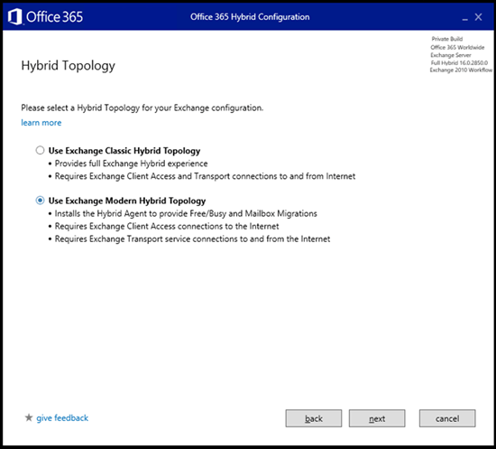
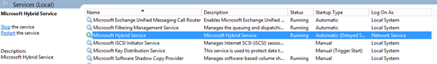
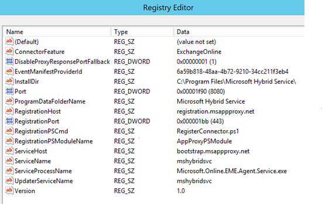
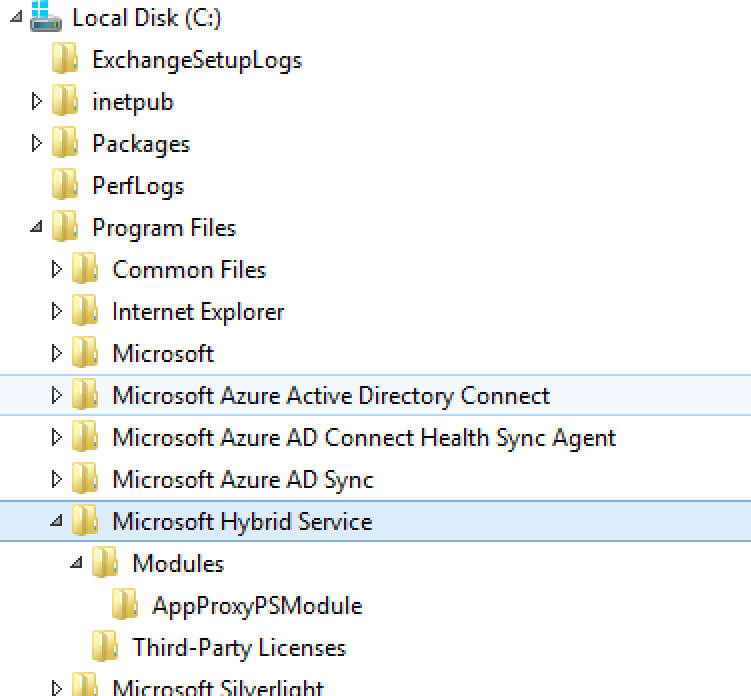
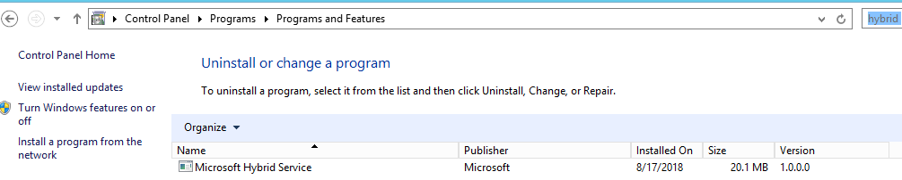
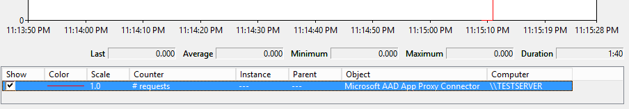

# Microsoft Hybrid agent – Preview

The Hybrid agent removes some of the challenges you can face when you configure an Exchange Hybrid environment. The agent, which is built on the same technology as the Azure Application Proxy, removes some requirements for external DNS entries, certificate updates, inbound network connections through your firewall, and more, so you can use Exchange hybrid features. These features include Free/Busy sharing and online mailbox moves. The Hybrid agent only supports free/busy and mailbox migrations; mail flow, directory synchronization, and other hybrid features aren't included.

## Agent Install Location & Requirements

The agent install and the configuration of Hybrid via the Hybrid Configuration Wizard is supported on either a standalone computer designed as your "agent server". You can also install it on an Exchange 2010, 2013, 2016 or 2019 server with the Client Access role. 

## System requirements

The Hybrid agent has the following requirements:

- The computer it's installed on needs to be:
  - Running Windows Server 2012 R2 or 2016 with .NET Framework 4.6.2 (or later, as supported by the Exchange version you are installing on)
  - Joined to an Active Directory domain
  - TLS 1.2 enabled
    - Azure Application Proxy documentation: https://docs.microsoft.com/en-us/azure/active-directory/manage-apps/application-proxy-add-on-premises-application  
  - Capable of establishing outbound HTTPS connections to the Internet
  - Capable of establishing HTTPS and remote PowerShell connections to the Client Access Server (CAS) chosen for hybrid configuration.
- Use a browser, like Microsoft Edge, that supports ClickOnce technology.
- The on-premises Active Directory account you're logged into must:
  - Be a member of the Organization Management role group in your on-premises Exchange organization
  - Be a member of the local Administrators group on the computer where you're installing the Hybrid agent.
- The account you use to connect to your Office 365 tenant must be a Global Administrator.
  
## Port and protocol requirements

- Outbound ports HTTPS (TCP) 443 and 80 must be open between the computer that has the Hybrid agent installed and the Internet, as shown here: https://docs.microsoft.com/en-us/azure/active-directory/manage-apps/application-proxy-enable. 
- Ports HTTPS (TCP) 443, 80, 5985 and 5986 must be open between the computer that has the Hybrid agent installed on the CAS that's selected in the Hybrid Configuration wizard.

    > [!IMPORTANT]
    > All Client Access Servers must be able to reach outbound to Office 365 endpoints via HTTPS (TCP) 443 as free/busy request from on-premises users to Office 365 users do not traverse the Hybrid agent. These requests still require your Exchange servers have outbound connectivity to Office 365 end points. Office 365 URLs and IP address ranges describes the required (and hybrid) ports and IPs outbound from on-prem to the service here: https://docs.microsoft.com/en-us/office365/enterprise/urls-and-ip-address-ranges. 

### Proxy server considerations

If your network environment uses outbound proxy servers, additional configuration and requirements are needed. This list may not be exhaustive.

#### Agent

The agent supports outbound proxy servers but requires additional configuration after installation. For more information, see [Work with existing on-premises proxy servers](https://docs.microsoft.com/azure/active-directory/manage-apps/application-proxy-configure-connectors-with-proxy-servers).

> [!IMPORTANT]
> A proxy server that prevents registration will cause the connector installation to fail. We recommend that you allow the connectors to bypass the proxy until app config changes can be made.

#### Client Access Server

The HCW establishes connections from your Client Access Server to domains.live.com to exchange metadata and establish trusts. Because connections originate from your CAS server, the proxy settings on that server (from `Get-ExchangeServer | Format-List InternetWebProxy`) must be set correctly or outbound free/busy can fail. In addition to connection failures, the HCW won't be able to configure delegated authentication if the proxy setting is incorrect.

## Preview Constraints

Keep the following issues in mind before you install the Hybrid agent:

- [Hybrid Modern Authentication](https://docs.microsoft.com/office365/enterprise/hybrid-modern-auth-overview) is not supported with the Hybrid Agent. Customers will need to leverage the Classic Exchange Hybrid Topology and publish AutoDiscover, EWS, MAPI and OAB endpoints for hybrid Modern Authentication to function with various Outlook clients.
- MailTips, Message Tracking, and Multi-mailbox search do not traverse the Hybrid agent. These Hybrid features require the classic connectivity model where Exchange Web Services (EWS) and Autodiscover are published on-premises and are externally available to Office 365.
- The public preview only supports a single Hybrid agent install for the Exchange organization. Support multiple agent installs for redundancy is being worked on but isn't available yet. If the server where the Hybrid agent is installed goes offline, free/busy lookups from your tenant to your on-premises organization and mailbox migrations to or from your tenant won't work. If the server where the agent is installed is permanently offline, was rebuilt, or the agent was uninstalled, you can re-run the Hybrid Configuration wizard to reinstall the Hybrid agent directly on the new server. 

    > [!WARNING]
    > Don't attempt to install multiple active Hybrid agents in your environment with this preview build, this could cause unexpected issues.

- The Hybrid agent registers the internal fully qualified domain name (FQDN) of the CAS server selected when running Hybrid Configuration wizard in Azure Application Proxy. If the registered CAS is offline, free/busy look ups from your tenant to on-premises and mailbox migrations to/from your tenant won't work. If the selected CAS is permanently offline, a new CAS server must be registered. Run the Hybrid Configuration wizard again to register a new CAS server. 
- The Hybrid agent preview comes with some support limitations that are called out in the Terms document you must agree to before you install the feature.

    > [!NOTE]
    > SMTP doesn't traverse the Hybrid agent and still requires a public certificate for mail flow between Office 365 and your  on-premises organization. SMTP traffic is out of scope for the Hybrid agent, both now and through General Availability.

## Running Setup

The HCW is the application responsible for the installation of the Hybrid agent the configuration in your on-premises organization and Office 365 tenant. You must run the HCW from the computer where you want the agent installed. After the Agent is installed and configured, the HCW will locate a preferred server to connect to and run the standard hybrid configuration steps. You do not have to run the HCW from the Exchange server directly, but as stated previously, the computer where the HCW is run must be able to connect to the CAS server on the ports specified in the [Ports and protocols](#port-and-protocol-requirements) section.

> [!NOTE]
> The Modern Hybrid option will only be presented if you have never run the Hybrid Configuration wizard. If you have successfully established Hybrid in either Minimal or Full in the "classic config" for your tenant, this new option won't be presented to you.

### Installation Prerequisites

1. To allow installation of the Hybrid agent and perform mailbox migrations to and from your Office 365 tenant, enable the Mailbox Replication service (MRS) proxy on the EWS virtual directory using the following command.

    ```PowerShell
    Set-WebServicesVirtualDirectory -Identity "EWS (Default Web Site)" -MRSProxyEnabled $true
    ```

2. Go to **Programs and Features** and verify that a previous version of the Microsoft Office 365 Hybrid Configuration Wizard is not already installed. If it is, uninstall it.
3. Install .NET Framework version 4.6.2 on the computer where the HCW is being run. You might need to install a later version of .NET Framework depending on the version of Exchange you have installed. Alternatively, if this version isn't installed, the HCW prompts you to install it or upgrade the version already installed on your computer.

### Installation steps

1. Log into your on-premises Exchange Admin Center (EAC), navigate to the **Hybrid** node, and then click **Configure**. 
2. Select the Exchange server where you want to run traditional hybrid setup. Either select the default server provided by the HCW or specify a specific server in the second radio button. Select **Next**.
3. Enter your on-premises Exchange credentials and your Office 365 Global Administrator credentials. Click **Next**.
4. Wait while the HCW gathers information and configuration about your environments. When it’s completed, click **Next**.
5. Select either **Minimal** or **Full Hybrid Configuration**. You can also choose **Organization Configuration Transfer**. For more information, see [Hybrid Organization Configuration Transfer](https://blogs.technet.microsoft.com/exchange/2018/06/18/hybrid-organization-configuration-transfer/). Click **Next**.
6. Follow the steps to enable federation. Click **Next**.
7. Select **Use Exchange Modern Hybrid**

    

    Click **Next**.
8. The HCW installs the Hybrid agent. There are four basic phases:
    1. Download the agent install package
    2. Installation of the agent on the local computer (note: this prompts for your Office 365 Global Administrator credentials again)
    3. Registration of the agent in Azure, including creation of the URL used to proxy requests. The URL has the format `uniqueGUID.resource.mailboxmigration.his.msappproxy.net`.
    4. Testing migration viability from your Office 365 tenant to your on-premises Exchange organization via the agent.

    > [!NOTE]
    > The Hybrid agent installation process could take up to 10 minutes to complete.

The rest of the HCW steps are the same as a traditional Hybrid deployment. During the last phase of the HCW, the HCW creates a migration endpoint with the custom URL. It then sets the `TargetSharingEPR` value on the Organization Relationship and/or the IntraOrganization Connector. Both the new migration endpoint value and the `TargetSharingEPR` value are set on Office 365 side only. The new URL is used to send requests from your Office 365 tenant to your on-premises Exchange organization for free/busy and migrations. You can view the specific values configured for each of these by running `Get-MigrationEndpoint` and `Get-OrganizationRelationship` from a remote PowerShell session connected to your Office 365 tenant. The following shows example output that you might see when you run the `Get-MigrationEndpoint` cmdlet.

```PowerShell
PS C:\Users\Hybrid\> Get-MigrationEndpoint | fl Identity,RemoteServerIdentity : Hybrid Migration Endpoint - EWS (Default Web Site)

RemoteServer :
087f1c2e-8711-4176-ab4f-4b1c1777a350.resource.mailboxmigration.his.msappproxy.net

PS C:\Users\Hybrid\> Get-OrganizationRelationship | fl Name,TargetSharingEpr

Name : O365 to On-premises - c6d22e11-2340-4432-9122-19097bacf0c1

TargetSharingEpr :
https://087f1c2e-8711-4176-ab4f-4b1c1777a350.resource.mailboxmigration.his.msappproxy.net/EWS/Exchange.asmx
```

## Additional Information

Installation details of the Hybrid agent can be viewed in the following locations on the server where it is installed.



`HKEY_LOCAL_MACHINE\SOFTWARE\Microsoft\Microsoft Hybrid Service:`





Add/Remove programs:



## Testing & validation of the Hybrid agent

After successful deployment of the Hybrid agent and hybrid configuration, the following are two simple tests to validate free/busy and mailbox migration flow via the Agent.

On the server where the Hybrid agent is installed, open **Performance Monitor**. Add the object **Microsoft AD App Proxy Connector** and the **\# requests** counter to your view.



### Migration

Open an remote PowerShell session to your Office 365 tenant and run the following test cmdlet:

```PowerShell
Test-MigrationServerAvailability -ExchangeRemoteMove: $true -RemoteServer '<your customguid>.resource.mailboxmigration.his.msappproxy.net' -Credentials (Get-Credential)
```

Enter your on-premises credentials in the dialog that appears. After the test returns the success result, switch back to **Performance Monitor** and confirm that the number of requests has increased.

Performing a test mailbox move from your on-premises Exchange organization to your Office 365 tenant is also an option.

### Free/Busy

To perform the same validation for free/busy information, log into an Office 365 mailbox in your tenant, create a test meeting invite, and send it to an on-premises mailbox.

## Uninstall the Hybrid agent

To uninstall the Hybrid agent, re-run Hybrid Configuration Wizard from the same computer you ran the installation on and select **Classic Connectivity**. Selecting classic connectivity uninstalls and unregisters the Hybrid agent from the computer and Azure. After you unregister the Hybrid agent, you can resume setup and configure hybrid in classic mode.
