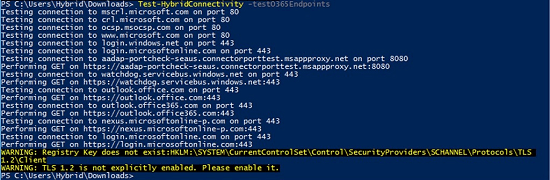
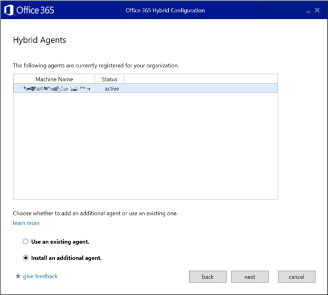
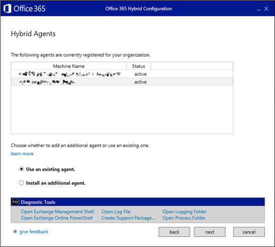
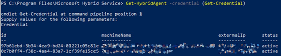
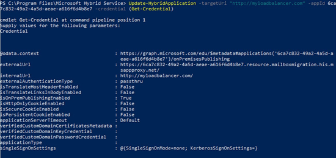

# Microsoft Hybrid Agent

The Hybrid Agent removes some of the challenges you can face when you configure an Exchange Hybrid environment. The agent, which is built on the same technology as the Azure Application Proxy, removes some requirements for external DNS entries, certificate updates and inbound network connections through your firewall to enable Exchange hybrid features. These features include Free/Busy sharing and online mailbox moves. The Hybrid Agent supports free/busy and mailbox migrations; mail flow, directory synchronization, and other hybrid features are not included.

## Agent Install Location & Requirements

The agent install and the configuration of Hybrid via the Hybrid Configuration wizard (HCW) is supported on either a standalone computer designed as your "agent server" or on an Exchange 2010, 2013, 2016 or 2019 server with the Client Access role.

## System requirements

The Hybrid Agent has multiple methods of installation with different requirements. In all cases, the core computer requirements are the same:

- Windows Server 2012 R2 or 2016 with .NET Framework 4.6.2 (or later, as supported by the Exchange version you are installing on).

  - TLS 1.2 enabled.

    Azure Application Proxy documentation: [https://docs.microsoft.com/azure/active-directory/manage-apps/application-proxy-add-on-premises-application](https://docs.microsoft.com/azure/active-directory/manage-apps/application-proxy-add-on-premises-application)

  - Capable of establishing outbound HTTPS connections to the Internet.

  - Capable of establishing HTTPS connections to the Client Access Server (CAS) chosen for hybrid configuration.

The SHCW can download and install the agent MSI automatically. Using this method is ideal when installing on a CAS server directly. In this case, the computer also must:

- Joined to an Active Directory domain.

- Capable of establishing remote PowerShell connections to the Client Access Server (CAS) chosen for hybrid configuration.

- Use a browser that supports ClickOnce technology (for example, Microsoft Edge).

- The on-premises Active Directory account you're logged into must:

  - Be a member of the Organization Management role group in your on-premises Exchange organization

  - Be a member of the local Administrators group on the computer where you're installing the Hybrid Agent.

## Port and protocol requirements

- Outbound ports HTTPS (TCP) 443 and 80 must be open between the computer that has the Hybrid Agent installed and the Internet, as shown here: [https://docs.microsoft.com/azure/active-directory/manage-apps/application-proxy-enable](https://docs.microsoft.com/azure/active-directory/manage-apps/application-proxy-enable).

- Ports HTTPS (TCP) 443, 80, 5985 and 5986 must be open between the computer that has the Hybrid Agent installed on the CAS that's selected in the Hybrid Configuration wizard.

> [!IMPORTANT]
> All Client Access Servers must be able to reach outbound to Office 365 endpoints via HTTPS (TCP) 443, because free/busy request from on-premises users to Office 365 users do not traverse the Hybrid Agent. These requests still require your Exchange servers have outbound connectivity to Office 365 end points. Office 365 URLs and IP address ranges describes the required (and hybrid) ports and IPs outbound from on-prem to the service here: [https://docs.microsoft.com/office365/enterprise/urls-and-ip-address-ranges](https://docs.microsoft.com/office365/enterprise/urls-and-ip-address-ranges).

### Proxy server considerations

If your network environment uses outbound proxy servers, additional configuration and requirements are needed. This list may not be exhaustive.

#### Agent

The agent supports outbound unauthenticated proxy servers but requires additional configuration after installation. For more information, see [Work with existing on-premises proxy servers](https://docs.microsoft.com/azure/active-directory/manage-apps/application-proxy-configure-connectors-with-proxy-servers).

> [!IMPORTANT]
> A proxy server that prevents registration will cause the connector installation to fail. We recommend that you allow the connectors to bypass the proxy until app config changes can be made. A proxy server that prevents connector bootstrapping will fail **Test-Connectivity** after installation. We recommend that you allow the connectors to bypass the proxy until app config changes can be made.

#### Client Access Server

The HCW establishes connections from your Client Access Server to domains.live.com to exchange metadata and establish trusts. Because connections originate from your CAS server, the proxy settings on that server (from `Get-ExchangeServer | Format-List InternetWebProxy`) must be set correctly or outbound free/busy can fail. In addition to connection failures, the HCW won't be able to configure delegated authentication if the proxy setting is incorrect.

## Free/Busy requirements

The hybrid wizard automatically handles the free/busy information that's required in both environments (cloud and on-premises).

If you need to configure free/busy sharing with a third-party company, go to the **Organization** tab in the Exchange admin center and configure individual or organization sharing between the two systems (Exchange online/Exchange on-premises or Exchange on-premises/Exchange on-premises).

If you encounter any problems or need to troubleshoot, see [How to troubleshoot free/busy issues in a hybrid deployment of on-premises Exchange Server and Exchange Online in Office 365](https://support.microsoft.com/help/2555008/how-to-troubleshoot-free-busy-issues-in-a-hybrid-deployment-of-on-prem).


## Constraints

Keep the following issues in mind before you install the Hybrid Agent:

- [Hybrid Modern Authentication](https://docs.microsoft.com/office365/enterprise/hybrid-modern-auth-overview) is not supported with the Hybrid Agent. Customers will need to leverage the Classic Exchange Hybrid Topology and publish AutoDiscover, EWS, ActiveSync, MAPI and OAB endpoints for hybrid Modern Authentication to function with various Outlook clients.

- Team's Calendaring features that require access to on premises mailboxes are not supported with the Hybrid Agent. You will need to leverage the Classic Exchange Hybrid Topology and publish AutoDiscover and EWS to support these features.

- Message Tracking and Multi-mailbox search do not traverse the Hybrid Agent. These Hybrid features require the classic connectivity model where Exchange Web Services (EWS) and Autodiscover are published on-premises and are externally available to Office 365.

- The Hybrid Agent registers the internal fully qualified domain name (FQDN) of the CAS server selected when running Hybrid Configuration wizard in the Azure Hybrid proxy infrastructure. If the registered CAS is offline, free/busy look ups from your tenant to on-premises and mailbox migrations to/from your tenant won't work. If the selected CAS is permanently offline, a new CAS server must be registered. Run the Hybrid Configuration wizard again to register a new CAS server.

- The Hybrid Agent supports a single migration endpoint with the service default limits. Multiple migration endpoints utilizing your custom endpoint/URL is not supported.

> [!NOTE]
> SMTP doesn't traverse the Hybrid Agent and still requires a public certificate for mail flow between Office 365 and your on-premises organization. SMTP traffic is out of scope for the Hybrid Agent.

## Running Setup

You must run the HCW from the computer where you want the agent installed. After the Agent is installed and configured, the HCW will locate a preferred server to connect to and run the standard hybrid configuration steps. You do not have to run the HCW from the Exchange server directly, but as stated previously, the computer where the HCW is run must be able to connect to the Client Access Server on the ports specified in the [Ports and protocols](#port-and-protocol-requirements) section.

> [!NOTE]
> The Modern Hybrid option will only be presented if you have never run the Hybrid Configuration wizard. If you have successfully established Hybrid in either Minimal or Full in the "classic config" for your tenant, this new option won't be presented to you.

### Installation Prerequisites

1. Optional: Verify connectivity.

   1. On the server where you will be running the Hybrid Configuration wizard (Hybrid Agent install and subsequent hybrid configuration steps), download the following sample script and save it to any directory: [https://aka.ms/hybridconnectivity](https://aka.ms/hybridconnectivity).

   2. Open the Exchange Management Shell and change directory to the location of the script.

   3. Import the cmdlets by running the following command:

      ```PowerShell
      Import-Module .\HybridManagement.psm1
      ```

   4. Next run the following command to verify the computer where you're installing can reach out to all required endpoints for the Hybrid Agent installation and Hybrid Configuration wizard setup.

      ```PowerShell
      Test-HybridConnectivity -TestO365Endpoints
      ```

      The output of the command looks like this:

      

2. To allow installation of the Hybrid Agent and perform mailbox migrations to and from your Office 365 tenant, enable the Mailbox Replication service (MRS) proxy on the EWS virtual directory by running the following command:

   ```PowerShell
   Set-WebServicesVirtualDirectory -Identity "EWS (Default Web Site)" -MRSProxyEnabled $true
   ```

   > [!NOTE]
   > If you don't complete this step before you run the HCW, the HCW will enable MRS proxy. However, we recommend that you complete this step before you run the HCW to ensure the IIS cache has time to clear before HCW validates the endpoint.

3. Go to **Programs and Features** in Control Panel and verify that a previous version of the Microsoft Office 365 Hybrid Configuration wizard is not already installed. If it is, uninstall it.

4. Install .NET Framework version 4.6.2 on the computer where the HCW is being run. You might need to install a later version of .NET Framework depending on the version of Exchange you have installed. Alternatively, if this version isn't installed, the HCW prompts you to install it or upgrade the version already installed on your computer.

### Installation steps

1. Log into your on-premises Exchange admin center (EAC), navigate to the **Hybrid** node, and then click **Configure**.

2. Select the Exchange server where you want to run traditional hybrid setup. Either select the default server provided by the HCW or specify a specific server in the second radio button. Select **Next**.

3. Enter your on-premises Exchange credentials and your Office 365 Global Administrator credentials. Click **Next**.

4. Wait while the HCW gathers information and configuration about your environments. When it's completed, click **Next**.

5. Select either **Minimal** or **Full Hybrid Configuration**. You can also choose **Organization Configuration Transfer**. For more information, see [Hybrid Organization Configuration Transfer](https://techcommunity.microsoft.com/t5/Exchange-Team-Blog/Hybrid-Organization-Configuration-Transfer/ba-p/607944). Click **Next**.

6. Follow the steps to enable federation. Click **Next**.

7. Select **Use Exchange Modern Hybrid Topology**

   

   Click **Next**.

8. The HCW installs the Hybrid Agent. There are four basic phases:

   1. Download the agent install package.

   2. Installation of the agent on the local computer (note: this prompts for your Office 365 Global Administrator credentials again).

   3. Registration of the agent in Azure, including creation of the URL used to proxy requests. The URL has the format: `uniqueGUID.resource.mailboxmigration.his.msappproxy.net`.

   4. Testing migration viability from your Office 365 tenant to your on-premises Exchange organization via the agent.

   > [!NOTE]
   > The Hybrid Agent installation process could take up to 10 minutes to complete.

   The remaining HCW inputs and actions are the same as a Classic Hybrid deployment.

During the update phase, the HCW creates a migration endpoint with the custom URL created in step 8.3 above. It will also set the `TargetSharingEPR` value on the Organization Relationship and/or the IntraOrganization Connector object on the Office 365 side to this value. The new URL is used to send requests from your Office 365 tenant to your on-premises Exchange organization for free/busy and migrations.

You can view the specific values configured for each of these by running **Get-MigrationEndpoint** and **Get-OrganizationRelationship** from an [Exchange Online PowerShell connection](https://docs.microsoft.com/powershell/exchange/exchange-online/connect-to-exchange-online-powershell/connect-to-exchange-online-powershell) to your Office 365 tenant.

The following example shows the output that you might see when you run the **Get-MigrationEndpoint** and **Get-OrganizationRelationship** cmdlets:

```PowerShell
Get-MigrationEndpoint | Format-List Identity,RemoteServer

Identity : Hybrid Migration Endpoint - EWS (Default Web Site)
RemoteServer : 087f1c2e-8711-4176-ab4f-4b1c1777a350.resource.mailboxmigration.his.msappproxy.net
```

```PowerShell
Get-OrganizationRelationship | Format-List Name,TargetSharingEpr

Name : O365 to On-premises - c6d22e11-2340-4432-9122-19097bacf0c1
TargetSharingEpr : https://087f1c2e-8711-4176-ab4f-4b1c1777a350.resource.mailboxmigration.his.msappproxy.net/EWS/Exchange.asmx
```

## Multi Agent Deployment

### Option 1: Use the Hybrid Configuration wizard to install additional agents

Additional Hybrid Agents can be installed for redundancy, simply download the latest version of the Hybrid Configuration wizard (HCW) and open the application on the computer where you would like to install an additional Hybrid Agent.

1. Like previous HCW runs, start the application, select **Next**.

2. Select a desired server to execute against, select **Next**.

3. Provide credentials to sign into your Office 365 tenant, select **Next**.

4. The HCW will gather configuration information, select **Next** when complete.

5. Select the default option provided for either **Full** or **Minimal**, select **Next**.

6. Select Exchange **Modern Hybrid Topology, Next**.

7. A page will be shown that will provide you with the status of your existing or previously installed agent(s). Make sure the status of the existing agent is accurate before proceeding to the next step. Select Install and additional agent option, **Next**.

   Example:

   

The HCW will install the additional Hybrid Agent. When the installation is complete, you can open the Microsoft Windows Services console from the computer and verify the service or agent is installed and running (look for **Microsoft Hybrid Service - mshybridsvc**). At that point, you can either re-run HCW if you wish to make further changes to your hybrid config, or simply cancel the wizard.

You can repeat this step on each computer where you would like an additional Hybrid Agent installed.

### Option 2: Manually download & install additional agents

A second option for installing additional agents is outside the HCW itself and is done by downloading and manually installing the agent on the desired computer.

1. Go to [https://aka.ms/hybridagentinstaller](https://aka.ms/hybridagentinstaller).

2. Save the MSHybridService.msi to a location on your computer.

3. From that computer, open a Windows Command console as Administrator and run the following command to install the Hybrid Agent:

   ```PowerShell
   Msiexec /i MSHybridService.msi
   ```

   You will be prompted for your tenant Global Admin credentials.

4. After the installation is complete, you can open the Microsoft Windows Services console from the computer and verify the service or agent is installed and running.

You can repeat this step on each computer where you would like an additional Hybrid Agent installed.

## Checking the Status of Your Hybrid Agents

### Option 1: Get status via the Hybrid Configuration wizard

1. Start the HCW application and select **Next**.

2. Select a server in your Exchange organization and select **Next**.

3. Provide credentials to sign into your Office 365 tenant and select **Next**.

4. The HCW will gather configuration information. Select **Next** when it's complete.

5. Select default option provided for either **Full** or **Minimal** and select **Next**.

6. Select **Exchange Modern Hybrid Topology** and select **Next**.

   A page will be shown that will provide you with the status of your existing installed agents.

   

7. Click **Cancel** when you're finished.

### Option 2: Get status via the Hybrid Management PowerShell Module

With each installation of the Hybrid Agent, the HCW install the Hybrid Management PowerShell module in \\Program Files\\Microsoft Hybrid Service\\ on the computer where the agent is installed. By default, this module is not imported and so you will need to import it before you can use it. This module also requires the Azure module for PowerShell if not already installed. First install [the PackageManagement modules](https://www.powershellgallery.com/packages/PackageManagement/) and then see [this topic](https://docs.microsoft.com/powershell/azure/servicemanagement/install-azure-ps) for the Azure PowerShell module installation instruction.

To import the Hybrid Management module, run the following from a Windows PowerShell prompt as Administrator:

```PowerShell
Import-module .\HybridManagement.psm1
```

After that you can run the following command to view agent status:

```PowerShell
Get-HybridAgent -Credential (Get-Credential)
```

The output of the command looks like this:



> [!NOTE]
> The **id** value in the results is the agent identity and not your unique tenant guid assigned to the route.

## Direct your Hybrid Agent(s) to the load balancer instead of a specific server

You can use the Hybrid Management PowerShell module to configure your Hybrid Agent(s) to direct requests to your load balancer instead of a specific Exchange Client Access Server. The Hybrid Agent supports routing requests to the load balancer for Exchange Server 2013 or later Client Access Servers. Exchange Server 2010 Client Access Servers aren't supported.

1. Follow the steps from the previous section to import the Hybrid Management module for PowerShell.

2. Use the *targetUri* parameter on the **Update-HybridApplication** cmdlet to change the value of the internalURL from a specific server to your load balancer endpoint.

3. Use the unique endpoint GUID value for your tenant for the *appId* parameter (for example, 6ca7c832-49a2-4a5d-aeae-a616f6d4b8e7). **Note that this GUID value is not the agent ID**. To find the endpoint GUID value, use either of the following procedures:

   - From the `TargetSharingEPR` value:

     ```PowerShell
     Get-OrganizationRelationship ((Get-OnPremisesOrganization).OrganizationRelationship) | Select-Object TargetSharingEpr
     ```

     The output looks like this:

     > TargetSharingEpr <br/> \---------------- <br/> https://6ca7c832-49a2-4a5d-aeae-a616f6d4b8e7.resource.mailboxmigration.his.msappproxy.net/EWS/Exchange.asmx

   - From the MRS configuration:

     ```PowerShell
     Get-MigrationEndpoint "Hybrid Migration Endpoint - EWS (Default Web Site)" | Select-Object RemoteServer
     ```

     The output looks like this:

     > RemoteServer <br/> \------------ <br/> 6ca7c832-49a2-4a5d-aeae-a616f6d4b8e7.resource.mailboxmigration.his.msappproxy.net

4. After you have the endpoint GUID value for your tenant, run the following command:

   - *targetUri*: https://myloadbalancer.com in this example (your value will be different).

   - *appId*: 6ca7c832-49a2-4a5d-aeae-a616f6d4b8e7 in this example (your value will be different).

   ```PowerShell
   Update-HybridApplication -targetUri "https://myloadbalancer.com" -appId 6ca7c832-49a2-4a5d-aeae-a616f6d4b8e7 -Credential (Get-Credential)
   ```

   Example:

   

## Additional Information

You can view installation details of the Hybrid Agent in the following locations on the server where it's installed.

- In the Services console:

  

- In the registry at `HKEY_LOCAL_MACHINE\SOFTWARE\Microsoft\Microsoft Hybrid Service`:

  

- On the hard drive:

  

- In **Programs and Features** in Control Panel:

  

## Testing and validation of the Hybrid Agent

After a successful deployment of the Hybrid Agent and hybrid configuration, you can use the following steps to validate free/busy and mailbox migration flow via the Agent.

1. On the server where the Hybrid Agent is installed, open **Performance Monitor**.

2. Add the object **Microsoft AD App Proxy Connector** and the **\# requests** counter to your view.

    
    

### Migration

1. Open an [Exchange Online PowerShell connection](https://docs.microsoft.com/powershell/exchange/exchange-online/connect-to-exchange-online-powershell/connect-to-exchange-online-powershell) to your Office 365 tenant.

2. Replace \<your customguid\> with the unique endpoint GUID value as described in [Direct your Hybrid Agent(s) to the load balancer instead of a specific server](#direct-your-hybrid-agents-to-the-load-balancer-instead-of-a-specific-server) and run the following command:

   ```PowerShell
   Test-MigrationServerAvailability -ExchangeRemoteMove:$true -RemoteServer '<your customguid>.resource.mailboxmigration.his.msappproxy.net' -Credentials (Get-Credential)
   ```

3. Enter your on-premises credentials in the dialog that appears.

After the test returns the success result, switch back to **Performance Monitor** and confirm that the number of requests has increased.

Performing a test mailbox move from your on-premises Exchange organization to your Office 365 tenant is also an option.

> [!NOTE]
> If this test fails try running Update-HybridApplication and point it to a single Exchange Server instead of a load balancer.

### Free/Busy

To perform the same validation for free/busy information, log into an Office 365 mailbox in your tenant, create a test meeting invite, and send it to an on-premises mailbox.

## Uninstall the Hybrid Agent

To uninstall the Hybrid Agent, re-run Hybrid Configuration wizard from the same computer you ran the installation on and select **Classic Connectivity**. Selecting classic connectivity uninstalls and unregisters the Hybrid Agent from the computer and Azure. After you unregister the Hybrid Agent, you can resume setup and configure hybrid in classic mode.

## Switching modes from Classic to Modern

It is possible to switch to Modern Hybrid (Hybrid Agent) after successfully configuring Classic Hybrid (publishing EWS namespace + allowing inbound), but we only recommend doing this if you are blocked migrating to O365 after this setup is complete. If you are successfully migrating mailboxes your users are experiencing hybrid features and chose to revert to Modern Hybrid, see the previous [Constraints](#constraints) section because not all hybrid features or experiences are supported with the Hybrid Agent.

If you have weighed the pros and cons of switching from Classic to Modern and choose to proceed, you can do this by deleting your existing migration batches and migration endpoint and re-running the Hybrid Configuration wizard and selecting **Modern Hybrid**.
