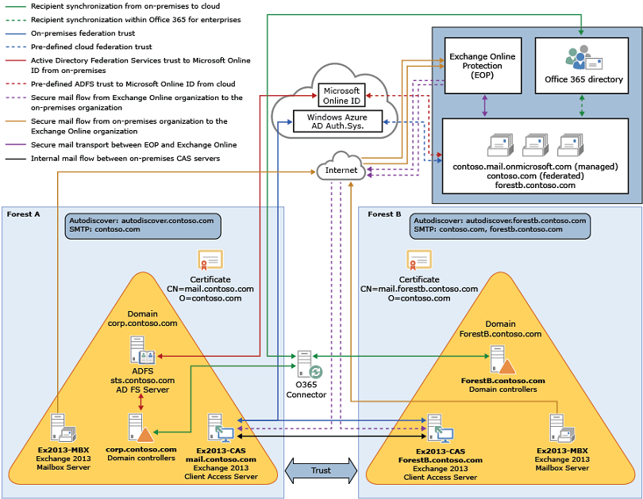

# Hybrid deployments with multiple forests

Exchange 2013 and later hybrid deployments are supported for organizations with multiple on-premises Exchange forests and a single Microsoft 365 or Office 365 organization. For hybrid deployment features and considerations, multi-forest organizations are defined as organizations having Exchange servers deployed in multiple forests. Organizations that utilize a resource forest for user accounts, but maintain all Exchange servers in a single forest, aren't classified as multi-forest in hybrid deployment scenarios. These types of organizations should consider themselves a single forest organization when planning and configuring a hybrid deployment.

The migration of public folders from an on-premises environment to Microsoft 365 or Office 365 is only supported from a single Active Directory forest. Similarly, accessing public folders in a hybrid state is only supported when the on-premises public folders are housed in a single Active Directory forest.

For more information about hybrid deployments, see [Exchange Server hybrid deployments](hybrid-deployment.md).

> [!IMPORTANT]
> For Exchange 2013 and later, hybrid deployments require the latest cumulative update (CU) available for the version of Exchange you have installed in your on-premises organization.
>
> If you can't install the latest update, the immediately previous release is also supported. Previous CUs and RUs are not supported. For more information, see [Hybrid deployment prerequisites](../hybrid-deployment-prerequisites.md).

## Multi-forest hybrid deployment prerequisites

Multi-forest hybrid deployment prerequisites are almost identical to the hybrid deployment prerequisites for a single-forest organization, with the following exceptions:

- **Autodiscover**: Each Exchange forest must be authoritative for at least one SMTP namespace and the corresponding Autodiscover namespace. If there are shared domains across multiple Exchange forests, both mail routing and Autodiscover endpoints need to be configured and working properly between the Exchange forests before configuring your multi-forest hybrid deployment. The Office 365 service must be able to query the Autodiscover service in each Exchange forest.

- **Certificates**: All hybrid deployments require a digital certificate issued by trusted third-party certificate authority (CA). For a multi-forest hybrid deployment, a single digital certificate can't be used for multiple Active Directory forests. Each forest must use a dedicated CA-issued certificate for secure mail transport to function correctly in a hybrid deployment. The certificate used for hybrid deployment features for each forest in a multi-forest organization must differ in at least one of the following properties:

  - **Common Name**: The common name (CN) of the digital certificate is part of the certificate subject. This must match the host being authenticated and is typically the external hostname for the Client Access server in the Active Directory forest. For example, mail.contoso.com. We recommend using the CN as the differentiating property between Active Directory certificates used in multi-forest hybrid deployments.

  - **Issuer**: The third-party CA that verified the organization information and issued the certificate. For example, VeriSign or Go Daddy. As an example in a multi-forest hybrid deployment, one forest would have a certificate issued by VeriSign and one forest would have a certificate issued by Go Daddy.

  > [!IMPORTANT]
  > The certificate installed on the Mailbox and Client Access (and Edge Transport, if deployed) servers in each Active Directory forest used for mail transport in the hybrid deployment must all be issued by the same CA and have the same common name.
  >
  > On an Edge Transport server, if the certificate common name and issuer name do not match, you can manually set them in the receive connector using following commands:
  >
  > ```PowerShell
  > $cert=Get-ExchangeCertificate -Thumbprint "Thumbprint of the certificate"
  > $tlscertificatename = "<i>$($cert.Issuer)<s>$($cert.Subject)"
  > Get-ReceiveConnector "Receiveconnectorname" | Set-ReceiveConnector -TlsCertificateName $tlscertificatename
  > ```
  
- **Exchange servers**: At least one Exchange 2013 server with the Client Access server role, or one Exchange 2016 or later server with the Mailbox role, must be installed in each Active Directory forest configured for hybrid deployment.

  In Exchange 2013, the Client Access server is the inbound secure mail transport endpoint for the Exchange Online Protection (EOP) service included with the Microsoft 365 or Office 365 organization service and enables the Hybrid Configuration wizard to run in the Active Directory forest. Additionally, at least one Exchange server with the Mailbox server role must be installed in each Active Directory forest configured for hybrid deployment. The Exchange 2013 Mailbox server is the outbound secure mail transport endpoint for messages sent to the EOP service and the Exchange Online organization.

  In Exchange 2016 and later, the Mailbox server role handles all inbound and outbound secure transport between your on-premises organization and Exchange Online.

- **Namespace planning**: Each forest in which you install Exchange requires its own unique externally-discoverable namespace. You will specify a forest's unique namespace in the Hybrid Configuration wizard when you run it in each forest.

- **Active Directory synchronization**: All hybrid deployments require Active Directory synchronization with Microsoft 365 or Office 365. If your company has already set up Active Directory synchronization between your multi-forest on-premises organization and Microsoft 365 or Office 365 using Forefront Identity Manager, you can use [Azure Active Directory Connect](https://docs.microsoft.com/azure/active-directory/hybrid/how-to-connect-install-prerequisites).

- **Single sign-on**: Although not a requirement for hybrid deployments with single Active Directory forests, administrators can choose to configure an SSO server in each Active Directory forest, or to configure a single SSO server if there is a two-way forest trust configured between the on-premises forests. You use either AD FS or password sync to allow for a seamless user authentication experience.

  For more information, see [Single sign-on with hybrid deployments](../single-sign-on.md).

For a full listing of hybrid deployment prerequisites, see [Hybrid deployment prerequisites](../hybrid-deployment-prerequisites.md)

## Multi-forest hybrid deployment scenario

Take a look at the following scenario. It's an example topology that provides an overview of a typical Exchange 2013 deployment. Contoso, Ltd. is a multi-forest, multi-domain organization with two Active Directory forests. Forest A contains the contoso.com domain and Forest B contains the sale.contoso.com domain. Each contains domain controllers in each forest, one Exchange 2013 server with the Client Access role installed, and one Exchange 2013 server with the Mailbox server role installed. Remote Contoso users use Outlook Web App to connect to Exchange 2013 over the Internet to check their mailboxes and access their Outlook calendar.


Let's say that you're the network administrator for Contoso and you're interested in configuring a hybrid deployment. You deploy and configure a required Active Directory Synchronization server in Forest A and you also decide to deploy an Active Directory Federation Services (AD FS) server as an option to minimize the number of prompts for account credentials for Contoso users and administrators accessing Microsoft 365 or Office 365 services in Forest A. After you complete the hybrid deployment prerequisites and use the Hybrid Configuration wizard to select options for the hybrid deployment, your new topology has the following configuration:

- Users will use their existing network account credentials for logging on to the on-premises and Exchange Online organizations ("single sign-on").

- User mailboxes located on-premises and in the Exchange Online organization will use multiple email address domains. For example, mailboxes located in Forest A on-premises and some mailboxes located in the Exchange Online organization will use @contoso.com in user email addresses and mailboxes in Forest B and some mailboxes located in the Exchange Online organization will use @sales.contoso.com.

- All mail is delivered to the Internet by the on-premises organization. The on-premises organization controls all messaging transport and serves as a relay for the Exchange Online organization ("centralized mail transport").

- On-premises and Exchange Online organization users can share calendar free/busy information with each other. Organization relationships configured for both organizations also enable cross-premises message tracking, MailTips, and message search.

- On-premises and Exchange Online users use the same URL to connect to their mailboxes over the Internet.



If you compare Contoso's existing organization configuration and the hybrid deployment configuration, you'll see that configuring a hybrid deployment has added servers and services that support additional communication and features that are shared between the on-premises and Exchange Online organizations. Here's an overview of the changes that a hybrid deployment has made from the initial on-premises Exchange organization.

|**Configuration**|**Before hybrid deployment**|**After hybrid deployment**|
|:-----|:-----|:-----|
|Mailbox location|Mailboxes on-premises only.|Mailboxes on-premises and in Exchange Online.|
|Message transport|On-premises Client Access servers handle all inbound and outbound message routing.|On-premises Client Access server handles internal message routing between the on-premises and Exchange Online organization.|
|Outlook Web App|On-premises Client Access server receives all Outlook Web App requests and displays mailbox information.|On-premises Client Access server redirects Outlook Web App requests to either the on-premises Exchange 2013 Mailbox server or provides a link to log on to the Exchange Online organization.|
|Unified GAL for both organizations|Not applicable; single organization only.|On-premises Active Directory synchronization server replicates Active Directory information for mail-enabled objects to the Exchange Online organization.|
|Single-sign on used for both organizations|Not applicable; single organization only.|On-premises Active Directory Federation Services (AD FS) server supports using single-sign on credentials for mailboxes located either on-premises or in the Microsoft 365 or Office 365 organization.|
|Organization relationship established and a federation trust with Azure AD authentication system|Trust relationship with the Azure AD authentication system and organization relationships with other federated Exchange organizations may be configured.|Trust relationship with the Azure AD authentication system is required. Organization relationships are established between the on-premises and Exchange Online organization.|
|Free/busy sharing|Free/busy sharing between on-premises users only.|Free/busy sharing between both on-premises and Exchange Online users.|

## Configuring hybrid deployments in multi-forest organizations

To configure a hybrid deployment for a multi-forest organization, you'll need to complete the basic steps below:

1. Verify that you've met the hybrid deployment prerequisites. See the prerequisites listed earlier in this topic and [Hybrid deployment prerequisites](../hybrid-deployment-prerequisites.md). Typically, only one forest needs an Active Directory synchronization server installed. A server with Azure Active Directory Connect (Azure AD Connect) with Active Directory Federation Services (AD FS) must be installed in each forest to enable single sign-on if a two-way forest trust isn't configured between the forests.

2. Obtain a third-party CA certificate for each Active Directory forest that meets the requirements listed previously in this topic.

3. Install the certificate on all Exchange 2013 Client Access and Mailbox servers, or Exchange 2016 Mailbox servers, in each forest.

4. Complete the steps outlined in the [Create a hybrid deployment with the Hybrid Configuration wizard](deploy-hybrid.md) topic for the primary forest.

   > [!IMPORTANT]
   > Be sure to select the certificate designated for the primary forest in the Hybrid Configuration wizard and select the primary SMTP domain for the forest.

5. Complete the steps outlined in the [Create a hybrid deployment with the Hybrid Configuration wizard](deploy-hybrid.md) topic for the secondary forest.

   > [!IMPORTANT]
   > Be sure to select the certificate designated for the secondary forest in the Hybrid Configuration wizard and select the primary SMTP domain for the forest.
