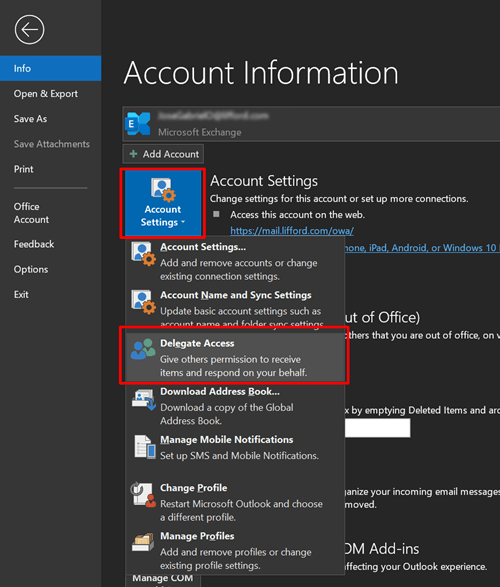
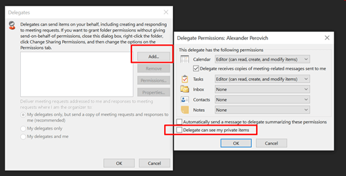

# Permissions in Exchange hybrid deployments

The Exchange Online in Microsoft 365 or Office 365 organization is based on Exchange Server and, like on-premises organizations, it also uses Role Based Access Control (RBAC) to control permissions. Administrators are granted permissions using management role groups, and end users are granted permissions using management role assignment policies.

Learn more about permissions in Exchange Online and on-premises Exchange at: [Exchange Server permissions](https://docs.microsoft.com/Exchange/permissions/permissions) and [Feature permissions in Exchange Online](https://docs.microsoft.com/Exchange/permissions-exo/feature-permissions).

## Administrator permissions

By default, the user that was used to create the Office 365 organization is made a member of the Organization Management role group in the Exchange Online organization. This user can manage the entire Exchange Online organization, including configuration of organization-level settings and management of Exchange Online recipients.

You can add additional administrators in the Exchange Online organization, depending on the management that needs to take place. For example, you can add additional organization administrators and recipient administrators, enable specialist users to perform compliance tasks such as discovery, configure custom permissions, and more. All Exchange Online permissions management for Microsoft 365 and Office 365 administrators must be performed in the Exchange Online organization using either the Exchange admin center (EAC) or Exchange Online PowerShell.

> [!IMPORTANT]
> There is no transfer of permissions between the on-premises organization and the Microsoft 365 or Office 365 organization. Permissions that you've defined in the on-premises organization must be re-created in the Microsoft 365 or Office 365 organization.

For more information, see [Manage Role Groups](https://docs.microsoft.com/Exchange/permissions/role-groups) and [Manage Role Group Members](https://docs.microsoft.com/Exchange/permissions/role-group-members).

## Delegate mailbox permissions

In on-premises Exchange deployments, users can be granted a variety of permissions to other users' mailboxes. This is called delegated mailbox permissions and it's useful when an administrative assistant needs to manage some part of another user's mailbox; for example, managing an executive's calendar. Exchange hybrid deployments support the use of some, but not all, mailbox permissions between mailboxes located in an on-premises Exchange organization and mailboxes located in Microsoft 365 or Office 365. The following sections detail which permission are, and aren't, supported; additional configuration required to support hybrid mailbox permissions; and how mailbox permissions are synchronized between your on-premises organization and Microsoft 365 or Office 365.

### Mailbox permissions in hybrid environments

Not all mailbox permissions are fully supported in an Exchange hybrid environment.

#### Mailbox permissions supported in hybrid environments

- **Full Access**: A mailbox on an on-premises Exchange server can be granted the **Full Access** permission to a Microsoft 365 or Office 365 mailbox, and vice versa. For example, a Microsoft 365 or Office 365 mailbox can be granted the **Full Access** permission to an on-premises shared mailbox. Users need to open the mailbox using the Outlook desktop client. Cross-premises mailbox permissions aren't fully supported in Outlook on the web. Users can use **Open another mailbox** in Outlook on the web to open other mailboxes where they have **Full Access** permission. However, this will generate a redirection link and credentials prompt before the user can access the mailbox.

  > [!NOTE]
  > Users might receive additional credential prompts when they first access a mailbox that's in the other organization and add it to their Outlook profile.

- **Send on Behalf**: A mailbox on an on-premises Exchange server can be granted the **Send on Behalf** permission to a Microsoft 365 or Office 365 mailbox, and vice versa. For example, a Microsoft 365 or Office 365 mailbox can be granted the **Send on Behalf** permission to an on-premises shared mailbox. Users need to open the mailbox using the Outlook desktop client; cross-premises mailbox permissions aren't supported in Outlook on the web.

  Some changes are needed on your Azure Active Directory Connect server for Send on Behalf permissions to sync between your on-premises Exchange servers and Exchange Online. For details, see the [Enabling support for hybrid mailbox permissions in Azure Active Directory Connect](#enabling-support-for-hybrid-mailbox-permissions-in-azure-active-directory-connect) section later in this topic.

- **Private items**: When you grant **Full Access** permission to a mailbox, you can decide whether to allow the delegate to see private items (private meetings, appointments, contacts, or tasks) in the mailbox.

  To share private items with a delegate, use the the following procedure in Outlook:

  1. Go to **File** > **Account Settings** > **Delegate Access**

     

  2. On the next window, click on **Add**. A new menu will appear listing the people in your organization. Select a delegate and click **OK**.

  3. The following image will appear, where you can select the related checkbox to share private items with a delegate.

     
     
For more information, see [Overview of delegation in an Office 365 hybrid environment](https://docs.microsoft.com/exchange/troubleshoot/delegates/overview-delegation-office-365-hybrid).

#### Mailbox permissions and capabilities NOT supported in hybrid environments

**Send As**: Lets a user send mail as though it appears to be coming from another user's mailbox. Azure AD Connect doesn't automatically synchronize Send As permission between on-premises Exchange and Microsoft 365 or Office 365, so cross-premises Send As permissions aren't supported. However, Send As will work in most scenarios if you manually add the Send As permissions in both environments, using Exchange Management Shell for on-premises Exchange and Exchange Online PowerShell for Microsoft 365 or Office 365.

For example, you want to grant Send As permission for an on-premises mailbox named ONPREM1 to a cloud mailbox name EXO1.
  
Run the following command in the Exchange Management Shell on your on-premises Exchange server:

```PowerShell
Add-ADPermission -Identity EXO1 -User ONPREM1 -AccessRights ExtendedRight -ExtendedRights "Send As"
```

Then run the corresponding command in Exchange Online PowerShell:

```PowerShell
Add-RecipientPermission -Identity EXO1 -Trustee ONPREM1 -AccessRights SendAs
```

**Note**:

Send As permission is also needed to comply with the following capabilities:

- **Auto-mapping**: Enables Outlook to automatically open any mailboxes that a user has been granted **Full Access** to on startup. (Note that auto-mapping will only work for individual users granted the proper permissions and will not work for any kind of group.)

- **Folder permissions**: Grants access to the contents of a particular folder.

Any mailboxes that receive these permissions from another mailbox need to be moved at the same time as the granting mailbox. If a mailbox receives permissions from multiple mailboxes, that mailbox, and all of the mailboxes granting permissions to it, need to be moved at the same time. More information can be found at https://support.microsoft.com/help/3064053.

### Configuring your on-premises Exchange servers to support hybrid mailbox permissions

To enable Full Access and Send on Behalf permissions in a hybrid deployment, additional configuration changes might be necessary depending on the version of Exchange you have installed. The following table shows which versions of Exchange support delegated mailbox permissions in a hybrid deployment with Microsoft 365 or Office 365 and what additional configuration is needed. For steps on how to configure Exchange 2013 and 2010 servers and mailboxes to support ACLs, see [Configure Exchange to support delegated mailbox permissions in a hybrid deployment](hybrid-deployment/set-up-delegated-mailbox-permissions.md).

****

|Exchange version|Prerequisites|
|---|---|
|Exchange 2016|Enable ACLable object synchronization at the organization level. <br> Manually enable ACLs on each mailbox moved to Microsoft 365 or Office 365 before ACLable object synchronization was enabled at the organization level. <br> No additional configuration is needed for mailboxes moved to Microsoft 365 or Office 365 after ACLable object synchronization is enabled at the organization level.|
|Exchange 2013|Exchange 2013 servers need the following: <ul><li>The latest cumulative update (CU), or the immediately previous CU, installed. Exchange 2013 servers running older CUs aren't supported and may not work with delegated mailbox permissions in a hybrid deployment.</li><li>The Exchange organization is configured to allow access control lists (ACLs) to be stamped on mail objects and synchronized with Microsoft 365 or Office 365.</li><li>On-premises remote mailboxes associated with mailboxes moved to Microsoft 365 or Office 365 prior to Exchange 2013 CU10 need to be manually configured to support ACLs. Remote mailboxes, created on servers running Exchange 2013 CU10 or later, and after the Exchange organization is set to allow ACLs, are configured automatically.</li></ul>|
|Exchange 2010|Not supported anymore.<br> Previously, on-premises remote mailboxes associated with Microsoft 365 or Office 365 mailboxes needed to be configured to support ACLs. This was required to be done for each on-premises remote mailbox that's associated with a Microsoft 365 or Office 365 mailbox.|
|Exchange 2007 or earlier|Not supported.|


### Enabling support for hybrid mailbox permissions in Azure Active Directory Connect

In addition to configuring your on-premises Exchange servers, you also need to make sure Azure Active Directory Connect (AAD Connect) server is set up to synchronize hybrid mailbox permissions. Here's what you need to do to make sure your AAD Connect server is ready to support these permissions:

- **Upgrade AAD Connect**: AAD Connect needs to be upgraded to at least version 1.1.553.0. You can download the latest version of AAD Connect from [Microsoft Azure Active Directory Connect](https://www.microsoft.com/download/details.aspx?id=47594).

- **Enable Exchange Hybrid in AAD Connect**: To synchronize the attributes that enable hybrid mailbox permissions (specifically the Send on Behalf permission), you need to make sure that the **Exchange Hybrid deployment** configuration option is enabled in AAD Connect. For information about how to run the AAD Connect installation wizard again to update its configuration, check out [Azure AD Connect sync: Running the installation wizard a second time](https://docs.microsoft.com/azure/active-directory/connect/active-directory-aadconnectsync-installation-wizard)

## End user permissions

As with administrator permissions, end users in Exchange Online can be granted permissions. By default, end users are granted permissions via the default role assignment policy. This policy is applied to every mailbox in the Exchange Online organization. If the permissions granted by default are sufficient, you don't need to change anything.

If you do want to customize end user permissions, you can either modify the existing default role assignment policy, or you can create new assignment policies. If you create multiple assignment policies, you can assign different policies to different groups of mailboxes, enabling you to control permissions granted to each group depending on their requirements. All permissions management for Exchange Online end users must be performed in the Exchange Online organization using either the EAC or Exchange Online PowerShell.

Like administrator permissions, end user permissions aren't transferred between the on-premises organization and the Exchange Online organization. Any permissions that you've defined in the on-premises organization must be re-created in the Exchange Online organization.

For more information, see [Manage Role Assignment Policies](https://docs.microsoft.com/Exchange/permissions/role-assignment-policies) and [Change the Assignment Policy on a Mailbox](https://docs.microsoft.com/Exchange/permissions/policy-assignments-for-mailboxes).

The following table lists the permissions granted by the default role assignment policies in the Exchange Online organization.

****

|Management role|Description|
|---|---|
|MyTeamMailboxes|The `MyTeamMailboxes` management role enables individual users to create site mailboxes and connect them to Microsoft SharePoint sites.|
|My Marketplace Apps|The `My Marketplace Apps` management role enables individual users to view and modify their Microsoft Office marketplace apps.|
|MyBaseOptions|The `MyBaseOptions` management role enables individual users to view and modify the basic configuration of their own mailbox and associated settings.|
|MyContactInformation|The `MyContactInformation` management role enables individual users to modify their contact information, including address and phone numbers.|
|MyDistributionGroupMembership|The `MyDistributionGroupMembership` management role enables individual users to view and modify their membership in distribution groups in an organization, provided that those distribution groups allow manipulation of group membership.|
|MyDistributionGroups|The `MyDistributionGroups` management role enables individual users to create, modify, and view distribution groups, and to modify, view, remove, and add members to distribution groups they own.|
|MyMailSubscription|The `MyMailSubscription` role enables individual users to view and modify their e-mail subscription settings such as message format and protocol defaults.|
|MyProfileInformation|The `MyProfileInformation` management role enables individual users to modify their name.|
|MyRetentionPolicies|The `MyRetentionPolicies` management role enables individual users to view their retention tags, and to view and modify their retention tag settings and defaults.|
|MyTextMessaging|The `MyTextMessaging` management role enables individual users to create, view, and modify their text messaging settings.|
|MyVoiceMail|The `MyVoiceMail` management role enables individual users to view and modify their voice mail settings.|
|My ReadWriteMailbox Apps|The `My ReadWriteMailbox Apps` management role enables users to install apps with ReadWriteMailbox permissions.|
|My Custom Apps|The `My Custom Apps` management role enables users to view and modify their custom apps.|
|
