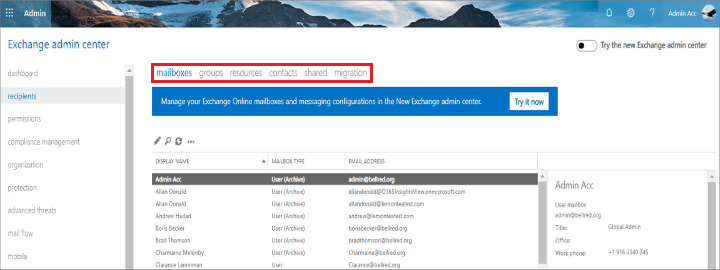
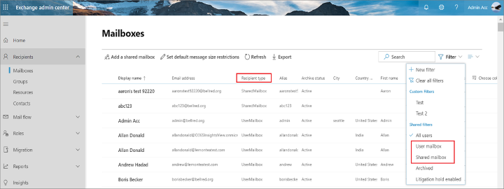
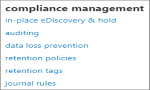
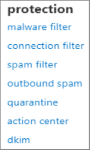

# Differences between the Classic Exchange admin center (Classic EAC) and the new Exchange admin center (new EAC)

The following are the differences between the Classic Exchange admin center (Classic EAC) and the new Exchange admin center (new EAC).

**User mailbox and Shared mailbox**

 - In Classic EAC, they are available as separate tabs, **Mailboxes**, and **Shared**. 
 
 - In new EAC, they're merged together under **Mailboxes**. In **Mailboxes** page, you can select **Filter > User mailbox/Shared mailbox** to view them. You can also sort them by clicking **Recipient type**. 

For more information, see [Manage user mailboxes](./recipients-in-exchange-online/manage-user-mailboxes/manage-user-mailboxes.md).
 
**Compliance Management tab**

 - In Classic EAC, it is available. 
 
   
 
 - In new EAC, it is not available and is now a part of [**Microsoft 365 compliance center**](https://df.compliance.microsoft.com/homepage).
 
**Protection tab**

 - In Classic EAC, it is available. 
 
   
 
 - In new EAC, it is not available and is now a part of [**Microsoft 365 security center**](https://df.security.microsoft.com/homepage).

**Unified Messaging tab**

 - In Classic EAC, it is available.
 
 - In new EAC, Exchange Online Unified Messaging is retired.
 
**Migration**

- In Classic EAC, it is under **Recipients**.

- In new EAC, it is available as a separate tab in the feature pane.

**Cross Tenant Migration**

- In Classic EAC, it is not available.

- In new EAC, it is a new addition to the types of migration and is available under **Migration**.

**Permissions tab**

 - In Classic EAC, it is available.
 
 - In new EAC, it is now known as **Roles** and is available in the feature pane.
 
**View Alerts**

 - In Classic EAC, it is not available.
 
 - In new EAC, it is a new addition and is available under **Mail flow**.
 
For more information, see [Exchange admin center](./exchange-admin-center.md).

## What's new when upgrading from Classic Exchange admin center (Classic EAC) to new Exchange admin center (new EAC)?

1. **Personalized Dashboard** - The admin can now customize the dashboard by choosing from a wide variety of cards using **+ Add Card** option. It allows the admin to quickly view reports that are of more importance to them. 

2. **Training & Guide** - You can select **Training for admins** for a video tutorial and **Documentation** to learn about the new Exchange admin center.

3. **Reports** - You can view the reports on mail flow and migration batches.

4. **Insights** - You can use the recommendations to discover trends and/or insights, and take actions to fix issues related to mailbox and mail flow.

5. **Support Assistant** - You can get help from Microsoft 365 Support Assistant. For more information, see [Contact Support](/microsoft-365/admin/contact-support-for-business-products?preserve-view=true&view=o365-worldwide).

6. **Cloud Shell** - You can select the Cloud Shell icon to access a browser-based command-line experience built with Azure management tasks. It also securely authenticates automatically for instant access to your resources through Azure PowerShell cmdlets. For more information, see [Azure Cloud Shell](/azure/cloud-shell/overview?preserve-view=true&view=azps-4.8.0).

7. **Give feedback** - You can select the Give feedback icon to provide your feedback and let us know what you think. You can also share your email address for us to reach out to you for more information.

For more information, see [What's new in Exchange admin center](./whats-new.md).

## Related articles

[Microsoft 365 compliance center](/microsoft-365/compliance/microsoft-365-compliance-center?preserve-view=true&view=o365-worldwide)

[Microsoft 365 security center](/microsoft-365/security/mtp/overview-security-center?preserve-view=true&view=o365-worldwide)

[About the Microsoft Support and Recovery Assistant](https://support.microsoft.com/office/about-the-microsoft-support-and-recovery-assistant-e90bb691-c2a7-4697-a94f-88836856c72f)
