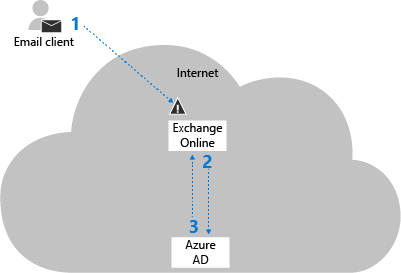
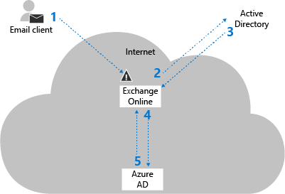

# Disable Basic authentication in Exchange Online

Basic authentication in Exchange Online uses a username and a password for client access requests. Blocking Basic authentication can help protect your Exchange Online organization from brute force or password spray attacks. When you disable Basic authentication for users in Exchange Online, their email clients and apps must support modern authentication. Those clients are:
  
- Outlook 2013 or later (note [Outlook 2013 requires a registry key change](https://support.office.com/article7dc1c01a-090f-4971-9677-f1b192d6c910))

- Outlook 2016 for Mac or later

- Outlook for iOS and Android

- Mail for iOS 11.3.1 or later

If your organization has no legacy email clients, you can use authentication policies in Exchange Online to disable Basic authentication requests, which forces all client access requests to use modern authentication. For more information about modern authentication, see [Using Office 365 modern authentication with Office clients](https://support.office.com/article/776c0036-66fd-41cb-8928-5495c0f9168a).
  
This topic explains how Basic authentication is used and blocked in Exchange Online, and the corresponding procedures for authentication policies.
  
## How Basic authentication works in Exchange Online

Basic authentication is also known as _proxy authentication_ because the email client transmits the username and password to Exchange Online, and Exchange Online forwards or _proxies_ the credentials to an authoritative identity provider (IdP) on behalf of the email client or app. The IdP depends your organization's authentication model: 
  
- **Cloud authentication**: The IdP is Azure Active Directory. 

- **Federated authentication**: The IdP is an on-premises solution like Active Directory Federation Services (AD FS). 

These authentication models are described in the following sections.
  
### Cloud authentication

The steps in cloud authentication are described in the following diagram:
  

  
1. The email client sends the username and password to Exchange Online.

    **Note**: When Basic authentication is blocked, it's blocked at this step. 

2. Exchange Online sends the username and password to Azure Active Directory.

3. Azure Active Directory returns a user ticket to Exchange Online and the user is authenticated.

### Federated authentication

The steps in federated authentication are described in the following diagram:
  

  
1. The email client sends the username and password to Exchange Online.

    **Note**: When Basic authentication is blocked, it's blocked at this step. 

2. Exchange Online sends the username and password to the on-premises IdP.

3. Exchange Online receives a Security Assertion Markup Language (SAML) token from the on-premises IdP.

4. Exchange Online sends the SAML token to Azure Active Directory.

5. Azure Active Directory returns a user ticket to Exchange Online and the user is authenticated.

## How Basic authentication is blocked in Exchange Online

You block Basic authentication in Exchange Online by creating and assigning authentication policies to individual users. The policies define the client protocols where Basic authentication is blocked, and assigning the policy to one or more users blocks their Basic authentication requests for the specified protocols.
  
When it's blocked, Basic authentication in Exchange Online is blocked at the first pre-authentication step (Step 1 in the previous diagrams) before the request reaches Azure Active Directory or the on-premises IdP. The benefit of this approach is brute force or password spray attacks won't reach the IdP (which might trigger account lock-outs due to incorrect login attempts).
  
Because authentication policies operate at the user level, Exchange Online can only block Basic authentication requests for users that exist in the cloud organization. For federated authentication, if a user doesn't exist in Exchange Online, the username and password are forwarded to the on-premises IdP. For example, consider the following scenario:
  
1. An organization has the federated domain contoso.com and uses on-premises AD FS for authentication.

2. The user ian@contoso.com exists in the on-premises organization, but not in Office 365 (there's no user account in Azure Active Directory and no recipient object in the Exchange Online global address list).

3. An email client sends a login request to Exchange Online with the username ian@contoso.com. An authentication policy can't be applied to the user, and the authentication request for ian@contoso.com is sent to the on-premises AD FS.

4. The on-premises AD FS can either accept or reject the authentication request for ian@contoso.com. If the request is accepted, a SAML token is returned to Exchange Online. As long as the SAML token's **ImmutableId** value matches a user in Azure Active Directory, Azure AD will issue a user ticket to Exchange Online (the **ImmutableId** value is set during Azure Active Directory Connect setup). 

In this scenario, if contoso.com uses on-premises AD FS server for authentication, the on-premises AD FS server will still receive authentication requests for non-existent usernames from Exchange Online during a password spray attack.
  
## Authentication policy procedures in Exchange Online

You manage all aspects of authentication policies in Exchange Online PowerShell. The protocols and services in Exchange Online that you can block Basic authentication for are described in the following table.
  
****

|**Protocol or service**|**Description**|**Parameter name**|
|:-----|:-----|:-----|
|Exchange Active Sync (EAS)|Used by some email clients on mobile devices.|*AllowBasicAuthActiveSync*|
|Autodiscover|Used by Outlook and EAS clients to find and connect to mailboxes in Exchange Online|*AllowBasicAuthAutodiscover*|
|IMAP4|Used by IMAP email clients.|*AllowBasicAuthImap*|
|MAPI over HTTP (MAPI/HTTP)|Used by Outlook 2013 and later.|*AllowBasicAuthMapi*|
|Offline Address Book (OAB)|A copy of address list collections that are downloaded and used by Outlook.|*AllowBasicAuthOfflineAddressBook*|
|Outlook Service|Used by the Mail and Calendar app for Windows 10.|*AllowBasicAuthOutlookService*|
|POP3|Used by POP email clients.|*AllowBasicAuthPop*|
|Reporting Web Services|Used to retrieve report data in Exchange Online.|*AllowBasicAuthReportingWebServices*|
|Exchange Representational State Transfer (REST)|A programming interfaced that's used by third-party apps.|*AllowBasicAuthRest*|
|Outlook Anywhere (RPC over HTTP)|Used by Outlook 2016 and earlier.|*AllowBasicAuthRpc*|
|Authenticated SMTP|Used by POP and IMAP client's to send email messages.|*AllowBasicAuthSmtp*|
|Exchange Web Services (EWS)|A programming interface that's used by Outlook, Outlook for Mac, and third-party apps.|*AllowBasicAuthWebServices*|
|PowerShell|Used to connect to Exchange Online with remote PowerShell. If you block Basic authentication for Exchange Online PowerShell, you need to use the Exchange Online PowerShell Module to connect. For instructions, see [Connect to Exchange Online PowerShell using multi-factor authentication](https://docs.microsoft.com/powershell/exchange/exchange-online/connect-to-exchange-online-powershell/mfa-connect-to-exchange-online-powershell).|*AllowBasicAuthPowerShell*|
   
Typically, when you block Basic authentication for a user, we recommend that you block Basic authentication for all protocols. However, you can use the *AllowBasicAuth\**  parameters (switches) on the **New-AuthenticationPolicy** and **Set-AuthenticationPolicy** cmdlets to selectively allow or block Basic authentication for specific protocols. 
  
For email clients and apps that don't support modern authentication, you need to allow Basic authentication for the protocols and services that they require. These protocols and services are described in the following table:
  
****

|**Client**|**Protocols and services**|
|:-----|:-----|
|Outlook 2013 and later|• Autodiscover <br/>• Exchange Web Services (EWS) <br/>• MAPI over HTTP <br/>• Outlook Anywhere (RPC over HTTP) <br/>• Offline Address Book (OAB)|
|Outlook for Mac 2016|• Autodiscover <br/>• EWS|
|Exchange ActiveSync clients (for example, iOS Mail 11.3.1)|• Autodiscover <br/>• ActiveSync (EAS)|
|POP clients|• POP3 <br/>• Authenticated SMTP|
|IMAP clients|• IMAP4 <br/>• Authenticated SMTP|
   
Blocking Basic authentication will block the following legacy Exchange Online features:
  
- **App passwords**: For more information about app passwords, see [Create an app password for Office 365](https://support.office.com/article/3e7c860f-bda4-4441-a618-b53953ee1183.aspx).

- **Availability address spaces**: These contain a service account that's used to share calendar free/busy information in hybrid and federated deployments. The service account authenticates with a username and password, so blocking Basic authentication blocks the authentication flow. For more information abut availability address spaces in hybrid deployments, see [Demystifying Hybrid Free/Busy](https://blogs.technet.microsoft.com/exchange/2018/02/06/demystifying-hybrid-freebusy-what-are-the-moving-parts/).

### What do you need to know before you begin?

- Verify that modern authentication for Outlook desktop clients is enabled in your Exchange Online organization (it's disabled by default). For more information, see [Enable or disable modern authentication in Exchange Online](https://support.office.com/article/58018196-f918-49cd-8238-56f57f38d662).

- Verify your email clients and apps support modern authentication (see the list at the beginning of the topic). Also, verify that your Outlook desktop clients are running the minimum required cumulative updates. For more information, see [Outlook Updates](https://support.office.com/article/472c2322-23a4-4014-8f02-bbc09ad62213).

- To learn how to connect to Exchange Online PowerShell, see [Connect to Exchange Online PowerShell](https://go.microsoft.com/fwlink/p/?LinkId=396554).

### Create and apply authentication policies

The steps to create and apply authentication policies to block Basic authentication in Exchange Online are:
  
1. Create the authentication policy.

2. Assign the authentication policy to users.

3. Wait 24 hours for the policy to be applied to users, or force the policy to be immediately applied.

These steps are described in the following sections.
  
#### Step 1: Create the authentication policy

To create a policy that blocks Basic authentication for all available client protocols in Exchange Online (the recommended configuration), use the following syntax:
  
```
New-AuthenticationPolicy -Name "<Descriptive Name>"
```

This example creates an authentication policy named Block Basic Auth.
  
```
New-AuthenticationPolicy -Name "Block Basic Auth"
```

For detailed syntax and parameter information, see [New-AuthenticationPolicy](https://docs.microsoft.com/powershell/module/exchange/organization/set-authenticationpolicy).
  
 **Notes**: 
  
- You can't change the name of the policy after you create it (the *Name* parameter isn't available on the **Set-AuthenticationPolicy** cmdlet). 

- To enable Basic authentication for specific protocols in the policy, see the [Modify authentication policies](#modify-authentication-policies) section later in this topic. The same protocol settings are available on the **New-AuthenticationPolicy** and **Set-AuthenticationPolicy** cmdlets, and the steps to enable Basic authentication for specific protocols are the same for both cmdlets. 

#### Step 2: Assign the authentication policy to users

There are three basic methods you can use to assign authentication policies to users:
  
- **Individual user accounts**: Use the following syntax: 

    ```
    Set-User -Identity <UserIdentity> -AuthenticationPolicy <PolicyIdentity>
    ```

  This example assigns the policy named Block Basic Auth to the user account laura@contoso.com.

    ```
    Set-User -Identity laura@contoso.com -AuthenticationPolicy "Block Basic Auth"
    ```

- **Filter user accounts by attributes**: This method requires that the user accounts all share a unique filterable attribute (for example, Title or Department) that you can use to identify the users. The syntax uses the following commands (two to identify the user accounts, and the other to apply the policy to those users): 

    ```
    $<VariableName1> = Get-User -ResultSize unlimited -Filter <Filter>
    ```

    ```
    $<VariableName2> = $<VariableName1>.MicrosoftOnlineServicesID
    ```

    ```
    $<VariableName2> | foreach {Set-User -Identity $_ -AuthenticationPolicy "Block Basic Auth"}
    ```

  This example assigns the policy named Block Basic Auth to all user accounts whose **Title** attribute contains the value "Sales Associate". 

    ```
    $SalesUsers = Get-User -ResultSize unlimited -Filter {(RecipientType -eq 'UserMailbox') -and (Title -like '*Sales Associate*')}
    ```

    ```
    $Sales = $SalesUsers.MicrosoftOnlineServicesID
    ```

    ```
    $Sales | foreach {Set-User -Identity $_ -AuthenticationPolicy "Block Basic Auth"}
    ```

- **Use a list of specific user accounts**: This method requires a text file to identify the user accounts. Values that don't contain spaces (for example, the Office 365 work or school account) work best. The text file must contain one user account on each line like this: 

    `akol@contoso.com`

    `tjohnston@contoso.com`

    `kakers@contoso.com`

  The syntax uses the following two commands (one to identify the user accounts, and the other to apply the policy to those users):

    ```
    $<VariableName> = Get-Content "<text file>"
    ```

    ```
    $<VariableName> | foreach {Set-User -Identity $_ -AuthenticationPolicy <PolicyIdentity>}
    ```

  This example assigns the policy named Block Basic Auth to the user accounts specified in the file C:\My Documents\BlockBasicAuth.txt.

    ```
    $BBA = Get-Content "C:\My Documents\BlockBasicAuth.txt"
    ```

    ```
    $BBA | foreach {Set-User -Identity $_ -AuthenticationPolicy "Block Basic Auth"}
    ```

 **Note**: To remove the policy assignment from users, use the value `$null` for the *AuthenticationPolicy* parameter on the **Set-User** cmdlet. 
  
#### Step 3: (Optional) Immediately apply the authentication policy to users

By default, when you create or change the authentication policy assignment on users or update the policy, the changes take effect within 24 hours. If you want the policy to take effect within 30 minutes, use the following syntax:
  
```
Set-User -Identity <UserIdentity> -STSRefreshTokensValidFrom $([System.DateTime]::UtcNow)
```

This example immediately applies the authentication policy to the user laura@contoso.com.
  
```
Set-User -Identity laura@contoso.com -STSRefreshTokensValidFrom $([System.DateTime]::UtcNow)
```

This example immediately applies the authentication policy to multiple users that were previously identified by filterable attributes or a text file. This example works if you're still in the same PowerShell session and you haven't changed the variables you used to identify the users (you didn't use the same variable name afterwards for some other purpose). For example:
  
```
$Sales | foreach {Set-User -Identity $_ -STSRefreshTokensValidFrom $([System.DateTime]::UtcNow)}
```

or

``` 
$BBA | foreach {Set-User -Identity $_ -STSRefreshTokensValidFrom $([System.DateTime]::UtcNow)}
```
  
### View authentication policies

To view a summary list of the names of all existing authentication policies, run the following command:
  
```
Get-AuthenticationPolicy | Format-Table -Auto Name
```

To view detailed information about a specific authentication policy, use this syntax:
  
```
Get-AuthenticationPolicy -Identity <PolicyIdentity>
```

This example returns detailed information about the policy named Block Basic Auth.
  
```
Get-AuthenticationPolicy -Identity "Block Basic Auth"
```

For detailed syntax and parameter information, see [Get-AuthenticationPolicy](https://docs.microsoft.com/powershell/module/exchange/organization/get-authenticationpolicy).
  
### Modify authentication policies

By default, when you create a new authentication policy without specifying any protocols, Basic authentication is blocked for all client protocols in Exchange Online. In other words, the default value of the *AllowBasicAuth\** parameters (switches) is `False` for all protocols. 
  
- To enable Basic authentication for a specific protocol that's disabled, specify the switch without a value.

- To disable Basic authentication for a specific protocol that's enabled, you can only use the value `:$false`.

You can use the **Get-AuthenticationPolicy** cmdlet to see the current status of the *AllowBasicAuth\** switches in the policy. 
  
This example enables basic authentication for the POP3 protocol and disables basic authentication for the IMAP4 protocol in the existing authentication policy named Block Basic Auth.
  
```
Set-AuthenticationPolicy -Identity "Block Basic Auth" -AllowBasicAuthPop -AllowBasicAuthImap:$false
```

For detailed syntax and parameter information, see [Set-AuthenticationPolicy](https://docs.microsoft.com/powershell/module/exchange/organization/set-authenticationpolicy).
  
### Configure the default authentication policy

The default authentication policy is assigned to all users who don't already have a specific policy assigned to them. Note that the authentication policies assigned to users take precedence to the default policy. To configure the default authentication policy for the organization, use this syntax:
  
```
Set-OrganizationConfig -DefaultAuthenticationPolicy <PolicyIdentity>
```

This example configures the authentication policy named Block Basic Auth as the default policy.
  
```
Set-OrganizationConfig -DefaultAuthenticationPolicy "Block Basic Auth"
```

 **Note**: To remove the default authentication policy designation, use the value `$null` for the *DefaultAuthenticationPolicy* parameter. 
  
### Remove authentication policies

To remove an existing authentication policy, use this syntax:
  
```
Remove-AuthenticationPolicy -Identity <PolicyIdentity>
```

This example removes the policy named Test Auth Policy.
  
```
Remove-AuthenticationPolicy -Identity "Test Auth Policy"
```

For detailed syntax and parameter information, see [Remove-AuthenticationPolicy](https://docs.microsoft.com/powershell/module/exchange/organization/remove-authenticationpolicy).
  
### How do you know that you've successfully disabled Basic authentication in Exchange Online?

When an authentication policy blocks Basic authentication requests from a specific user for a specific protocol in Exchange Online, the response is `401 Unauthorized`. No additional information is returned to the client to avoid leaking any additional information about the blocked user. An example of the response looks like this:
  
```
HTTP/1.1 401 Unauthorized
Server: Microsoft-IIS/10.0
request-id: 413ee498-f337-4b0d-8ad5-50d900eb1f72
X-CalculatedBETarget: DM5PR2101MB0886.namprd21.prod.outlook.com
X-BackEndHttpStatus: 401
Set-Cookie: MapiRouting=#################################################; path=/mapi/; secure; HttpOnly
X-ServerApplication: Exchange/15.20.0485.000
X-RequestId: {3146D993-9082-4D57-99ED-9E7D5EA4FA56}:8
X-ClientInfo: {B0DD130A-CDBF-4CFA-8041-3D73B4318010}:59
X-RequestType: Bind
X-DiagInfo: DM5PR2101MB0886
X-BEServer: DM5PR2101MB0886
X-Powered-By: ASP.NET
X-FEServer: MA1PR0101CA0031
WWW-Authenticate: Basic Realm="",Basic Realm=""
Date: Wed, 31 Jan 2018 05:15:08 GMT
Content-Length: 0
```
