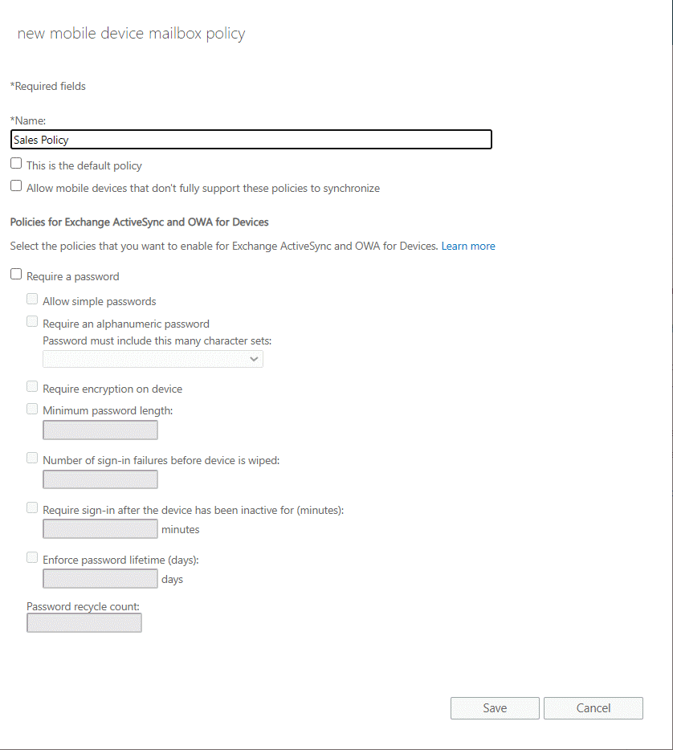
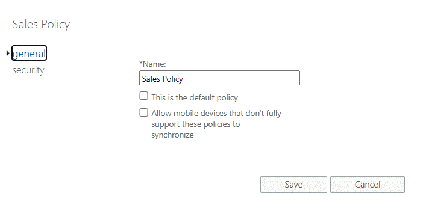
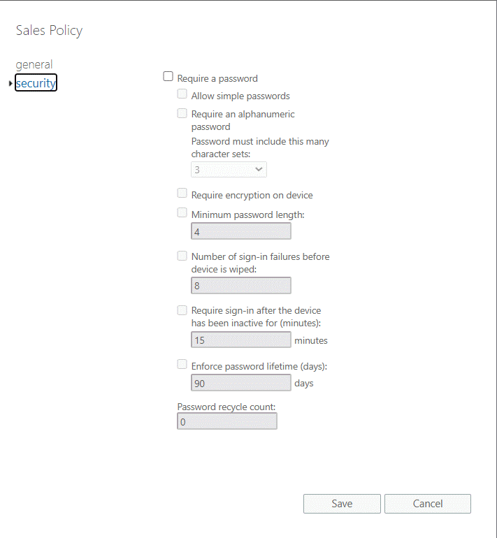

# Mobile device mailbox policies in Exchange Online

In Microsoft 365 or Office 365, you can create mobile device mailbox policies to apply a common set of policies or security settings to a collection of users. A default mobile device mailbox policy is created in every Microsoft 365 or Office 365 organization.

## Overview of mobile device mailbox policies

You can use mobile device mailbox policies to manage many different settings. These include the following:

- Require a password

- Specify the minimum password length

- Allow a numeric PIN or require special characters in the password

- Designate how long a device can be inactive before requiring the user to re-enter a password

- Wipe a device after a specific number of failed password attempts

## Mobile device password settings and biometrics

Many mobile devices support biometrics such as Apple Touch ID or Face ID. Exchange mobile device mailbox policies do not control whether biometrics can be used instead of typing the device PIN. Mobile device mailbox policies can be configured to require a device PIN, but then the users control whether they use biometrics after complying with the device PIN requirement.

Customers that need advanced control over the use of biometrics should consider device enrollment solutions such as Microsoft Intune. See [Deploying Outlook for iOS and Android app configuration settings](../outlook-for-ios-and-android/outlook-for-ios-and-android-configuration-with-microsoft-intune.md) for more information.

## Mobile device password settings and Android

Android 9.0 and earlier versions utilize Android's device admin functionality to manage device password settings defined in a mobile device mailbox policy.

With Android 10.0 and later, Android has removed device admin functionality. Instead, apps that require a screen lock query the device's (or the work profile's) screen lock complexity using the [getPasswordComplexity](https://developer.android.com/reference/android/app/admin/DevicePolicyManager#getPasswordComplexity()) API. Apps that require a stronger screen lock direct the user to the system screen lock settings, allowing the user to update the security settings to become compliant. At no time is the app aware of the user's password; the app is only aware of the password complexity level. Android supports the following four password complexity levels:

|Password complexity level |Password requirements  |
|---------|---------|
|None     |No password requirements are configured         |
|Low     |Password can be a pattern or a PIN with either repeating (4444) or ordered (1234, 4321, 2468) sequences         |
|Medium     |Passwords that meet one of the following criteria:<br/><br/>- PIN with no repeating (4444) or ordered (1234, 4321, 2468) sequences with a minimum length of 4 characters <br/>- Alphabetic passwords with a minimum length of 4 characters<br/>- Alphanumeric passwords with a minimum length of 4 characters        |
|High     |Passwords that meet one of the following criteria:<br/><br/>- PIN with no repeating (4444) or ordered (1234, 4321, 2468) sequences with a minimum length of 8 characters<br/>- Alphabetic passwords with a minimum length of 6 characters<br/>- Alphanumeric passwords with a minimum length of 6 characters         |

Android's password complexity levels are mapped to the following Exchange mobile device mailbox policy settings:

|Mobile device mailbox policy setting  |Android password complexity level  |
|---------|---------|
|Password enabled = false     | None        |
|Allow simple password = true<br/>Min password length < 4      |Low         |
|Alphanumeric password required = false<br/>Min password length >= 4<br/>Min password length < 8      |Medium         |
|Alphanumeric password required = true<br/>Min password length < 6      |Medium         |
|Alphanumeric password required = false<br/>Min password length >= 8      |High         |
|Alphanumeric password required = true<br/>Min password length >= 6      |High         |

## Mobile device mailbox policy settings

The following table summarizes the settings you can specify using mobile device mailbox policies.

**Mobile device mailbox policy settings**

|**Setting**|**Description**|
|:-----|:-----|
|Allow Bluetooth|This setting specifies whether a mobile device allows Bluetooth connections. The available options are Disable, HandsFree Only, and Allow. The default value is Allow.|
|Allow Browser|This setting specifies whether Pocket Internet Explorer is allowed on the mobile device. This setting doesn't affect third-party browsers installed on the mobile device. The default value is `$true`.|
|Allow Camera|This setting specifies whether the mobile device camera can be used. The default value is `$true`.|
|Allow Consumer EMail|This setting specifies whether the mobile device user can configure a personal email account (either POP3 or IMAP4) on the mobile device. The default value is `$true`. This setting doesn't control access to email accounts that are using third-party mobile device email programs.|
|Allow Desktop Sync|This setting specifies whether the mobile device can synchronize with a computer through a cable, Bluetooth, or IrDA connection. The default value is `$true`.|
|Allow External Device Management|This setting specifies whether an external device management program is allowed to manage the mobile device.|
|Allow HTML Email|This setting specifies whether email synchronized to the mobile device can be in HTML format. If this setting is set to `$false`, all email is converted to plain text.|
|Allow Internet Sharing|This setting specifies whether the mobile device can be used as a modem for a desktop or a portable computer. The default value is `$true`.|
|AllowIrDA|This setting specifies whether infrared connections are allowed to and from the mobile device.|
|Allow Mobile OTA Update|This setting specifies whether the mobile device mailbox policy settings can be sent to the mobile device over a cellular data connection. The default value is `true`.|
|Allow non-provisionable devices|This setting specifies whether mobile devices that may not support application of all policy settings are allowed to connect to Office 365 by using Exchange ActiveSync. Allowing non-provisionable mobile devices has security implications. For example, some non-provisionable devices may not be able to implement an organization's password requirements.|
|Allow POPIMAPEmail|This setting specifies whether the user can configure a POP3 or an IMAP4 email account on the mobile device. The default value is `$true`. This setting doesn't control access by third-party email programs.|
|Allow Remote Desktop|This setting specifies whether the mobile device can initiate a remote desktop connection. The default value is `$true`.|
|Allow simple password|This setting enables or disables the ability to use a simple password such as 1111 or 1234. The default value is `$true`.|
|Allow S/MIME encryption algorithm negotiation|This setting specifies whether the messaging application on the mobile device can negotiate the encryption algorithm if a recipient's certificate doesn't support the specified encryption algorithm.|
|Allow S/MIME software certificates|This setting specifies whether S/MIME software certificates are allowed on the mobile device.|
|Allow storage card|This setting specifies whether the mobile device can access information that's stored on a storage card.|
|Allow text messaging|This setting specifies whether text messaging is allowed from the mobile device. The default value is `$true`.|
|Allow unsigned applications|This setting specifies whether unsigned applications can be installed on the mobile device. The default value is `$true`.|
|Allow unsigned installation packages|This setting specifies whether an unsigned installation package can be run on the mobile device. The default value is `$true`.|
|Allow Wi-Fi|This setting specifies whether wireless Internet access is allowed on the mobile device. The default value is `$true`.|
|Alphanumeric password required|This setting requires that a password contains numeric and non-numeric characters. The default value is `$true`.|
|Approved Application List|This setting stores a list of approved applications that can be run on the mobile device.|
|Attachments enabled|This setting enables attachments to be downloaded to the mobile device. The default value is `$true`.|
|Device encryption enabled|This setting enables encryption on the mobile device. Not all mobile devices can enforce encryption. For more information, see the device and mobile operating system documentation.|
|Device policy refresh interval|This setting specifies how often the mobile device mailbox policy is sent from the server to the mobile device.|
|IRM enabled|This setting specifies whether Information Rights Management (IRM) is enabled on the mobile device.|
|Max attachment size|This setting controls the maximum size of attachments that can be downloaded to the mobile device. The default value is Unlimited.|
|Max calendar age filter| This setting specifies the maximum range of calendar days that can be synchronized to the mobile device. The following values are accepted:  <br/>  All  <br/>  TwoWeeks  <br/>  OneMonth  <br/>  ThreeMonths  <br/>  SixMonths|
|Max email age filter| This setting specifies the maximum number of days of email items to synchronize to the mobile device. The following values are accepted:  <br/>  All  <br/>  OneDay  <br/>  ThreeDays  <br/>  OneWeek  <br/>  TwoWeeks  <br/>  OneMonth|
|Max email body truncation size|This setting specifies the maximum size at which email messages are truncated when synchronized to the mobile device. The value is in kilobytes (KB).|
|Max email HTML body truncation size|This setting specifies the maximum size at which HTML email messages are truncated when synchronized to the mobile device. The value is in kilobytes (KB).|
|Max inactivity time lock|This value specifies the length of time that the mobile device can be inactive before a password is required to reactivate it. You can enter any interval between 30 seconds and 1 hour. The default value is 15 minutes.|
|Max password failed attempts|This setting specifies the number of attempts a user can make to enter the correct password for the mobile device. You can enter any number from 4 through 16. The default value is 8.|
|Min password complex characters|This setting specifies the minimum number of complex characters required in the mobile device's password. A complex character is a character that is not a letter.|
|Min password length|This setting specifies the minimum number of characters in the mobile device password. You can enter any number from 1 through 16. The default value is 4.|
|Password enabled|This setting enables the mobile device password.|
|Password expiration|This setting enables the administrator to configure a length of time after which a mobile device password must be changed.|
|Password history|This setting specifies the number of past passwords that can be stored in a user's mailbox. A user can't reuse a stored password.|
|Password recovery enabled|When this setting is enabled, the mobile device generates a recovery password that's sent to the server. If the user forgets their mobile device password, the recovery password can be used to unlock the mobile device and enable the user to create a new mobile device password.|
|Require device encryption|This setting specifies whether device encryption is required. If set to `$true`, the mobile device must be able to support and implement encryption to synchronize with the server.|
|Require encrypted S/MIME messages|This setting specifies whether S/MIME messages must be encrypted. The default value is `$false`.|
|Require encryption S/MIME algorithm|This setting specifies what required algorithm must be used when encrypting S/MIME messages.|
|Require manual synchronization while roaming|This setting specifies whether the mobile device must synchronize manually while roaming. Allowing automatic synchronization while roaming will frequently lead to larger-than-expected data costs for the mobile device data plan.|
|Require signed S/MIME algorithm|This setting specifies what required algorithm must be used when signing a message.|
|Require signed S/MIME messages|This setting specifies whether the mobile device must send signed S/MIME messages.|
|Require storage card encryption|This setting specifies whether the storage card must be encrypted. Not all mobile device operating systems support storage card encryption. For more information, see your mobile device and mobile operating system documentation.|
|Unapproved InROM application list|This setting specifies a list of applications that cannot be run in ROM.|

## Managing mobile device mailbox policies

Mobile device mailbox policies can be created, modified, or deleted in the Exchange admin center (EAC) or Exchange Online PowerShell. If you create a policy in the EAC, you can configure only a subset of the available settings. You can configure the rest of the settings using Exchange Online PowerShell.

### What do you need to know before you begin?

- Estimated time to complete: 15 minutes.

- You need to be assigned permissions before you can perform this procedure or procedures. To see what permissions you need, see the "Mobile devices" feature in the [Feature permissions in Exchange Online](../../permissions-exo/feature-permissions.md) topic.

- To open the Exchange admin center (EAC), see [Exchange admin center in Exchange Online](../../exchange-admin-center.md). To connect to Exchange Online PowerShell, see [Connect to Exchange Online PowerShell](https://docs.microsoft.com/powershell/exchange/connect-to-exchange-online-powershell).

- For information about keyboard shortcuts that may apply to the procedures in this topic, see [Keyboard shortcuts for the Exchange admin center](../../accessibility/keyboard-shortcuts-in-admin-center.md).

> [!TIP]
> Having problems? Ask for help in the Exchange forums. Visit the forums at [Exchange Online](https://social.technet.microsoft.com/forums/msonline/home?forum=onlineservicesexchange).

### Create a new mobile device mailbox policy

#### Use the EAC to create a new mobile device mailbox policy

> [!NOTE]
> You can only set a subset of mobile device mailbox policy settings in the EAC. To set all the mobile device mailbox policy settings, you need to use the Exchange Online PowerShell.

1. In the EAC, click **Mobile** \> **Mobile Device Mailbox Policies**, and then click **Add** .

2. Use the various check boxes and drop-down lists to configure the settings for the mobile device mailbox policy.

   

    > [!WARNING]
    > Select **This is the default policy** to make the new mobile mailbox policy the default mobile mailbox policy. After you make a mobile mailbox policy the default policy, all new users will be assigned this policy automatically when they are created.

3. Click **Save**.

#### Use the Exchange Online PowerShell to create a new mobile device mailbox policy

You create a new mobile device mailbox policy using the [New-MobileDeviceMailboxPolicy](https://docs.microsoft.com/powershell/module/exchange/new-mobiledevicemailboxpolicy) cmdlet.

1. In the Exchange Online PowerShell, run the following command.

   ```powershell
   New-MobileDeviceMailboxPolicy -Name:"Management" -AllowBluetooth:$true -AllowBrowser:$true -AllowCamera:$true -AllowPOPIMAPEmail:$false -PasswordEnabled:$true -AlphanumericPasswordRequired:$true -PasswordRecoveryEnabled:$true -MaxEmailAgeFilter:10 -AllowWiFi:$true -AllowStorageCard:$true -AllowPOPIMAPEmail:$false
   ```

#### How do you know this worked?

To verify that you've successfully created a mobile device mailbox policy, use one of the following options:

1. In the EAC, click **Mobile** \> **Mobile Device mailbox policies**, and verify that your new policy is displayed in the List view.

2. In the Exchange Online PowerShell, run the following command.

   ```powershell
   Get-MobileDeviceMailboxPolicy -Identity <PolicyName>
   ```
   
For more information about this cmdlet, see [Get-MobileDeviceMailboxPolicy](https://docs.microsoft.com/powershell/module/exchange/get-mobiledevicemailboxpolicy).

#### Use the EAC to edit a mobile device mailbox policy

> [!NOTE]
> You can only edit a subset of mobile device mailbox policy settings in the EAC. To edit all the mobile device mailbox policy settings, you need to use the Exchange Online PowerShell.

1. In the EAC, click **Mobile** \> **Mobile Device Mailbox Policies**.

2. Select a policy from the List view and then click **Edit** .

3. Use the **General** and **Security** tabs to edit the mobile device mailbox policy settings.

   
     
   

4. Click **Save** to update the policy.

#### Use the Exchange Online PowerShell to edit mobile device mailbox policy settings

You edit a mobile device mailbox policy using the [Set-MobileDeviceMailboxPolicy](https://docs.microsoft.com/powershell/module/exchange/set-mobiledevicemailboxpolicy) cmdlet.

```powershell
Set-MobileDeviceMailboxPolicy -Identity:Default -DevicePasswordEnabled:$true -AlphanumericDevicePasswordRequired:$true -PasswordRecoveryEnabled:$true -MaxEmailAgeFilter:ThreeDays -AllowWiFi:$false -AllowStorageCard:$true -AllowPOPIMAPEmail:$false -IsDefault:$true -AllowTextMessaging:$true -Confirm:$true
```

#### How do you know this worked?

To verify that you've successfully edited a mobile device mailbox policy, do one of the following:

1. In the EAC, click **Mobile** \> **Mobile Device Mailbox Policy**, and then choose a specific policy. In the Details pane, you'll see a number of the policy settings listed.

2. In the Shell, run the following command.

   ```powershell
   Get-MobileDeviceMailboxPolicy -Identity <PolicyName>
   ```

For more information about this cmdlet, see [Get-MobileDeviceMailboxPolicy](https://docs.microsoft.com/powershell/module/exchange/get-mobiledevicemailboxpolicy).
