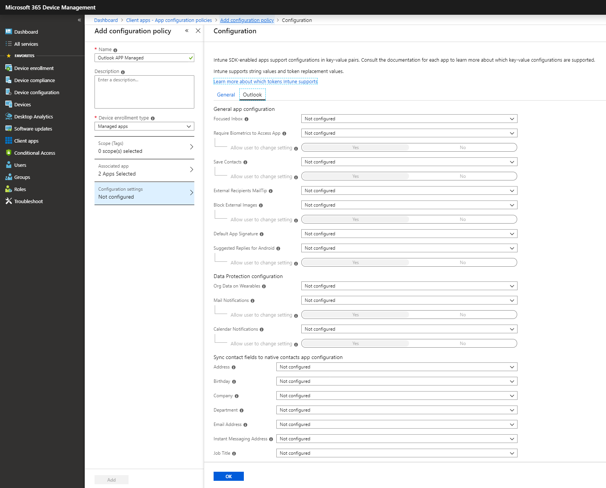

# Deploying Outlook for iOS and Android app configuration settings

 **Summary**: How to customize the behavior of Outlook for iOS and Android in your Exchange organization.

Outlook for iOS and Android supports app settings that allow Office 365 and mobile device management (MDM), like Intune, administrators to customize the behavior of the app.

Outlook for iOS and Android supports the following configuration scenarios:

- Account setup configuration
- Organization allowed accounts mode
- General app configuration settings
- Data protection settings

Each configuration scenario will highlight its specific requirements; for example, whether the configuration scenario requires device enrollment, and thus work with any MDM provider, or requires Intune App Protection Policies.

> [!IMPORTANT]
> For configuration settings that require device enrollment, with Android the devices must be enrolled via an Android Enterprise work profile and Outlook for Android must be deployed via the managed Google Play store. For more information, please see [Set up enrollment of Android work profile devices](https://docs.microsoft.com/intune/android-work-profile-enroll) and [Add app configuration policies for managed Android devices](https://docs.microsoft.com/intune/app-configuration-policies-use-android).

## App configuration scenarios

Outlook for iOS and Android offers administrators the following app configuration scenarios with enrolled devices:

  - Account setup configuration
  - Organization allowed accounts mode
  - General app configuration settings

These configuration scenarios only work with enrolled devices; however, any MDM provider is supported. If you are not using Intune, you'll need to consult with your MDM documentation on how to deploy these settings. For more information on the configuration keys, see [Configuration keys](#configuration-keys).

### Account setup configuration settings

Outlook for iOS and Android offers administrators the ability to “push” account configurations to their Office 365 and on-premises users leveraging hybrid Modern Authentication users. For more information on account setup configuration, see [Account setup with modern authentication in Exchange Online](https://docs.microsoft.com/exchange/clients-and-mobile-in-exchange-online/outlook-for-ios-and-android/setup-with-modern-authentication#account-setup-configuration-via-enterprise-mobility-management).

### Organization allowed accounts mode settings

Outlook for iOS and Android offers administrators the ability to restrict email and storage provider accounts to only corporate accounts. For more information on organization allowed accounts mode, please see [Account setup with modern authentication in Exchange Online](https://docs.microsoft.com/exchange/clients-and-mobile-in-exchange-online/outlook-for-ios-and-android/setup-with-modern-authentication#organization-allowed-accounts-mode).

### General app configuration settings

Outlook for iOS and Android offers administrators the ability to customize the default configuration for several in-app settings.

For this first release, Outlook is supporting the following settings for configuration:

<table>
<thead>
<tr class="header">
<th><strong>Setting</strong></th>
<th><strong>Default app behavior</strong></th>
<th><strong>Notes</strong></th>
</tr>
</thead>
<tbody>
<tr class="odd">
<td>Focused Inbox</td>
<td>On</td>
<td></td>
</tr>
<tr class="even">
<td>Require Biometrics to access the app</td>
<td>Off</td>
<td>
This setting is only available for Outlook for iOS.

If using App Protection Policies, Microsoft recommends disabling this setting to prevent dual access prompts.
</td>
</tr>
<tr class="odd">
<td>Save Contacts</td>
<td>Off</td>
<td>User must grant access to the native Contacts app for contact synchronization to occur.</td>
</tr>
<tr class="even">
<td>External Recipients MailTip</td>
<td>On</td>
<td></td>
</tr>
<tr class="odd">
<td>Block external images</td>
<td>Off</td>
<td></td>
</tr>
</tbody>
</table>

Settings that are security-related in nature have an additional option, **Allow user to change setting**. For these settings (*Save Contacts*, *External recipients MailTip*, *Block external images*, and *Require Biometrics to access the app*), administrators can prevent the user from changing the app’s configuration. The administrator’s configuration cannot be overridden. 

**Allow user to change setting** does not change the app’s behavior. For example, if the admin enables *Block external images* and prevents user change, then by default external images will not be downloaded in messages; however, the user can manually download the images for that message body.

> [!NOTE]
> The **Allow user to change setting** for *Require Biometrics to access the app* is currently only available as a configuration key. This will be addressed in a future Intune portal update. For more information regarding the configuration key, see [Configuration keys](#configuration-keys).

The following conditions describe Outlook’s behavior when implementing various app configurations:

  - If the admin configures a setting with its default value, and the app is configured with the default, then the admin’s configuration doesn't have any effect. For example, if the admin sets *External recipients MailTip*=on, the default value is also on, so Outlook’s configuration doesn't change.

  - If the admin configures a setting with the non-default value and the app is configured with the default, then the admin’s configuration is applied. For example, the admin sets *Focused Inbox*=off, but app default is on, so Outlook’s configuration for Focused Inbox is off.

  - If the user has configured a non-default value, but the admin has configured a default value and allows user choice, then Outlook retains the user’s configured value. For example, the user has enabled contact synchronization, but the admin sets *Save Contacts*=off and allows user choice, so Outlook keeps contact synchronization on and does not break caller-ID for user.

  - If the admin disables user choice, Outlook always enforces the admin-defined configuration, regardless of the user's configuration or default app configuration. For example, the user has enabled contact synchronization, but the admin sets *Save Contacts*=off and disables user choice, so contact synchronization gets disabled and the user is prevented from enabling it.

  - If after the MDM configuration is applied, if the user changes the setting value to not match the admin desired value (and user choice is allowed), then the user’s configuration is retained. For example, block external images is off by default, admin set *Block external images*=on, but afterwards, user changes block external images back to off; in this scenario, block external images remains off the next time the policy is applied.

Users are alerted to configuration changes via a notification toast in the app:  

This notification toast will automatically dismiss after ten seconds. There are two scenarios where this notification toast will not appear:

  - If the app has previously shown the notification in the last hour.

  - If the app has been installed in less than 24 hours.

#### Save Contacts

The *Save Contacts* setting is a special case scenario because unlike the other settings, this setting requires user interaction: the user needs to grant Outlook permissions to access the native Contacts app and the data stored within. If the user does not grant access, then contact synchronization cannot be enabled.

> [!NOTE]
> With Android Enterprise, administrators can configure the default permissions assigned to the managed app. Within the policy, you can define that Outlook for Android is granted READ\_CONTACTS and WRITE\_CONTACTS within the work profile; for more information on how to assign permissions, please see [Add app configuration policies for managed Android devices](https://docs.microsoft.com/intune/app-configuration-policies-use-android). When assigning default permissions it is important to understand which [Android Enterprise deployment models](https://developers.google.com/android/work/overview) are in use, as the permissions may grant access to personal data.

The workflow for enabling Save Contacts is the same for new accounts and existing accounts.

1.  The user is notified that the administrator has enabled contact synchronization. In Outlook for iOS, the notification occurs within the app, whereas in Outlook for Android, a persistent notification is delivered via the Android notification center.
    
    

2.  If the user taps on the notification, the user is prompted to grant access:

    

3.  If the user allows Outlook to access the native Contacts app, access is granted and contact synchronization will be enabled. If the user denies Outlook access to the native Contacts app, then the user is prompted to go into the OS settings and enable contact synchronization:

    

4.  In the event the user denies Outlook access to the native Contacts app and dismisses the previous prompt, the user may later enable access by navigating to the account configuration within Outlook and tapping **Open Settings**:

    

### Deploying app configuration settings with Intune

The Intune portal enables administrators to easily deploy these settings to Outlook for iOS and Android via App Configuration Policies.

The following steps will allow you to create an app configuration policy. After the configuration policy is created, you can assign its settings to groups of users.

> [!IMPORTANT]
>When deploying app configuration policies to managed devices, issues can occur when multiple policies have different values for the same configuration key and are targeted for the same app and user. This is due to the lack of a conflict resolution mechanism for resolving the differing values. You can prevent this by ensuring that only a single app configuration policy for managed devices is defined and targeted for the same app and user.

#### Create an app configuration policy for Outlook for iOS and Android

1.  Sign into the Azure portal.

2.  Select **More Services** \> **Monitoring + Management** \> **Intune**.

3.  On the **Client apps** blade of the Manage list, select **App configuration policies**.

4.  On the **App Configuration policies** blade, choose **Add**.

5.  On the **Add app configuration** blade, enter a **Name**, and optional **Description** for the app configuration settings.

6.  For **Device enrollment** type, choose **Managed devices**.

7.  For **Platform**, choose either **iOS** or **Android**.

8.  For **Associated app**, choose **Select the required app**, and then, on the **Targeted apps** blade, choose **Outlook**.
> [!NOTE]
> If Outlook is not listed as an available app, then you must add it by following the instructions in [Assign apps to Android work profile devices with Intune](https://docs.microsoft.com/intune/apps-add-android-for-work) and [Add iOS store apps to Microsoft Intune](https://docs.microsoft.com/intune/store-apps-ios).

9.  Click **OK** to return to the **Add app configuration** blade.

10. Choose **Configuration Settings**. On the **Configuration** blade, select **Use configuration designer** for the **Configuration settings format**.

11. If you want to deploy account setup configuration, select **Yes** for **Configure email account** **settings** and configure appropriately:
    
    - For **Authentication type**, select **Modern authentication**. This is required for Office 365 accounts or on-premises accounts leveraging hybrid modern authentication.

    - For **Username attribute from AAD**, select **User Principal Name**.

    - For **Email address attribute from AAD**, select **Primary SMTP Address**.

    - If you want to configure Outlook for iOS and Android such that only the work or school account can be used, select **Require** for **Allow only work or** **school** **accounts**.

12. If you want to deploy general app configuration settings, configure the desired settings accordingly:

    - For **Focused Inbox**, choose from the available options: **Not configured** (default), **On** (app default), **Off**.
    - For **Require Biometrics to access the app**, choose from the available options: **Not configured** (default), **On**, **Off** (app default). This setting is only available in Outlook for iOS.
    > [!IMPORTANT]
    > If the account will be protected by an Intune App Protection Policy that requires a PIN to access the protected account, then the **Require Biometrics to access the app** setting should be disabled, otherwise the user will be prompted with multiple authentication prompts when accessing the app.   

    - For **Save Contacts**, choose from the available options: **Not configured** (default), **On**, **Off** (app default). When selecting **On** or **Off**, administrators can choose to allow the user to change the app setting’s value. Select **Yes** (app default) to allow the user to change the setting or choose **No** if you want to prevent the user from changing the setting’s value.
    - For **External recipients MailTip**, choose from the available options: **Not configured** (default), **On** (app default), **Off**. When selecting **On** or **Off**, administrators can choose to allow the user to change the app setting’s value. Select **Yes** (app default) to allow the user to change the setting or choose **No** if you want to prevent the user from changing the setting’s value.
    - For **Block external images**, choose from the available options: **Not configured** (default), **On**, **Off** (app default). When selecting **On** or **Off**, administrators can choose to allow the user to change the app setting’s value. Select **Yes** (app default) to allow the user to change the setting or choose **No** if you want to prevent the user from changing the setting’s value.

13. When you are done, choose **OK**.

14. On the **Add app configuration** blade, choose **Add**.

The newly created configuration policy will be displayed on the **App configuration** blade.

> [!NOTE]
> For **Managed devices** you will need to create a separate app configuration policy for each platform. Also, Outlook will need to be installed from the Company Portal for the configuration settings to take effect.

#### Assign the configuration policy settings that you created

You assign the settings to groups of users in Azure Active Directory. When a user has the Microsoft Outlook app installed, the app will be managed by the settings you have specified. To do this:

1.  From the **Intune** blade, on the **Mobile apps** blade of the Manage list, select **App configuration policies**.

2.  From the list of app configuration policies, select the one you want to assign.

3.  On the next blade, choose **Assignments**.

4.  On the **Assignments** blade, select the Azure AD group to which you want to assign the app configuration, and then choose **OK**.

## Data protection scenarios
Outlook for iOS and Android supports app configuration policies for the following data protection settings when the app is managed by Intune:
- Managing the use of wearable technology
- Managing mail and calendar reminder notifications on iOS
- Managing the contact fields synchronized to the native contacts app

These settings can be deployed to the app regardless of device enrollment status.

### Configure Wearables for Outlook for iOS and Android

By default, Outlook for iOS and Android supports wearable technology, allowing the user to receive message notifications and event reminders, and the ability to interact with messages and view daily calendars. Organizations that want to disable the ability to access corporate data on wearables can deploy the following key via App configuration policies.

|**Key**|**Value**|**Device Enrollment Type**|
|:-----|:-----|:-----|
|com.microsoft.intune.mam.areWearablesAllowed|This key specifies if Outlook data can be synchronized to a wearable device. Setting the value to false disables wearable synchronization.    **Accepted values**: true, false    **Default if not specified**: true    **Example**: false|Managed apps|

### Configure Notifications for Outlook for iOS

The Apple notification architecture ensures notifications are mirrored on iOS devices and WatchOS. Which device shows the notification depends on the device state: if the Apple Watch is unlocked and on a wrist, while the iOS device is locked, then WatchOS will alert the user with the notification. Apple does not provide a mechanism where you can administratively control and prevent notifications on WatchOS while still allowing them to be delivered on iOS devices.

The following configuration settings will disable notifications completely on iOS and WatchOS. The disadvantage is that the end user will never see new mail notifications or calendar reminders on iOS devices. The user will have to launch the Outlook for iOS in order to discover new mail or see calendar appointments.

|**Key**|**Value**|**Device Enrollment Type**|
|:-----|:-----|:-----|
|com.microsoft.outlook.Mail.NotificationsEnabled|This key specifies if Outlook will allow mail notifications. Setting the value to false disables mail notifications.    **Accepted values**: true, false    **Default if not specified**: true    **Example**: false|Managed apps|
|com.microsoft.outlook.Mail.NotificationsEnabled.UserChangeAllowed|This key specifies if the user can adjust the mail notification setting within the app. Setting the value to false prevents the user from adjusting the mail notification setting.    **Accepted values**: true, false    **Default if not specified**: true    **Example**: false|Managed apps|
|com.microsoft.outlook.Calendar.NotificationsEnabled|This key specifies if Outlook will allow calendar reminder notifications. Setting the value to false disables calendar reminder notifications.    **Accepted values**: true, false    **Default if not specified**: true    **Example**: false|Managed apps|
|com.microsoft.outlook.Calendar.NotificationsEnabled.UserChangeAllowed|This key specifies if the user can adjust the calendar reminder notification setting within the app. Setting the value to false prevents the user from adjusting the calendar reminder notification setting.    **Accepted values**: true, false    **Default if not specified**: true    **Example**: false|Managed apps|

### Configure Contact Field Sync to native Contacts for Outlook for iOS and Android

The settings in the following table allow you to control the contact fields that will synchronize between Outlook on iOS and Android and the native Contacts applications.

> [!NOTE]
> Outlook for Android supports bi-directional contact synchronization. However, if a user edits a field in the native contacts app that is restricted (such as the **Notes** field), then that data will not synchronize back into Outlook for Android.

|**Key**|**Value**|**Device Enrollment Type**|
|:-----|:-----|:-----|
|com.microsoft.outlook.ContactSync.AddressAllowed|This key specifies if the contact's address should be synchronized to native contacts.    **Accepted values**: true, false    **Default if not specified**: true    **Example**: true|Managed apps|
|com.microsoft.outlook.ContactSync.BirthdayAllowed|This value specifies if the contact's birthday should be synchronized to native contacts.    **Accepted values**: true, false    **Default if not specified**: true    **Example**: true|Managed apps|
|com.microsoft.outlook.ContactSync.CompanyAllowed|This key specifies if the contact's company name should be synchronized to native contacts.    **Accepted values**: true, false    **Default if not specified**: true    **Example**: true|Managed apps|
|com.microsoft.outlook.ContactSync.DepartmentAllowed|This key specifies if the contact's department should be synchronized to native contacts.    **Accepted values**: true, false    **Default if not specified**: true    **Example**: true|Managed apps|
|com.microsoft.outlook.ContactSync.EmailAllowed|This key specifies if the contact's email address should be synchronized to native contacts.    **Accepted values**: true, false    **Default if not specified**: true    **Example**: true|Managed apps|
|com.microsoft.outlook.ContactSync.InstantMessageAllowed|This key specifies if the contact's instant messaging address should be synchronized to native contacts.    **Accepted values**: true, false    **Default if not specified**: true    **Example**: true|Managed apps|
|com.microsoft.outlook.ContactSync.JobTitleAllowed|This key specifies if the contact's job title should be synchronized to native contacts.    **Accepted values**: true, false    **Default if not specified**: true    **Example**: true|Managed apps|
|com.microsoft.outlook.ContactSync.NicknameAllowed|This key specifies if the contact's nickname should be synchronized to native contacts.    **Accepted values**: true, false    **Default if not specified**: true    **Example**: true|Managed apps|
|com.microsoft.outlook.ContactSync.NotesAllowed|This key specifies if the contact's notes should be synchronized to native contacts.    **Accepted values**: true, false    **Default if not specified**: true    **Example**: true|Managed apps|
|com.microsoft.outlook.ContactSync.PhoneHomeAllowed|This key specifies if the contact's home phone number should be synchronized to native contacts.    **Accepted values**: true, false    **Default if not specified**: true    **Example**: true|Managed apps|
|com.microsoft.outlook.ContactSync.PhoneHomeFaxAllowed|This key specifies if the contact's home fax number should be synchronized to native contacts.    **Accepted values**: true, false    **Default if not specified**: true    **Example**: true|Managed apps|
|com.microsoft.outlook.ContactSync.PhoneMobileAllowed|This key specifies if the contact's mobile phone number should be synchronized to native contacts.    **Accepted values**: true, false    **Default if not specified**: true    **Example**: true|Managed apps|
|com.microsoft.outlook.ContactSync.PhoneOtherAllowed|This key specifies if the contact's other phone number should be synchronized to native contacts.    **Accepted values**: true, false    **Default if not specified**: true    **Example**: true|Managed apps|
|com.microsoft.outlook.ContactSync.PhonePagerAllowed|This key specifies if the contact's pager phone number should be synchronized to native contacts.    **Accepted values**: true, false    **Default if not specified**: true    **Example**: true|Managed apps|
|com.microsoft.outlook.ContactSync.PhoneWorkAllowed|This value specifies if the work phone number should be synchronized to native contacts.    **Accepted values**: true, false    **Default if not specified**: true    **Example**: true|Managed apps|
|com.microsoft.outlook.ContactSync.PhoneWorkFaxAllowed|This key specifies if the contact's work fax number should be synchronized to native contacts.    **Accepted values**: true, false    **Default if not specified**: true    **Example**: true|Managed apps|
|com.microsoft.outlook.ContactSync.PrefixAllowed|This key specifies if the contact's name prefix should be synchronized to native contacts.    **Accepted values**: true, false    **Default if not specified**: true    **Example**: true|Managed apps|
|com.microsoft.outlook.ContactSync.SuffixAllowed|This key specifies if the contact's name suffix should be synchronized to native contacts.    **Accepted values**: true, false    **Default if not specified**: true    **Example**: true|Managed apps|

### Deploying the configuration scenarios with Microsoft Intune

If you are using Microsoft Intune as your mobile device management provider, the following steps will allow you to create an app configuration policy. After the configuration is created, you can assign its settings to groups of users.

> [!NOTE]
> Intune managed apps will check-in with an interval of 30 minutes for Intune App Configuration Policy status, when deployed in conjunction with an Intune App Protection Policy. If an Intune App Protection Policy isn't assigned to the user, then the Intune App Configuration Policy check-in interval is set to 720 minutes.

#### Create an app configuration policy for Outlook for iOS and Android

1. Sign in to the Azure portal.

2. Select **More Services** \> **Monitoring + Management** \> **Intune**.

3. On the **Client apps** blade of the Manage list, select **App configuration policies**.

4. On the **App Configuration policies** blade, choose **Add**.

5. On the **Add app configuration** blade, enter a **Name**, and optional **Description** for the app configuration settings.

6. For **Device enrollment** type, choose **Managed apps**.

7. For **Associated app**, choose **Select the required app**, and then, on the **Targeted apps** blade, choose **Outlook** by selecting both the iOS and Android platform Outlook apps.

8. Click **OK** to return to the **Add app configuration** blade.

9. Choose **Configuration Settings**. On the **Configuration** blade, define the key and value pairs that will supply configurations for Outlook for iOS and Android. The key and value pairs you can define are covered in [Data protection scenarios](#data-protection-scenarios).

10. When you are done, choose **OK**.

11. On the **Add app configuration** blade, choose **Add**.

The newly created configuration policy will be displayed on the **App configuration** blade.

#### Assign the configuration settings that you created

You assign the settings to groups of users in Azure Active Directory. When a user has the Microsoft Outlook app installed, the app will be managed by the settings you have specified. To do this:

1. From the **Intune** blade, on the **Mobile apps** blade of the Manage list, select **App configuration policies**.

2. From the list of app configuration policies, select the one you want to assign.

3. On the next blade, choose **Assignments**.

4. On the **Assignments** blade, select the Azure AD group to which you want to assign the app configuration, and then choose **OK**.

## Configuration keys

### Account setup configuration

Outlook for iOS and Android offers administrators the ability to “push” account configurations to their Office 365 users. For more information on account setup configuration, see [Account setup with modern authentication in Exchange Online](https://docs.microsoft.com/exchange/clients-and-mobile-in-exchange-online/outlook-for-ios-and-android/setup-with-modern-authentication#account-setup-configuration-via-enterprise-mobility-management).

| **Key**                                         | **Value**                                                                                                                                                                                                                                                                                        | **Device Enrollment Type** |
| ----------------------------------------------- | ------------------------------------------------------------------------------------------------------------------------------------------------------------------------------------------------------------------------------------------------------------------------------------------------ | -------------------------- |
| com.microsoft.outlook.EmailProfile.EmailAddress | This key specifies the email address to be used for sending and receiving mail. **Value type**: String **Accepted values**: Email address **Default if not specified**: \<blank\> **Required**: Yes **Example**: user@companyname.com                                                          | Managed devices            |
| com.microsoft.outlook.EmailProfile.EmailUPN     | This key specifies the User Principal Name or username for the email profile that will be used to authenticate the account. **Value type**: String **Accepted values**: UPN Address or username **Default if not specified**: \<blank\> **Required**: Yes **Example**: userupn@companyname.com | Managed devices            |
| com.microsoft.outlook.EmailProfile.AccountType  | This key specifies the account type being configured based on the authentication model. **Value type**: String **Accepted values**: ModernAuth **Required**: Yes **Example**: ModernAuth                                                                                                       | Managed devices            |

### Organization allowed accounts mode settings

Outlook for iOS and Android offers administrators the ability to restrict email and storage provider accounts to only corporate accounts. For more information on organization allowed accounts mode, please see [Account setup with modern authentication in Exchange Online](https://docs.microsoft.com/exchange/clients-and-mobile-in-exchange-online/outlook-for-ios-and-android/setup-with-modern-authentication#organization-allowed-accounts-mode).

| **Key**                                     | **Value**                                                                                                                                                                        | **Platform** | **Device Enrollment Type** |
| ------------------------------------------- | -------------------------------------------------------------------------------------------------------------------------------------------------------------------------------- | ------------ | -------------------------- |
| IntuneMAMAllowedAccountsOnly                | This key specifies the whether organization allowed account mode is active. **Value type**: String **Accepted values**: Enabled, Disabled **Required**: Yes **Value**: Enabled | iOS          | Managed devices            |
| IntuneMAMUPN                                | This key specifies the User Principal Name for the account. **Value type**: String **Accepted values**: UPN Address **Required**: Yes **Example**: userupn@companyname.com     | iOS          | Managed devices            |
| com.microsoft.intune.mam.AllowedAccountUPNs | This key specifies the UPNs allowed for organization allowed account mode. **Accepted values**: UPN Address **Required**: Yes **Example**: userupn@companyname.com   | Android      | Managed devices            |

### General app configuration settings

Outlook for iOS and Android offers administrators the ability to customize the default configuration for several in-app settings.

| **Key**                                     | **Value**                                                                                                                                                                        | **Platform** | **Device Enrollment Type** |
| ------------------------------------------- | -------------------------------------------------------------------------------------------------------------------------------------------------------------------------------- | ------------ | -------------------------- |
| com.microsoft.outlook.Mail.FocusedInbox | This key specifies whether Focused Inbox is enabled. Setting the value to false will disable Focused Inbox. **Value type**: Boolean **Accepted values**: true, false **Default if not specified**: true **Required**: No **Example**: false | iOS, Android |  Managed Devices            |
| com.microsoft.outlook.Auth.Biometric | This key specifies whether FaceID or TouchID is required to access the app. Setting the value to true will enable biometric access. **Value type**: Boolean **Accepted values**: true, false **Default if not specified**: false **Required**: No **Example**: false | iOS | Managed Devices            |
| com.microsoft.outlook.Auth.Biometric.UserChangeAllowed | This key specifies whether the biometric setting can be changed by the end user. **Value type**: Boolean **Accepted values**: true, false **Default if not specified**: true **Required**: No **Example**: false | iOS | Managed devices            |
| com.microsoft.outlook.Contacts.LocalSyncEnabled | This key specifies whether the app should sync Outlook contacts to the native Contacts app. Setting the value to true will enable contact sync. **Value type**: Boolean **Accepted values**: true, false **Default if not specified**: false **Required**: No **Example**: false | iOS, Android | Managed devices            |
| com.microsoft.outlook.Contacts.LocalSyncEnabled.UserChangeAllowed | This key specifies whether the contact sync setting can be changed by the end user. **Value type**: Boolean **Accepted values**: true, false **Default if not specified**: true **Required**: No **Example**: false | iOS, Android | Managed devices            |
| com.microsoft.outlook.Mail.ExternalRecipientsToolTipEnabled  | This key specifies whether the External Recipients MailTip is enabled. Setting the value to false will disable the MailTip. **Value type**: Boolean **Accepted values**: true, false **Default if not specified**: true **Required**: No **Example**: false | iOS, Android | Managed devices            |
| com.microsoft.outlook.Mail.ExternalRecipientsToolTipEnabled.UserChangeAllowed | This key specifies whether the External Recipients MailTip setting can be changed by the end user. Note that at this time, there is no user configurable setting for MailTips. **Value type**: Boolean **Accepted values**: true, false **Default if not specified**: true **Required**: No **Example**: false | iOS, Android | Managed devices            |
| com.microsoft.outlook.Mail.BlockExternalImagesEnabled | This key specifies whether external images are blocked by default. Setting the value to true will enable blocking external images. **Value type**: Boolean **Accepted values**: true, false **Default if not specified**: false **Required**: No **Example**: false | iOS, Android | Managed devices            |
| com.microsoft.outlook.Mail.BlockExternalImagesEnabled.UserChangeAllowed | This key specifies whether the Block External Images setting can be changed by the end user. **Value type**: Boolean **Accepted values**: true, false **Default if not specified**: true **Required**: No **Example**: false | iOS, Android | Managed devices            |
