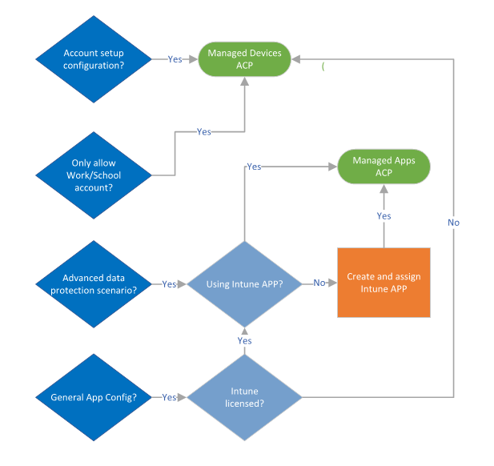
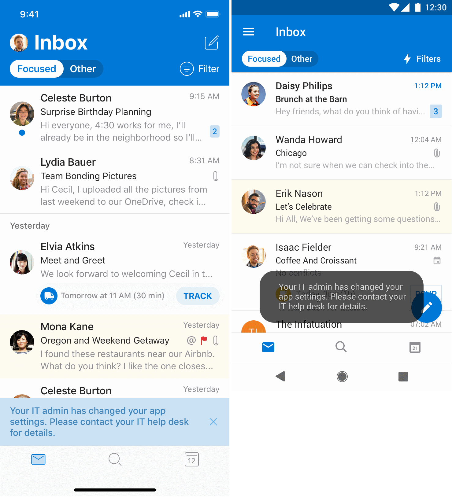
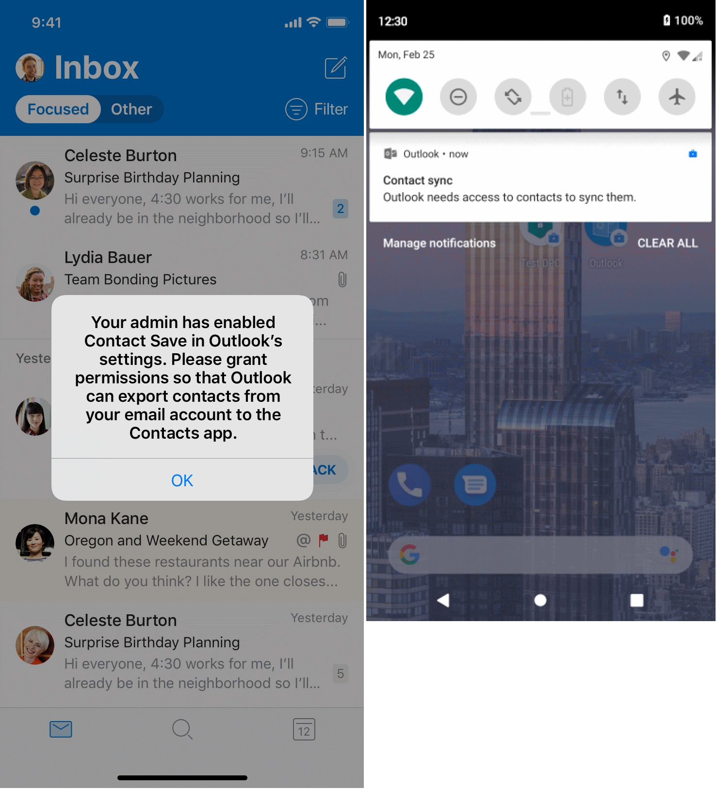
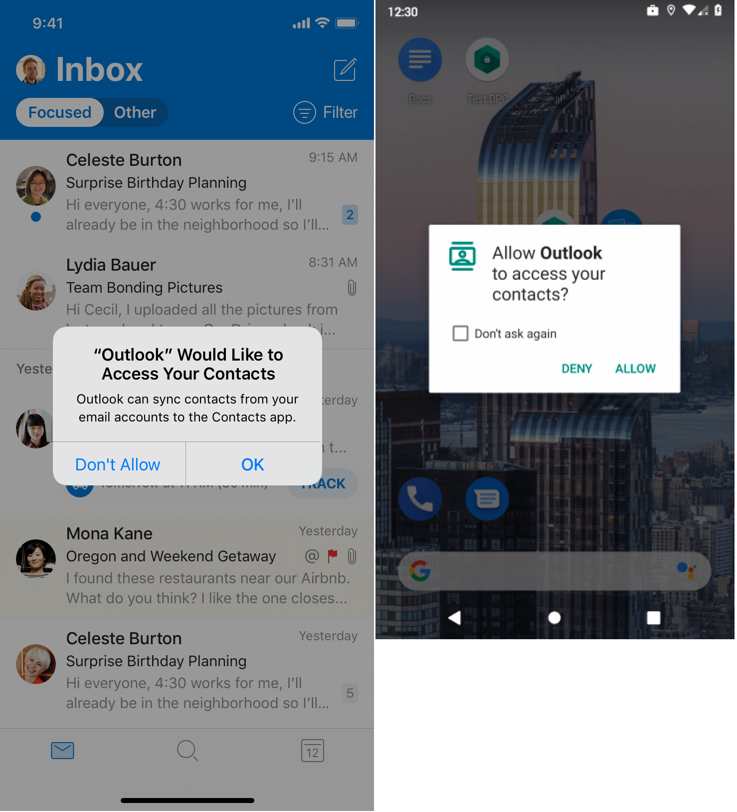
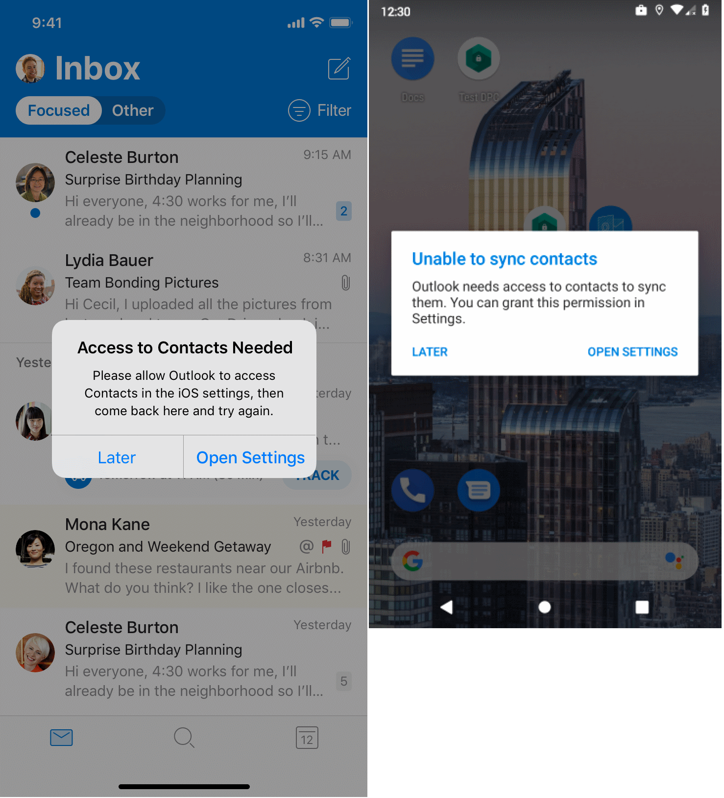
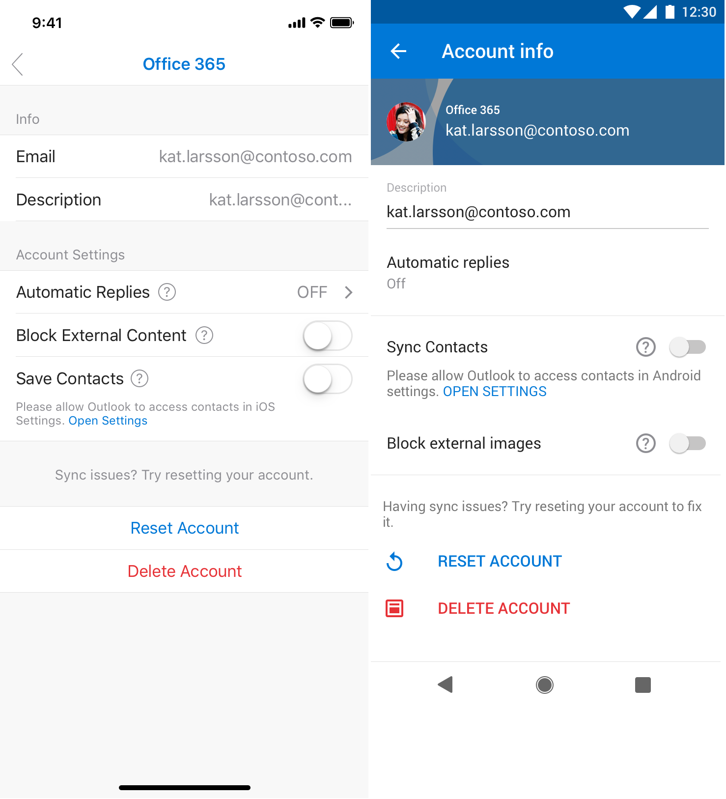

# Deploying Outlook for iOS and Android app configuration settings

 **Summary**: How to customize the behavior of Outlook for iOS and Android in your Exchange organization.

Outlook for iOS and Android supports app settings that allow unified endpoint management (UEM) administrators (using tools such as Microsoft Endpoint Manager) and Microsoft 365 or Office 365 administrators to customize the behavior of the app.

App configuration can be delivered either through the mobile device management OS channel on enrolled devices ([Managed App Configuration](https://developer.apple.com/library/content/samplecode/sc2279/Introduction/Intro.html) channel for iOS or the [Android in the Enterprise](https://developer.android.com/work/managed-configurations) channel for Android) or through the Intune App Protection Policy (APP) channel. Outlook for iOS and Android supports the following configuration scenarios:

- Account setup configuration
- Organization allowed accounts mode
- General app configuration settings
- S/MIME settings
- Data protection settings

> [!IMPORTANT]
> For configuration scenarios that require device enrollment on Android, the devices must be enrolled in Android Enterprise and Outlook for Android must be deployed via the managed Google Play store. For more information, please see [Set up enrollment of Android work profile devices](https://docs.microsoft.com/intune/android-work-profile-enroll) and [Add app configuration policies for managed Android devices](https://docs.microsoft.com/intune/app-configuration-policies-use-android).

Each configuration scenario highlights its specific requirements. For example, whether the configuration scenario requires device enrollment, and thus works with any UEM provider, or requires Intune App Protection Policies. The following flow chart outlines which channel needs to be used for the above configuration scenarios:

> [!NOTE]
> With Microsoft Endpoint Manager, app configuration delivered through the mobile device management OS channel is referred to as a **Managed Devices** App Configuration Policy (ACP); app configuration delivered through the App Protection Policy channel is referred to as a **Managed Apps** App Configuration Policy.

## Account configuration scenarios

Outlook for iOS and Android offers administrators the following app configuration scenarios with enrolled devices:

  - Account setup configuration
  - Organization allowed accounts mode
  
These configuration scenarios only work with enrolled devices. However, any UEM provider is supported. If you are not using Microsoft Endpoint Manager, you need to consult with your UEM documentation on how to deploy these settings. For more information on the configuration keys, see [Configuration keys](#configuration-keys).

### Account setup configuration settings

Outlook for iOS and Android offers administrators the ability to "push" account configurations to their Office 365 and on-premises users leveraging hybrid Modern Authentication users. For more information on account setup configuration, see [Account setup with modern authentication in Exchange Online](https://docs.microsoft.com/exchange/clients-and-mobile-in-exchange-online/outlook-for-ios-and-android/setup-with-modern-authentication#account-setup-configuration-via-enterprise-mobility-management).

### Organization allowed accounts mode settings

Outlook for iOS and Android offers administrators the ability to restrict email and storage provider accounts to only corporate accounts. For more information on organization allowed accounts mode, please see [Account setup with modern authentication in Exchange Online](https://docs.microsoft.com/exchange/clients-and-mobile-in-exchange-online/outlook-for-ios-and-android/setup-with-modern-authentication#organization-allowed-accounts-mode).

## General app configuration scenarios

Outlook for iOS and Android offers administrators the ability to customize the default configuration for several in-app settings. This capability is offered for both enrolled devices via any UEM provider and for devices that are not enrolled when Outlook for iOS and Android has an Intune App Protection Policy applied.

> [!NOTE]
> If an App Protection Policy is targeted to the users, the recommendation is to deploy the general app configuration settings in a **Managed Apps** device enrollment model. This ensures the App Configuration Policy is deployed to both enrolled devices and unenrolled devices. 

Outlook supports the following settings for configuration:

<table>
<thead>
<tr class="header">
<th>Setting</th>
<th>Default app behavior</th>
<th>Notes</th>
<th>Recommended configuration</th>
</tr>
</thead>
<tbody>
<tr class="odd">
<td>Focused Inbox</td>
<td>On</td>
<td>Focused Inbox separates your inbox into two tabs, Focused and Other. Your most important emails are on the Focused tab while the rest remains easily accessible (but out of the way) on the Other tab.</td>
<td>App default</td>
</tr>
<tr class="even">
<td>Require Biometrics to access the app</td>
<td>Off</td>
<td>
Biometrics, such as TouchID or FaceID, can be required for users to access the app on their device. When required, biometrics is used in addition to the authentication method selected in this profile.

This setting is only available for Outlook for iOS.

If using App Protection Policies, Microsoft recommends disabling this setting to prevent dual access prompts.
</td>
<td>Disable</td>
</tr>
<tr class="odd">
<td>Save (or Sync) Contacts</td>
<td>Off</td>
<td>
Saving contacts to the mobile device's native address book allows new calls and text messages to be linked with the user's existing Outlook contacts.

The user must grant access to the native Contacts app for contact synchronization to occur.</td>
<td>Enable</td>
</tr>
<tr class="even">
<td>Sync Calendars</td>
<td>Off</td>
<td>
Outlook for Android provides users the ability to synchronize Outlook calendar data to the native Calendar app.

The user must grant access to the native Calendar app for calendar synchronization to occur.

This feature is only supported with Outlook for Android.
</td>
<td>App default</td>
</tr>
<tr class="odd">
<td>External Recipients MailTip</td>
<td>On</td>
<td>
If the sender adds a recipient that's external or adds a distribution group that contains external recipients, the External Recipients MailTip is displayed. This MailTip informs senders if a message they're composing will leave the organization, helping them make the correct decisions about wording, tone, and content.

Note that Exchange Online MailTipsExternalRecipientsTipsEnabled parameter must be set to $true in order for Outlook for iOS and Android to see the External Recipients MailTip. For more information, see <a href="https://docs.microsoft.com/exchange/clients-and-mobile-in-exchange-online/mailtips/mailtips">MailTips</a>.
</td>
<td>App default</td>
</tr>
<tr class="even">
<td>Block external images</td>
<td>Off</td>
<td>When block external images is enabled, the app prevents the download of images hosted on the Internet that are embedded in the message body by default (the user can still choose to download the images).</td>
<td>Enable</td>
</tr>
<tr class="odd">
<td>Default app signature</td>
<td>On</td>
<td>Indicates whether the app uses its default signature, "Get Outlook for [OS]", during message composition. Users can add their own signature even when the default signature is disabled.</td>
<td>App default</td>
</tr>
<tr class="even">
<td>Suggested replies</td>
<td>On</td>
<td>By default, Outlook for iOS and Android suggests replies in the quick reply compose window. If you select a suggested reply, you can edit the reply before sending it.</td>
<td>App default</td>
</tr>
<tr class="odd">
<td>Recommendations feed</td>
<td>On</td>
<td>The Recommendations feed is powered by Microsoft Graph and provides a feed of your organization's Office files connected to the people in your organization. This feature is located in the Recommended section within the Search experience and only shows documents for which the user has access. Recommendations based on insights from other users in the organization can be controlled through the <a href="https://docs.microsoft.com/graph/api/resources/iteminsights?view=graph-rest-beta">itemInsights</a> setting.</td>
<td>App default</td>
</tr>
<tr class="even">
<td>Organize mail by thread</td>
<td>On</td>
<td>
By default, Outlook for iOS and Android collates related emails into a single threaded conversation view.
</td>
<td>App default</td>
</tr>
<tr class="odd">
<td>Play My Emails</td>
<td>On</td>
<td>By default, Play My Emails is promoted to eligible users via a banner in the inbox.</td>
<td>App default</td>
</tr>
<tr class="even">
<td>Text Predictions</td>
<td>On</td>
<td>By default, Outlook for iOS and Android can suggest words and phrases as you compose messages.</td>
<td>App default</td>
</tr>
</tbody>  
</table>

Settings that are security-related in nature have an additional option, **Allow user to change setting**. For these settings (*Save Contacts*, *Block external images*, and *Require Biometrics to access the app*), organizations can prevent the user from changing the app's configuration. The organization's configuration cannot be overridden.

**Allow user to change setting** does not change the app's behavior. For example, if the admin enables *Block external images* and prevents user change, then by default external images are not downloaded in messages; however, the user can manually download the images for that message body.

The following conditions describe Outlook's behavior when implementing various app configurations:

  - If the admin configures a setting with its default value, and the app is configured with the default, then the admin's configuration doesn't have any effect. For example, if the admin sets *External recipients MailTip*=on, the default value is also on, so Outlook's configuration doesn't change.

  - If the admin configures a setting with the non-default value and the app is configured with the default, then the admin's configuration is applied. For example, the admin sets *Focused Inbox*=off, but app default is on, so Outlook's configuration for Focused Inbox is off.

  - If the user has configured a non-default value, but the admin has configured a default value and allows user choice, then Outlook retains the user's configured value. For example, the user has enabled contact synchronization, but the admin sets *Save Contacts*=off and allows user choice, so Outlook keeps contact synchronization on and does not break caller-ID for user.

  - If the admin disables user choice, Outlook always enforces the admin-defined configuration, regardless of the user's configuration or default app configuration. For example, the user has enabled contact synchronization, but the admin sets *Save Contacts*=off and disables user choice, so contact synchronization gets disabled and the user is prevented from enabling it.

  - If after the app configuration is applied, if the user changes the setting value to not match the admin desired value (and user choice is allowed), then the user's configuration is retained. For example, block external images is off by default, admin set *Block external images*=on, but afterwards, user changes block external images back to off. In this scenario, block external images remains off the next time the policy is applied.

Users are alerted to configuration changes via a notification toast in the app:

> [!div class="mx-imgBorder"]
> 

This notification toast will automatically dismiss after 10 seconds. There are two scenarios where this notification toast will not appear:

  - If the app has previously shown the notification in the last hour.

  - If the app has been installed in less than 24 hours.

#### Save Contacts

The *Save Contacts* setting is a special case scenario because unlike the other settings, this setting requires user interaction: the user needs to grant Outlook permissions to access the native Contacts app and the data stored within. If the user does not grant access, then contact synchronization cannot be enabled.

> [!NOTE]
> With Android Enterprise, administrators can configure the default permissions assigned to the managed app. Within the policy, you can define that Outlook for Android is granted READ\_CONTACTS and WRITE\_CONTACTS within the work profile; for more information on how to assign permissions, please see [Add app configuration policies for managed Android devices](https://docs.microsoft.com/intune/app-configuration-policies-use-android). When assigning default permissions it is important to understand which [Android Enterprise deployment models](https://developers.google.com/android/work/overview) are in use, as the permissions may grant access to personal data.
> 
> When enabling Outlook for Android's Save Contacts within Android Enterprise's work profile, Outlook for Android is limited in only being able to access the native Contacts app within the work profile context; this provides a clear separation between work and personal profile data. However, Android Enterprise allows for the dialer and messaging apps within the personal profile to access the local contacts within the work profile. This behavior is enabled by default, but can be controlled via device restrictions; for more information, see [Android Enterprise device settings to allow or restrict features using Intune](https://docs.microsoft.com/intune/device-restrictions-android-for-work). It's possible that some dialer or messaging apps, whether pre-installed by the device manufacturer or installed from the Play Store, do not properly support this capability.

The workflow for enabling Save Contacts is the same for new accounts and existing accounts.

1. The user is notified that the administrator has enabled contact synchronization. In Outlook for iOS, the notification occurs within the app, whereas in Outlook for Android, a persistent notification is delivered via the Android notification center.

   > [!div class="mx-imgBorder"]
   > 

2. If the user taps on the notification, the user is prompted to grant access:

   > [!div class="mx-imgBorder"]
   > 

3. If the user allows Outlook to access the native Contacts app, access is granted and contact synchronization is enabled. If the user denies Outlook access to the native Contacts app, then the user is prompted to go into the OS settings and enable contact synchronization:
   
   > [!div class="mx-imgBorder"]
   > 

4. In the event the user denies Outlook access to the native Contacts app and dismisses the previous prompt, the user may later enable access by navigating to the account configuration within Outlook and tapping **Open Settings**:

   > [!div class="mx-imgBorder"]
   > 

#### Calendar Sync

> [!NOTE]
> Calendar sync support will begin rolling out in October 2020.

Calendar sync enables users to synchronize their Outlook for Android calendar data with the native Android Calendar app. Calendar sync is off by default and requires user participation.

Like *Save Contacts*, the *Sync Calendars* setting is another special case scenario because this setting requires user interaction: the user needs to grant Outlook permissions to access the native Calendar app and the data stored within. If the user does not grant access, then calendar synchronization cannot be enabled.

> [!NOTE]
> With Android Enterprise, administrators can configure the default permissions assigned to the managed app. Within the policy, you can define that Outlook for Android is granted READ\_CALENDAR and WRITE\_CALENDAR within the work profile; for more information on how to assign permissions, please see [Add app configuration policies for managed Android devices](https://docs.microsoft.com/intune/app-configuration-policies-use-android). When assigning default permissions it is important to understand which [Android Enterprise deployment models](https://developers.google.com/android/work/overview) are in use, as the permissions may grant access to personal data.    When enabling Outlook for Android's Sync Calendar within Android Enterprise's work profile, Outlook for Android is limited in only being able to access the native Calendar app within the work profile context; this provides a clear separation between work and personal profile data.

Organizations have several controls for managing *Sync Calendars* with the work or school account:

- With Intune App Protection Policies, the setting **Sync policy managed app data with native apps** defines whether *Save Contacts* and *Sync Calendars* are available for use within the work or school account. By default, this setting is set to **Allow**. If this setting is set to **Blocked**, both *Save Contacts* and *Sync Calendars* are disabled for the work or school account.

- Independent of the Intune App Protection Policy setting **Sync policy managed app data with native apps**, organizations can choose to define the availability of *Sync Calendars* through a managed apps App Configuration Policy. This allows for feature granularity control from a data protection perspective; for example, organizations can enable *Save Contacts* (by setting **Sync policy managed app data with native apps** to **Allow**) but disable *Sync Calendars* (by setting the **Allow Calendar Sync** setting within a managed apps App Configuration Policy to **Off**).

- Finally, if organizations allow the availability of *Sync Calendars*, through an App Configuration Policy, organizations can define the default sync state of the setting. This setting removes the need for the user to enable calendar synchronization.

## S/MIME scenarios

On enrolled devices, Outlook for iOS and Android supports automated certificate delivery. Outlook for iOS and Android also supports app configuration settings that enable or disable S/MIME in the app, as well as the user's ability to change the setting. For more information on how to deploy these settings via Microsoft Endpoint Manager, see [Understanding S/MIME](sensitive-labeling-and-protection-outlook-for-ios-android.md#understanding-smime). For more information on the configuration keys, see [Configuration keys](#configuration-keys).

## Data protection scenarios

Outlook for iOS and Android supports app configuration policies for the following data protection settings when the app is managed by Microsoft Endpoint Manager with an Intune App Protection Policy applied:

- Managing the use of wearable technology

- Managing sensitive data in mail and calendar reminder notifications

- Managing the contact fields synchronized to the native contacts app

- Managing calendar sync availability

These settings can be deployed to the app regardless of device enrollment status. For more information on the configuration keys, see [Configuration keys](#configuration-keys).

### Configure Wearables for Outlook for iOS and Android

By default, Outlook for iOS and Android supports wearable technology, allowing the user to receive message notifications and event reminders, and the ability to interact with messages and view daily calendars. Organizations that want to disable the ability to access corporate data on wearables can block wearables with an App Configuration Policy.

### Configure Notifications for Outlook for iOS and Android

Mobile app notifications are critical in alerting users of new content or reminding them to act. Users interact with these notifications via the lock screen and in the operating system's notification center. Notifications often include detailed information, which can be sensitive in nature. This information, unfortunately, can inadvertently be leaked to casual observers.

Outlook for iOS and Android has designed its notifications to enable users to triage email and alert users to upcoming meetings, including incorporating Time to Leave suggestions. Mail notifications include the sender's address, the subject of the message, and a short message preview of the message body. Calendar reminders include the subject, location, and start time of the meeting.

Recognizing that these notifications may include sensitive data, organizations can leverage an Intune App Protection Policy setting, **Org Data Notifications**, to remove the sensitive data. As this is an App Protection Policy setting, it applies on all devices (phones, tablets, and wearables) for the user for the apps that support the setting. For more information on the setting, see [iOS App Protection Policy settings](https://docs.microsoft.com/intune/apps/app-protection-policy-settings-ios) and [Android App Protection Policy settings](https://docs.microsoft.com/intune/apps/app-protection-policy-settings-android).

In addition to the App Protection Policy setting, Outlook for iOS and Android has a data protection App Configuration Policy setting, **Calendar Notifications**, that provides additional flexibility with calendar notifications – organizations can block sensitive information in mail notifications, while allowing sensitive information in calendar notifications. After all, users might just need to know where they are going and when they should leave, at a glance. 

The following table outlines the notification experience in Outlook for iOS and Android based on the combination of the App Protection and App Configuration policy settings:

<table>
<thead>
<tr class="header">
<th>Org Data Notifications value</th>
<th>Calendar Notifications value</th>
<th>Notification behavior</th>
</tr>
</thead>
<tbody>
<tr class="odd">
<td>Allow (default)</td>
<td>Not Configured (default)</td>
<td>Default client behavior where sensitive data is exposed in mail and calendar notifications</td>
</tr>
<tr class="even">
<td>Block</td>
<td>Not Configured</td>
<td>Sensitive data is exposed in mail and calendar notifications as Outlook ignores the block setting</td>
</tr>
<tr class="odd">
<td>Block Org Data</td>
<td>Not Configured</td>
<td>Sensitive data is not available in mail or calendar notifications</td>
</tr>
<tr class="even">
<td>Block Org Data</td>
<td>Allowed</td>
<td>
Sensitive data is not available in mail notifications

Calendar notifications expose sensitive data
</td>
</tr>
</tbody>
</table>

### Configure Contact Field Sync to native Contacts for Outlook for iOS and Android

The settings allow organizations to control the contact fields that synchronize between Outlook on iOS and Android and the native Contacts apps.

> [!NOTE]
> Outlook for Android supports bi-directional contact synchronization. However, if a user edits a field in the native contacts app that is restricted (such as the **Notes** field), then that data will not synchronize back into Outlook for Android.

### Configure Calendar Sync availability with Outlook for Android

Calendar sync enables users to synchronize their Outlook for Android calendar data with the native Android Calendar app. This setting allows organizations to control whether calendar sync is available to the work or school account.

## Deploying configuration scenarios with Microsoft Endpoint Manager for enrolled devices

Microsoft Endpoint Manager enables administrators to easily deploy these settings to Outlook for iOS and Android via App Configuration Policies.

The following steps allow you to create an app configuration policy. After the configuration policy is created, you can assign its settings to groups of users.

> [!NOTE]
> Intune notifies the enrolled device to check in with the Intune service for policy changes. The notification times vary, including immediately up to a few hours. For more information, please see [Common questions, issues, and resolutions with device policies and profiles in Microsoft Intune](https://docs.microsoft.com/intune/device-profile-troubleshoot#how-long-does-it-take-for-devices-to-get-a-policy-profile-or-app-after-they-are-assigned). 

> [!IMPORTANT]
> When deploying app configuration policies to managed devices, issues can occur when multiple policies have different values for the same configuration key and are targeted for the same app and user. This is due to the lack of a conflict resolution mechanism for resolving the differing values. You can prevent this by ensuring that only a single app configuration policy for managed devices is defined and targeted for the same app and user.

### Create a managed devices app configuration policy for Outlook for iOS and Android

1. Sign into [Microsoft Endpoint Manager](https://endpoint.microsoft.com).

2. Select **Apps** and then select **App configuration policies**.

3. On the **App Configuration policies** blade, choose **Add** and select **Managed devices** to start the app configuration policy creation flow.

4. On the **Basics** section, enter a **Name**, and optional **Description** for the app configuration settings.

5. For **Platform**, choose either **iOS/iPadOS** or **Android Enterprise**.

6. If Android Enterprise is selected as the platform, for **Profile Type**, choose **All Profile Types**.

7. For **Targeted app**, choose **Select app**, and then, on the **Associated app** blade, choose **Microsoft Outlook**. Click **OK**.

   > [!NOTE]
   > If Outlook is not listed as an available app, then you must add it by following the instructions in [Assign apps to Android work profile devices with Intune](https://docs.microsoft.com/intune/apps-add-android-for-work) and [Add iOS store apps to Microsoft Intune](https://docs.microsoft.com/intune/store-apps-ios).

8. Click **Next** to complete the basic settings of the app configuration policy.

9. On the **Settings** section, select **Use configuration designer** for the **Configuration settings format**.

10. If you want to deploy account setup configuration, select **Yes** for **Configure email account** **settings** and configure appropriately:

      > [!NOTE]
      > If an App Protection Policy is targeted to the users, the recommendation is to deploy the general app configuration settings in a **Managed Apps** device enrollment model instead of using **Managed devices**. This ensures the App Configuration Policy is deployed to both enrolled devices and unenrolled devices. 

    - For **Authentication type**, select **Modern authentication**. This is required for Microsoft 365 or Office 365 accounts or on-premises accounts leveraging hybrid modern authentication.

    - For **Username attribute from AAD**, select **User Principal Name**.

    - For **Email address attribute from AAD**, select **Primary SMTP Address**.

    - If you want to configure Outlook for iOS and Android such that only the work or school account can be used, select **Require** for **Allow only work or** **school** **accounts**. Please note that this configuration will only allow a single corporate account to be added to Outlook for iOS and Android.

11. If you want to deploy general app configuration settings, configure the desired settings accordingly:

    - For **Focused Inbox**, choose from the available options: **Not configured** (default), **On** (app default), **Off**.

    - For **Require Biometrics to access the app**, choose from the available options: **Not configured** (default), **On**, **Off** (app default). When selecting **On** or **Off**, administrators can choose to allow the user to change the app setting's value. Select **Yes** (app default) to allow the user to change the setting or choose **No** if you want to prevent the user from changing the setting's value. This setting is only available in Outlook for iOS.

      > [!IMPORTANT]
      > If the account is protected by an Intune App Protection Policy that requires a PIN to access the protected account, then the **Require Biometrics to access the app** setting should be disabled, otherwise the user is prompted with multiple authentication prompts when accessing the app.

    - For **Save Contacts**, choose from the available options: **Not configured** (default), **On**, **Off** (app default). When selecting **On** or **Off**, administrators can choose to allow the user to change the app setting's value. Select **Yes** (app default) to allow the user to change the setting or choose **No** if you want to prevent the user from changing the setting's value.

    - For **Suggested Replies**, choose from the available options: **Not configured** (default), **On** (app default), **Off**. When selecting **On** or **Off**, administrators can choose to allow the user to change the app setting's value. Select **Yes** (app default) to allow the user to change the setting or choose **No** if you want to prevent the user from changing the setting's value.

    - For **Recommendations feed**, choose from the available options: **Not configured** (default), **On** (app default), **Off**.

    - For **External recipients MailTip**, choose from the available options: **Not configured** (default), **On** (app default), **Off**.

    - For **Default app signature**, choose from the available options: **Not configured** (default), **On** (app default), **Off**.

    - For **Block external images**, choose from the available options: **Not configured** (default), **On**, **Off** (app default). When selecting **On** or **Off**, administrators can choose to allow the user to change the app setting's value. Select **Yes** (app default) to allow the user to change the setting or choose **No** if you want to prevent the user from changing the setting's value.

    - For **Organize mail by thread**, choose from the available options: **Not configured** (default), **On** (app default), **Off**.

    - For **Play My Emails**, choose from the available options: **Not configured** (default), **On** (app default), **Off**.

    - For **Sync Calendars**, choose from the available options: **Not configured** (default), **On** (app default), **Off**. When selecting **On** or **Off**, administrators can choose to allow the user to change the app setting's value. Select **Yes** (app default) to allow the user to change the setting or choose **No** if you want to prevent the user from changing the setting's value. This feature is only available in Outlook for Android.

    - For **Text Predictions**, choose from the available options: **Not configured** (default), **On** (app default), **Off**. When selecting **On** or **Off**, administrators can choose to allow the user to change the app setting's value. Select **Yes** (app default) to allow the user to change the setting or choose **No** if you want to prevent the user from changing the setting's value.

12. If you want to configure S/MIME settings, see [Outlook for iOS Automated Certificate Delivery](sensitive-labeling-and-protection-outlook-for-ios-android.md#outlook-for-ios-automated-certificate-delivery) or [Outlook for Android Automated Certificate Delivery](sensitive-labeling-and-protection-outlook-for-ios-android.md#outlook-for-android-automated-certificate-delivery).

13. When you are finished selecting settings, choose **Next**.

14. On the **Assignments** section, choose **Select groups to include**. Select the Azure AD group to which you want to assign the app configuration policy, and then choose **Select**.

15. When you are finished with assignments, choose **Next**.

16. On the **Review + Create** section, review the settings configured and choose **Create**.

The newly created configuration policy is displayed on the **App configuration** blade.

> [!NOTE]
> For **Managed devices** you will need to create a separate app configuration policy for each platform. Also, Outlook will need to be installed from the Company Portal for the configuration settings to take effect.

## Deploying configuration scenarios with Microsoft Endpoint Manager for unenrolled devices

If you are using Microsoft Endpoint Manager as your mobile app management provider, the following steps allow you to create a managed apps app configuration policy. After the configuration is created, you can assign its settings to groups of users.

> [!NOTE]
> Microsoft Endpoint Manager managed apps will check-in with an interval of 30 minutes for Intune App Configuration Policy status, when deployed in conjunction with an Intune App Protection Policy. If an Intune App Protection Policy isn't assigned to the user, then the Intune App Configuration Policy check-in interval is set to 720 minutes.

### Create a managed apps app configuration policy for Outlook for iOS and Android

1. Sign into [Microsoft Endpoint Manager](https://endpoint.microsoft.com).

2. Select **Apps** and then select **App configuration policies**.

3. On the **App Configuration policies** blade, choose **Add** and select **Managed apps**.

4. On the **Basics** section, enter a **Name**, and optional **Description** for the app configuration settings.

5. For **Public apps**, choose **Select public apps**, and then, on the **Targeted apps** blade, choose **Outlook** by selecting both the iOS and Android platform apps. Click **Select** to save the selected public apps.

6. Click **Next** to complete the basic settings of the app configuration policy.

7. On the **Settings** section, expand the **Outlook configuration settings**.

8. If you want to deploy general app configuration settings, configure the desired settings accordingly:

    - For **Focused Inbox**, choose from the available options: **Not configured** (default), **Yes** (app default), **No**.

    - For **Require Biometrics to access the app**, choose from the available options: **Not configured** (default), **Yes**, **No** (app default). When selecting **Yes** or **No**, administrators can choose to allow the user to change the app setting's value. Select **Yes** (app default) to allow the user to change the setting or choose **No** if you want to prevent the user from changing the setting's value. This setting is only available in Outlook for iOS.

      > [!IMPORTANT]
      > If the account is protected by an Intune App Protection Policy that requires a PIN to access the protected account, then the **Require Biometrics to access the app** setting should be disabled, otherwise the user is prompted with multiple authentication prompts when accessing the app.

    - For **Save Contacts**, choose from the available options: **Not configured** (default), **Yes**, **No** (app default). When selecting **Yes** or **No**, administrators can choose to allow the user to change the app setting's value. Select **Yes** (app default) to allow the user to change the setting or choose **No** if you want to prevent the user from changing the setting's value.

    - For **External recipients MailTip**, choose from the available options: **Not configured** (default), **Yes** (app default), **No**.

    - For **Block external images**, choose from the available options: **Not configured** (default), **Yes**, **No** (app default). When selecting **Yes** or **No**, administrators can choose to allow the user to change the app setting's value. Select **Yes** (app default) to allow the user to change the setting or choose **No** if you want to prevent the user from changing the setting's value.

    - For **Default app signature**, choose from the available options: **Not configured** (default), **Yes** (app default), **No**.

    - For **Suggested Replies**, choose from the available options: **Not configured** (default), **Yes** (app default), **No**. When selecting **Yes** or **No**, administrators can choose to allow the user to change the app setting's value. Select **Yes** (app default) to allow the user to change the setting or choose **No** if you want to prevent the user from changing the setting's value.

    - For **Organize mail by thread**, choose from the available options: **Not configured** (default), **Yes** (app default), **No**.

    - For **Recommendations feed**, choose from the available options: **Not configured** (default), **Yes** (app default), **No**.

    - For **Play My Emails**, choose from the available options: **Not configured** (default), **Yes** (app default), **No**.
  
    - For **Sync Calendars**, choose from the available options: **Not configured** (default), **Yes** (app default), **No**. When selecting **Yes** or **No**, administrators can choose to allow the user to change the app setting's value. Select **Yes** (app default) to allow the user to change the setting or choose **No** if you want to prevent the user from changing the setting's value. This feature is available only in Outlook for Android.
  
    - For **Text Predictions**, choose from the available options: **Not configured** (default), **Yes** (app default), **No**. When selecting **Yes** or **No**, administrators can choose to allow the user to change the app setting's value. Select **Yes** (app default) to allow the user to change the setting or choose **No** if you want to prevent the user from changing the setting's value.

9. If you want to manage the data protection settings, configure the desired settings accordingly:

    - For **Org data on wearables**, choose from the available options: **Not configured** (default), **Yes** (app default), **No**.

    - For **Calendar Notifications**, choose from the available options: **Not configured** (default), **Allowed**. By default calendar notifications are allowed within the app and display sensitive information. **Allowed** only takes effect when the App Protection Policy setting **Org Data Notifications** is set to **Block org data**.

    - For **Allow Calendar Sync**, choose from the available options: **Not configured** (default), **Yes** (app default), **No**. For more information on the setting choices, see [Calendar Sync](#calendar-sync).

    - If you want to manage which contact fields sync to the native contacts apps, configure the desired **Sync contact fields to native contacts app configuration** settings accordingly. For each contact field setting, choose from the available options: **Not configured** (default), **Yes** (app default), **No**.

11. If you want to manage the app's S/MIME configuration, configure the desired settings accordingly:

    - For **Enable S/MIME**, choose from the available options: **Not configured** (default), **Yes**, **No** (app default). When selecting **Yes** or **No**, administrators can choose to allow the user to change the app setting's value. Select **Yes** (app default) to allow the user to change the setting or choose **No** if you want to prevent the user from changing the setting's value.

12. When you are finished configuring the settings, choose **Next**.

13. On the **Assignments** section, choose **Select groups to include**. Select the Azure AD group to which you want to assign the app configuration policy, and then choose **Select**.

14. When you are finished with the assignments, choose **Next**.

15. On the **Create app configuration policy Review + Create** blade, review the settings configured and choose **Create**.

The newly created configuration policy is displayed on the **App configuration** blade.

## Configuration keys
The following sections outline the app configuration keys and their supported values. Configuration keys identified with the **Managed apps** device enrollment type are delivered through the App Protection Policy channel. Configuration keys identified with the **Managed devices** device enrollment type are delivered through the mobile device management OS channel. If a configuration key is listed with both device enrollment types, the key can be delivered through either channel; for more information see [General app configuration scenarios](#general-app-configuration-scenarios).

> [!IMPORTANT]
> App configuration keys are case sensitive. Use the proper casing to ensure the configuration takes affect.

### iOS devices and third-party unified endpoint management solutions
If the **Managed devices** device enrollment type configuration keys are deployed with a third-party unified endpoint management (UEM) provider, then the following additional key must also be delivered for iOS devices:

   **key** = IntuneMAMUPN, **value** = <username@company.com>

The exact syntax of the key/value pair may differ based on the third-party UEM provider used. The following table shows examples of some third-party UEM providers and the exact values for the key/value pair:

   |Third-party UEM provider| Configuration Key | Value Type | Configuration Value|
   | ------- | ---- | ---- | ---- |
   |Microsoft Intune| IntuneMAMUPN | String | {{UserPrincipalName}}|
   |VMware AirWatch| IntuneMAMUPN | String | {UserPrincipalName}|
   |MobileIron | IntuneMAMUPN | String | ${userUPN} **or** ${userEmailAddress} |
   |Citrix Endpoint Management | IntuneMAMUPN | String | ${user.userprincipalname} |
   |ManageEngine Mobile Device Manager | IntuneMAMUPN | String | %upn% |

### Account setup configuration

Outlook for iOS and Android offers administrators the ability to "push" account configurations to their Microsoft 365 and Office 365 users. For more information on account setup configuration, see [Account setup with modern authentication in Exchange Online](https://docs.microsoft.com/exchange/clients-and-mobile-in-exchange-online/outlook-for-ios-and-android/setup-with-modern-authentication#account-setup-configuration-via-enterprise-mobility-management).

| Key | Value | Device Enrollment Type |
|:-----|:-----|:-----|
|com.microsoft.outlook.EmailProfile.EmailAddress|This key specifies the email address to be used for sending and receiving mail.    **Value type**: String    **Accepted values**: Email address    **Default if not specified**: \<blank\>    **Required**: Yes    **Example**: user@companyname.com|Managed devices|
|com.microsoft.outlook.EmailProfile.EmailUPN|This key specifies the User Principal Name or username for the email profile that is used to authenticate the account.    **Value type**: String    **Accepted values**: UPN Address or username    **Default if not specified**: \<blank\>    **Required**: Yes    **Example**: userupn@companyname.com|Managed devices|
|com.microsoft.outlook.EmailProfile.AccountType|This key specifies the account type being configured based on the authentication model.    **Value type**: String    **Accepted values**: ModernAuth    **Required**: Yes    **Example**: ModernAuth| Managed devices|

### Organization allowed accounts mode settings

Outlook for iOS and Android offers administrators the ability to restrict email and storage provider accounts to only corporate accounts. For more information on organization allowed accounts mode, please see [Account setup with modern authentication in Exchange Online](https://docs.microsoft.com/exchange/clients-and-mobile-in-exchange-online/outlook-for-ios-and-android/setup-with-modern-authentication#organization-allowed-accounts-mode).

| Key | Value | Platform | Device Enrollment Type |
|:-----|:-----|:-----|:-----|
|IntuneMAMAllowedAccountsOnly|This key specifies whether organization allowed account mode is active.    **Value type**: String    **Accepted values**: Enabled, Disabled    **Required**: Yes    **Value**: Enabled|iOS|Managed devices|
|IntuneMAMUPN|This key specifies the User Principal Name for the account.    **Value type**: String    **Accepted values**: UPN Address    **Required**: Yes    **Example**: userupn@companyname.com|iOS|Managed devices|
|com.microsoft.intune.mam.AllowedAccountUPNs|This key specifies the UPNs allowed for organization allowed account mode.    **Accepted values**: UPN Address    **Required**: Yes    **Example**: userupn@companyname.com|Android|Managed devices|

### General app configuration settings

Outlook for iOS and Android offers administrators the ability to customize the default configuration for several in-app settings.

| Key | Value | Device Enrollment Type |
|:-----|:-----|:-----|
|com.microsoft.outlook.Mail.FocusedInbox|This key specifies whether Focused Inbox is enabled. Setting the value to false will disable Focused Inbox.    **Value type**: Boolean    **Accepted values**: true, false    **Default if not specified**: true    **Required**: No    **Example**: false|Managed Devices, Managed Apps|
|com.microsoft.outlook.Auth.Biometric|This key specifies whether FaceID or TouchID is required to access the app. Setting the value to true will enable biometric access. This key is only supported with Outlook for iOS.   **Value type**: Boolean    **Accepted values**: true, false    **Default if not specified**: false    **Required**: No    **Example**: false|Managed Devices, Managed Apps|
|com.microsoft.outlook.Auth.Biometric.UserChangeAllowed|This key specifies whether the biometric setting can be changed by the end user. This key is only supported with Outlook for iOS.    **Value type**: Boolean    **Accepted values**:    true, false    **Default if not specified**: true    **Required**: No    **Example**: false|Managed Devices, Managed Apps|
|com.microsoft.outlook.Contacts.LocalSyncEnabled|By default, Outlook does not sync contact data to the native Contacts app. This key defines the default sync state behavior. Setting the value to true will enable contact sync.    **Value type**: Boolean    **Accepted values**: true, false    **Default if not specified**: false    **Required**: No    **Example**: false|Managed Devices, Managed Apps|
|com.microsoft.outlook.Contacts.LocalSyncEnabled.UserChangeAllowed|This key specifies whether the contact sync state can be changed by the end user.    **Value type**: Boolean    **Accepted values**: true, false    **Default if not specified**: true    **Required**: No    **Example**: false|Managed Devices, Managed Apps|
|com.microsoft.outlook.Mail.ExternalRecipientsToolTipEnabled|This key specifies whether the External Recipients MailTip is enabled. Setting the value to false will disable the MailTip.    **Value type**: Boolean    **Accepted values**: true, false    **Default if not specified**: true    **Required**: No    **Example**: false|Managed Devices, Managed Apps|
|com.microsoft.outlook.Mail.BlockExternalImagesEnabled|This key specifies whether external images are blocked by default. Setting the value to true will enable blocking external images.    **Value type**: Boolean    **Accepted values**: true, false    **Default if not specified**: false    **Required**: No    **Example**: false|Managed Devices, Managed Apps|
|com.microsoft.outlook.Mail.BlockExternalImagesEnabled.UserChangeAllowed|This key specifies whether the Block External Images setting can be changed by the end user.    **Value type**: Boolean    **Accepted values**: true, false    **Default if not specified**: true    **Required**: No    **Example**: false|Managed Devices, Managed Apps|
|com.microsoft.outlook.Mail.DefaultSignatureEnabled|This key specifies whether the app uses its default signature. Setting the value to false will disable the app's default signature.    **Value type**: Boolean    **Accepted values**: true, false    **Default if not specified**: true    **Required**: No    **Example**: false|Managed Devices, Managed Apps|
|com.microsoft.outlook.Mail.SuggestedRepliesEnabled|This key specifies whether the app enables Suggested Replies. Setting the value to false will disable the app's ability to suggest replies.   **Value type**: Boolean    **Accepted values**: true, false    **Default if not specified**: true    **Required**: No    **Example**: false|Managed Devices, Managed Apps|
|com.microsoft.outlook.Mail.SuggestedRepliesEnabled.UserChangeAllowed|This key specifies whether the Suggested Replies setting can be changed by the end user.   **Value type**: Boolean    **Accepted values**: true, false    **Default if not specified**: true    **Required**: No    **Example**: false|Managed Devices, Managed Apps|
|com.microsoft.outlook.Mail.OfficeFeedEnabled|This key specifies whether the app enables the Discover Feed which shows the user's and the user's coworkers Office files. Setting the value to false will disable the Discover Feed.   **Value type**: Boolean    **Accepted values**: true, false    **Default if not specified**: true    **Required**: No    **Example**: false|Managed Devices, Managed Apps|
|com.microsoft.outlook.Mail.OrganizeByThreadEnabled|This key specifies whether the app enables Organize by thread view. Setting the value to false will disable mail threaded conversation view.   **Value type**: Boolean    **Accepted values**: true, false    **Default if not specified**: true    **Required**: No    **Example**: false|Managed Devices, Managed Apps|
|com.microsoft.outlook.Mail.PlayMyEmailsEnabled|This key specifies whether the Play My Emails feature is promoted to eligible users via a banner in the inbox. When set to Off, this feature will not be promoted to eligible users in the app. Users can choose to manually enable Play My Emails from within the app, even when this feature is set to Off. When set as Not configured, the default app setting is On and the feature will be promoted to eligible users. .   **Value type**: Boolean    **Accepted values**: true, false    **Default if not specified**: true    **Required**: No    **Example**: false|Managed Devices, Managed Apps|
|com.microsoft.outlook.Calendar.NativeSyncEnabled|By default, Outlook does not sync calendar data to the native Calendar app. This key defines the default sync state behavior. Setting the value to true will enable calendar sync. This key is only supported with Outlook for Android.    **Value type**: Boolean    **Accepted values**: true, false    **Default if not specified**: false    **Required**: No    **Example**: false|Managed Devices, Managed Apps|
|com.microsoft.outlook.Calendar.NativeSyncEnabled.UserChangeAllowed|This key specifies whether the calendar sync state can be changed by the end user. This key is only supported with Outlook for Android.    **Value type**: Boolean    **Accepted values**: true, false    **Default if not specified**: true    **Required**: No    **Example**: false|Managed Devices, Managed Apps|
|com.microsoft.outlook.Mail.TextPredictionsEnabled|Outlook can suggest words and phrases as you compose messages. When set as not configured, the default app setting is set to On.    **Value type**: Boolean    **Accepted values**: true, false    **Default if not specified**: true    **Required**: No    **Example**: false|Managed Devices, Managed Apps|
|com.microsoft.outlook.Mail.TextPredictionsEnabled.UserChangeAllowe|This key specifies whether Smart Compose can be changed by the end user.    **Value type**: Boolean    **Accepted values**: true, false    **Default if not specified**: true    **Required**: No    **Example**: false|Managed Devices, Managed Apps|

### S/MIME settings

Outlook for iOS offers administrators the ability to customize the default S/MIME configuration in Outlook for iOS and Android.

| Key | Value | Device Enrollment Type |
|:-----|:-----|:-----|
|com.microsoft.outlook.Mail.SMIMEEnabled|This key specifies whether the app enables S/MIME. Use of S/MIME requires certificates available to Outlook for iOS and Android. Setting the value to true will enable S/MIME support in the app.   **Value type**: Boolean    **Accepted values**: true, false    **Default if not specified**: false    **Required**: No    **Example**: false|Managed Devices, Managed Apps|
|com.microsoft.outlook.Mail.SMIMEEnabled.UserChangeAllowed|This key specifies whether the S/MIME setting can be changed by the end user.   **Value type**: Boolean    **Accepted values**: true, false    **Default if not specified**: true    **Required**: No    **Example**: false|Managed Devices, Managed Apps|
|com.microsoft.outlook.Mail.SMIMEEnabled.EncryptAllMail​​|This key specifies whether S/MIME encryption is required to send messages. Use of S/MIME requires certificates available to Outlook for iOS and Android.    **Value type**: Boolean    **Accepted values**: true, false    **Default if not specified**: false    **Required**: No    **Example**: false|Managed Devices|
|com.microsoft.outlook.Mail.SMIMEEnabled.EncryptAllMail​​.UserChangeAllowed|This key specifies whether the S/MIME setting can be changed by the end user.   **Value type**: Boolean    **Accepted values**: true, false    **Default if not specified**: true    **Required**: No    **Example**: false|Managed Devices|
|com.microsoft.outlook.Mail.SMIMEEnabled.SignAllMail|This key specifies whether S/MIME signing is required to send messages. Use of S/MIME requires certificates available to Outlook for iOS and Android.    **Value type**: Boolean    **Accepted values**: true, false    **Default if not specified**: false    **Required**: No    **Example**: false|Managed Devices|
|com.microsoft.outlook.Mail.SMIMEEnabled.SignAllMail.UserChangeAllowed|This key specifies whether the S/MIME setting can be changed by the end user.   **Value type**: Boolean    **Accepted values**: true, false    **Default if not specified**: true    **Required**: No    **Example**: false|Managed Devices|

### Data protection settings

Outlook for iOS and Android offers administrators additional data protection capabilities when Outlook is managed by Microsoft Endpoint Manager and has an Intune App Protection Policy.

| Key | Value | Device Enrollment Type |
|:-----|:-----|:-----|
|com.microsoft.outlook.Calendar.NativeSyncAvailable.IntuneMAMOnly|This key specifies whether calendar sync between Outlook and the native Android Calendar app is available for the work or school account. If not defined, Outlook respects the setting value for "Sync policy managed app data with native apps" within the App Protection Policy. This key is only supported with Outlook for Android.   **Accepted values**: true, false    **Default if not specified**: No value specified   **Example**: false|Managed apps|
|com.microsoft.outlook.Calendar.Notifications.IntuneMAMOnly|This key specifies whether sensitive data is exposed in calendar notifications when the App Protection Policy **Org data notifications** is set to **Block Org Data**. Setting the value to Allowed (0) exposes sensitive data in the calendar notification. Leaving the value unset protects sensitive data in the calendar notification.   **Accepted values**: 0    **Default if not specified**: No value specified   **Example**: 0|Managed apps|
|com.microsoft.intune.mam.areWearablesAllowed|This key specifies if Outlook data can be synchronized to a wearable device. Setting the value to false disables wearable synchronization.   **Accepted values**: true, false    **Default if not specified**: true    **Example**: false|Managed apps|
|com.microsoft.outlook.ContactSync.AddressAllowed|This key specifies if the contact's address should be synchronized to native contacts.   **Accepted values**: true, false    **Default if not specified**: true    **Example**: true|Managed apps|
|com.microsoft.outlook.ContactSync.BirthdayAllowed|This value specifies if the contact's birthday should be synchronized to native contacts.   **Accepted values**: true, false    **Default if not specified**: true    **Example**: true|Managed apps|
|com.microsoft.outlook.ContactSync.CompanyAllowed|This key specifies if the contact's company name should be synchronized to native contacts.   **Accepted values**: true, false    **Default if not specified**: true    **Example**: true|Managed apps|
|com.microsoft.outlook.ContactSync.DepartmentAllowed|This key specifies if the contact's department should be synchronized to native contacts.   **Accepted values**: true, false    **Default if not specified**: true    **Example**: true|Managed apps|
|com.microsoft.outlook.ContactSync.EmailAllowed|This key specifies if the contact's email address should be synchronized to native contacts.   **Accepted values**: true, false    **Default if not specified**: true    **Example**: true|Managed apps|
|com.microsoft.outlook.ContactSync.InstantMessageAllowed|This key specifies if the contact's instant messaging address should be synchronized to native contacts.   **Accepted values**: true, false    **Default if not specified**: true    **Example**: true|Managed apps|
|com.microsoft.outlook.ContactSync.JobTitleAllowed|This key specifies if the contact's job title should be synchronized to native contacts.   **Accepted values**: true, false    **Default if not specified**: true    **Example**: true|Managed apps|
|com.microsoft.outlook.ContactSync.NicknameAllowed|This key specifies if the contact's nickname should be synchronized to native contacts.   **Accepted values**: true, false    **Default if not specified**: true    **Example**: true|Managed apps|
|com.microsoft.outlook.ContactSync.NotesAllowed|This key specifies if the contact's notes should be synchronized to native contacts.   **Accepted values**: true, false    **Default if not specified**: true    **Example**: true|Managed apps|
|com.microsoft.outlook.ContactSync.PhoneHomeAllowed|This key specifies if the contact's home phone number should be synchronized to native contacts.   **Accepted values**: true, false    **Default if not specified**: true    **Example**: true|Managed apps|
|com.microsoft.outlook.ContactSync.PhoneHomeFaxAllowed|This key specifies if the contact's home fax number should be synchronized to native contacts.   **Accepted values**: true, false    **Default if not specified**: true    **Example**: true|Managed apps|
|com.microsoft.outlook.ContactSync.PhoneMobileAllowed|This key specifies if the contact's mobile phone number should be synchronized to native contacts.   **Accepted values**: true, false    **Default if not specified**: true    **Example**: true|Managed apps|
|com.microsoft.outlook.ContactSync.PhoneOtherAllowed|This key specifies if the contact's other phone number should be synchronized to native contacts.   **Accepted values**: true, false    **Default if not specified**: true    **Example**: true|Managed apps|
|com.microsoft.outlook.ContactSync.PhonePagerAllowed|This key specifies if the contact's pager phone number should be synchronized to native contacts.   **Accepted values**: true, false    **Default if not specified**: true    **Example**: true|Managed apps|
|com.microsoft.outlook.ContactSync.PhoneWorkAllowed|This value specifies if the work phone number should be synchronized to native contacts.   **Accepted values**: true, false    **Default if not specified**: true    **Example**: true|Managed apps|
|com.microsoft.outlook.ContactSync.PhoneWorkFaxAllowed|This key specifies if the contact's work fax number should be synchronized to native contacts.   **Accepted values**: true, false    **Default if not specified**: true    **Example**: true|Managed apps|
|com.microsoft.outlook.ContactSync.PrefixAllowed|This key specifies if the contact's name prefix should be synchronized to native contacts.   **Accepted values**: true, false    **Default if not specified**: true    **Example**: true|Managed apps|
|com.microsoft.outlook.ContactSync.SuffixAllowed|This key specifies if the contact's name suffix should be synchronized to native contacts.   **Accepted values**: true, false    **Default if not specified**: true    **Example**: true|Managed apps|
