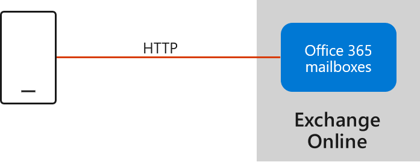

# Outlook for iOS and Android in Exchange Online

The Outlook app for iOS and Android is designed to bring together email, calendar, contacts, and other files, enabling users in your organization to do more from their mobile devices. This article provides an overview of the architecture, so that Office 365 administrators can deploy and maintain Outlook for iOS and Android in their organizations.

> [!NOTE]
> The [Outlook for iOS and Android Help Center](https://support.office.com/article/cd84214e-a5ac-4e95-9ea3-e07f78d0cde6) is available for users, including help for using the app on specific devices and troubleshooting information.

## Outlook for iOS and Android architecture

The Outlook for iOS and Android app is fully powered by the Microsoft Cloud. All Office 365 Enterprise, Government, Business, and Education accounts are supported natively, which means there is no mailbox data cached outside of Office 365. Data simply stays in its current Exchange Online mailbox, and it's secured with TLS version 1.2 over HTTPS connections end-to-end, between Office 365 and the app. Outlook for iOS and Android is fully delivered through Microsoft services that provide a strong commitment to security, privacy, and compliance.

The Office 365-based architecture provides the following benefits:
1. **Data locality**: User mailbox data stays in place, and therefore continues to respect the data locality and regionality promises of Office 365 for data at rest. In other words, the user's mailbox data is stored within the region in which the tenant (or mailbox in the case of a [Multi-Geo](https://docs.microsoft.com/office365/enterprise/multi-geo-capabilities-in-exchange-online) tenant) is located.

2. **Device ID**: Each Outlook for iOS and Android connection registers in the Office 365 Admin console and is able to be managed as a unique connection.

3. **Modern Authentication (OAuth)**: Outlook for iOS and Android leverages Modern Authentication (OAuth) to protect user's credentials. Modern authentication provides Outlook for iOS and Android with a secure mechanism to access Office 365 data without ever touching a user's credentials. At sign in, the user authenticates directly against an identity platform (either Azure AD or an on-premises identity provider like ADFS) and receives an access token in return, which grants Outlook for iOS and Android access to the user's mailbox or files. At no time does the service have access to the user's password in any form.

4. **Enterprise Mobility + Security support**: Customers can take advantage of Microsoft Enterprise Mobility + Security (EMS) including Microsoft Intune and Azure Active Directory Premium, to enable conditional access and Intune app protection policies, which control and secure corporate messaging data on the mobile device.

Within the Office 365-based architecture, Outlook for iOS and Android uses the native Microsoft sync technology as the protocol for data synchronization.

The native Microsoft sync technology offers several benefits:

1. **Eliminates middle tier services**: Data synchronization with the native Microsoft sync technology occurs between the app and Office 365, eliminating the need for any middle tier services.

2. **Latency reduction**: By replacing the proprietary Outlook device API and Stateless Protocol Translator, there is a reduction in end-to-end latency between the app and Office 365.

3. **Additional Office 365 instance support**: Removing the intermediary Stateless Protocol Translator for data connections enables Microsoft to support other unique Office 365 instances, like Office 365 Government Community Cloud High and Office 365 Department of Defense, that were previously blocked from using Outlook for iOS and Android.

4. **Protocol consolidation**: Today, each Outlook client platform utilizes a different data sync protocol, which hinders the ability to innovate and deploy new features quickly across all Outlook clients. The native Microsoft sync technology that Outlook for iOS and Android is adopting has been in use by the native Windows 10 mail client for a number of years, and in the future, will be used by Outlook for Mac.

5. **Unlocking new features**: The native Microsoft sync technology will enable Outlook for iOS and Android to take advantage of native Office 365 features it does not support today, such as S/MIME, Microsoft Information Protection labeling, and shared mailboxes. These and more Office 365 features will roll out soon after the architecture update.
