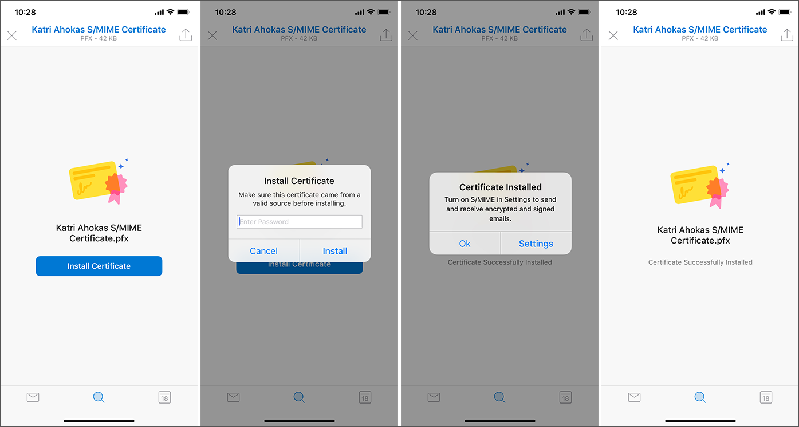
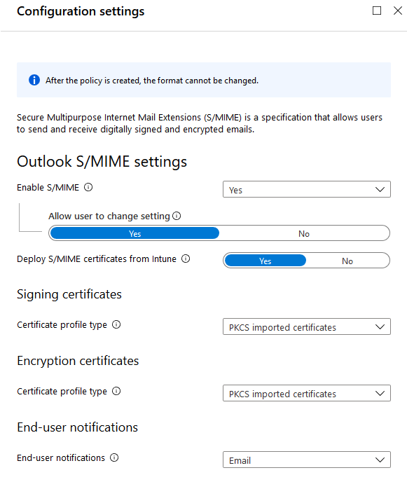
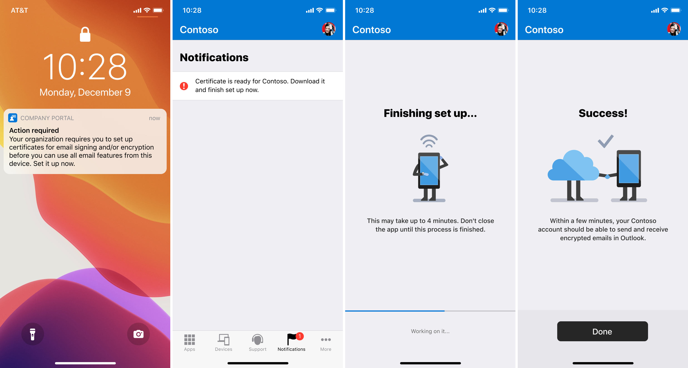
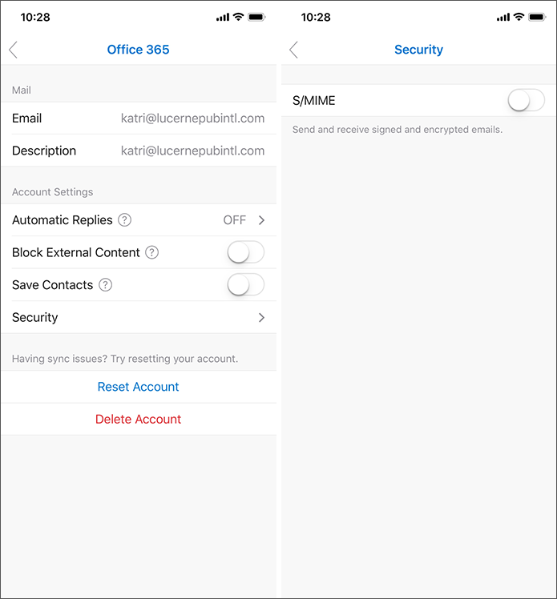
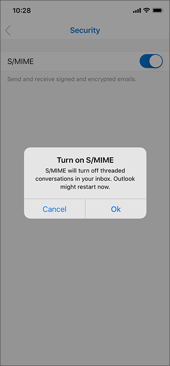
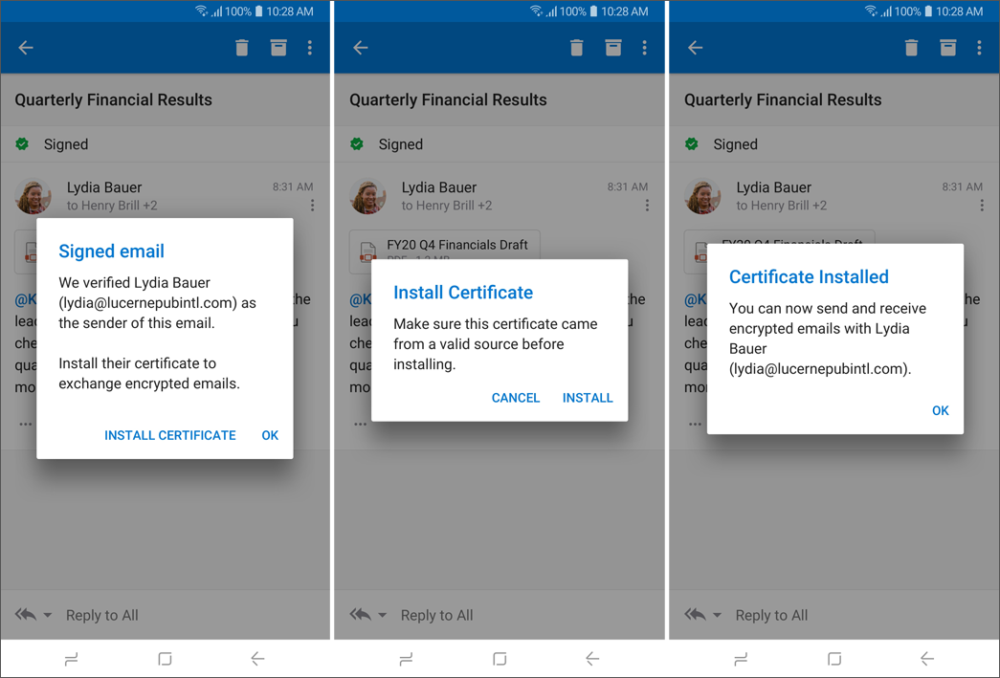
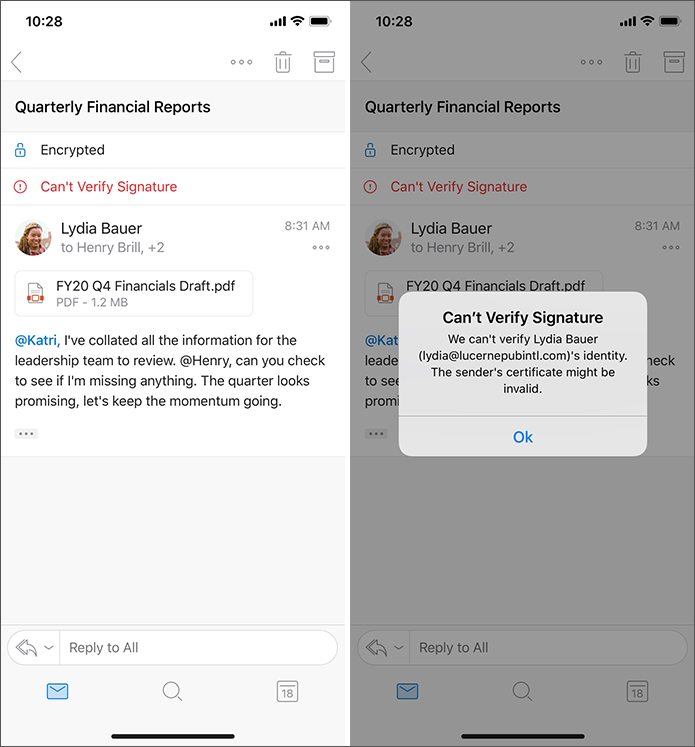
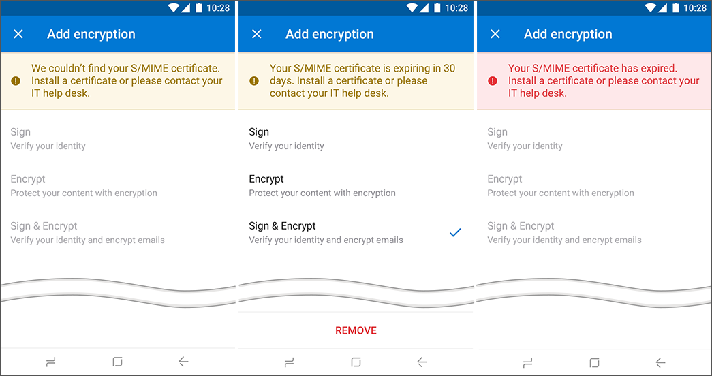
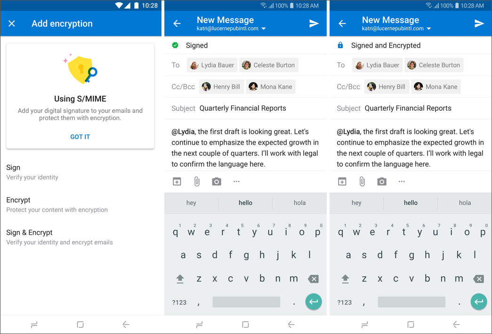
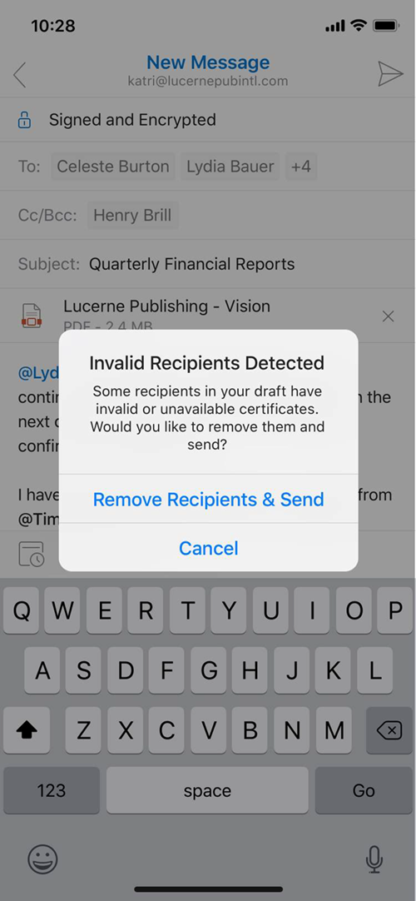

# Sensitivity labeling and protection in Outlook for iOS and Android

**Summary**: How to classify and/or protect messages when using Outlook for iOS and Android.

Protecting company or organizational data is extremely important. Outlook for iOS and Android supports two scenarios for classifying and/or protecting content:

1. Sensitivity labeling

2. Secure/Multipurpose Internet Mail Extension (S/MIME)

Sensitivity labeling and S/MIME in Outlook for iOS and Android are supported with Office 365 accounts using the native Microsoft sync technology.

> [!NOTE]
> Sensitvity labeling is not supported with Government Community Cloud accounts.

## Understanding Sensitivity Labeling
Sensitivity labeling enables organizations to classify and protect sensitive content. For more information, see [Overview of sensitivity labels](https://docs.microsoft.com/microsoft-365/compliance/sensitivity-labels). 

From a classification perspective, a sensitivity label is applied to a message and is retained throughout the message's lifecycle (assuming the label is not removed). In addition, sensitivity labels can be configured to mark content by adding a header or footer to the message body. 

Sensitivity labels can also be configured to protect messages with access restrictions or encryption. Access restrictions include ensuring only users within the organization can open the message, restricting editing rights, preventing forwarding, printing, or copying the contents of the message. Encryption provides at-rest encryption and ensures only authorized users can decrypt the message. 

When a sensitivity label is configured with encryption, the encryption process depends on the client platform. With Outlook for iOS and Android, encryption occurs within Exchange Online transport after the message is sent from the sender, prior to recipient delivery. Encryption does not occur within the app. For more information, see [How sensitivity labels work in Office apps](https://docs.microsoft.com/microsoft-365/compliance/sensitivity-labels-office-apps).

Likewise, Outlook for iOS and Android does not perform decryption of received messages, either. Exchange Online performs the decryption prior to delivering the message to Outlook for iOS and Android. For more information, see [Outlook for iOS and Android in Exchange Online: FAQ](https://docs.microsoft.com/exchange/clients-and-mobile-in-exchange-online/outlook-for-ios-and-android/outlook-for-ios-and-android-faq).

## Deploying Sensitivity Labeling with Outlook for iOS and Android

For information on how to create and define sensitivity labels, as well as, publishing a label policy, see [Overview of sensitivity labels](https://docs.microsoft.com/microsoft-365/compliance/sensitivity-labels).

> [!IMPORTANT]
> If your organization has previously deployed Azure Information Protection labels, you must migrate from Azure Information Protection to Microsoft Information Protection. To determine which platform is being used, see [Frequently asked questions for Azure Information Protection](https://docs.microsoft.com/azure/information-protection/faqs#how-can-i-determine-if-my-tenant-is-on-the-unified-labeling-platform). To complete the migration, see [How to migrate Azure Information Protection labels to unified sensitivity labels](https://docs.microsoft.com/azure/information-protection/configure-policy-migrate-labels).

## Using Sensitivity Labeling with Outlook for iOS and Android

For information on the end user experience, see [Apply sensitivity labels to your documents and email within Office](https://support.office.com/article/apply-sensitivity-labels-to-your-documents-and-email-within-office-2f96e7cd-d5a4-403b-8bd7-4cc636bae0f9). 

## Understanding S/MIME

S/MIME provides encryption, which protects the content of e-mail messages, and it provides digital signatures, which verify the identity of the sender of an e-mail message. S/MIME in Outlook for iOS and Android is supported with Office 365 accounts using the native Microsoft sync technology.

Digital signatures are the more commonly used service of S/MIME. As the name suggests, digital signatures are the digital counterpart to the traditional, legal signature on a paper document. As with a legal signature, digital signatures provide the following security capabilities:

  - **Authentication:** A signature serves to validate an identity. It verifies the answer to "who are you" by providing a means of differentiating that entity from all others and proving its uniqueness. Because there is no authentication in SMTP e-mail, there is no way to know who sent a message. Authentication in a digital signature solves this problem by allowing a recipient to know that a message was sent by the person or organization who claims to have sent the message.

  - **Nonrepudiation:** The uniqueness of a signature prevents the owner of the signature from disowning the signature. This capability is called nonrepudiation. Thus, the authentication that a signature provides gives the means to enforce nonrepudiation. The concept of nonrepudiation is most familiar in the context of paper contracts: a signed contract is a legally binding document, and it is impossible to disown an authenticated signature. Digital signatures provide the same function and, increasingly in some areas, are recognized as legally binding, similar to a signature on paper. Because SMTP e-mail does not provide a means of authentication, it cannot provide nonrepudiation. It is easy for a sender to disavow ownership of an SMTP e-mail message.

  - **Data integrity:** An additional security service that digital signatures provide is data integrity. Data integrity is a result of the specific operations that make digital signatures possible. With data integrity services, when the recipient of a digitally signed e-mail message validates the digital signature, the recipient is assured that the e-mail message that is received is, in fact, the same message that was signed and sent, and has not been altered while in transit. Any alteration of the message while in transit after it has been signed invalidates the signature. In this way, digital signatures provide an assurance that signatures on paper cannot, because it is possible for a paper document to be altered after it has been signed.

> [!IMPORTANT]
> Although digital signatures provide data integrity, they don't provide confidentiality. Messages with only a digital signature are sent in cleartext, like SMTP messages and can be read by others. In the case where the message is opaque-signed, a level of obfuscation is achieved because the message is base64-encoded, but it is still cleartext. To protect the contents of e-mail messages, encryption must be used.

Message encryption provides a solution to information disclosure. SMTP-based Internet e-mail does not secure messages. An SMTP Internet e-mail message can be read by anyone who sees it as it travels or views it where it is stored. These problems are addressed by S/MIME using encryption. Encryption is a way to change information so that it cannot be read or understood until it is changed back into a readable and understandable form. Message encryption provides two specific security services:

  - **Confidentiality**: Message encryption serves to protect the contents of an e-mail message. Only the intended recipient can view the contents, and the contents remain confidential and cannot be known by anyone else who might receive or view the message. Encryption provides confidentiality while the message is in transit and in storage.

  - **Data** **integrity:** As with digital signatures, message encryption provides data integrity services as a result of the specific operations that make encryption possible.

> [!IMPORTANT]
> Although message encryption provides confidentiality, it doesn't authenticate the message sender in any way. An unsigned, encrypted message is as susceptible to sender impersonation as a message that isn't encrypted. Because nonrepudiation is a direct result of authentication, message encryption also doesn't provide nonrepudiation. Although encryption does provide data integrity, an encrypted message can show only that the message hasn't been altered since it was sent. No information about who sent the message is provided. To prove the identity of the sender, the message must use a digital signature.

## Deploying S/MIME certificates with Outlook for iOS and Android
In order to leverage S/MIME in Outlook for iOS and Android, the Exchange Online tenant must be properly configured. Once those steps have been completed, S/MIME certificates can be deployed to Outlook for iOS and Android via the following ways:

1. Manual certificate delivery

2. Automated certificate delivery

> [!NOTE]
> Outlook for Android will support automated certificate delivery in a future release. For more information, see the [Microsoft 365 Roadmap](https://aka.ms/m365roadmap).

### S/MIME Prerequisites
Ensure S/MIME has been properly configured in Exchange Online by following the steps outlined in [S/MIME for message signing and encryption in Exchange Online](https://docs.microsoft.com/office365/SecurityCompliance/s-mime-for-message-signing-and-encryption). Specifically, this includes:

1. Setting up the [virtual certificate collection](https://docs.microsoft.com/microsoft-365/security/office-365-security/set-up-virtual-certificate-collection-to-validate-s-mime).

2. Publishing the certificate revocation list to the Internet.

In both certificate delivery solutions, it is expected that the certificate's trusted root chain is available and discoverable within Exchange Online. Trust verification is performed on all digital certificates. Exchange Online validates the certificate by validating each certificate in the certificate chain until it reaches a trusted root certificate. In most cases, this is done by obtaining the intermediate certificates through the authority information access path in the certificate until a trusted root certificate is located. Intermediate certificates can also be included with digitally signed e-mail messages. If Exchange Online locates a trusted root certificate and can query the certificate revocation list for the certificate authority, the digital certificate's chain for that digital certificate is considered valid and trusted and can be used. If Exchange Online fails to locate a trusted root certificate or fails to contact the certificate revocation list for the certificate authority, that certificate is considered invalid and not trusted.

Outlook for iOS and Android leverages the user's primary SMTP address for mail flow activities, which is configured during account profile setup. The S/MIME certificate used by Outlook for iOS and Android is calculated by comparing the user's primary SMTP address as defined in the account profile with the certificate's subject value or the subject alternative name value; if these do not match, then Outlook for iOS and Android will report that a certificate is not available (see Figure 7) and will not allow the user to sign and/or encrypt messages.

> [!IMPORTANT]
> Outlook for iOS and Android S/MIME functionality requires that a user have both signing and encrypting capabilities, which can be delivered with a single certificate or with separate signing and encryption certificates.

### Manual Certificate Delivery

Outlook for iOS and Outlook for Android both support manual certificate delivery, which is when the certificate is emailed to the user and the user taps on the certificate attachment within the app to initiate the certificate's installation. The following image shows how manual certificate delivery works in iOS.

A user can export their own certificate and mail it to themselves using Outlook. For more information, see [Exporting a digital certificate](https://support.office.com/article/f3574266-2f9e-4f15-ab21-5989f4cf0c9b).

> [!IMPORTANT]
> When exporting the certificate, ensure that the exported certificate is password-protected with a strong password.

### Automated Certificate Delivery
> [!IMPORTANT]
> Outlook for iOS only supports automated certificate delivery when Microsoft Endpoint Manager is the enrollment provider. This is due to the iOS keychain architecture. iOS offers a system keychain and publisher keychains. iOS prevents third-party apps from accessing the system keychain (only first-party apps and the Safari webview controller can access the system keychain). In order to deliver  certificates that can be accessed by Outlook for iOS, the certificates must reside in the Microsoft publisher keychain to which Outlook for iOS has access. Only Microsoft published apps, like the Company Portal, can place certificates into the Microsoft publisher keychain.

With Endpoint Manager, organizations can import encryption certificate histories from any Certification Authority. Endpoint Manager will then automatically deliver those certificates to any device that the user enrolls. Generally, Simple Certificate Enrollment Protocol (SCEP) is used for signing certificates. With SCEP, the private key is generated and stored on the enrolled device and a unique certificate is delivered to each device that a user enrolls, which can be used for non-repudiation. Lastly, Endpoint Manager supports derived credentials for customers who need support for the NIST 800-157 standard. On iOS, the Company Portal is used to retrieve signing and encryption certificates from Intune.

In order to deliver certificates to Outlook for iOS, the following prerequisites must be completed:

- Deploy trusted root certificates via Endpoint Manager. For more information, see [Create trusted certificate profiles](https://docs.microsoft.com/intune/protect/certificates-configure#create-trusted-certificate-profiles).
- Encryption certificates must be imported into Endpoint Manager. For more information, see [Configure and use imported PKCS certificates with Intune](https://docs.microsoft.com/intune/protect/certificates-imported-pfx-configure).
- Install and Configure the PFX Connector for Microsoft Intune. For more information, see [Download, install, and configure the PFX Certificate Connector for Microsoft Intune](https://docs.microsoft.com/intune/protect/certificates-imported-pfx-configure#download-install-and-configure-the-pfx-certificate-connector-for-microsoft-intune).
- Devices must be MDM enrolled to receive trusted root and S/MIME certificates automatically from Endpoint Manager.

Use the following steps to create and configure the Outlook for iOS S/MIME policy in Endpoint Manager. These settings provide automated delivery of the signing and encryption certificates.

1. Sign in to [Intune](https://go.microsoft.com/fwlink/?linkid=2090973) and select **Apps** > **Apps configuration policies** > **Add**.
2. Enter the **Name** and **Description** of the configuration policy.
3. Select **Managed devices** as the **Device enrollment type**.
4. Select **iOS/iPadOS** as the **Platform**.
5. For **Associated app**, choose **Select the required app**, and then, on the **Targeted apps** blade, choose **Outlook**.

   > [!NOTE]
   > If Outlook is not listed as an available app, then you must add it by following the instructions in [Assign apps to Android work profile devices with Intune](https://docs.microsoft.com/intune/apps-add-android-for-work) and [Add iOS store apps to Microsoft Intune](https://docs.microsoft.com/intune/store-apps-ios).

6. Click **Configuration settings** to add configuration settings. 
    - Select **Use configuration designer** next to **Configuration settings format** and accept or modify the default settings. For more information, see [Deploying Outlook for iOS and Android app configuration settings](https://docs.microsoft.com/exchange/clients-and-mobile-in-exchange-online/outlook-for-ios-and-android/outlook-for-ios-and-android-configuration-with-microsoft-intune).
7. Click **S/MIME** to display the **Outlook S/MIME settings**.
    
8. Set **Enable S/MIME** to **Yes**.
9. Set **Deploy S/MIME certificates from Intune** to **Yes**.
10. Under **Signing certificates** next to **Certificate profile type**, choose one of the following options:
    - **SCEP** – Creates a certificate that is unique for the device and user that can be used by Microsoft Outlook for signing. For related information, see [Configure infrastructure to support SCEP with Intune](https://docs.microsoft.com/intune/protect/certificates-scep-configure) and [Create a SCEP certificate profile](https://docs.microsoft.com/intune/protect/certificates-profile-scep#create-a-scep-certificate-profile). 
    - **PKCS imported certificates** – Uses a certificate that is unique to the user, but may be shared across devices and has been imported to Endpoint Manager by the administrator on behalf of the user. The certificate is delivered to any device that a user enrolls. Endpoint Manager will automatically pick the imported certificate that supports signing to deliver to the device the corresponds to the enrolled user.
    - **Derived credentials** – Uses a certificate that is already on the device that can be used for signing. The certificate must be retrieved on the device using the derived credentials flows in Intune.
11. Under **Encryption certificates** next to **Certificate profile type**, choose one of the following options:
    - **PKCS imported certificates** – Delivers any encryption certificates that have been imported to Endpoint Manager by the administrator across any device a user enrolls Endpoint Manager will automatically pick the imported certificate or certificates that support encryption to deliver to the device that corresponds to the enrolled user.
    - **Derived credentials** – Uses a certificate that is already on the device that can be used for signing. The certificate must be retrieved on the device using the derived credentials flows in Intune.
12. Next to **End-user notifications**, choose how to notify end users to retrieve the certificates by selecting **Company Portal** or **Email**.

    On iOS, users must use the Company Portal app to retrieve their S/MIME certificates. Endpoint Manager will inform the user that they need to launch the Company Portal to retrieve their S/MIME certificates via the Notifications section of Company Portal, a push notification, and/or an email. Clicking one of the notifications will take the user to a landing page that informs them of progress retrieving the certificates. Once the certificates are retrieved, the user can use S/MIME from within Microsoft Outlook for iOS to sign and encrypt email.
    
    The end-user notifications include the following options:
       - **Company Portal** – If selected, users will receive a push notification on their device, which will take them to the landing page in Company Portal where S/MIME certificates will be retrieved.
       - **Email** – Sends an email to the end user informing them that they need to launch Company Portal to retrieve their S/MIME certificates. If the user is on their enrolled iOS device when they click the link in the email, they will be redirected to the Company Portal to retrieve their certificates.
    
    End-users will see an experience similar to the following for automated certificate delivery:
    
13. Select **Assignments** to assign the app configuration policy to the Azure AD groups. For more information, see [Assign apps to groups with Microsoft Intune](https://docs.microsoft.com/intune/apps/apps-deploy).

### Enabling S/MIME in the client

S/MIME must be enabled for Outlook for iOS and Android to view or create S/MIME-related content.

End users will need to enable S/MIME functionality manually by accessing their account settings, tapping Security, and tapping the S/MIME control, which is off by default. The Outlook for iOS S/MIME security setting looks like the following:

When the S/MIME setting is enabled, Outlook for iOS and Android will automatically disable the **Organize By Thread** setting. This is because S/MIME encryption becomes more complex as a conversation thread grows. By removing the threaded conversation view, Outlook for iOS and Android reduces the opportunity for issues with certificates across recipients during signing and encryption. As this is an app-level setting, this change affects all accounts added to the app. This threaded conversation dialog is rendered in iOS as follows:

## Using S/MIME in Outlook for iOS and Android

After the certificates have been deployed and S/MIME has been enabled in the app, users can consume S/MIME related content and compose content using S/MIME certificates. If the S/MIME setting is not enabled, then users will not be able to consume S/MIME content.

### Consumption

In the message view, users can view messages that are S/MIME signed or encrypted. In addition, users can tap the S/MIME status bar to view more information about the message's S/MIME status. The following screenshots show examples of how S/MIME messages are consumed in Android.

> [!IMPORTANT]
> In order to read an encrypted message, the recipient's private certificate key must be available on the device.

Users can install a sender's public certificate key by tapping the S/MIME status bar. The certificate will be installed on the user's device, specifically in the Microsoft publisher [keychain in iOS](https://www.apple.com/business/site/docs/iOS_Security_Guide.pdf) or the system [KeyStore in Android](https://source.android.com/security/reports/Google_Android_Enterprise_Security_Whitepaper_2018.pdf). The Android version appears similar to the following:

If there are certificate errors, Outlook for iOS and Android will warn the user. The user can tap the S/MIME status bar notification to view more information about the certificate error, such as in the following example.

### Composition

Before a user can send a signed and/or encrypted message, Outlook for iOS and Android performs a validity check on the certificate to ensure it's valid for signing or encryption operations. If the certificate is near expiration, Outlook for iOS and Android will alert the user to obtain a new certificate when the user attempts to sign or encrypt a message, beginning 30 days before expiration.

When composing an email in Outlook for iOS and Android, the sender can choose to encrypt and/or sign the message. By tapping on the **ellipses** and then **Sign and Encrypt**, the various S/MIME options are presented. Selecting an S/MIME option enables the respective encoding on the email as soon as the message is saved or sent, assuming the sender has a valid certificate.

> [!NOTE]
> Outlook for iOS and Android only supports sending clear-signed messages.

> [!IMPORTANT]
> In order to compose an encrypted message, the target recipient's public certificate key must be available either in the Global Address List or stored on the local device. In order to compose a signed message, the sender's private certificate key must be available on the device.

Here is how S/MIME options appear in Outlook for Android:

Outlook for iOS and Android will evaluate all recipients prior to sending an encrypted message and confirm that a valid public certificate key exists for each recipient. The Global Address List (GAL) is checked first; if a certificate for the recipient does not exist in the GAL, Outlook queries the Microsoft publisher keychain in iOS or the system KeyStore in Android to locate the recipient's public certificate key. For recipients without a public certificate key (or an invalid key), Outlook will prompt for their removal. The message will not be sent without encryption to any recipient unless the encryption option is disabled by the sender during composition.

