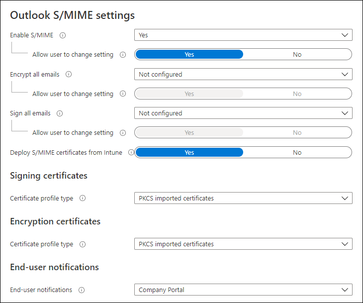
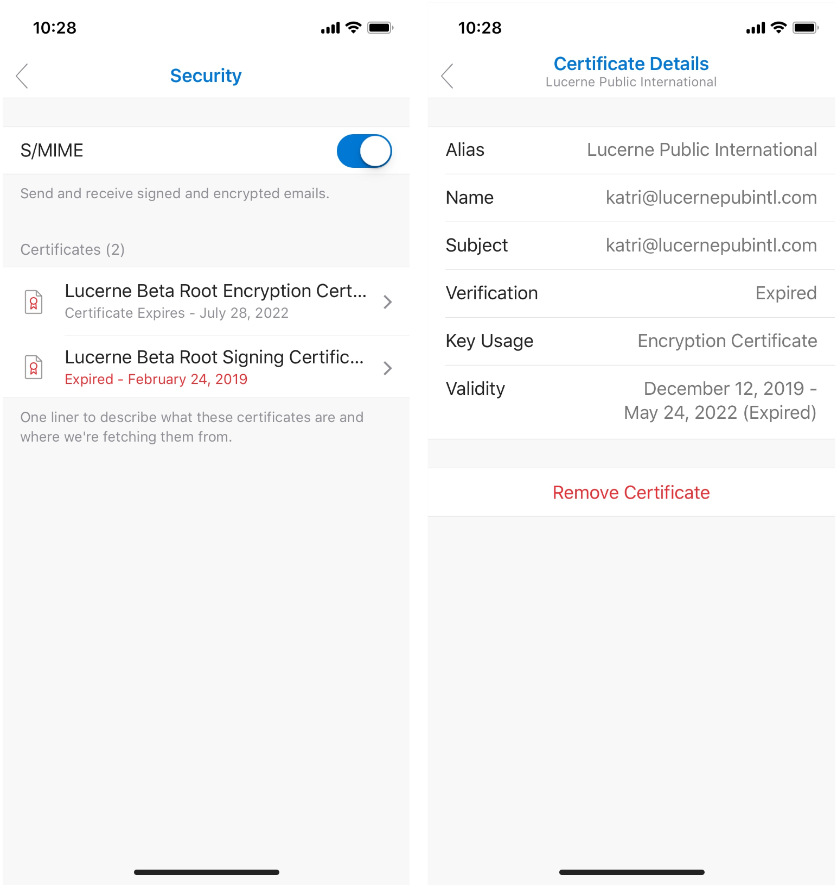

# S/MIME for Outlook for iOS and Android

S/MIME (Secure/Multipurpose Internet Mail Extensions) is a widely accepted protocol for sending digitally signed and encrypted messages. For more information, see [S/MIME for message signing and encryption in Exchange Online](../../security-and-compliance/smime-exo/smime-exo.md).

To leverage S/MIME in Outlook for iOS and Android, you need to configure specific S/MIME prerequisite in Exchange Online. After you have completed those steps, you can deploy S/MIME certificates to Outlook for iOS and Android using the following methods:

- Manual certificate delivery
- Automated certificate delivery

This article describes how to configure Exchange Online for S/MIME using Outlook for iOS and Android, and how to use S/MIME in Outlook for iOS and Android.

## S/MIME prerequisites

Ensure S/MIME has been properly configured in Exchange Online by following the steps outlined in [Configure S/MIME in Exchange Online](../../security-and-compliance/smime-exo/configure-smime-exo.md). Specifically, this includes:

1. Setting up the [virtual certificate collection](../../security-and-compliance/smime-exo/configure-smime-exo.md#step-2-set-up-a-virtual-certificate-collection-in-exchange-online).

2. Publishing the certificate revocation list to the internet.

In manual and automated certificate delivery solutions, it is expected that the certificate's trusted root chain is available and discoverable within Exchange Online. Trust verification is performed on all digital certificates. Exchange Online validates the certificate by validating each certificate in the certificate chain until it reaches a trusted root certificate. In most cases, this is done by obtaining the intermediate certificates through the authority information access path in the certificate until a trusted root certificate is located. Intermediate certificates can also be included with digitally signed email messages. If Exchange Online locates a trusted root certificate and can query the certificate revocation list for the certificate authority, the digital certificate's chain for that digital certificate is considered valid and trusted and can be used. If Exchange Online fails to locate a trusted root certificate or fails to contact the certificate revocation list for the certificate authority, that certificate is considered invalid and not trusted.

Outlook for iOS and Android leverages the user's primary SMTP address for mail flow activities, which is configured during account profile setup. The S/MIME certificate used by Outlook for iOS and Android is calculated by comparing the user's primary SMTP address as defined in the account profile with the certificate's subject value or the subject alternative name value; if these do not match, then Outlook for iOS and Android will report that a certificate is not available (see Figure 7) and will not allow the user to sign and/or encrypt messages.

## Manual certificate delivery

Outlook for iOS and Outlook for Android both support manual certificate delivery, which is when the certificate is emailed to the user and the user taps on the certificate attachment within the app to initiate the certificate's installation. The following image shows how manual certificate delivery works in iOS.

A user can export their own certificate and mail it to themselves using Outlook. For more information, see [Exporting a digital certificate](https://support.microsoft.com/office/f3574266-2f9e-4f15-ab21-5989f4cf0c9b).

> [!IMPORTANT]
> When exporting the certificate, ensure that the exported certificate is password-protected with a strong password.

## Automated certificate delivery

> [!IMPORTANT]
>
> - Outlook for iOS and Android only supports automated certificate delivery when Microsoft Endpoint Manager is the enrollment provider.
>
> - For Outlook for iOS, this is due to the iOS keychain architecture. iOS offers a system keychain and publisher keychains. iOS prevents third-party apps from accessing the system keychain (only first-party apps and the Safari webview controller can access the system keychain). In order to deliver certificates that can be accessed by Outlook for iOS, the certificates must reside in the Microsoft publisher keychain to which Outlook for iOS has access. Only Microsoft published apps, like the Company Portal, can place certificates into the Microsoft publisher keychain.
>
> - Outlook for Android relies on Endpoint Manager to deliver and approve the S/MIME certificates. Automatic certificate delivery is supported with Android enrollment scenarios: device administrator, Android Enterprise work profile, and Android Enterprise fully managed.

With Endpoint Manager, organizations can import encryption certificate histories from any Certification Authority. Endpoint Manager will then automatically deliver those certificates to any device that the user enrolls. Generally, Simple Certificate Enrollment Protocol (SCEP) is used for signing certificates. With SCEP, the private key is generated and stored on the enrolled device and a unique certificate is delivered to each device that a user enrolls, which can be used for non-repudiation. Lastly, Endpoint Manager supports derived credentials for customers who need support for the NIST 800-157 standard. The Company Portal is used to retrieve signing and encryption certificates from Intune.

In order to deliver certificates to Outlook for iOS and Android, you must complete the following prerequisites:

- Deploy trusted root certificates via Endpoint Manager. For more information, see [Create trusted certificate profiles](/intune/protect/certificates-configure#create-trusted-certificate-profiles).
- Encryption certificates must be imported into Endpoint Manager. For more information, see [Configure and use imported PKCS certificates with Intune](/intune/protect/certificates-imported-pfx-configure).
- Install and Configure the PFX Connector for Microsoft Intune. For more information, see [Download, install, and configure the PFX Certificate Connector for Microsoft Intune](/intune/protect/certificates-imported-pfx-configure#download-install-and-configure-the-pfx-certificate-connector-for-microsoft-intune).
- Devices must be enrolled to receive trusted root and S/MIME certificates automatically from Endpoint Manager.

### Outlook for iOS automated certificate delivery

Use the following steps to create and configure the Outlook for iOS S/MIME policy in Endpoint Manager. These settings provide automated delivery of the signing and encryption certificates.

1. Sign into [Microsoft Endpoint Manager](https://endpoint.microsoft.com).
2. Select **Apps** and then select **App configuration policies**.
3. On the **App Configuration policies** blade, choose **Add** and select **Managed devices** to start the app configuration policy creation flow.
4. On the **Basics** section, enter a **Name**, and optional **Description** for the app configuration settings.
5. For **Platform**, choose **iOS/iPadOS**.
6. For **Targeted app**, choose **Select app**, and then, on the **Associated app** blade, choose **Microsoft Outlook**. Click **OK**.

   > [!NOTE]
   > If Outlook is not listed as an available app, then you must add it by following the instructions in [Assign apps to Android work profile devices with Intune](/intune/apps-add-android-for-work) and [Add iOS store apps to Microsoft Intune](/intune/store-apps-ios).

7. Click **Configuration settings** to add configuration settings.

    Select **Use configuration designer** next to **Configuration settings format** and accept or modify the default settings. For more information, see [Deploying Outlook for iOS and Android app configuration settings](outlook-for-ios-and-android-configuration-with-microsoft-intune.md).

8. Click **S/MIME** to display the **Outlook S/MIME settings**.
    

9. Set **Enable S/MIME** to **Yes**. When selecting **Yes** or **No**, administrators can choose to allow the user to change the app setting's value. Select **Yes** (app default) to allow the user to change the setting or choose **No** if you want to prevent the user from changing the setting's value.

10. Choose whether to **Encrypt all emails** by selecting **Yes** or **No**. When selecting **Yes** or **No**, administrators can choose to allow the user to change the app setting's value. Select **Yes** (app default) to allow the user to change the setting or choose **No** if you want to prevent the user from changing the setting's value.

11. Choose whether to **Sign all emails** by selecting **Yes** or **No**. When selecting **Yes** or **No**, administrators can choose to allow the user to change the app setting's value. Select **Yes** (app default) to allow the user to change the setting or choose **No** if you want to prevent the user from changing the setting's value.

12. Set **Deploy S/MIME certificates from Intune** to **Yes**.

13. Under **Signing certificates** next to **Certificate profile type**, choose one of the following options:
    - **SCEP**: Creates a certificate that is unique for the device and user that can be used by Microsoft Outlook for signing. For information on what is required to use SCEP certificate profiles, see [Configure infrastructure to support SCEP with Intune](/intune/protect/certificates-scep-configure).
    - **PKCS imported certificates**: Uses a certificate that is unique to the user, but may be shared across devices and has been imported to Endpoint Manager by the administrator on behalf of the user. The certificate is delivered to any device that a user enrolls. Endpoint Manager will automatically pick the imported certificate that supports signing to deliver to the device the corresponds to the enrolled user. For information on what is required to use PKCS imported certificates, see [Configure and use PKCS certificates with Intune](/mem/intune/protect/certficates-pfx-configure).
    - **Derived credentials**: Uses a certificate that is already on the device that can be used for signing. The certificate must be retrieved on the device using the derived credentials flows in Intune.

14. Under **Encryption certificates** next to **Certificate profile type**, choose one of the following options:
    - **PKCS imported certificates**: Delivers any encryption certificates that have been imported to Endpoint Manager by the administrator across any device a user enrolls. Endpoint Manager will automatically pick the imported certificate or certificates that support encryption and deliver to the enrolled user's devices.
    - **Derived credentials**: Uses a certificate that is already on the device that can be used for signing. The certificate must be retrieved on the device using the derived credentials flows in Intune.

15. Next to **End-user notifications**, choose how to notify end users to retrieve the certificates by selecting **Company Portal** or **Email**.

    On iOS, users must use the Company Portal app to retrieve their S/MIME certificates. Endpoint Manager will inform the user that they need to launch the Company Portal to retrieve their S/MIME certificates via the Notifications section of Company Portal, a push notification, and/or an email. Clicking one of the notifications will take the user to a landing page that informs them of progress retrieving the certificates. Once the certificates are retrieved, the user can use S/MIME from within Microsoft Outlook for iOS to sign and encrypt email.

    The end-user notifications include the following options:
       - **Company Portal**: If selected, users will receive a push notification on their device, which will take them to the landing page in Company Portal where S/MIME certificates will be retrieved.
       - **Email**: Sends an email to the end user informing them that they need to launch Company Portal to retrieve their S/MIME certificates. If the user is on their enrolled iOS device when they click the link in the email, they will be redirected to the Company Portal to retrieve their certificates.

    End-users will see an experience similar to the following for automated certificate delivery:
    

16. Select **Assignments** to assign the app configuration policy to the Azure AD groups. For more information, see [Assign apps to groups with Microsoft Intune](/intune/apps/apps-deploy).

### Outlook for Android automated certificate delivery

Use the following steps to create and configure the Outlook for iOS and Android S/MIME policy in Endpoint Manager. These settings provide automated delivery of the signing and encryption certificates.

1. Sign into [Microsoft Endpoint Manager](https://endpoint.microsoft.com).
2. Create a [SCEP certificate profile](/mem/intune/protect/certificates-profile-scep) or [PKCS certificate profile](/mem/intune/protect/certificates-imported-pfx-configure#create-a-pkcs-imported-certificate-profile) and assign it to your mobile users.
3. Select **Apps** and then select **App configuration policies**.
4. On the **App Configuration policies** blade, choose **Add** and select **Managed devices** to start the app configuration policy creation flow.
5. On the **Basics** section, enter a **Name**, and optional **Description** for the app configuration settings.
6. For **Platform**, choose **Android Enterprise** and for **Profile Type**, choose **All Profile Types**.
7. For **Targeted app**, choose **Select app**, and then, on the **Associated app** blade, choose **Microsoft Outlook**. Click **OK**.

   > [!NOTE]
   > If Outlook is not listed as an available app, then you must add it by following the instructions in [Assign apps to Android work profile devices with Intune](/intune/apps-add-android-for-work) and [Add iOS store apps to Microsoft Intune](/intune/store-apps-ios).

8. Click **Configuration settings** to add configuration settings.

    Select **Use configuration designer** next to **Configuration settings format** and accept or modify the default settings. For more information, see [Deploying Outlook for iOS and Android app configuration settings](outlook-for-ios-and-android-configuration-with-microsoft-intune.md).

9. Click **S/MIME** to display the **Outlook S/MIME settings**.
10. Set **Enable S/MIME** to **Yes**. When selecting **Yes** or **No**, administrators can choose to allow the user to change the app setting's value. Select **Yes** (app default) to allow the user to change the setting or choose **No** if you want to prevent the user from changing the setting's value.
11. Choose whether to **Encrypt all emails** by selecting **Yes** or **No**. When selecting **Yes** or **No**, administrators can choose to allow the user to change the app setting's value. Select **Yes** (app default) to allow the user to change the setting or choose **No** if you want to prevent the user from changing the setting's value.
12. Choose whether to **Sign all emails** by selecting **Yes** or **No**. When selecting **Yes** or **No**, administrators can choose to allow the user to change the app setting's value. Select **Yes** (app default) to allow the user to change the setting or choose **No** if you want to prevent the user from changing the setting's value.
13. Select **Assignments** to assign the app configuration policy to the Azure AD groups. For more information, see [Assign apps to groups with Microsoft Intune](/intune/apps/apps-deploy).

## Enabling S/MIME in the client

S/MIME must be enabled for Outlook for iOS and Android to view or create S/MIME-related content.

End users will need to enable S/MIME functionality manually by accessing their account settings, tapping Security, and tapping the S/MIME control, which is off by default. The Outlook for iOS S/MIME security setting looks like the following:

When the S/MIME setting is enabled, Outlook for iOS and Android will automatically disable the **Organize By Thread** setting. This is because S/MIME encryption becomes more complex as a conversation thread grows. By removing the threaded conversation view, Outlook for iOS and Android reduces the opportunity for issues with certificates across recipients during signing and encryption. As this is an app-level setting, this change affects all accounts added to the app. This threaded conversation dialog is rendered in iOS as follows:

Once S/MIME is enabled and the S/MIME certificates are installed, users can view the installed certificates by accessing their account settings and tapping Security. Furthermore, users can tap on each individual S/MIME certificate and view the certificate's details, including information like key usage and the validity period.

Users can configure Outlook to automatically sign or encrypt messages. This allows users to save time sending email while being confident that their emails are being signed/encrypted.

### LDAP support for certificate delivery

Outlook for iOS and Android supports accessing public user certificate keys from secure LDAP directory endpoints. In order to utilize an LDAP endpoint, the following requirements must be met:

- The LDAP endpoint does not require authentication.
- The LDAP endpoint configuration is delivered to Outlook for iOS and ANdroid through an app configuration policy. For more information, see [S/MIME settings](outlook-for-ios-and-android-configuration-with-microsoft-intune.md#smime-settings).
- The LDAP endpoint configuration is supported using the following formats:
  - `<ldaps://contoso.com>`
  - `<ldap://contoso.com>`
  - `<ldap://contoso.com:389>`
  - `<ldaps://contoso.com:636>`
  - `contoso.com`
  - `contoso.com:389`
  - `contoso.com:636`

When Outlook for iOS and Android performs a certificate lookup, the app will search the local device first, then query Azure Active Directory, and then evaluate any LDAP directory endpoint. When Outlook for iOS and Android connects to the LDAP directory endpoint to search for a user public certificate, certificate validation is performed to ensure that the certificate is not revoked. The certificate is only returned to the app if certificate validation completes successfully.

## Using S/MIME in Outlook for iOS and Android

After the certificates have been deployed and S/MIME has been enabled in the app, users can consume S/MIME related content and compose content using S/MIME certificates. If the S/MIME setting is not enabled, then users will not be able to consume S/MIME content.

### View S/MIME messages

In the message view, users can view messages that are S/MIME signed or encrypted. In addition, users can tap the S/MIME status bar to view more information about the message's S/MIME status. The following screenshots show examples of how S/MIME messages are consumed in Android.

> [!IMPORTANT]
> In order to read an encrypted message, the recipient's private certificate key must be available on the device.

Users can install a sender's public certificate key by tapping the S/MIME status bar. The certificate will be installed on the user's device, specifically in the Microsoft publisher [keychain in iOS](https://support.apple.com/guide/security/welcome/web) or the system [KeyStore in Android](https://source.android.com/security/reports/Google_Android_Enterprise_Security_Whitepaper_2018.pdf). The Android version appears similar to the following:

If there are certificate errors, Outlook for iOS and Android will warn the user. The user can tap the S/MIME status bar notification to view more information about the certificate error, such as in the following example.

### Create S/MIME messages

Before a user can send a signed and/or encrypted message, Outlook for iOS and Android performs a validity check on the certificate to ensure it's valid for signing or encryption operations. If the certificate is near expiration, Outlook for iOS and Android will alert the user to obtain a new certificate when the user attempts to sign or encrypt a message, beginning 30 days before expiration.

When composing an email in Outlook for iOS and Android, the sender can choose to encrypt and/or sign the message. By tapping on the **ellipses** and then **Sign and Encrypt**, the various S/MIME options are presented. Selecting an S/MIME option enables the respective encoding on the email as soon as the message is saved or sent, assuming the sender has a valid certificate.

Outlook for iOS and Android can send S/MIME signed and encrypted messages to distribution groups. Outlook for iOS and Android enumerates the certificates for the users defined in the distribution group, including those in nested distribution groups, though care should be taken on limiting the number of nested distribution groups to minimize the processing impact.

> [!IMPORTANT]
>
> - Outlook for iOS and Android only supports sending clear-signed messages.
> - In order to compose an encrypted message, the target recipient's public certificate key must be available either in the Global Address List or stored on the local device. In order to compose a signed message, the sender's private certificate key must be available on the device.

Here is how S/MIME options appear in Outlook for Android:

Outlook for iOS and Android will evaluate all recipients prior to sending an encrypted message and confirm that a valid public certificate key exists for each recipient. The Global Address List (GAL) is checked first; if a certificate for the recipient does not exist in the GAL, Outlook queries the Microsoft publisher keychain in iOS or the system KeyStore in Android to locate the recipient's public certificate key. For recipients without a public certificate key (or an invalid key), Outlook will prompt for their removal. The message will not be sent without encryption to any recipient unless the encryption option is disabled by the sender during composition.

