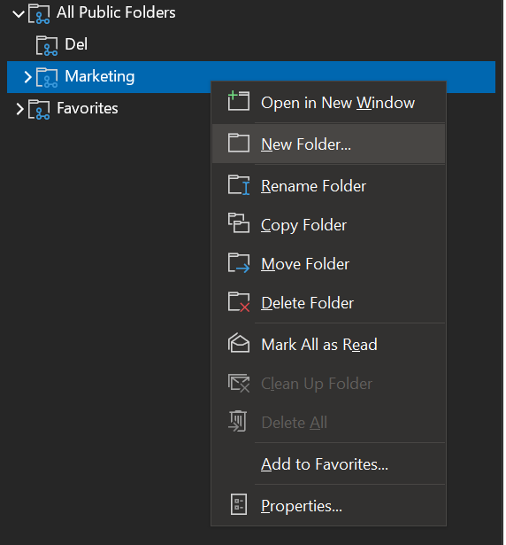
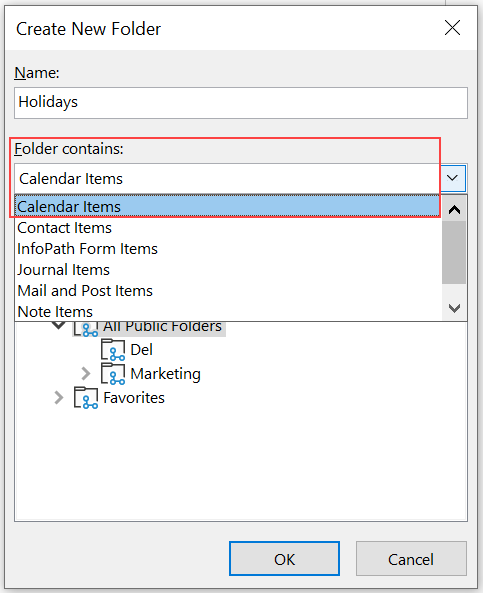
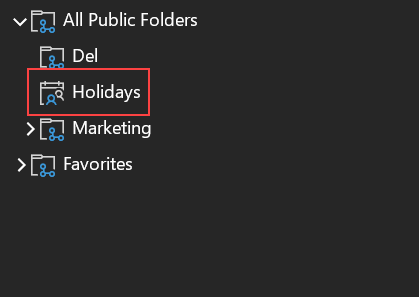
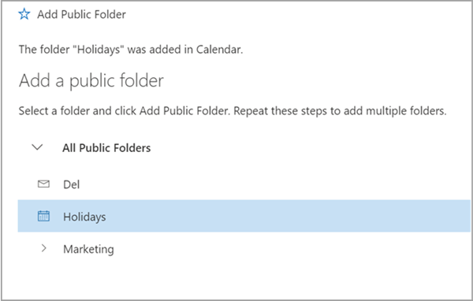
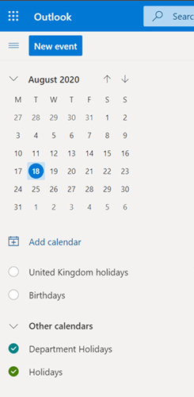

# Create a Public Folder calendar in Exchange Online

A public folder calendar is a good solution for people looking for only a shared calendar without having to maintain an additional mailbox along with it. This article explains how to set up and access public folder calendars in Microsoft Exchange Online.

> [!Important]
> You must use the Microsoft Outlook desktop client to create the public folder calendar.

> [!Note]
> The Calendar type of public folder can be accessed from Outlook Web App and the Outlook desktop client. Public folders, including calendar, cannot be accessed from mobile devices.

## Prerequisites

Before you create your public folder calendar, follow the prerequisites.

1. Ensure public folders are [deployed](./create-public-folder-mailbox.md) in Exchange Online.

2. Use the following command to see a list of any public folder mailboxes present in the organization:

   ```PowerShell
   Get-Mailbox -PublicFolder
   Get-PublicFolder \
   ```

3. If you don't see a list of the public folder mailboxes, then follow the steps to [create a public folder mailbox](./create-public-folder-mailbox.md).

4. Verify that you have the necessary [access rights](https://support.microsoft.com/help/2573274/public-folder-permissions-for-exchange-server) to create the public folder.

   - If you want the user to be able to create a public folder on the root of the public folder hierarchy, along with all other access rights, run the following command:

     ```PowerShell
     Add-PublicFolderClientPermission -Identity "\" -AccessRights Owner -User User1
     ```

   - If you want the user to be able to create a public folder under the existing public folder, such as a folder named Marketing, then run the following command:

     ```PowerShell
      Add-PublicFolderClientPermission -Identity "\Marketing" -AccessRights Editor -User User1
     ```

5. Login to the Outlook desktop client and ensure you're able to access the public folder deployment.

## Create a public folder calendar

Once you have ensured the prerequisites are met, then you're ready to get started creating a public folder calendar.

1. Login to the Outlook desktop client with a user account that has the necessary [access rights](https://support.microsoft.com/help/2573274/public-folder-permissions-for-exchange-server) to create a public folder.

2. Expand the folders.

3. Create a new public folder.

  - To create a public folder calendar at the top level of the directories, right-click  **All Public Folders** and select **New Folder**.

    

  - To create a public folder calendar under an existing public folder, right-click the folder, and select **New Folder**.

4. Name the new public folder and select **Calendar Items** from the **Folder contains** drop-down list.

    

5. Click **OK**.

   The calendar type folder shows up with a different icon.

   

6. For faster access to the new public folder calendar, right-click the folder and select **Add to Favorites...**.

## Share a public folder calendar

By default, everyone in the organization can access the public folder and create items in it. If you want to delegate additional access rights, add other users, and provide a required set of permissions, then follow the instructions in [public folder permissions](https://support.microsoft.com/help/2573274/public-folder-permissions-for-exchange-server).

## Access a public folder calendar in the Outlook Web App

1. Login to the Outlook Web App.

2. Right-click **Folders** and select **Add public folder to Favorites**.

3. Browse the directory and select the desired public folder.

4. Click **Add Public Folders**.



5. Close the **Add Public Folder** menu.

   The calendar public folder shows in Calendar area of the Outlook Web App.

6. Click the Calendar icon.

   You'll see the public folder calendar under **Other Calendars**.



## Receive emails to a public folder calendar

Follow the steps in [mail enable public folder calendar](enable-or-disable-mail-for-public-folder.md) to allow users to email calendar invites and appointments to the calendar.
