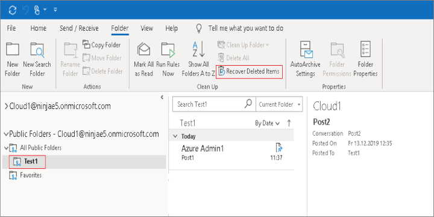
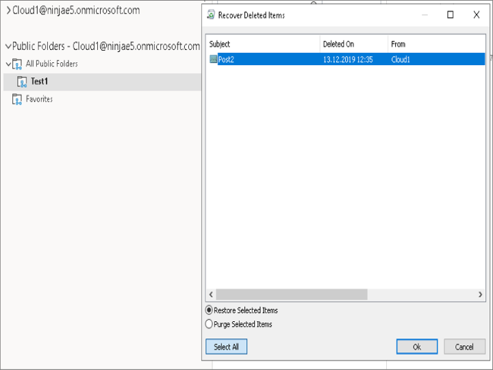
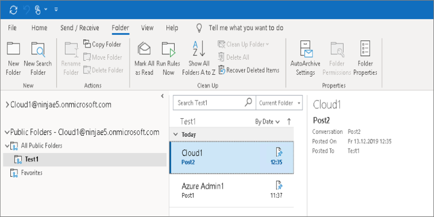

# Restore deleted items from public folder 

The items deleted from public folders are stored in the recoverable items (dumpster) of public folder until the retention period is over.

## Permissions required

The user restoring items from the public folder must have atleast the `Author` public folder client permission assigned. For more information on public folder client permissions, see [Add-PublicFolderClientPermission](https://docs.microsoft.com/powershell/module/exchange/add-publicfolderclientpermission?view=exchange-ps). 

## Restore deleted items

1. In outlook, under **Public Folders**, select the folder from which items were deleted, and click **Recover Deleted Items**.

   

2. Select the item to be restored, ensure **Restore Selected Items** option is selected and click **Ok**.

   

3. The item is restored.

   

> [!NOTE]
> To enable the **Recover Deleted Items** option for non-mail type (for example: Calendar, Contact, Tasks) of public folders, see [Can't recover deleted items from a non-mail public folder](https://docs.microsoft.com/outlook/troubleshoot/user-interface/cannot-recover-deleted-items-from-non-mail-public-folder).

See also

[Recover a deleted public folder mailbox](https://docs.microsoft.com/exchange/collaboration-exo/public-folders/recover-deleted-public-folder-mailbox)

[Restore a deleted public folder](https://docs.microsoft.com/exchange/collaboration-exo/public-folders/restore-deleted-public-folder)
