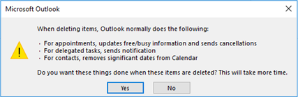

# Restore a deleted public folder

In some cases, you can restore a public folder that has been deleted.

Public folders that have been deleted by users or administrators are stored in the public folder dumpster located in `\NON_IPM_SUBTREE\DUMPSTER_ROOT`. Deleted folders are preserved here until the time retention period is over.

For scenarios where public folder contents are put on hold using retention policy, the folders removed from `\NON_IPM_SUBTREE\DUMPSTER_ROOT` are preserved under `\NON_IPM_SUBTREE\DiscoveryHolds` until the retention hold period is over.

Any folders preserved in the public folder dumpster or under the DiscoverHolds folder can be restored using EXO PowerShell. Restoring the public folder will restore all subfolders and items present in the folder.

> [!NOTE]
> The folders in the dumpster are permanently deleted after the retention period is over. After a public folder is permanently deleted, it cannot be restored, unless it is preserved under DiscoveryHolds by a retention policy.

## Permissions required

The user restoring the public folder must have the `Public Folders` role assigned. This role is assigned by default to users present in the `Organization Management` role group.

## Restore a deleted public folder

1. Connect to EXO PowerShell for Exchange Online.

1. Determine if the public folder you want to restore is in the public folder dumpster.

    The following command lists all non-system public folders in the dumpster:

    ```PowerShell
    Get-PublicFolder \NON_IPM_SUBTREE\DUMPSTER_ROOT -Recurse |?{$_.FolderClass -ne "$null"}
    ```

    Alternatively, you can search for specific folders. For example, the following command searches for a deleted public folder that was named `Marketing`:

    ```PowerShell
    Get-PublicFolder \NON_IPM_SUBTREE\DUMPSTER_ROOT -Recurse |?{$_.Name -like "Marketing"}
    ```

    You can also search for public folders present under `\NON_IPM_SUBTREE\DiscoverHolds`. For example, the following command searches for a deleted public folder that was named `Sales`:
    
    ```PowerShell
    Get-PublicFolder \NON_IPM_SUBTREE\DiscoveryHolds -Recurse |?{$_.Name -like "Sales"}
    ```

1. Use the following command to restore the desired public folder:

    ```PowerShell
    Set-PublicFolder -Identity "Full path of folder to be restored" -Path "Parent folder path where folder needs to be restored"
    ```

    For example, to restore a public folder named `PF1` to the root of the public folder tree:

    ```PowerShell
    Set-PublicFolder -Identity \NON_IPM_SUBTREE\DUMPSTER_ROOT\DUMPSTER_EXTEND\RESERVED_1\RESERVED_1\9f32c468-4bc2-42aa-b979-16a057394b2f\PF1 -Path \
    ```

    The following alternate example restores a public folder named `Sales` to the root of the public folder tree:

    ```PowerShell
    Set-PublicFolder -Identity \NON_IPM_SUBTREE\DiscoveryHolds\Sales -Path \
    ```

### Restore a specific subfolder

Restoring a folder restores all of its subfolders, but it is also possible to restore only one subfolder.

For example, the following command restores `Subfolder1` under `\Parent1`:

```PowerShell
$pf=Get-PublicFolder \NON_IPM_SUBTREE\DUMPSTER_ROOT -Recurse |?{$_.Name -eq "Subfolder1"};Set-PublicFolder $pf.identity -Path \Parent1
```

### Restore a public calendar folder

You can restore a public calendar folder using the same procedure as any other public folder, but there are special considerations.

When deleting a public calendar folder, a user sees the following options:



If the user selected "Yes", the items were deleted. In this case, you can restore the public folder, but the items cannot be recovered.

> [!NOTE]
> Using Outlook to restore deleted public folders is not recommended because it truncates the name of the public folder. This issue is under investigation and this article will be updated when a fix is available.
