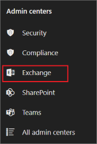
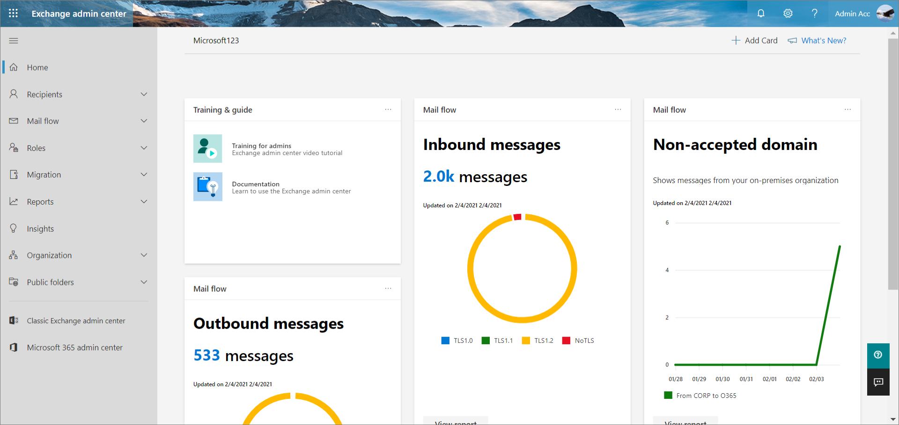
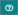
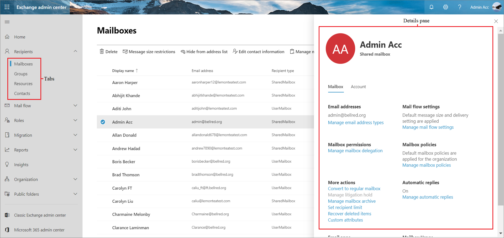

# New Exchange admin center in Exchange Online

The new Exchange admin center is simple and accessible, and it enables you to perform tasks like restoring mailboxes, migrating data, and much more.

## Get to the new Exchange admin center

You must have [Microsoft 365 admin permissions](/microsoft-365/admin/add-users/assign-admin-roles) to access the new Exchange admin center. For more information, see [Permissions in Exchange Online](permissions-exo/permissions-exo.md).

1. [Sign in](https://support.microsoft.com/office/e9eb7d51-5430-4929-91ab-6157c5a050b4) to Microsoft 365 or Office 365 using your work or school account.

2. In the left navigation pane, navigate to **Admin centers** > **Exchange**.

    

You can also get to the new Exchange admin center directly by using the URL [https://admin.exchange.microsoft.com](https://admin.exchange.microsoft.com) and signing in using your credentials.

> [!NOTE]
> Be sure to use a private browsing session (not a regular session) to access the Exchange admin center using the direct URL. This will prevent the credential that you are currently logged on with from being used. To open an InPrivate Browsing session in Microsoft Edge or an incognito window in Google Chrome, press CTRL+SHIFT+N. To open an InPrivate Browsing session in Microsoft Edge Legacy, Internet Explorer, or a Private Browsing session in Mozilla Firefox, press CTRL+SHIFT+P.

## New Exchange admin center features

Here's what the new Exchange admin center looks like.

### Home page

You can personalize your home page by selecting a theme, setting your language, and timezone from the **Settings** bubble.

1. To personalize your dashboard, click **+ Add card** on top of the homepage and drag any card onto the dashboard to the location you want.

2. To learn about the new updates in the new Exchange admin center, click **What's New?**.

3. To sign out of the new Exchange admin center and sign in as a different user, click **My account tile**. You can also sign in with another account.

4. To learn about the new Exchange admin center, in **Training & guide**, select **Training for admins** for a video tutorial and **Documentation**.

5. To get help from Microsoft 365 Support assistant, click .

6. To give feedback to help improve the new Exchange admin center, click . While it's not necessary to provide your email ID, you can click **You can contact me about this feedback** checkbox and provide your email ID to help the team to resolve your concerns faster.

### Feature pane

Here are the features available in the left-hand navigation.

 

****

|Area|What you do here|
|---|---|
|**Recipients**|View and manage your mailboxes (both user and shared mailboxes), groups, resource mailboxes, and contacts.|
|**Mail flow**|Trace messages, create rules, manage remote domains and accepted domains, add connectors, manage alert, and alert policies.|
|**Roles**|Manage administrator roles.|
|**Migration**|Migrate mailboxes in batches.|
|**Reports**|View reports on mail flow and migration batches.|
|**Insights**|Use the recommendations to discover trends and/or insights, and take actions to fix issues related to mailbox and mail flow.|
|**Organization**|Manage organization sharing and apps for Outlook.|
|**Public folders**|Manage public folders and public folder mailboxes.|
|

> [!NOTE]
> You can also access **Classic Exchange admin center** and **Microsoft 365 admin center**, by selecting them at the bottom of left navigation panel.

### Tabs

The tabs are your second level of navigation. Each of the feature areas contains various tabs, each representing a complete feature.

### Toolbar

When you click most tabs, you'll see a toolbar. The toolbar has icons that perform a specific action.

### List view

When you select a tab, in most cases you'll see a list view. The list view in the new Exchange admin center is designed to remove limitations that existed in the Classic Exchange admin center and Exchange Control Panel.

### Details pane

When you select an item from the list view, information about that object is displayed in the details pane.

 **To bulk edit several items**: Select the objects you want to bulk edit, and use the options in the toolbar.

## Related articles

[Exchange Online][Exchange Online](exchange-online.md)

[Exchange admin center in Exchange Online](exchange-admin-center.md)

[What's new in Exchange admin center](whats-new.md)

[Differences between the Classic Exchange admin center (Classic EAC) and the new Exchange admin center (new EAC)](changes-in-exchange-admin-center.md)
