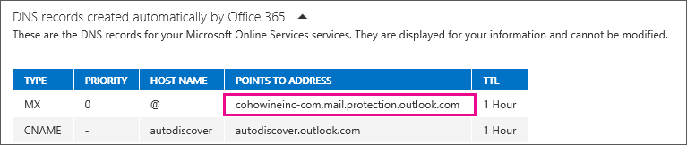

# How to set up a multifunction device or application to send email using Office 365

Prerequisites: Office 365 Subscription, [Exchange Online Plan](https://products.office.com/exchange/compare-microsoft-exchange-online-plans)

From September 1st, 2018, Office 365 is slowly rolling out changes to SMTP client submission (also known as SMTP Authenticated Submission) which may affect your devices and applications that send emails. To find out more, visit the KB article [Improvements in SMTP Authenticated Submission client protocol](https://support.microsoft.com/help/4458479/improvements-in-smtp-authenticated-submission-client-protocol).

This article explains how you can send email from devices and business applications when all of your mailboxes are in Office 365. For example:

- You have a scanner, and you want to email scanned documents to yourself or someone else.

- You have a line-of-business (LOB) application that manages appointments, and you want to email reminders to clients of their appointment time.

> [!NOTE]
> Beginning September 1st, 2018, Office 365 is slowly rolling out changes to SMTP client submission (also known as SMTP Authenticated Submission), which may affect your devices and your applications that send emails. For more information, see the KB article [Improvements to the SMTP Authenticated Submission client protocol](https://support.microsoft.com/help/4458479/improvements-in-smtp-authenticated-submission-client-protocol).

## Option 1 (recommended): Authenticate your device or application directly with an Office 365 mailbox, and send mail using SMTP client submission

This option supports most usage scenarios and it's the easiest to set up. Choose this option when:

- You want to send email from a third-party hosted application, service, or device.

- You want to send email to people inside and outside your organization.

To configure your device or application, connect directly to Office 365 using the SMTP client submission endpoint **smtp.office365.com**.

Each device/application must be able to authenticate with Office 365. The email address of the account that's used to authenticate with Office 365 will appear as the sender of messages from the device/application.

### How to set up SMTP client submission

Enter the following settings directly on your device or in the application **as their guide instructs** (it might use different terminology than this article). As long as your scenario meets the requirements for SMTP client submission, the following settings will enable you to send email from your device or application.

|**Device or Application setting**|**Value**|
|:-----|:-----|
|Server/smart host|smtp.office365.com|
|Port|Port 587 (recommended) or port 25|
|TLS/ StartTLS|Enabled|
|Username/email address and password|Enter the sign in credentials of the hosted mailbox being used|

For more information, expand the following sections.

#### TLS and other encryption options

Determine what version of TLS your device supports by checking the device guide or with the vendor. If your device or application does not support TLS 1.0 or above:

- Use direct send (Option 2) or Office 365 SMTP relay (Option 3) for sending mail instead (depending on your requirements).

- If it is essential to use SMTP client submission and your printer only supports SSL 3.0, you can set up an alternative configuration called Indirect SMTP client submission. This uses a local SMTP relay server to connect to Office 365. This is a much more complex setup. Instructions can be found here: [How to configure IIS for relay with Office 365](how-to-configure-iis-for-relay-with-office-365.md).

> [!NOTE]
> If your device recommends or defaults to port 465, it does not support SMTP client submission.

#### How SMTP client submission works

The following diagram gives you a conceptual overview of what you're environment will look like.

#### Features of SMTP client submission

- SMTP client submission allows you to send email to people in your organization as well as outside your company.

- This method bypasses most spam checks for email sent to people in your organization. This can help protect your company IP addresses from being blocked by a spam list.

- With this method, you can send email from any location or IP address, including your (on-premises) organization's network, or a third-party cloud hosting service, like Microsoft Azure.

#### Requirements for SMTP client submission

- **Authentication**: You must be able to configure a user name and password to send email on the device.

- **Mailbox**: You must have a licensed Office 365 mailbox to send email from.

- **Transport Layer Security (TLS)**: Your device must be able to use TLS version 1.0 and above.

- **Port**: Port 587 (recommended) or port 25 is required and must be unblocked on your network. Some network firewalls or ISPs block ports—especially port 25.

> [!NOTE]
> For information about TLS, see [How Exchange Online uses TLS to secure email connections in Office 365](https://go.microsoft.com/fwlink/p/?LinkId=620842) and for detailed technical information about how Exchange Online uses TLS with cipher suite ordering, see [Enhancing mail flow security for Exchange Online](https://go.microsoft.com/fwlink/p/?LinkId=620841).

#### Limitations of SMTP client submission

You can only send from one email address unless your device can store login credentials for multiple Office 365 mailboxes. Office 365 imposes a limit of 30 messages sent per minute, and a limit of 10,000 recipients per day.

## Option 2: Send mail directly from your printer or application to Office 365 (direct send)

Choose this option when:

- SMTP client submission (Option 1) is not compatible with your business needs or with your device. For example, your device or application does not meet the requirements of SMTP client submission, such as TLS support.

- You only need to send messages to recipients in your own organization who have mailboxes in Office 365; you don't need to send email to people outside of your organization.

Other scenarios when direct send may be your best choice:

- You want your device or application to send from each user's email address and do not want each user's mailbox credentials configured to use SMTP client submission. Direct send allows each user in your organization to send email using their own address.

    Avoid using a single mailbox with Send As permissions for all your users. This method is not supported because of complexity and potential issues.

- You want to send bulk email or newsletters. Office 365 does not allow you to do this via SMTP client submission. Direct send allows you to send a high volume of messages.

    Note that there is a risk of your email being marked as spam by Office 365. You might want to enlist the help of a bulk email provider to assist you. For example, they'll help you adhere to best practices, and can help ensure that your domains and IP addresses are not blocked by others on the Internet.

### Settings for direct send

Enter the following settings on the device or in the application directly.

|**Device or application setting**|**Value**|
|:-----|:-----|
|Server/smart host|Your MX endpoint, for example, contoso-com.mail.protection.outlook.com|
|Port|Port 25|
|TLS/StartTLS|Enabled|
|Email address|Any email address for one of your Office 365 accepted domains. This email address does not need to have a mailbox.|

We recommend adding an SPF record to avoid having messages flagged as spam. If you are sending from a static IP address, add it to your SPF record in your domain registrar's DNS settings as follows:

|**DNS entry**|**Value**|
|:-----|:-----|
|SPF|`v=spf1 ip4:<Static IP Address> include:spf.protection.outlook.com ~all`|

### Step-by-step instructions for direct send

1. If your device or application can send from a static public IP address, obtain this IP address and make a note of it. You can share your static IP address with other devices and users, but don't share the IP address with anyone outside of your company. Your device or application can send from a dynamic or shared IP address but messages are more prone to antispam filtering.

2. [Sign in to Office 365](https://go.microsoft.com/fwlink/p/?LinkID=402333).

3. Make sure your domain, such as contoso.com, is selected. Click **Manage DNS**, and find the MX record. The MX record will have a **POINTS TO ADDRESS** value that looks similar to cohowineinc-com.mail.protection.outlook.com, as depicted in the following screenshot. Make a note of the MX record **POINTS TO ADDRESS** value, which we refer to as your MX endpoint.

    

4. Go back to the device, and in the settings, under what would normally be called **Server** or **Smart Host**, enter the MX record **POINTS TO ADDRESS** value you recorded in step 3.

5. Now that you are done configuring your device settings, go to your domain registrar's website to update your DNS records. Edit your sender policy framework (SPF) record. In the entry, include the IP address that you noted in step 1. The finished string looks similar to this:

     `v=spf1 ip4:10.5.3.2 include:spf.protection.outlook.com ~all`

    where 10.5.3.2 is your public IP address.

    > [!NOTE]
    > Skipping this step might cause email to be sent to recipients' junk mail folders.

6. To test the configuration, send a test email from your device or application, and confirm that the recipient received it.

### How direct send works

In the following diagram, the application or device in your organization's network uses direct send and your Office 365 mail exchange (MX) endpoint to email recipients in your organization. It's easy to find your MX endpoint in Office 365 if you need to look it up.

You can configure your device to send email direct to Office 365. Use direct send to relay email to recipients with Office 365 mailboxes in your organization. Direct send also works for external recipients with mailboxes in Office 365. If your device uses direct send to try to relay an email for a recipient who doesn't have an Office 365 mailbox, the email will be rejected.

> [!NOTE]
> If your device or application has the ability to act as a mail server and deliver to Office 365 as well as other mail providers, consult your device or application instructions; there are no Office 365 settings needed for this scenario.

### Features of direct send

- Uses Office 365 to send emails, but does not require a dedicated Office 365 mailbox.

- Doesn't require your device or application to have a static IP address. However, this is recommended if possible.

- Doesn't work with a connector; never configure a device to use a connector with direct send, this can cause problems.

- Doesn't require your device to support TLS.

Direct send has higher sending limits than SMTP client submission. Senders are not bound by the 30 messages per minute or 10,000 recipients per day limit.

### Requirements for direct send

- **Port**: Port 25 is required and must be unblocked on your network.

- **Static IP address is recommended**: A static IP address is recommended so that an SPF record can be created for your domain. This helps avoid your messages being flagged as spam.

- Does not require an Office 365 mailbox with a license.

### Limitations of direct send

- Direct send cannot be used to deliver email to external recipients, for example, recipients with Yahoo or Gmail addresses.

- Your messages will be subject to antispam checks.

- Sent mail might be disrupted if your IP addresses are blocked by a spam list.

- Office 365 uses throttling policies to protect the performance of the service.

## Option 3: Configure a connector to send mail using Office 365 SMTP relay

This option is more difficult to implement than the others. Only choose this option when:

- SMTP client submission (Option 1) is not compatible with your business needs or with your device

- You can't use direct send (Option 2) because you must send email to external recipients.

SMTP relay lets Office 365 relay emails on your behalf by using your public IP address (or a certificate) to authenticate Office 365. To do this, you'll need to set up a connector for your Office 365 account, which is what makes this a more complicated configuration.

### Settings for Office 365 SMTP relay

|**Device or application setting**|**Value**|
|:-----|:-----|
|Server/smart host|Your MX endpoint, e.g. yourcontosodomain-com.mail.protection.outlook.com|
|Port|Port 25|
|TLS/StartTLS|Enabled|
|Email address|Any email address for one of your Office 365 verified domains. This email address does not need a mailbox.|

If you have set up Exchange Hybrid or have a connector configured for mail flow from your email server to Office 365, it is likely that no additional setup will be required for this scenario. Otherwise, create a mail flow connector to support this scenario:

|**Connector setting**|**Value**|
|:-----|:-----|
|From|Your organization's email server|
|To|Office 365|
|Domain restrictions: IP address/range|Your on-premises IP address or address range that the device or application will use to connect to Office 365|

We recommend adding an SPF record to avoid having messages flagged as spam. If you are sending from a static IP address, add it to your SPF record in your domain registrar's DNS settings as follows:

|**DNS entry**|**Value**|
|:-----|:-----|
|SPF|`v=spf1 ip4:<Static IP Address> include:spf.protection.outlook.com ~all`|

### Step-by-step configuration instructions for SMTP relay

1. Obtain the public (static) IP address that the device or application with send from. A dynamic IP address isn't supported or allowed. You can share your static IP address with other devices and users, but don't share the IP address with anyone outside of your company. Make a note of this IP address for later.

2. [Sign in to Office 365](https://go.microsoft.com/fwlink/p/?LinkID=402333).

3. Select **Domains**. Make sure your domain, such as contoso.com, is selected. Click **Manage DNS** and find the MX record. The MX record will have a **POINTS TO ADDRESS** value that looks similar to cohowineinc-com.mail.protection.outlook.com as depicted in the following screenshot. Make a note of the MX record **POINTS TO ADDRESS** value. You'll need this later.

    

4. Check that the domains that the application or device will send to have been verified. If the domain is not verified, emails could be lost, and you won't be able to track them with the Exchange Online message trace tool.

5. In Office 365, click **Admin**, and then click **Exchange** to go to the Exchange admin center.

6. In the Exchange admin center, go to **Mail flow** \> **Connectors**.

7. Check the list of connectors set up for your organization. If there is no connector listed from your organization's email server to Office 365, create one.

1. To start the wizard, click the plus symbol **+**. On the first screen, choose the options that are depicted in the following screenshot:

    

    Click **Next**, and give the connector a name.

2. On the next screen, choose the option **By verifying that the IP address of the sending server matches one of these IP addresses that belong to your organization**, and add the IP address from step 1.

3. Leave all the other fields with their default values, and select **Save**.

8. Now that you are done with configuring your Office 365 settings, go to your domain registrar's website to update your DNS records. Edit your SPF record. Include the IP address that you noted in step 1. The finished string should look similar to this `v=spf1 ip4:10.5.3.2 include:spf.protection.outlook.com ~all`, where 10.5.3.2 is your public IP address. Skipping this step can cause email to be sent to recipients' junk mail folders.

9. Now, go back to the device, and in the settings, find the entry for Server or Smart Host, and enter the MX record **POINTS TO ADDRESS** value that you recorded in step 3.

10. To test the configuration, send a test email from your device or application, and confirm that it was received by the recipient.

### How Office 365 SMTP relay works

In the following diagram, the application or device in your organization's network uses a connector for SMTP relay to email recipients in your organization.

- The Office 365 connector that you configure authenticates your device or application with Office 365 using an IP address. Your device or application can send email using any address (including ones that can't receive mail), as long as the address uses one of your domains. The email address doesn't need to be associated with an actual mailbox. For example, if your domain is contoso.com, you could send from an address like do_not_reply@contoso.com.

- Office 365 SMTP relay uses a connector to authenticate the mail sent from your device or application. This allows Office 365 to relay those messages to your own mailboxes as well as external recipients. Office 365 SMTP relay is very similar to direct send except that it can send mail to external recipients.

- Due to the added complexity of configuring a connector, direct send is recommended over Office 365 SMTP relay, unless you must send email to external recipients. To send email using Office 365 SMTP relay, your device or application server must have a static IP address or address range. You can't use SMTP relay to send email directly to Office 365 from a third-party hosted service, such as Microsoft Azure.

### Features of Office 365 SMTP relay

- Office 365 SMTP relay does not require the use of a licensed Office 365 mailbox to send emails.

- Office 365 SMTP relay has higher sending limits than SMTP client submission; senders are not bound by the 30 messages per minute or 10,000 recipients per day limits.

### Requirements for Office 365 SMTP relay

- **Static IP address or address range**: Most devices or applications are unable to use a certificate for authentication. To authenticate your device or application, use one or more static IP addresses that are not shared with another organization.

- **Connector**: You must set up a connector in Exchange Online for email sent from your device or application.

- **Port**: Port 25 is required and must not be blocked on your network or by your ISP.

- **Licensing**: SMTP relay doesn't use a specific Office 365 mailbox to send email. This is why it's important that only licensed users send email from devices or applications configured for SMTP relay. If you have senders using devices or LOB applications who don't have an Office 365 mailbox license, obtain and assign an Exchange Online Protection license to each unlicensed sender. This is the least expensive license that allows you to send email via Office 365.

### Limitations of Office 365 SMTP relay

- Sent mail can be disrupted if your IP addresses are blocked by a spam list.

- Reasonable limits are imposed for sending. For more information, see [Higher Risk Delivery Pool for Outbound Messages](https://go.microsoft.com/fwlink/p/?linkid=830829).

- Requires static unshared IP addresses (unless a certificate is used).

## Compare the options

Here's a comparison of each configuration option and the features they support.

||**SMTP client submission**|**Direct send**|**SMTP relay**|
|:-----|:-----|:-----|:-----|
|**Features**|
|Send to recipients in your domain(s)|Yes|Yes|Yes|
|Relay to Internet via Office 365|Yes|No. Direct delivery only.|Yes|
|Bypasses antispam|Yes, if the mail is destined for an Office 365 mailbox.|No. Suspicious emails might be filtered. We recommend a custom Sender Policy Framework (SPF) record.|No. Suspicious emails might be filtered. We recommend a custom SPF record.|
|Supports mail sent from applications hosted by a third party|Yes|No|No|
|**Requirements**|
|Open network port|Port 587 or port 25|Port 25|Port 25|
|Device or application server must support TLS|Required|Optional|Optional|
|Requires authentication|Office 365 user name and password required|None|One or more static IP addresses. Your printer or the server running your LOB app must have a static IP address to use for authentication with Office 365.|
|**Limitations**|
|Throttling limits|10,000 recipients per day. 30 messages per minute.|Standard throttling is in place to protect Office 365.|Reasonable limits are imposed. The service can't be used to send spam or bulk mail. For more information about reasonable limits, see [Higher Risk Delivery Pool for Outbound Messages](https://go.microsoft.com/fwlink/p/?linkid=830829).|

## Use your own email server to send email from multifunction devices and applications

If you have mailboxes in Office 365 and an email server that you manage (also called an on-premises email server), always configure your devices and applications to use your local network and route email through your own email server. For details about setting up your Exchange server to receive email from systems that are not running Exchange (such as a multifunction printer), see [Create a Receive Connector to Receive Email from a System Not Running Exchange](https://docs.microsoft.com/exchange/create-a-receive-connector-to-receive-email-from-a-system-not-running-exchange-exchange-2013-help).

## Related Topics

[Fix issues with printers, scanners, and LOB applications that send email using Office 365](fix-issues-with-printers-scanners-and-lob-applications-that-send-email-using-off.md)

[How to configure IIS for relay with Office 365](how-to-configure-iis-for-relay-with-office-365.md)
