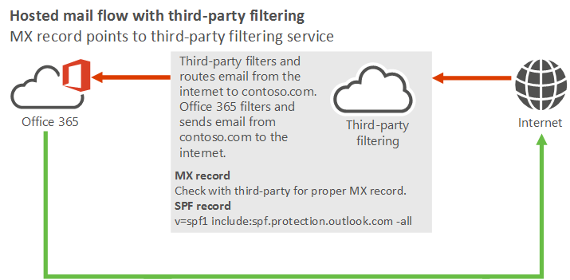
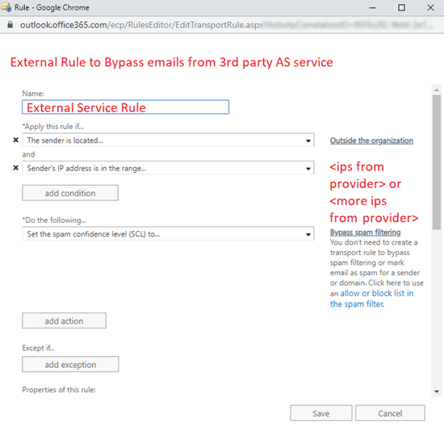
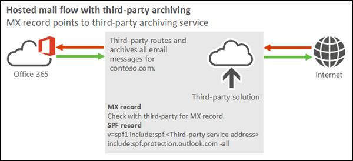

# Manage mail flow using a third-party cloud service with Exchange Online

This topic covers the following complex mail flow scenarios using Exchange Online:

[Scenario 1 - MX record points to third-party spam filtering](#scenario-1---mx-record-points-to-third-party-spam-filtering)

[Scenario 2 - MX record points to third-party solution without spam filtering](#scenario-2---mx-record-points-to-third-party-solution-without-spam-filtering)

> [!NOTE]
> Examples in this topic use the fictitious organization, Contoso, which owns the domain contoso.com and is a tenant in Exchange Online. This is just an example. You can adapt this example to fit your organization's domain name and third-party service IP addresses where necessary.

## Using a third-party cloud service with Microsoft 365 or Office 365

### Scenario 1 - MX record points to third-party spam filtering

I plan to use Exchange Online to host all my organization's mailboxes. My organization uses a third-party cloud service for spam, malware, and phish filtering. All email from the internet must first be filtered by this third-party cloud service before being routed to Microsoft 365 or Office 365.

For this scenario, your organization's mail flow setup looks like the following diagram:



#### Best practices for using a third-party cloud filtering service with Microsoft 365 or Office 365

1. Add your custom domains in Microsoft 365 or Office 365. To prove that you own the domains, follow the instructions in [Add a domain to Microsoft 365](https://docs.microsoft.com/microsoft-365/admin/setup/add-domain).

2. [Create user mailboxes in Exchange Online](../recipients-in-exchange-online/create-user-mailboxes.md) or [move all users' mailboxes to Microsoft 365 or Office 365](../mailbox-migration/mailbox-migration.md).

3. Update the DNS records for the domains that you added in step 1. (Not sure how to do this? Follow the instructions on [this page](https://docs.microsoft.com/microsoft-365/admin/get-help-with-domains/create-dns-records-at-any-dns-hosting-provider).) The following DNS records control mail flow:

   - **MX record**: Your domain's MX record must point to your third-party service provider. Follow their guidelines for how to configure your MX record.

   - **SPF record**: All mail sent from your domain to the internet originates in Microsoft 365 or Office 365, so your SPF record requires the standard value for Microsoft 365 or Office 365:

     ```text
     v=spf1 include:spf.protection.outlook.com -all
     ```

     You would only need to include the third-party service in your SPF record if your organization sends **outbound** internet email through the service (where the third-party service would be a source for email from your domain).

   When you're configuring this scenario, the "host" that you need to configure to receive email from the third-party service is specified in the **MX Record**. For example:

   

   In this example, the host name for the Microsoft 365 or Office 365 host should be **hubstream-mx.mail.protection.outlook.com**. This value can vary from domain to domain, so check your value at **Configuration** \> **Domain** \> \<select domain\> to confirm your actual value.

4. Lock down your Exchange Online organization to only accept mail from your third-party service.

   Create and configure a **Partner** inbound connector using either *TlsSenderCertificateName* (preferred) or *SenderIpAddresses* parameters, then set the corresponding *RestrictDomainsToCertificate* or *RestrictDomainsToIPAddresses* parameters to $True. Any messages that are smart-host routed directly to Exchange Online will be rejected (because they didn't arrive over a connection using specified certificate or from the specified IP addresses). 

   For example:

   ```powershell
   New-InboundConnector –Name "Reject mail not routed through MX (third-party service name)" -ConnectorType Partner -SenderDomains * -RestrictDomainsToCertificate $true -TlsSenderCertificateName *.contoso.com -RequireTls $true
   ```

   or

   ```powershell
   New-InboundConnector –Name "Reject mail not routed through MX (third-party service name)" -ConnectorType Partner -SenderDomains * -RestrictDomainsToIPAddresses $true -SenderIpAddresses <#static list of on-premises IPs or IP ranges of the third-party service>
   ```

   > [!NOTE]
   > If you already have an **OnPremises** inbound connector for the same certificate or sender IP addresses, you still need to create the  **Partner** inbound connector (the *RestrictDomainsToCertificate* and *RestrictDomainsToIPAddresses* parameters are only applied to **Partner** connectors). The two connectors can coexist without problems. 

5. There are two options for this step:

   - **Use Enhanced Filtering for Connectors (highly recommended)**: Use [Enhanced Filtering for Connectors](use-connectors-to-configure-mail-flow/enhanced-filtering-for-connectors.md) (also known as skip listing) on the Partner inbound connector that receives messages from the third-party application. This allows EOP and Microsoft 365 or Office 365 ATP scanning on the messages.

     > [!NOTE]
     > For hybrid scenarios where third-party applications rely on Exchange on-premises to send to Exchange Online, you also need to enable Enhanced Filtering for Connectors on the OnPremsise inbound connector.

   - **Bypass spam filtering**: Use a mail flow rule (also known as a transport rule) to bypass spam filtering. This option will prevent most EOP and Microsoft 365 or Office 365 ATP controls and will therefore prevent a double anti-spam check.

     

     > [!IMPORTANT]
     > Instead of bypassing spam filtering using a mail flow rule, we highly recommend that you enable [Enhanced Filtering for Connector (also known as Skip Listing)](use-connectors-to-configure-mail-flow/enhanced-filtering-for-connectors.md). Most third-party cloud anti-spam proviers share IP addresses among many customers. Bypassing scanning on these IPs might allow spoofed and phishing messages from these IP addresses.

### Scenario 2 - MX record points to third-party solution without spam filtering

I plan to use Exchange Online to host all my organization's mailboxes. All email that's sent to my domain from the internet must first flow through a third-party archiving or auditing service before arriving in Exchange Online. All outbound email that's sent from my Exchange Online organization to the internet must also flow through the service. However, the service doesn't provide a spam filtering solution.

This scenario requires you to use [Enhanced Filtering for Connectors](use-connectors-to-configure-mail-flow/enhanced-filtering-for-connectors.md). Otherwise, mail from all internet senders appears to originate from the third-party service, not from the true sources on the internet.



#### Best practices for using a third-party cloud service with Microsoft 365 or Office 365

We strongly recommend that you use the archiving and auditing solutions that are provided by Microsoft 365 and Office 365.

## See also

[Mail flow best practices for Exchange Online, Microsoft 365, Office 365 (overview)](mail-flow-best-practices.md)

[Set up connectors for secure mail flow with a partner organization](use-connectors-to-configure-mail-flow/set-up-connectors-for-secure-mail-flow-with-a-partner.md)

[Manage all mailboxes and mail flow using Microsoft 365 or Office 365](manage-mailboxes-using-microsoft-365-or-office-365.md)

[Manage mail flow with mailboxes in multiple locations (Microsoft 365 or Office 365 and on-premises Exchange)](manage-mail-flow-for-multiple-locations.md)

[Manage mail flow using a third-party cloud service with Exchange Online and on-premises mailboxes](manage-mail-flow-on-office-365-and-on-prem.md)

[Troubleshoot Microsoft 365 or Office 365 mail flow](troubleshoot-mail-flow.md)

[Test mail flow by validating your connectors](test-mail-flow.md)
