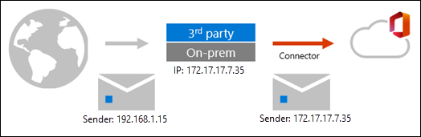
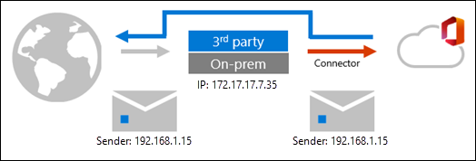

# Enhanced Filtering for Connectors in Exchange Online

Properly configured inbound connectors are a trusted source of incoming mail to Microsoft 365 or Office 365. But in complex routing scenarios where email for your Microsoft 365 or Office 365 domain is routed somewhere else first, the source of the inbound connector is typically not the true indicator of where the message came from. Complex routing scenarios include:

- Third-party cloud filtering services
- Managed filtering appliances
- Hybrid environments (e.g., on-premises Exchange)

Mail routing in complex scenarios looks like this:



As you can see, the message adopts the source IP of the service, appliance, or on-premises Exchange organization that sits in front of Microsoft 365. The message arrives in Microsoft 365 with a different source IP address. This isn't a limitation of Microsoft 365; it's simply how SMTP works.

In these scenarios, you can still get the most out of [Exchange Online Protection (EOP)](https://docs.microsoft.com/microsoft-365/security/office-365-security/exchange-online-protection-overview) and [Office 365 Advanced Threat Protection (ATP)](https://docs.microsoft.com/microsoft-365/security/office-365-security/office-365-atp) by using Enhanced Filtering for Connectors (also known as _skip listing_).

After you enable Enhanced Filtering for Connectors, mail routing in complex routing scenarios looks like this:



As you can see, Enhanced Filtering for connectors allows IP address and sender information to be preserved, which has the following benefits:

- Improved accuracy for the Microsoft filtering stack and machine learning models, which include:
  - Heuristic clustering
  - Anti-spoofing
  - Anti-phishing
- Better post-breach capabilities in [Automated investigation and response (AIR)](https://docs.microsoft.com/microsoft-365/security/office-365-security/office-365-air)
- Able to use explicit email authentication (SPF, DKIM, and DMARC) to verify the reputation of the sending domain for impersonation and spoof detection. For more information about explicit and implicit email authentication, see [Email authentication in EOP](https://docs.microsoft.com/microsoft-365/security/office-365-security/email-validation-and-authentication).

For additional information, see the [What happens when you enable Enhanced Filtering for Connectors?](#what-happens-when-you-enable-enhanced-filtering-for-connectors) section later in this article.

Use the procedures in this article to enable Enhanced Filtering for Connectors on individual connectors. For more information about connectors in Exchange Online, see [Configure mail flow using connectors](use-connectors-to-configure-mail-flow.md).

> [!NOTE]
>
> - We always recommend that you point your MX record to Microsoft 365 or Office 365 in order to reduce complexity. For example, some hosts might invalidate DKIM signatures, causing false positives. When two systems are responsible for email protection, determining which one acted on the message is more complicated.
>
> - The most common scenarios that Enhanced Filtering is designed for are Hybrid environments; however, the mail destined for on-premises mailboxes (outbound mail) will still not be filtered by EOP. The only way to get full EOP scanning on all mailboxes is to [move your MX record to Microsoft 365 or Office 365](https://docs.microsoft.com/Office365/SecurityCompliance/eop/set-up-your-eop-service#step-6-use-the-microsoft-365-admin-center-to-point-your-mx-record-to-eop).
>
> - Do not put another scanning service or host _after_ EOP. Once EOP scans a message, be careful not to break the chain of trust by routing mail through any non-Exchange server that is not part of your cloud or on-premises organization. When the message eventually arrives at the destination mailbox, the headers from the first scanning verdict might no longer be accurate. [Centralized Mail Transport](https://docs.microsoft.com/exchange/transport-options) should not be used to introduce non-Exchange servers into the mail flow path.  

## Configure Enhanced Filtering for Connectors

### What do you need to know before you begin?

- You need to include all of the trusted IP addresses that are associated with the on-premises hosts or the third-party filters that send email into your Microsoft 365 or Office 365 organization, including any intermediate hops with public IP addresses. To get these IP addresses, consult the documentation or support that's provided with the service.

- If you have mail flow rules (also known as transport rules) that set the [SCL to -1](https://docs.microsoft.com/microsoft-365/security/office-365-security/use-mail-flow-rules-to-set-the-spam-confidence-level-scl-in-messages) for messages that flow through this connector, you need to [disable those mail flow rules](../../security-and-compliance/mail-flow-rules/manage-mail-flow-rules.md#enable-or-disable-a-mail-flow-rule) after you enable Enhanced Filtering for Connectors.

- To open the Security & Compliance Center, got to <https://protection.office.com>. To go directly to the **Enhanced Filtering for Connectors** page, open <https://protection.office.com/skiplisting>.

- To connect to Exchange Online PowerShell, see [Connect to Exchange Online PowerShell](https://docs.microsoft.com/powershell/exchange/connect-to-exchange-online-powershell). To connect to Exchange Online Protection PowerShell, see [Connect to Exchange Online Protection PowerShell](https://docs.microsoft.com/powershell/exchange/connect-to-exchange-online-protection-powershell).

- To configure Enhanced Filtering for Connectors, you need to be a member of one of the following role groups:

  - **Organization Management** or **Security Administrator** in the [Security & Compliance Center](https://docs.microsoft.com/microsoft-365/security/office-365-security/permissions-in-the-security-and-compliance-center).
  - **Organization Management** in [Exchange Online](../../permissions-exo/permissions-exo.md#role-groups).

### Use the Security & Compliance Center to configure Enhanced Filtering for Connectors on an inbound connector

1. In the Security and Compliance Center, go to **Threat Management** \> **Policy**, and then choose **Enhanced Filtering**.

2. In the **Enhanced Filtering for Connectors** page that opens, select the inbound connector that you want to configure.

3. In the connector details flyout that opens, configure the following settings:

   - **IP addresses to skip**: Choose one of the following values:
        - **Automatically detect and skip the last IP address**: We recommend this value if you have to skip only the last message source.
        - **Skip these IP addresses that are associated with the connector**: Select this value to configure a list of IP addresses to skip.

          > [!IMPORTANT]
          >
          > - Entering the IP addresses of Microsoft 365 or Office 365 is not supported. Do not use this feature to compensate for issues introduced by unsupported email routing paths. Use caution and limit the IP ranges to only the email systems that will handle your own organization's messages prior to Microsoft 365 or Office 365.
          >
          > - Entering any private IP address defined by RFC 1918 (10.0.0.0/8, 172.16.0.0/12, and 192.168.0.0/16) is not supported. Enhanced Filtering automatically detects and skips private IP addresses. If the previous hop is an email server that's behind a network address translation (NAT) device that assigns private IP addresses, we recommend that you configure NAT to assign a public IP address to the email server.

        - **Disable Enhanced Filtering for Connectors**: Turn off Enhanced Filtering for Connectors on the connector.

   - **Apply to these users**: Choose one of the following values:
     - **Apply to a small set of users**: Select this value to configure a list of recipient email addresses that Enhanced Filtering for Connectors applies to. We recommend this value as an initial test of the feature.

       > [!NOTE]
       >
       > - This value is only affective on the actual email addresses that you specify. For example, if a user has five email addresses associated with their mailbox (also known as _proxy addresses_), you'll need to specify all five of their email addresses here. Otherwise, messages that are sent to the four other email addresses will go through normal filtering.
       >
       > - In hybrid environments where inbound mail flows through on-premises Exchange, you must specify the *targetAddress* of the *MailUser* object. For example, *michelle@contoso.mail.onmicrosoft.com*.
       >
       > - This value is only affective on messages where **all** recipients are specified here. If a message contains **any** recipients that aren't specified here, normal filtering is applied to **all** recipients of the message.

     - **Apply to entire organization**: We recommend this value after you've tested the feature on a small number of recipients first.

4. When you're finished, click **Save**.

### Use Exchange Online PowerShell or Exchange Online Protection PowerShell to configure Enhanced Filtering for Connectors on an inbound connector

To configure Enhanced Filtering for Connectors on an inbound connector, use the following syntax:

```powershell
Set-InboundConnector -Identity <ConnectorIdentity> [-EFSkipLastIP <$true | $false>] [-EFSkipIPs <IPAddresses>] [-EFUsers "emailaddress1","emailaddress2",..."emailaddressN"]
```

- _EFSkipLastIP_: Valid values are:
  - `$true`: Only the last message source is skipped.
  - `$false`: Skip the IP addresses specified by the _EFSkipIPs_ parameter. If no IP addresses are specified there, Enhanced Filtering for Connectors is disabled on the inbound connector. The default value is `$false`.

- _EFSkipIPs_: The specific IP addresses to skip when the _EFSkipLastIP_ parameter value is `$false`. Valid values are:
  - **A single IP address**: For example, `192.168.1.1`.
  - **An IP address range**: For example, `192.168.1.0-192.168.1.31`.
  - **Classless Inter-Domain Routing (CIDR) IP**: For example, `192.168.1.0/25`.

  See the **Skip these IP addresses that are associated with the connector** description in the previous section for limitations on IP addresses.

- _EFUsers_: The comma-separated email address of recipient email addresses that you want to apply Enhanced Filtering for Connectors to. See the **Apply to a small set of users** description in the previous section for limitations on individual recipients. The default value is blank (`$null`), which means Enhanced Filtering for Connectors is applied to all recipients.

This example configures the inbound connector named From Anti-Spam Service with the following settings:

- Enhanced Filtering for Connectors is enabled on the connector, and the IP address of the last message source is skipped.
- Enhanced Filtering for Connectors only applies to the recipient email addresses michelle@contoso.com, laura@contoso.com, and julia@contoso.com.

```powershell
Set-InboundConnector -Identity "From Anti-Spam Service" -EFSkipLastIP $true -EFUsers "michelle@contoso.com","laura@contoso.com","julia@contoso.com"
```

**Note**: To disable Enhanced Filtering for Connectors, use the value `$false` for the _EFSkipLastIP_ parameter.

For detailed syntax and parameter information, see [Set-InboundConnector](https://docs.microsoft.com/powershell/module/exchange/set-inboundconnector).

## What happens when you enable Enhanced Filtering for Connectors?

The following table describes what connections look like before and after you enable Enhanced Filtering for Connectors:

****

|Feature|Before Enhanced Filtering is enabled|After Enhanced Filtering is enabled|
|---|---|---|
|**Email domain authentication**|[Implicit](https://docs.microsoft.com/office365/securitycompliance/anti-spoofing-protection#stopping-spoofing-with-implicit-email-authentication) using anti-spoof protection technology.|Explicit, based on the source domain's SPF, DKIM, and DMARC records in DNS.|
|**X-MS-Exchange-ExternalOriginalInternetSender**|Not available|This header is stamped if skip listing was successful, enabled on the connector, and recipient match happens. The value of this field contains information about the true source address.|
|**X-MS-Exchange-SkipListedInternetSender**|Not available|This header is stamped if skip listing was successful and enabled on the connector. The value of this field contains information about the true source address. This header is used primarily for reporting purposes and to help understand WhatIf scenarios.|
|

You can view the improvements in filtering and reporting by using the following email security reports in the Security & Compliance Center:

- [Threat Protection Status report](https://docs.microsoft.com/office365/securitycompliance/view-email-security-reports#threat-protection-status-report)
- [Spam Detections report](https://docs.microsoft.com/office365/securitycompliance/view-email-security-reports#spam-detections-report)

## See also

[Mail flow best practices for Exchange Online, Microsoft 365, and Office 365 (overview)](../mail-flow-best-practices.md)

[Configure mail flow using connectors](use-connectors-to-configure-mail-flow.md)
