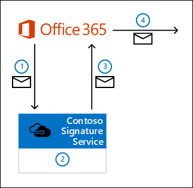
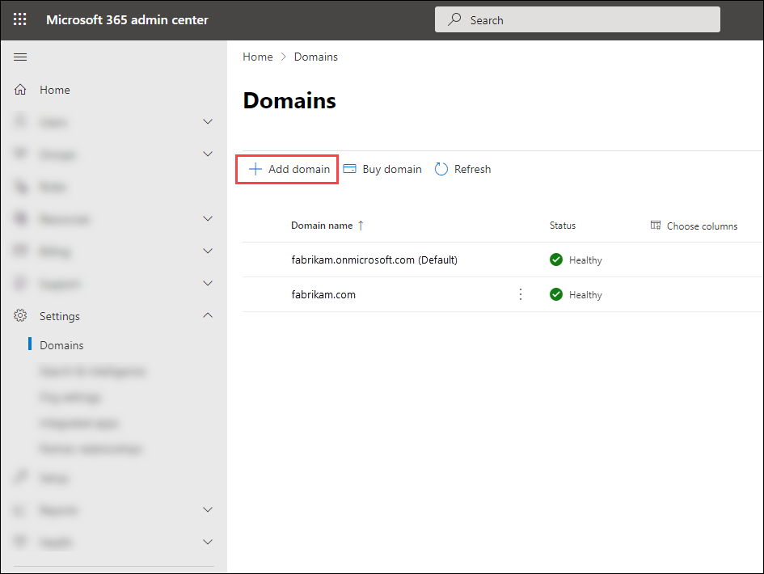
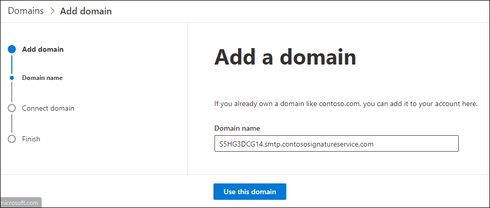
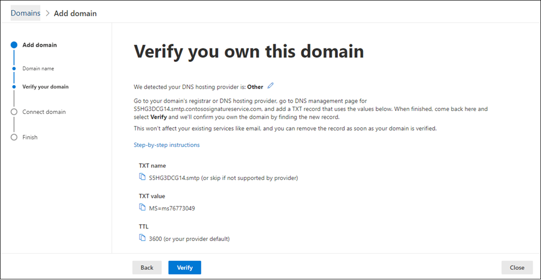
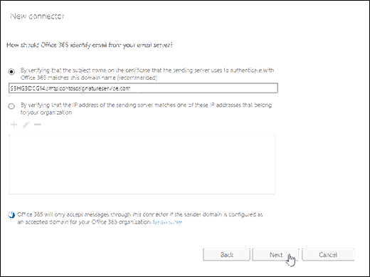
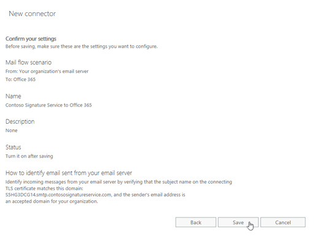

# Scenario: Integrate Microsoft 365 or Office 365 with an email add-on service

Many third-party cloud service solutions provide add-on services for Microsoft 365 or Office 365. For security reasons, we don't allow third-party email add-on services to be installed in Microsoft 365 or Office 365. But, you can work with the service provider to configure the settings in your Microsoft 365 or Office 365 organization so that you can use the service.

This topic describes the best practices for how your organization can use a third-party email add-on service by examining a fictional service named Contoso Signature Service. This fictional service runs in Azure and provides custom email signatures (note that the service could be deployed in a cloud environment other than Azure). The mail flow and a high-level summary of the service are shown in the following diagram.



1. When a user in your Microsoft 365 or Office 365 organization composes and sends a message, the message is diverted to Contoso Signature Service by using a connector and a mail flow rule (also known as a transport rule) that you create.

   Connections from Microsoft 365 or Office 365 to Contoso Signature Service are encrypted by TLS, because you configure the certificate domain name for the service in the connector settings (for example, smtp.contososignatureservice.com).

2. Contoso Signature Service accepts the message and adds an email signature to the message. The service also stamps the message with a custom header to indicate the message has been processed.

3. Contoso Signature Service routes the message back to Microsoft 365 or Office 365. A connector that you create accepts the incoming messages from Contoso Signature Service.

   - Contoso Signature Service uses smart host routing to route messages back to the region where your Microsoft 365 or Office 365 organization is located. For example, if your Microsoft 365 or Office 365 domain is fabrikam.onmicrosoft.com, the destination smart host is fabrikam.mail.protection.outlook.com.

   - Contoso Signature Service provides a unique certificate domain name for each customer. You configure this domain name as an accepted domain in your Microsoft 365 or Office 365 organization, and in the connector settings (for example, S5HG3DCG14H8S1R2303RZHM4RX.smtp.contososignatureservice.com).

4. Microsoft 365 or Office 365 sends the message with the customized signature to the original recipients.

The rest of this topic explains how to configure mail flow in Microsoft 365 or Office 365 to work with the email add-on service.

> [!NOTE]
> These elements are required for any email add-on service that you want to integrate with your Microsoft 365 or Office 365 organization. You need to work with the email add-on service provider to configure their required settings in Microsoft 365 or Office 365.

## What do you need to know before you begin?

- Estimated time to complete: 15 minutes

- You need to be assigned permissions before you can perform this procedure or procedures. To see what permissions you need, see the "Mail flow" entry in the [Feature permissions in Exchange Online](../../permissions-exo/feature-permissions.md) topic.

- To open the Exchange admin center (EAC), see [Exchange admin center in Exchange Online](../../exchange-admin-center.md). To learn how to use Windows PowerShell to connect to Exchange Online, see [Connect to Exchange Online PowerShell](https://docs.microsoft.com/powershell/exchange/connect-to-exchange-online-powershell).

- For information about keyboard shortcuts that may apply to the procedures in this topic, see [Keyboard shortcuts for the Exchange admin center](../../accessibility/keyboard-shortcuts-in-admin-center.md).

> [!TIP]
> Having problems? Ask for help in the Exchange forums. Visit the forums at [Exchange Online](https://social.technet.microsoft.com/forums/msonline/home?forum=onlineservicesexchange) or [Exchange Online Protection](https://social.technet.microsoft.com/forums/forefront/home?forum=FOPE).

## Step 1: Create an outbound connector to route messages to the email add-on service

The important settings for the connector are:

- From Microsoft 365 or Office 365 to the email add-on service.

- Uses smart host routing to the email add-on service.

- Uses TLS to encrypt the connection based on the domain name of the email add-on service (smart host).

### Use the Exchange admin center (EAC) to create the outbound connector to the email add-on service

To create an outbound connector from the new EAC, navigate from the Microsoft 365 admin center to the new EAC by clicking **Exchange** under the **Admin centers** pane. You are now on the New EAC screen.

1. Navigate to **Mail flow** \> **Connectors**. The **Connectors** screen appears.

2. Click **+Add a connector**. The **New connector** screen appears.

:::image type="content" source="../../media/add-connector-option.png" alt-text="The screen on which you can create a connector":::

3. Configure the following settings:
a. Under **Connection from**, choose **Office 365**.
b. Under **Connection to**, choose **Your organization's email server**.

:::image type="content" source="../../media/new-connector-configuration.png" alt-text="The screen on which the connector configuration is set":::

4. Click **Next**. The **Connector name** screen appears.

5. Perform the following tasks:

- Enter a descriptive name (for example, Office 365 to Contoso Signature Service).

- Under **What do you want to do after connector is saved?**:
    - Choose **Turn it on**
    - Choose **Retain internal Exchange email headers (recommended)**.


> [!NOTE]
> > If **Retain internal Exchange email headers (recommended)** is chosen, it provides the following functionality:
> 
> Preserves internal headers in messages that are sent to the email add-on service, which means the messages are treated as trusted internal messages. If you select this value, you'll also need to use the same value on this setting for the inbound connector that you create in Step 4. Otherwise, the inbound connector will remove the internal Exchange headers from the returning messages.

:::image type="content" source="../../media/configuring-connector-name.png" alt-text="The screen on which further configurations for the connector are set":::

6. Click **Next**. The **Use of connector** screen appears.

7. Choose **Only when i have a transport rule set up that redirects messages to this connector** option, as shown in the following screenshot:

:::image type="content" source="../../media/configuring-transport-rule.png" alt-text="Page on which the email transport rule is configured":::

8. Click **Next**. The **Routing** screen appears.

9. Enter the smart host value (for example, myhpstcontoso.com) for the email add-on service, as shown in the following screenshot.

:::image type="content" source="../../media/defining-smart-host.png" alt-text="The screen on which the domain name of the smart host is entered":::

10. Click **Next**. The **Security restrictions** screen appears.

11. Configure these settings:

    a. Choose **Always use Transport Layer Security (TLS) to secure the connection (recommended)**.
    
    b. Choose **Issued by a trusted certificate authority (CA)**.
    
    c. Choose **And the subject name or subject alternative name (SAN) matches this domain name**, and enter the smart host that you used in the Step-8 (for example, myhost.contoso.com)
   
:::image type="content" source="../../media/configuring-security-restrictions.png" alt-text="A screen on which the security restrictions are configured":::

12. Click **Next**. The **Validation email** screen appears.

13. Specify an email address of an active mailbox on your organization's email server and click **+**. 

:::image type="content" source="../../media/validation-email-screen.png" alt-text="The screen on which the user can enter the validation email":::

14. Click **Validate**. The validation process starts.

15. Once the validation process is completed, click **Next**. The **Review connector** screen appears.

16. Verify the settings, and then click **Create connector**, as shown in the following screenshot:

:::image type="content" source="../../media/connector-settings-display.png" alt-text="The screen on which the settings of the connector are displayed":::

The outbound connector is created.

**From Classic EAC**

To create an outbound connector from the Classic EAC, You need not launch the Classic EAC separately. You can navigate to it from the New EAC by clicking **Classic Exchange admin center** on the left-bottom of the screen.

1. Go to **Mail flow** \> **Connectors**, and then click **New** .

   

The new connector wizard opens.

2. On the **Select your mail flow scenario** page, configure these settings:

   - **From**: **Office 365**

   - **To**: **Your organization's email server**

   

   When you're finished, click **Next**.

3. On the next page, configure these settings:

   - **Name**: Enter a descriptive name (for example, Office 365 to Contoso Signature Service).

   - **Retain internal Exchange email headers (recommended)**: Configure one of these values:

   - **Checked**: Preserves internal headers in messages that are sent to the email add-on service, which means the messages are treated as trusted internal messages. If you select this value, you'll also need to use the same value on this setting for the inbound connector that you create in Step 4 (otherwise, the inbound connector will remove the internal Exchange headers from the returning messages).

   - **Unchecked**: Removes internal headers from messages before they're sent to the email add-on service. If you select this value, the value of this setting on the inbound connector that you create in Step 4 is meaningless (by definition, there will be no internal Exchange headers to keep or remove in returning messages).

   

   When you're finished, click **Next**.

4. On the **When do you want to use this connector?** page, select **Only when I have a transport rule set up that redirects messages to this connector**, and then click **Next**.

   

5. On the **How do you want to route email messages?** page, click **Add** . In the **Add smart host** dialog that appears, enter the smart host value for the email add-on service (for example, smtp.contososignatureservice.com), click **Save**, and then click **Next**.

   

6. On the **How should Microsoft 365 or Office 365 connect to your email server?** page, configure these settings:

   - Verify **Always use Transport Layer Security (TLS) to secure the connection (recommended)** is selected.

   - Verify **Issued by a trusted certificate authority (CA)** is selected.

   - Select **And the subject name or subject alternative name (SAN) matches this domain name**, and enter the smart host that you used in the previous step (for example, smtp.contososignatureservice.com).

   

   When you're finished, click **Next**.

7. On the **Confirm your settings** page, verify the settings, and then click **Next**.

   

8. On the **Validate this connector** page, click **Add** . In the **Add email** dialog that appears, enter an email address that isn't in Microsoft 365 or Office 365 to test the connector (for example, admin@fabrikam.com), click **OK**, and then click **Validate**.

   

   A progress indicator appears. When the connector validation is complete, click **Close**.

   

9. On the **Validation result** page, click **Save**.

## Step 2: Create a mail flow rule to route unprocessed messages to the email add-on service

The rule routes messages from internal senders to the outbound connector that you created in Step 1 if the messages haven't already been processed by the email add-on service (the custom header isn't stamped on the message).

### Use the EAC to create a mail flow rule to route unprocessed messages to the email add-on service

To create a mail flow rule in the EAC, perform the following steps:

> [!NOTE]
> The below procedure is applicable for both New EAC and Classic EAC.

1. Go to **Mail flow** \> **Rules**, and click **New** , and then select **Create a new rule**.

   

2. In the **New rule** page that opens, click **More options** near the bottom of the page.

   

3. On the **New rule** page, configure these settings:

   - **Name**: Enter a descriptive name (for example, Route email to Contoso Signature Service).

   - **Apply this rule if**: Select **The sender** \> **Is external/internal** \> Select **Inside the organization**, and then click **OK**.

   - **Do the following**: Select **Redirect the message to** \> **The following connector** \> Select the outbound connector you created in Step 1, and then click **OK**.

   - **Except if**: Click **Add exception** \> Select **A message header** \> **Includes and of these words**.
]
   - Click **Enter text**, enter the name of the custom header field that's applied by the email add-on service (for example, SignatureContoso), and then click **OK**.

   - Click **Enter words**, enter the header field value that indicates a message has been processed by the email add-on service (for example, true), click **Add** , and then click **OK**.

   - Near the bottom of the page, select **Stop processing more rules**.

   

When you're finished, click **Save**.

## Step 3: Add the custom certificate domain provided by the email add-on service as an accepted domain in Microsoft 365 or Office 365

1. Open the [Microsoft 365 admin center](https://admin.microsoft.com), click **Setup** \> **Domains**, and then click **Add domain**.

   

2. In the **Add a domain** page that appears, enter the custom certificate domain that the email add-on service provided when you enrolled in the service (for example, S5HG3DCG14H8S1R2303RZHM4RX.smtp.contososignatureservice.com), and then click **Next**.

   

3. On the **Verify domain** page, use the details on the **TXT record** or **MX record** tabs to create a TXT or MX proof of domain ownership record for the custom certificate domain. After you've created the proof of domain ownership record, click **Verify**. After the domain has been verified, click **Save and close**.

   

For more information, see [Add your domain to Microsoft 365](https://docs.microsoft.com/microsoft-365/admin/setup/add-domain).

## Step 4: Create an inbound connector to receive messages from the email add-on service

The important settings for the connector are:

- From the email add-on service to Microsoft 365 or Office 365.

- TLS encryption and certificate verification is based on the custom certificate domain name that you configured as an accepted domain in the previous step.

### Use the EAC to create an inbound connector to receive messages from the email add-on service

To create an inbound connector from the new EAC, navigate from the Microsoft 365 admin center to the new EAC by clicking **Exchange** under the **Admin centers** pane. You are now on the New EAC screen.

1. Navigate to **Mail flow** \> **Connectors**. The **Connectors** screen appears.

2. Click **+Add a new connector**. The **New connector** screen appears, as shown in the following screenshot:

:::image type="content" source="../../media/add-connector-option.png" alt-text="The screen on which a connector is being created":::

3. Under **Connection from**, choose **Your organization's email server**. 

The **Office 365** option is then chosen by default, as shown in the following screenshot:

:::image type="content" source="../../media/your-org-server-to-365.png" alt-text="SA screen on which the connector is configured from your organization's server to Office 365":::

4. Click **Next**. The **Connector name** screen appears.

5. Perform the following actions:

   a. Enter a descriptive name (for example, Contoso Signature Service to Office 365).
   
   b. Choose **Turn it on**.
   
   c. Choose **Retain internal Exchange email headers (recommended)**.
    
> [!NOTE]
> The **Retain internal Exchange email headers (recommended)** option provides the following functionality:
>  
> **If checked**: Preserves internal headers in messages that are returning from the email add-on service. If you had selected this value on this setting for the outbound connector that you created, you'll need to configure the same value here. The internal Exchange headers in the returning messages are preserved, which means the messages returning from the email add-on service are treated as trusted internal messages.
> 
> **Unchecked**: Removes the internal Exchange headers (if any) from messages that are returning from the email add-on service.
   
:::image type="content" source="../../media/configuring-connector-name-to-365.png" alt-text="The screen on which connector configuration is set":::
    
6. Click **Next**. The **Authenticating sent email** screen appears.

7. Verify that **By verifying that the subject name of the certificate that the sending server uses to authenticate with Office 365 matches the domain entered in the text box below (recommended)** option is chosen.

8. Enter the certificate domain that the email add-on service gave to you when you enrolled in the service (for example, S5HG3DCG14H8S1R2303RZHM4RX.smtp.contososignatureservice.com).

:::image type="content" source="../../media/authenticate-sent-email.png" alt-text="The screen on sent mails are authenticated for eligibility of being transmitted":::

9. Click **Next**. The **Review connector** screen appears.

10. Verify the settings and click **Create connector**.

:::image type="content" source="../../media/review-a-connector.png" alt-text="The screen on which the connector settings are verified":::

The inbound connector is created.

**From Classic EAC**

To create an inbound connector from the Classic EAC, You need not launch the Classic EAC separately. You can navigate to it from the New EAC by clicking **Classic Exchange admin center** on the left-bottom of the screen.

1. Go to **Mail flow** \> **Connectors**, and then click **New** .

   

2. The new connector wizard opens. On the **Select your mail flow scenario** page, configure these settings:

   - **From** **Your organization's email server**

   - **To** **Office 365**

   

   When you're finished, click **Next**.

3. On the next page, configure these settings:

   - **Name**: Enter a descriptive name (for example, Contoso Signature Service to Microsoft 365 or Office 365).

   - **Retain internal Exchange email headers (recommended)**: Configure one of these values:

   - **Checked**: Preserves internal headers in messages that are returning from the email add-on service. If you selected this value on this setting for the outbound connector that you create in Step 1, you'll need to configure the same value here. The internal Exchange headers in the returning messages are preserved, which means the messages returning from the email add-on service are treated as trusted internal messages.

   - **Unchecked**: Removes the internal Exchange headers (if any) from messages that are returning from the email add-on service.

   

   When you're finished, click **Next**.

4. On the **How should Office 365 identify email from your email server?** page, verify that the first option is selected (verify by certificate), and enter the certificate domain that the email add-on service gave to you when you enrolled in the service (for example, S5HG3DCG14H8S1R2303RZHM4RX.smtp.contososignatureservice.com).

   

   When you're finished, click **Next**.

5. On the **Confirm your settings** page, verify the settings, and then click **Save**.

   

### Use Exchange Online PowerShell to create the outbound connector to the email add-on service

To create the outbound connector to the email add-on service in Exchange Online PowerShell, use this syntax:

```powershell
New-OutboundConnector -Name "<Descriptive Name>" -ConnectorType OnPremises -IsTransportRuleScoped $true -UseMxRecord $false -SmartHosts <SmartHost> -TlsSettings DomainValidation -TlsDomain <SmartHost> [-CloudServicesMailEnabled $true]
```

This example creates an outbound connector with these settings:

- **Name**: Office 365 to Contoso Signature Service

- **Smart host destination of the email add-on service**: smtp.contososignatureservice.com

- **TLS domain for domain validation**: smtp.contososignatureservice.com

- Internal Exchange message headers that identify messages as internal are preserved in the outbound messages.

```powershell
New-OutboundConnector -Name "Office 365 to Contoso Signature Service" -ConnectorType OnPremises -IsTransportRuleScoped $true -UseMxRecord $false -SmartHosts smtp.contososignatureservice.com -TlsSettings DomainValidation -TlsDomain smtp.contososignatureservice.com -CloudServicesMailEnabled $true
```

For detailed syntax and parameter information, see [New-OutboundConnector](https://docs.microsoft.com/powershell/module/exchange/new-outboundconnector).

### Use Exchange Online PowerShell to create a mail flow rule to route unprocessed messages to the email add-on service

To create the mail flow rule in Exchange Online PowerShell, use this syntax:

```powershell
New-TransportRule -Name "<Descriptive Name>" -FromScope InOrganization -RouteMessageOutboundConnector "<Connector Name>" -ExceptIfHeaderContainsMessageHeader <HeaderName> -ExceptIfHeaderContainsWords <HeaderValue> -StopRuleProcessing $true
```

This example creates the mail flow rule with these settings:

- **Name**: Route email to Contoso Signature Service

- **Outbound connector name**: Office 365 to Contoso Signature Service

- **Header field and value that indicates processing by the email add-on service**SignatureContoso with the value true.

```powershell
New-TransportRule -Name "Route email to Contoso Signature Service" -FromScope InOrganization -RouteMessageOutboundConnector "Office 365 to Contoso Signature Service" -ExceptIfHeaderContainsMessageHeader SignatureContoso -ExceptIfHeaderContainsWords true -StopRuleProcessing $true
```

For detailed syntax and parameter information, see [New-TransportRule](https://docs.microsoft.com/powershell/module/exchange/new-transportrule).

### Use Exchange Online PowerShell to create an inbound connector to receive messages from the email add-on service

To create the inbound connector from the email add-on service in Exchange Online PowerShell, use this syntax:

```powershell
New-InboundConnector -Name "<Descriptive Name>" -SenderDomains * -ConnectorType OnPremises -RequireTls $true -RestrictDomainsToCertificate $true -TlsSenderCertificateName <CertificateDomainName> [-CloudServicesMailEnabled $true]
```

This example creates an inbound connector with these settings:

- **Name**: Contoso Signature Service to Office 365

- **Domain name used by the email add-on service's certificate to authenticate with your Microsoft 365 or Office 365 organization**: S5HG3DCG14H8S1R2303RZHM4RX.smtp.contososignatureservice.com

- Internal Exchange message headers that identify messages returning from the email add-on service as internal messages are preserved.

```powershell
New-InboundConnector -Name "Contoso Signature Service to Office 365" -SenderDomains * -ConnectorType OnPremises -RequireTls $true -RestrictDomainsToCertificate $true -TlsSenderCertificateName S5HG3DCG14H8S1R2303RZHM4RX.smtp.contososignatureservice.com -CloudServicesMailEnabled $true
```

For detailed syntax and parameter information, see [New-InboundConnector](https://docs.microsoft.com/powershell/module/exchange/new-inboundconnector).

