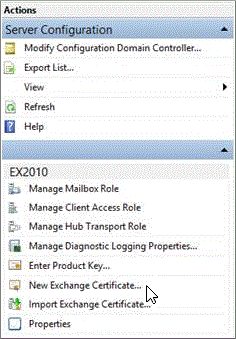
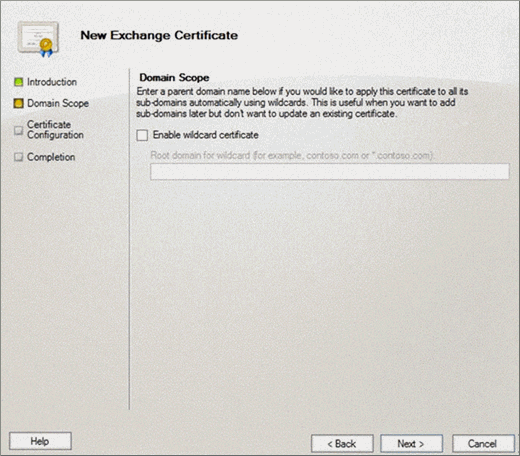
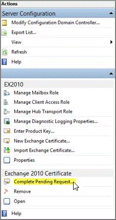

# Add an SSL certificate to Exchange 2010

Some services, such as Outlook Anywhere, Cutover migration to Office 365, and Exchange ActiveSync, require certificates to be configured on your Exchange 2010 server. This article shows you how to configure an SSL certificate from a third-party certificate authority (CA).

## What permissions do you need?

In order to add certificates, you need to be assigned the [Organization Management]( https://go.microsoft.com/fwlink/p/?LinkId=615558) role group on the Exchange 2010.

## Tasks for adding an SSL certificate

Adding an SSL certificate to Exchange 2010 is a three step process.

1. Create a certificate request

2. Submit the request to certificate authority

3. Import the certificate

## Create a certificate request

 **To create a certificate request**

1. Open the Exchange Management Console (EMC).

2. Select the server to which you want to add the certificate.

3. In the **Actions** pane, choose **New Exchange Certificate**.

    

4. In the **New Exchange certificate** wizard, specify a name for this certificate, and then choose **Next**.

5. In the Domain Scope page, specify the root domain for all subdomains in the **Root domain** field. If you want to request a wildcard, select **Enable wildcard certificate**. If you don't want to request a wildcard certificate, you will specify each domain you want to add to the certificate on the next page. Choose **Next**.

    

6. On the **Exchange Configuration** page for each service in the list shown, verify that the external or internal server names that users will use to connect to the Exchange server are correct. For example:

  - If you configured your internal and external URLs to be the same, Outlook Web App (when accessed from the internet) and Outlook Web App (when accessed from the intranet) should show owa.contoso.com. Offline Address Book (OAB) (when accessed from the internet) and OAB (when accessed from the intranet) should show mail.contoso.com.

  - If you configured the internal URLs to be internal.contoso.com, Outlook Web App (when accessed from the internet) should show owa.contoso.com, and Outlook Web App (when accessed from the intranet) should show internal.contoso.com.

7. These domains will be used to create the SSL certificate request. Choose **Next**.

8. On the **Certificate Domains** page, add any additional domains you want included on the SSL certificate.

    Select the domain that you want to be the common name for the certificate \> **Set as common name**. For example, contoso.com. Choose **Next**.

9. On the **Organization and Location** page, provide information about your organization. This information will be included with the SSL certificate.

    Specify the network location where you want this certificate request to be saved. Choose **Next**.

10. On the **Certificate Configuration** page, review the summary information, choose **New** to create the certificate, and then choose **Finish** on the **Completion** page.

## Submit the request to certificate authority

After you've saved the certificate request, submit the request to your certificate authority (CA). This can be an internal CA or a third-party CA, depending on your organization. Clients that connect to the Client Access server must trust the CA that you use. You can search the CA website for the specific steps for submitting your request.

## Import the certificate

After you receive the certificate from the CA, complete the following steps.

 **To import the certificate request**

1. Open the EMC.

2. Select the server to which you want to import the certificate.

3. In the **Exchange Certificates** pane, select the request you created earlier, and in the **Actions** pane, choose **Complete Pending Request**.

    

4. On the **Complete Pending Request** page, specify the path to the SSL certificate file you received from your CA \> **Complete**.

5. On the **Completion** page, choose **Finish**.

6. To assign services to this certificate, on the EMC, select the Exchange server, and then select the certificate in the **Exchange Certificates** tab.

    In the **Actions** pane, choose **Assign Services to Certificate**.

7. On the **Select Servers** page of the **Assign Services to Certificate** wizard, select the name of the server to which you're adding the certificate \> **Next**.

8. On the **Select Services** page, select the services you want to assign to this certificate. At a minimum, you should select SMTP and IIS. Choose **Next**.

9. On the **Assign Services** page, choose **Assign**.

    If you receive the warning **Overwrite the existing default SMTP certificate?**, choose **Yes** \> **Finish**.

