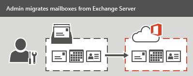
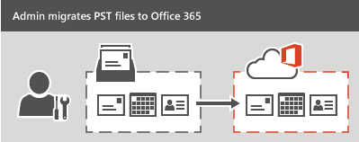
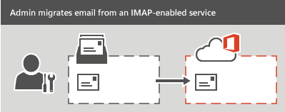
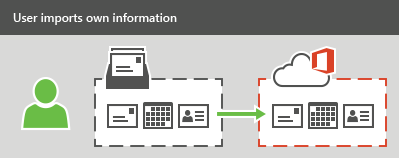
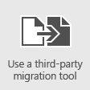

# Ways to migrate multiple email accounts to Office 365

Your organization can migrate email to Office 365 from other systems. Your administrators can [Migrate mailboxes from Exchange Server](mailbox-migration.md#StagedorCutover) or [Migrate email from another IMAP-enabled email system](mailbox-migration.md#IMAP). And your users can [Have users import their own email](mailbox-migration.md#Import) their own email, contacts, and other mailbox information to an Office 365 mailbox created for them. Your organization also can [Work with a partner to migrate email](mailbox-migration.md#Partner) to migrate email.

Before you start an email migration, review [limits](https://go.microsoft.com/fwlink/p/?LinkID=328224) and [best practices](https://go.microsoft.com/fwlink/p/?LinkID=392945) for Exchange Online to make sure you get the performance and behavior you expect after migration.

See [Decide on a migration path](decide-on-a-migration-path.md) or [Exchange migration advisors](https://aka.ms/office365setup) for help with choosing the best option for your organization.

> [!TIP]
> Another option available to assist you with your email migration is [FastTrack Center Benefit for Office 365](https://docs.microsoft.com/fasttrack/fasttrack-benefit-overview). FastTrack specialists can help you plan and perform your migration. For more information, see [Data Migration](https://docs.microsoft.com/fasttrack/data-migration).

You can also view an overview video:

> [!VIDEO https://www.microsoft.com/videoplayer/embed/226b533f-a08b-476f-b1ca-1c0e96b1c85b?autoplay=false]

## Migrate mailboxes from Exchange Server

For migrations from an existing on-premises Exchange Server environment, an administrator can migrate all email, calendar, and contacts from user mailboxes to Office 365.

There are three types of email migrations that can be made from an Exchange Server:

- **Migrate all mailboxes at once (cutover migration) or Express migration**

    Use this type of migration if you're running Exchange 2003, Exchange 2007, Exchange 2010, or Exchange 2013, and if there are fewer than 2000 mailboxes. You can perform a cutover migration by starting from the Exchange admin center (EAC); see [Perform a cutover migration to Office 365](cutover-migration-to-office-365.md). See [Use express migration to migrate Exchange mailboxes to Office 365](use-minimal-hybrid-to-quickly-migrate.md) to use the Express migration.

    > [!IMPORTANT]
    > With cutover migration, you can move up to 2000 mailboxes, but due to length of time it takes to create and migrate 2000 users, it is more reasonable to migrate 150 users or less.

- **Migrate mailboxes in batches (staged migration)**

    Use this type of migration if you're running Exchange 2003 or Exchange 2007, and there are more than 2,000 mailboxes. For an overview of staged migration, see [What you need to know about a staged email migration to Office 365](what-to-know-about-a-staged-migration.md). To perform the migration tasks, see [Perform a staged migration of Exchange Server 2003 and Exchange 2007 to Office 365](perform-a-staged-migration/perform-a-staged-migration.md).

- **Migrate using an integrated Exchange Server and Office 365 environment (hybrid)**

    Use this type of migration to maintain both on-premises and online mailboxes for your organization and to gradually migrate users and email to Office 365. Use this type of migration if:

  - You have Exchange 2010 and more than 150-2,000 mailboxes.

  - You have Exchange 2010 and want to migrate mailboxes in small batches over time.

  - You have Exchange 2013.

    For more information, see [Plan an Exchange Online hybrid deployment in Office 365](https://go.microsoft.com/fwlink/p/?LinkId=517633).

## Use Office 365 Import Service to migrate PST-files

If your organization has many large PST files, you can use the Office 365 Import Service to migrate email data to Office 365.

You can use the Office 365 Import Service to either upload the PST files through a network, or to mail the PST files in a drive that you prepare.

For instructions, see [Office 365 Import Service](https://go.microsoft.com/fwlink/p/?LinkId=544944).

## Migrate email from another IMAP-enabled email system

You can use the Internet Message Access Protocol (IMAP) to migrate user email from Gmail, Exchange, Outlook.com, and other email systems that support IMAP migration. When you migrate the user's email by using IMAP migration, only the items in the users' inbox or other mail folders are migrated. Contacts, calendar items, and tasks can't be migrated with IMAP, but they can be by a user.

IMAP migration also doesn't create mailboxes in Office 365. You'll have to create a mailboxfor each user before you migrate their email.

To migrate email from another mail system, see [Migrate your IMAP mailboxes to Office 365](migrating-imap-mailboxes/migrating-imap-mailboxes.md). After the email migration is done, any new mail sent to the source email isn't migrated.

## Have users import their own email

Users can import their own email, contacts, and other mailbox information to Office 365. See [Migrate email and contacts to Office 365](https://support.office.com/article/a3e3bddb-582e-4133-8670-e61b9f58627e) to learn how.

## Work with a partner to migrate email

If none of the types of migrations described will work for your organization, consider working with a partner to migrate email to Office 365.

|**Method**|**Description**|
|:-----|:-----|
||**Use a third-party email migration tool**   Migration tools can help speed up and simplify email migration. You'll find a list of tools in the [Office 365 Marketplace](https://go.microsoft.com/fwlink/p/?LinkId=785068).|
||**Hire a partner to help migrate your email**   You'll find a list of partners in the [Office 365 Marketplace](https://go.microsoft.com/fwlink/p/?LinkId=620000).|

## Related Topics

[Use PowerShell for email migration to Office 365](https://go.microsoft.com/fwlink/p/?LinkId=615247)

