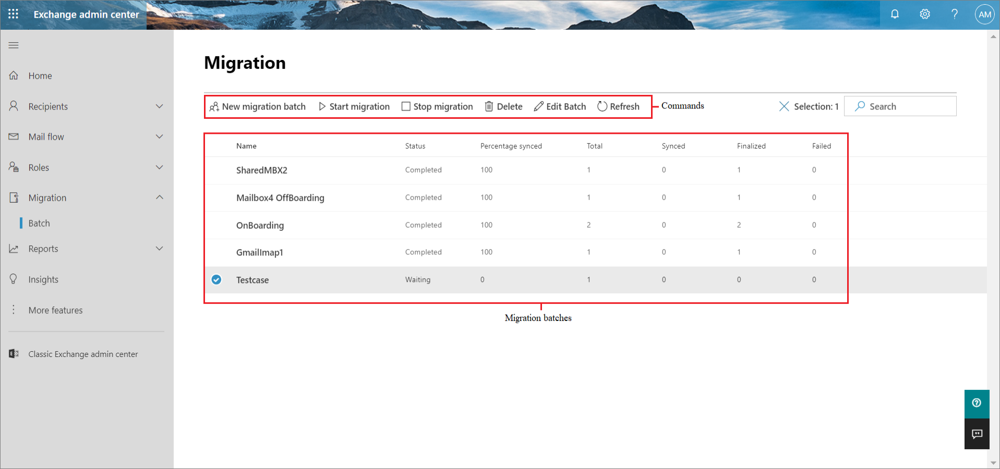
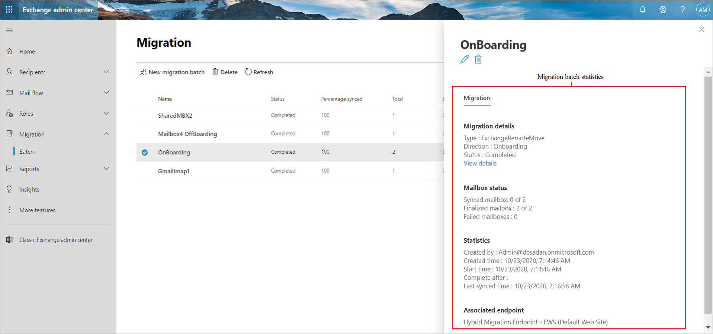
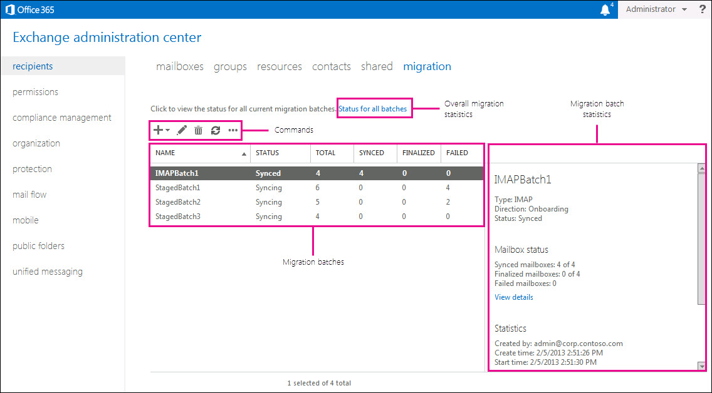

# Manage migration batches

You can use the Migration dashboard in the Microsoft 365 or Office 365 Exchange admin center (EAC) to manage mailbox migration to Microsoft 365 or Office 365 using a cutover or staged Exchange migration. You can also use the Migration dashboard to migrate the contents of users' mailboxes from an on-premises IMAP server, or the contents of Google Workspace (formerly G Suite) users' mailboxes, calendars, and contacts to existing Microsoft 365 or Office 365 mailboxes. The Migration dashboard displays statistics about the overall migration in addition to statistics about a specific migration batch. You can create, start, stop, pause, and edit migration batches.

## The Migration dashboard for new Exchange admin center (New EAC)

To access the Migration dashboard in the new EAC, go to new [Exchange admin center](https://admin.exchange.microsoft.com/#/), navigate to **Migration** > **Batch**. The following screenshot identifies the different areas of the Migration dashboard that you can use to get migration information and manage migration batches.

### Migration batches

Migration batches that are created are listed in the migration queue. The following columns display information about each migration batch.

|**Column**|**Description**|
|:-----|:-----|
|**Name**|The name of the migration batch that was defined when it was created.|
|**Status**| The status of the migration batch. The following is a list of the different status states for migration batches, along with what you can do with migration batches in each of these states:  **Stopped**: Either the migration batch has been created but hasn't been started, or it has been stopped after running for some period of time. In this state, you can start, edit, or delete it.  **Syncing**: The migration batch has been started, and mailboxes in the migration batch are being actively migrated. When a migration batch is in this state, you can stop it.  **Stopping**: Immediately after you run [Stop-MigrationBatch](https://docs.microsoft.com/powershell/module/exchange/Stop-MigrationBatch) cmdlet.  **Starting**: Immediately after you run [Start-MigrationBatch](https://docs.microsoft.com/powershell/module/exchange/Start-MigrationBatch) cmdlet.  **Completing**: Immediately after you run [Complete-MigrationBatch](https://docs.microsoft.com/powershell/module/exchange/Complete-MigrationBatch) cmdlet.  **Removing:** Immediately after you run [Remove-MigrationBatch](https://docs.microsoft.com/powershell/module/exchange/Remove-MigrationBatch) cmdlet.  **Synced**: The migration batch has completed an initial sync of the data. A migration batch in this state may contain errors if mailboxes weren't migrated. For most types of migrations, the remote/on-premises mailboxes and the corresponding Microsoft 365 or Office 365 mailboxes are synchronized every 24 hours during incremental synchronization.  **Completed**: The migration batch is complete.  **Synced with errors**: The migration batch has completed an initial sync of the data, but some mailboxes failed migration. Mailboxes that were successfully migrated in migration batches with errors are still synchronized every 24 hours during incremental synchronization.|
|**Percentage synced**|Indicates the percentage of mailboxes that were successfully migrated in migration batches.|
|**Total**|Indicates the number of mailboxes in the migration batch.|
|**Synced**|Indicates the number of mailboxes that were successfully migrated.|
|**Finalized**|The number of mailboxes in the migration batch that have been finalized. Finalization is performed only for migration batches for remote move migrations in an Exchange hybrid deployment. For more information about the finalization process, see [Complete-MigrationBatch](https://docs.microsoft.com/powershell/module/exchange/Complete-MigrationBatch).|
|**Failed**|The number of mailboxes in the migration batch for which the migration failed. You can display information about specific mailboxes that have migration errors. For more information, see [Migration users status report](migration-users-status-report.md).|

> [!IMPORTANT]
> Migration batches with a status of **Synced** that have no administrator-initiated activity (for example, no administrator has stopped and restarted a migration batch or edited a migration batch) for the last 60 days will be stopped. All batches with **Stopped** or **Failed** status will be removed after 90 days. All batches with **Completed** status will be removed after 60 days.

The Migration dashboard contains a set of commands that you can use to manage migration batches. After you create a migration batch, you can select it, and then click one of the following commands. 

|**Command**|**Description**|
|:-----|:-----|
|**New migration batch**|Create a new migration batch. Use this command to migrate on-premises mailboxes to Microsoft 365 or Office 365 (also called onboarding) or to migrate Microsoft 365 or Office 365 mailboxes back to your on-premises Exchange organization in a hybrid deployment.|
|**Start migration**|Start a migration batch that's been created. After the batch is started, the status is changed to **Syncing**.|
|**Stop migration**|Stop the migration of mailboxes. After the batch is stopped, the status is changed to **Stopped**.|
|**Delete**|Delete a migration batch after you verify that all mailboxes in the migration batch have been successfully migrated. Verify also that mail is being routed directly to cloud-based mailboxes after you've configured your MX record to point to Microsoft 365 or Office 365. When you delete a migration batch, Microsoft 365 or Office 365 cleans up any records related to the migration batch and removes it from the list.|
|**Edit Batch**|Edit an existing migration batch. You can change the finalization semantics of batches that support finalization. You can also change the migration endpoint used for the migration batch.|
|**Resume migration**|Resume the running of a migration batch that was paused and has a status of **Stopped**. If there are errors for a migration batch, you can restart it with this command, and Microsoft 365 or Office 365 will attempt to migrate the mailboxes that failed.|
|**Refresh**|Refresh the Migration dashboard to update the information displayed for the overall migration statistics, the list of migration batches, and the statistics for the selected migration batch.|

### Migration batch statistics

The details pane in the Migration dashboard displays the following information about the selected migration batch.

|**Field**|**Description**|
|:-----|:-----|
|**Type**| Indicates the migration type of the selected migration batch. The value of this field also denotes the type of migration endpoint associated with the migration batch.  **Exchange Outlook Anywhere**: The migration batch is either a cutover Exchange migration or a staged Exchange migration.  **ExchangeRemoteMove**: The migration batch is either an onboarding or offboarding remote move migration in an Exchange hybrid deployment.  **Gmail**: The migration batch is a Google Workspace migration.|
|**Direction**| Indicates if mailboxes are being migrated to Microsoft 365 or Office 365 or to your on-premises Exchange organization.  **Onboarding**: Indicates that mailboxes are being migrated to Microsoft 365 or Office 365. Onboarding migration types are staged migrations, cutover migrations, IMAP migrations, Google Workspace migrations, and onboarding remote move migrations.  **Offboarding**: Indicates that Microsoft 365 or Office 365 mailboxes are being migrated to your on-premises Exchange organization. Offboarding remote move migrations are the only type of offboarding migration.|
|**Status**| The current state of the selected migration batch.  **Completed**  **Syncing**  **Stopped**  **Synced**  **Synced with errors**  See the previous description of each of these states.|
|**View details**|Click **View details** to display status information for each mailbox in the migration batch. For more information, see [Migration users status report](migration-users-status-report.md).|
|**Synced mailboxes**|The number of mailboxes out of the total number of mailboxes in the migration batch that have successfully completed initial synchronization. This field is updated during the migration.|
|**Finalized mailboxes**|The number of mailboxes out of the total number of mailboxes in the migration batch that have successfully been finalized. Finalization only occurs in onboarding and offboarding remote move migrations.|
|**Failed mailboxes**|The number of mailboxes that failed initial synchronization.|
|**Created by**|The email address of the Microsoft 365 or Office 365 administrator who created the migration batch.|
|**Created time**|The date and time when the migration batch was created.|
|**Start time**|The date and time when the migration batch was started.|
|**Complete after**|The date and time when the migration batch is completed.|
|**Last synced time**|The last time the migration batch was restarted or the last time that incremental synchronization was performed for the batch. As previously stated, incremental synchronization occurs every 24 hours.|
|**Associated endpoint**|The name of the migration endpoint being used by the migration batch. You can click **View details** to view the migration endpoint settings. You can also edit the settings if none of the migration batches using the endpoint are currently running.|

## The Migration dashboard for Classic Exchange admin center (Classic EAC)

To access the Migration dashboard in the Classic EAC, select **Recipients** \> **Migration**. The following screenshot identifies the different areas of the Migration dashboard that you can use to get migration information and manage migration batches.

### Overall migration statistics

Click **Status for all batches** to display the overall statistics about all migration batches that have been created. The following fields display cumulative information about all migration batches.

|**Field**|**Description**|
|:-----|:-----|
|**Total mailboxes**|The total number of mailboxes from all current migration batches.|
|**Synced mailboxes**|The number of mailboxes from all migration batches that were successfully migrated.|
|**Finalized mailboxes**|The number of mailboxes from all migration batches that have been finalized. Finalization occurs only when you use remote move migrations to migrate mailboxes between your on-premises Exchange organization and Microsoft 365 or Office 365 in an Exchange hybrid deployment. Mailboxes can be finalized after the initial synchronization is successfully completed. For more information about finalizations in remote move migrations, see [Complete-MigrationBatch](https://docs.microsoft.com/powershell/module/exchange/Complete-MigrationBatch).|
|**Failed mailboxes**|The number of mailboxes from all migration batches for which migration failed.|

### Migration batches

Migration batches that are created are listed in the migration queue. The following columns display information about each migration batch.

|**Column**|**Description**|
|:-----|:-----|
|**Name**|The name of the migration batch that was defined when it was created.|
|**Status**| The status of the migration batch. The following is a list of the different status states for migration batches, along with what you can do with migration batches in each of these states:    **Stopped**: Either the migration batch has been created but hasn't been started, or it has been stopped after running for some period of time. In this state, you can start, edit, or delete it.   **Syncing**: The migration batch has been started, and mailboxes in the migration batch are being actively migrated. When a migration batch is in this state, you can stop it.   **Stopping**: Immediately after you run [Stop-MigrationBatch](https://docs.microsoft.com/powershell/module/exchange/Stop-MigrationBatch) cmdlet.   **Starting**: Immediately after you run [Start-MigrationBatch](https://docs.microsoft.com/powershell/module/exchange/Start-MigrationBatch) cmdlet.   **Completing**: Immediately after you run [Complete-MigrationBatch](https://docs.microsoft.com/powershell/module/exchange/Complete-MigrationBatch) cmdlet.   **Removing:** Immediately after you run [Remove-MigrationBatch](https://docs.microsoft.com/powershell/module/exchange/Remove-MigrationBatch) cmdlet.   **Synced**: The migration batch has completed an initial sync of the data. A migration batch in this state may contain errors if mailboxes weren't migrated. For most types of migrations, the remote/on-premises mailboxes and the corresponding Microsoft 365 or Office 365 mailboxes are synchronized every 24 hours during incremental synchronization.   **Completed**: The migration batch is complete.   **Synced with errors**: The migration batch has completed an initial sync of the data, but some mailboxes failed migration. Mailboxes that were successfully migrated in migration batches with errors are still synchronized every 24 hours during incremental synchronization.|
|**Total**|Indicates the number of mailboxes in the migration batch.|
|**Synced**|Indicates the number of mailboxes that were successfully migrated.|
|**Finalized**|The number of mailboxes in the migration batch that have been finalized. Finalization is performed only for migration batches for remote move migrations in an Exchange hybrid deployment. For more information about the finalization process, see [Complete-MigrationBatch](https://docs.microsoft.com/powershell/module/exchange/Complete-MigrationBatch).|
|**Failed**|The number of mailboxes in the migration batch for which the migration failed. You can display information about specific mailboxes that have migration errors. For more information, see [Migration users status report](migration-users-status-report.md).|

> [!IMPORTANT]
> Migration batches with a status of **Synced** that have no administrator-initiated activity (for example, no administrator has stopped and restarted a migration batch or edited a migration batch) for the last 60 days will be stopped. All batches with **Stopped** or **Failed** status will be removed after 90 days. All batches with **Completed** status will be removed after 60 days.

The Migration dashboard contains a set of commands that you can use to manage migration batches. After you create a migration batch, you can select it, and then click one of the following commands. If a migration batch is in a status state that isn't supported by a command, the command is either dimmed or not displayed because it's unavailable.

|**Command**|**Description**|
|:-----|:-----|
|**New** |Create a new migration batch. Use this command to migrate on-premises mailboxes to Microsoft 365 or Office 365 (also called onboarding) or to migrate Microsoft 365 or Office 365 mailboxes back to your on-premises Exchange organization in a hybrid deployment.|
|**Edit** |Edit an existing migration batch. You can change the finalization semantics of batches that support finalization. You can also change the migration endpoint used for the migration batch.|
|**Start** |Start a migration batch that's been created. After the batch is started, the status is changed to **Syncing**.|
|**Resume** |Resume the running of a migration batch that was paused and has a status of **Stopped**. If there are errors for a migration batch, you can restart it with this command, and Microsoft 365 or Office 365 will attempt to migrate the mailboxes that failed.|
|**Pause** |Stop a migration batch that's currently running or that's been started but has a status of **Queued**. You can also stop a migration batch that's completed the initiation synchronization phase and has a status of **Synced**. This will stop incremental synchronizations. You can resume incremental synchronizations by selecting the migration batch and clicking **Resume**.|
|**Delete** |Delete a migration batch after you verify that all mailboxes in the migration batch have been successfully migrated. Verify also that mail is being routed directly to cloud-based mailboxes after you've configured your MX record to point to Microsoft 365 or Office 365. When you delete a migration batch, Microsoft 365 or Office 365 cleans up any records related to the migration batch and removes it from the list.|
|**More** |Click this command, and then click **Migration endpoints** to create new migration endpoints or view and edit existing migration endpoints.|
|**Refresh** |Refresh the Migration dashboard to update the information displayed for the overall migration statistics, the list of migration batches, and the statistics for the selected migration batch.|

### Migration batch statistics

The details pane in the Migration dashboard displays the following information about the selected migration batch.

|**Field**|**Description**|
|:-----|:-----|
|**Type**| Indicates the migration type of the selected migration batch. The value of this field also denotes the type of migration endpoint associated with the migration batch.   **Exchange Outlook Anywhere**: The migration batch is either a cutover Exchange migration or a staged Exchange migration.   **IMAP**: The migration batch is an IMAP migration.   **Remote move migration**: The migration batch is either an onboarding or offboarding remote move migration in an Exchange hybrid deployment.   **Gmail**: The migration batch is a Google Workspace migration.|
|**Direction**| Indicates if mailboxes are being migrated to Microsoft 365 or Office 365 or to your on-premises Exchange organization.   **Onboarding**: Indicates that mailboxes are being migrated to Microsoft 365 or Office 365. Onboarding migration types are staged migrations, cutover migrations, IMAP migrations, Google Workspace migrations, and onboarding remote move migrations.   **Offboarding**: Indicates that Microsoft 365 or Office 365 mailboxes are being migrated to your on-premises Exchange organization. Offboarding remote move migrations are the only type of offboarding migration.|
|**Status**| The current state of the selected migration batch.   **Completed**   **Syncing**   **Stopped**   **Synced**   **Synced with errors**    See the previous description of each of these states.|
|**Requested**|The number of mailboxes to be migrated in the migration batch. This number corresponds to the number of rows in the migration CSV file for IMAP, Google Workspace, staged, or remote move migrations, or the number of on-premises mailboxes in a cutover Exchange migration.|
|**Synced mailboxes**|The number of mailboxes out of the total number of mailboxes in the migration batch that have successfully completed initial synchronization. This field is updated during the migration.|
|**Finalized**|The number of mailboxes out of the total number of mailboxes in the migration batch that have successfully been finalized. Finalization only occurs in onboarding and offboarding remote move migrations.|
|**Failed mailboxes**|The number of mailboxes that failed initial synchronization.|
|**View details**|Click **View details** to display status information for each mailbox in the migration batch. For more information, see [Migration users status report](migration-users-status-report.md).|
|**Created by**|The email address of the Microsoft 365 or Office 365 administrator who created the migration batch.|
|**Create time**|The date and time when the migration batch was created.|
|**Start time**|The date and time when the migration batch was started.|
|**Initial sync time**|The date and time when the migration batch completed initial synchronization.|
|**Initial sync duration**|The amount of time it took to complete the initial synchronization for all mailboxes in the migration batch.|
|**Last sync time**|The last time the migration batch was restarted or the last time that incremental synchronization was performed for the batch. As previously stated, incremental synchronization occurs every 24 hours.|
|**Associated endpoint**|The name of the migration endpoint being used by the migration batch. You can click **View details** to view the migration endpoint settings. You can also edit the settings if none of the migration batches using the endpoint are currently running.|
