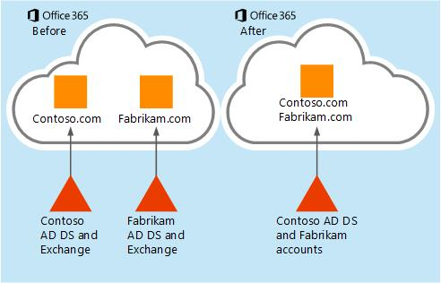
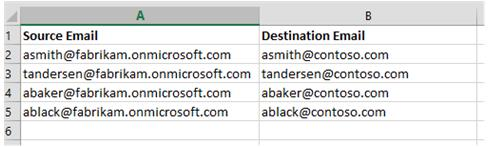

# How to migrate mailboxes from one Office 365 tenant to another 

This article explains how to migrate mailboxes and service settings from one Office 365 tenant to another Office 365 tenant in a business-merger scenario. If you have more than 500 users to migrate or a large amount of SharePoint data to migrate, it's a good idea to work with an [Office 365 partner](https://go.microsoft.com/fwlink/p/?LinkId=393485).

The scenario in this article is based on two fictional companies - Contoso.com and Fabrikam.com - using two separate Office 365 tenants. Contoso has purchased Fabrikam and is moving the Fabrikam users and data to the contoso.com Office 365 tenant.

||**Tenant 1 (Target)**|**Tenant 2 (Source)**|
|:-----|:-----|:-----|
|**Custom email domain:**|contoso.com|fabrikam.com|
|**Office 365 initial domain:**|contoso.onmicrosoft.com|fabrikam.onmicrosoft.com|

## Scenario: Migrate using a third party migration tool

This scenario assumes that user, group and other objects from the Fabrikam Company will be manually created in Office 365, imported into the portal via script, or merged into the Contoso Active Directory through Active Directory Domain Services (AD DS) consolidation.

When complete, all Fabrikam accounts will exist in the Contoso.com Office 365 tenant, and will all use @fabrikam.com for the UPN. The final addressing scheme was chosen for simplicity and brevity but can of course be modified to meet your requirements.



### Planning: Two weeks before you migrate

If using a third party migration tool to migrate your users, purchase the needed licenses for your migration.

 **Client considerations**

For Outlook 2010 or above, you only need to [remove the Outlook user profile](https://support.office.com/en-us/article/remove-a-profile-d5f0f365-c10d-4a97-aa74-3b38e40e7cdd) and [create it again](https://support.office.com/en-us/article/create-an-outlook-profile-f544c1ba-3352-4b3b-be0b-8d42a540459d).

For Outlook 2007 and Outlook 2010, when you are restarting the client, auto-discover will configure the client and rebuild the .OST file.

For the skype for business client, once migration is complete, since the process creates a new profile, you will need to [add contacts](https://support.office.com/en-us/article/video-add-a-contact-in-skype-for-business-3f102f2f-4bfc-4d67-a8e2-66aee1e7c0da).


 **Tenant preparation and licensing**

The source tenant is the Fabrikam Office 365 tenant from which you are migrating users and data. The target tenant is the Contoso Office 365 tenant to which you are migrating.

1. Increase licenses in Target Office 365 tenant to accommodate all mailboxes that will be migrated from the source tenant.

2. Create Administrator accounts in source and target tenants for use in migrating from Office 365 to another Office 365. Some migration tools may require more than one admin account in the source tenant to optimize the data throughput.
   

 **Room, resource, distribution group, and user object creation in the target tenant**

To create the resources in the target (Contoso) tenant:

1. If the [Azure AD Connect](https://go.microsoft.com/fwlink/p/?LinkId=626003) tool will be used to sync all objects from the Contoso Active Directory Domain Services (AD DS), the objects from the source (Fabrikam) tenant AD DS must be created in the target tenant (Contoso) AD DS through consolidation.

  1. AD DS consolidation can be done using various AD DS tools. Consolidation can take extra time and planning depending on how many objects are being moved, so it can be completed ahead of the migration project.

  2. Verify that all new users and groups are synced to the Contoso.com target tenant via directory synchronization. The objects should appear as user@contoso.onmicrosoft.com in the new tenant since the Fabrikam domain has not been moved over at this time. The primary email address for the users and groups can be updated to @fabrikam.com after the domain move is complete.

2. If directory synchronization will not be used, or if any Rooms, Resources, Groups or Users are managed in the Office 365 admin center of the source tenant; these objects must be created in the target tenant. Objects can be created manually in the Office 365 admin center or for larger numbers import a CSV file by using the bulk add feature in the Office 365 admin center, or by using Windows PowerShell.

 **End-user communications**

To communicate the migration to the end users in your organization:

1. Create a communication plan and begin to notify users of the upcoming migration and service changes.

2. After migration, the nickname cache will have to be cleared on all Outlook clients. See [How to reset the nickname and the automatic completion caches in Outlook](https://go.microsoft.com/fwlink/p/?LinkId=393486) for an automated fix-it-tool that can be run by the end users.

3. Make users aware of how to connect to Outlook Web App with their new sign on information in case they have a problem after migration.

### Preparation and pre-migration activities: Three days before you migrate

 **Domain preparation**

To prepare the domain for migration, complete the following steps.

1. Begin domain verification process on target (Contoso) tenant for the Fabrikam.com email domain.

2. In the contoso.com Office 365 admin center, add the Fabrikam.com domain and create TXT records in Domain Name Systems (DNS) for verification.

    > [!NOTE]
    > The verification will fail because the domain is still in use in the other tenant.

    Performing this step now will allow the DNS record time to propagate as it can take up to 72 hours. Final validation will occur later in the process.

 **Migration scheduling**

To schedule the migration:

1. Create master list of user mailboxes you want to migrate.

2. Create mailbox mapping .CSV file for the third-party migration tool you are using. This mapping file will be used by the migration tool to match the source mailbox with the target tenant mailbox when migration occurs. *We recommend that you use the \*.onmicrosoft.com 'initial' domain for mapping the source accounts since the custom email domain will be constantly changing*.



 **Mail exchanger record (MX record) time to live (TTL) test**

Next, you'll schedule the TTL test.

1. In DNS, change the TTL value on the MX record for the primary email domain you wish to transfer to a small number (i.e. 5 minutes). If the TTL cannot be lowered to 5 minutes, make note of the lowest value. Example, if the lowest value is 4 hours, the MX record will have to be changed 4 hours before your migration begins.

2. [Mx Lookup](https://go.microsoft.com/fwlink/p/?LinkId=393487) can be used to verify MX and DNS changes.

 **Disable directory sync in source tenant**

In the source tenant Office 365 admin center, disable directory sync. This process can take 24 hours or more so it must be done ahead of the migration. Once disabled in the portal, any changes to the source tenant AD DS will no longer sync to the Office 365 tenant. Adjust your existing user and group provisioning process accordingly.

### Migration: The day you migrate

These are the steps you'll need the day you perform the migration.

 **MX record change - Stop inbound mail flow**

Change your primary MX record from Office 365 to domain that is not reachable, i.e. "unreachable.example.com". Internet mail servers attempting to deliver new mail will queue the mail and attempt redelivery for 24 hours. Using this method, some email may return a non-delivery report (NDR) depending on the server attempting to deliver the email. If this is a problem use an MX record backup service. There are many third party services that will queue your email for days or weeks. Once your migration is complete, these services will deliver the queued mail to your new Office 365 tenant.

> [!TIP]
> If your TTL is short, for example, five minutes, this step can be done at the end of the work day to cause less disruption. If you have a larger TTL, you must change the MX record ahead of time to allow the TTL to expire. Example, a four hour TTL must be changed before 2 PM if you plan to begin migrations at 6 PM.

Verify your MX and DNS changes if necessary. Nslookup or a service like [MxToolbox](https://go.microsoft.com/fwlink/p/?LinkId=393487) can be used to verify MX and DNS changes.

 **Source tenant preparation**

The primary email domain, fabrikam.com, must be removed from all objects in the source tenant before the domain can be moved to the target tenant.

1. If you had also set up your domain with a SharePoint Online public website, then before you can remove the domain, you first have to set the website's URL back to the initial domain.

2. Remove all Lync licenses from the users in the source tenant using Lync admin portal. This will remove the Lync Sip address connected to Fabrikam.com.

3. Reset default email addresses on Office 365 source mailboxes to the initial domain (fabrikam.onmicrosoft.com).

4. Reset default email addresses on all Distribution Lists, Rooms and Resources to the initial domain (fabrikam.onmicrosoft.com) in source tenant.

5. Remove all secondary email (proxy addresses) from user objects that are still using @fabrikam.com.

6. Set default domain in source tenant to fabrikam.onmicrosoft.com routing domain (in the admin portal, click your company name in the upper right corner).

7. Use Windows PowerShell command Get-MsolUser -DomainName Fabrikam.com to retrieve a list of all objects that are still using the domain and blocking removal.

8. For common domain removal issues, see [You get an error message when you try to remove a domain from Office 365](https://go.microsoft.com/fwlink/p/?LinkId=393489).

 **Target tenant preparation**

Complete the verification of the Fabrikam.com domain in the contoso.com tenant. You may have to wait one hour after removing the domain from the old tenant.

1. Configure auto-discover CNAME (internal/External) optional.

2. If you are using AD FS, configure the new domain in target tenant for AD FS.

3. Begin mailbox activation in the contoso.com tenant \> Assign licenses to all of the new user accounts.

4. Set the Fabrikam.com email domain as the primary address on the new users. This can be done by selecting/editing multiple unlicensed users in the portal or by using Windows PowerShell.

5. If you are not using the password hash sync feature, pass-through authentication or AD FS, set password on all mailboxes in the target (Contoso) tenant. If you are not using a common password, notify users of the new password.

6. Once mailboxes are licensed and active, transition the mail routing. Point the Fabrikam MX record to Office 365 target (Contoso) tenant. When the MX TTL expires, mail will begin to flow into the new empty mailboxes. If you are using an MX backup service, you can release the email to the new mailboxes.

7. Perform verification testing of mail flow to/from new mailboxes in the target tenant.

8. If you are using Exchange Online Protection (EOP): In the target tenant recreate mail flow rules (also known as transport rules), connectors, white/black lists etc. from source tenant.

 **Begin migration**

To minimize downtime and user inconvenience, determine the best method for migration.

- Migration for 500 users or less: Migrate Mail Calendar and contact data to target tenant mailboxes. Limit mail migration by date if possible; for example, the last 6 months of data.

- Migration for more than 500 users: Use a multi-pass approach where you migrate contacts, calendars and only 1 week of email for all users, then on succeeding days or weeks, do multiple passes to fill in the mailboxes with older email data.

Start your mail migration via the third party migration tool.

1. Monitor migration progress with the tools provided by the vendor. Send out periodic progress reports during migration to management and migration team.

2. Do second or third pass migrations, optional after all migrations are complete.

At the end of migration, Outlook 2007 and 2010 will sync the entire mailbox for each user, consuming considerable bandwidth depending on how much data you migrated into each mailbox. Outlook 2013 will only cache 12 months of data by default. This setting can be configured to more or less data, for example, only 3 months of data, which can lighten bandwidth usage.

 **Post migration: Cleanup**

User may receive NDRs when replying to migrated email messages. The Outlook nickname cache needs to be cleared. See [How to reset the nickname and the automatic completion caches in Outlook](https://go.microsoft.com/fwlink/p/?LinkId=393486). Alternatively, add the old legacy DN as an x.500 proxy address to all users.

## Sample Windows PowerShell scripts

Use the following sample Windows PowerShell scripts as a starting point for creating your own scripts.

 **Office 365 bulk password reset**

1. Create a CSV file named password.csv.

2. Insert "upn" and "newpassword" columns in this file (Example: johnsmith@contoso.com,Password1)

3. Use the Windows PowerShell command:

  ```Powershell
  Import-Csv password.csv|%{Set-MsolUserPassword -userPrincipalName $_.upn -NewPassword $_.newpassword -ForceChangePassword $false}
  ```

### Copy all Office 365 accounts with a specific proxy address into a CSV file

```Powershell
##########################################################################
# Script: showproxies.ps1
# Copies all accounts in Office 365 that contain/don't contain a specific
# proxyaddress to a .CSV file (addresses.csv)
#
# Change the following variable to the proxy address string you want to find:
# $proxyaddr = "onmicrosoft.com"
################################################################################
$proxyaddr = "onmicrosoft.com"
# Create an object to hold the results
$addresses = @()
# Get every mailbox in the Exchange Organisation
$Mailboxes = Get-Mailbox -ResultSize Unlimited
# Loop through the mailboxes
ForEach ($mbx in $Mailboxes) {
    # Loop through every address assigned to the mailbox
    Foreach ($address in $mbx.EmailAddresses) {
       # If it contains XXX,  Record it
        if ($address.ToString().ToLower().contains($proxyaddr)) {
            # This is an email address. Add it to the list
            $obj = "" | Select-Object Alias,EmailAddress
            $obj.Alias = $mbx.Alias
            $obj.EmailAddress = $address.ToString() #.SubString(10)
            $addresses += $obj
      }
    }
}
# Export the final object to a csv in the working directory

$addresses | Export-Csv addresses.csv -NoTypeInformation
# Open the csv with the default handler
Invoke-Item addresses.csv

##### END OF SHOWPROXIES.PS1
```


### Bulk Create es in Office 365

```Powershell
################################################################################
#  Script: create-rooms.ps1
#  Description:*** RUN THIS SCRIPT FROM A WINDOWS POWERSHELL SESSION ***
#This script creates es in Office 365.
# Syntax:Create-Rooms.ps1 -inputfile "file name.csv"
#
# Dependencies: Input file should contain 3 columns: RoomName, RoomSMTPAddress, RoomCapacity
#
################################################################################
param( $inputFile )
Function Usage
{
$strScriptFileName = ($MyInvocation.ScriptName).substring(($MyInvocation.ScriptName).lastindexofany("\") + 1).ToString()
@"
NAME:
$strScriptFileName
EXAMPLE:
C:\PS> .\$strScriptFileName -inputfile `"file name.csv`"
"@
}
If (-not $inputFile) {Usage;Exit}
#Get MSO creds and initialize session
If ($cred -eq $NULL) {$Global:cred = Get-Credential}
#
If ($ExchRemoteCmdlets.AccessMode -ne "ReadWrite")
{
Write-Host
Write-Host Connecting to Office 365...
Write-Host
$NewSession = New-PSSession -ConfigurationName Microsoft.Exchange -ConnectionUri https://ps.outlook.com/powershell -Credential $cred -Authentication Basic -AllowRedirection
$Global:ExchRemoteCmdlets = Import-PSSession $NewSession
}
#Import the CSV file
$csv = Import-CSV $inputfile
#Create Rooms contained in the CSV file
$csv | foreach-object{
New-mailbox -Name $_.RoomName -room -primarysmtpaddress $_.RoomSMTPAddress -resourcecapacity $_.RoomCapacity
}
##### END OF CREATE-ROOMS.PS1
```

### Bulk remove secondary email address from mailboxes

```Powershell
##########################################################################
#      Script:  remove-proxy.ps1
#Description:*** RUN THIS SCRIPT FROM A WINDOWS POWERSHELL SESSION ***
#This script will remove a secondary email address from many users
#
# Syntax:remove-proxy.ps1 -inputfile "filename.csv"
#
# Dependencies:Input file should contain 2 columns: Username, Emailsuffix
#               Example:  Username=tim, Emailsuffix=fabrikam.com
#Script will remove the address tim@fabrikam.com from the mailbox for Tim.
#NOTE: Address must be secondary; it will not remove primary email address.
#
################################################################################
param( $inputFile )
Function Usage
{
$strScriptFileName = ($MyInvocation.ScriptName).substring(($MyInvocation.ScriptName).lastindexofany
("\") + 1).ToString()
@"
NAME:
$strScriptFileName
EXAMPLE:
C:\PS> .\$strScriptFileName -inputfile `"file name.csv`"
"@
}
If (-not $inputFile) {Usage;Exit}
#Get MSO creds and initialize session
If ($cred -eq $NULL) {$Global:cred = Get-Credential}
#
If ($ExchRemoteCmdlets.AccessMode -ne "ReadWrite")
{
Write-Host
Write-Host Connecting to Office 365...
Write-Host
$NewSession = New-PSSession -ConfigurationName Microsoft.Exchange -ConnectionUri
https://ps.outlook.com/powershell -Credential $cred -Authentication Basic -AllowRedirection
$Global:ExchRemoteCmdlets = Import-PSSession $NewSession
}
#Import the CSV file and change primary smtp address
$csv = Import-CSV $inputfile
$csv | foreach-object{
# Set variable for email address to remove
$removeaddr = $_.username + "@" + $_.emailsuffix
Write-Host ("Processing User: " + $_.UserName +" - Removing " + $removeaddr)
Set-Mailbox $_.Username -EmailAddresses @{Remove=$removeaddr}
}
##### END OF REMOVE-PROXY.PS1
```


