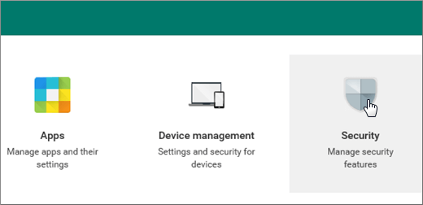
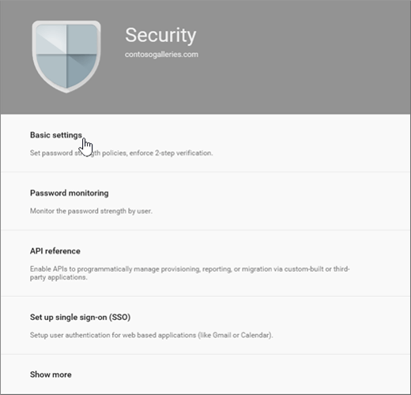
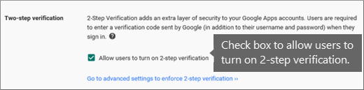

# Enable 2-step verification for your Google apps users

If you want to migrate email for your Google app users to Microsoft 365 or Office 365, the users need to create an app password that you will use together with their Google apps password to connect to their Gmail. Before they can create an app password, you will have to allow them to turn on two-step verification in the Google Admin console.

## Enable two-step verification

In order for your users to create an app password, they will have to first enable two-step verification.

 **To enable two-step verification for your Google apps domain**

1. Sign in to the Google Admin console.

2. On the console, choose **Security**.

    

3. On the **Security** page, choose **Basic settings**.

    

    And then check the check-box next to **Allow users to turn on 2-step verification**.

    

4. Your users can now turn on two-step verification and create an app password as described here: [Prepare your Gmail account for connecting to Outlook and Microsoft 365 or Office 365](prepare-gmail-or-g-suite-accounts.md).
