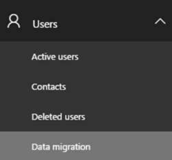
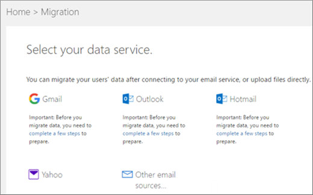
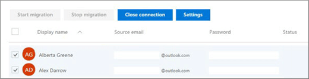
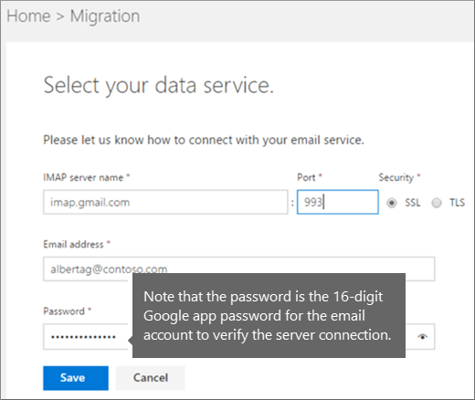
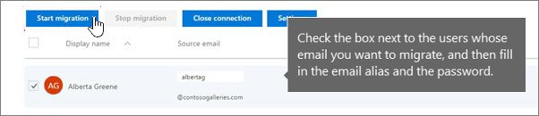

# IMAP migration in the Office 365 admin center

After you've added your users to Office 365, you can use Internet Message Access Protocol (IMAP) to migrate email for those users from their IMAP-enabled email servers.

In the Office 365 admin center, go to **Setup** \> **Data migration** to start migrating IMAP enabled emails. The email migrations page is pre-configured for migrations from Gmail, Outlook, Hotmail and Yahoo. You can also enter your own IMAP server name and connection parameters to migrate from an email service that is not listed.

> [!IMPORTANT]
> Before you can use an IMAP migration for your users, they must have been first added to your Office 365 tenant. For instructions, see [Add users to Office 365 for business](https://support.office.com/article/435ccec3-09dd-4587-9ebd-2f3cad6bc2bc.aspx).

Before you migrate, read [What you need to know about migrating your IMAP mailboxes to Office 365](migrating-imap-mailboxes.md).

To perform an IMAP migration by using the Exchange admin center (EAC), see [Migrate other types of IMAP mailboxes to Office 365](migrate-other-types-of-imap-mailboxes.md).

To migrate Exchange mail to Office 365, see [Use express migration to migrate Exchange mailboxes to Office 365](../use-minimal-hybrid-to-quickly-migrate.md)

## Migrate IMAP mailboxes to Office 365

1. Sign into the [About the Office 365 admin center](https://support.office.com/article/758befc4-0888-4009-9f14-0d147402fd23).

2. Navigate to **Setup** \> **Data migration**.

    

    **Select your data service** dashboard opens.

    

3. **Your provider is listed:**

  - Choose the email provider you are migrating from.

    > [!IMPORTANT]
    > **If you're migrating email from Gmail**, you need to ask your users to [create an app password](prepare-gmail-or-g-suite-accounts.md) you will have to use instead of their account password. **If you're migrating email from Outlook.com or Hotmail.com**, you need to ask your users to [set up two-step verification](migrating-your-outlook-com-account.md) and obtain an app password. You will use their app password instead of their account password when you establish a connection between Outlook.com or Hotmail.com and Office 365.

  - After you choose a provider, the **Select users to start migrating email messages** page will list all of your users with the source email pre-filled in.

    

    **Your provider is not listed:**

1. Choose **Other email sources**:

2. On the **Select your data service** page, fill in the appropriate [IMAP connection data](setting-up-your-imap-server-connection.md) to test the connection. You can use any account for this.

    The example below is for a Google apps domain called contoso.com, and therefore the IMAP server name is imap.gmail.com.

    Because the example is for Google apps, note that the password is the 16-digit app password for the email account that is entered to verify the connection to the server.

    > [!IMPORTANT]
    > If you're migrating email from Google Apps where you own the domain, you need to ask your users to [create an app password](prepare-gmail-or-g-suite-accounts.md) you will have to use instead of their account password.

3. Click **Save** to test the connection. Once the connection is verified, the **Email Migration Status** page will list all your added users with the email address that you provided.

4. **This and the following steps apply for both a listed email provider or "Other":**

    Check the box next to the users whose email you want to migrate, and then fill in the email alias, and the password (app password if you are migrating mail from Gmail or Google apps).

5. Choose **Start Migration** after you have entered the required information.

    

6. The migration status will be one of:

  - **Starting**

  - **Queued**

  - **Syncing**

  - **Synced**

    When the status is **Synced** the IMAP migration will continue to synchronize with the source email periodically until you choose **Stop Migration**.

    When you're done, choose **Close Connection**. This also allows you to start a new migration if you want to migrate emails from other providers as well.

7. If you are migrating from Google apps where you own the domain, you need to go [Create DNS records at Google Domains for Office 365](https://support.office.com/article/0db29490-2612-48bc-9b77-1862e7a41a8c) after you have completed email migration so that the mail will be sent to Office 365 mailboxes instead of Google apps. If you are migrating from another IMAP provider where you own the domain, [check these instructions](https://support.office.com/article/b0f3fdca-8a80-4e8e-9ef3-61e8a2a9ab23.aspx) to find your domain provider.

    If you have migrated as a part of the setup experience, you can return to the setup. The setup steps will guide you through updating the DNS records.

## Related Topics

[Prepare your Gmail or Google Apps account for connecting to Outlook and Office 365](prepare-gmail-or-g-suite-accounts.md)

[Prepare your Outlook.com or Hotmail.com account for IMAP migration](migrating-your-outlook-com-account.md)

