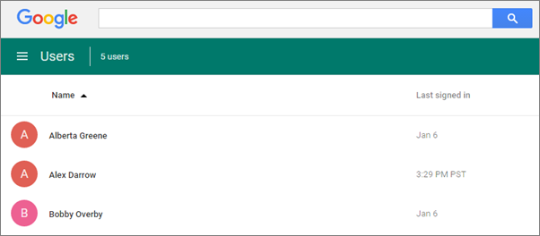
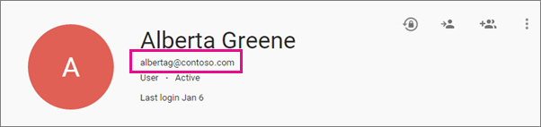
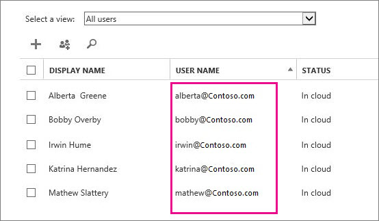
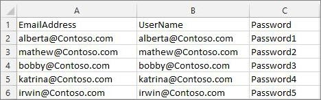
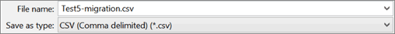
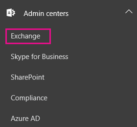
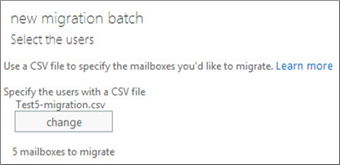
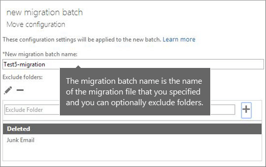
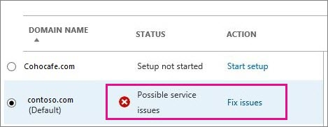

# Migrate consumer Google Workspace (formerly G Suite) mailboxes to Microsoft 365 or Office 365

> [!NOTE]
> This article explains how to migrate consumer Gmail mailboxes to Microsoft 365 or Office 365. For organizations and enterprises interested in migrating Google Workspace content, including calendar and contacts information in addition to mailbox data, see [Perform a Google Workspace migration](../perform-G-Suite-migration.md).

[Migrate your IMAP mailboxes to Microsoft 365 or Office 365](migrating-imap-mailboxes.md) gives you an overview of the migration process. Read it first and when you're familiar with the contents of that article, return to this topic to learn how to migrate mailboxes from Google Workspace Gmail to Microsoft 365 or Office 365. You must be a global admin in Microsoft 365 or Office 365 to complete IMAP migration steps.

Looking for Windows PowerShell commands? See [User PowerShell to perform an IMAP migration to Microsoft 365 or Office 365](https://docs.microsoft.com/office365/enterprise/powershell/use-powershell-to-perform-an-imap-migration-to-office-365).

Want to migrate other types of IMAP mailboxes? See [Migrate other types of IMAP mailboxes to Microsoft 365 or Office 365](migrate-other-types-of-imap-mailboxes.md).

## Migration from Google Workspace mailboxes using the Microsoft 365 admin center

You can use the setup wizard in the Microsoft 365 admin center for an IMAP migration. See [IMAP migration in the Microsoft 365 admin center](imap-migration-in-the-admin-center.md) for instructions.

 **IMPORTANT**: IMAP migration will only migrate emails, not calendar and contact information. Users can import their own email, contacts, and other mailbox information to Microsoft 365 or Office 365. See [Migrate email and contacts to Microsoft 365](https://docs.microsoft.com/microsoft-365/admin/setup/migrate-email-and-contacts-admin) to learn how.

Before Microsoft 365 or Office 365 can connect to Gmail or Google Workspace, all account owners must create an app password to access their account. This is because Google considers Outlook to be a less secure app and will not allow a connection to it with a password alone. For instructions, see [Prepare your Google Workspace account for connecting to Outlook and Microsoft 365 or Office 365](prepare-gmail-or-g-suite-accounts.md). You'll also need to make sure your [Google Workspace users can turn on 2-step verification](enable-2-step-verification-for-google-apps.md).

### Gmail Migration tasks

The following list contains the migration tasks given in the order in which you should complete them.

### Step 1: Verify you own your domain

In this task, you'll first verify to Microsoft 365 or Office 365 that you own the domain you used for your Google Workspace accounts.

> [!NOTE]
> Another option is to use the *your company name*.onmicrosoft.com domain that is included with your Microsoft 365 or Office 365 subscription instead of using your own custom domain. In that case, you can just add users as described in [Add users individually or in bulk](https://docs.microsoft.com/microsoft-365/admin/add-users/add-users) and omit this task. Most people, however, prefer to use their own domain.

Domain verification is a task you will go through as you set up Microsoft 365 or Office 365. During setup, the setup wizard provides you with a TXT record you will add at your domain host provider. See [Add a domain to Microsoft 365](https://docs.microsoft.com/microsoft-365/admin/setup/add-domain) for the steps to complete in Microsoft 365 admin center, and choose a domain registrar from the two following options to see how to complete add the TXT record that your DNS host provider.

- **Your current DNS host provider is Google**: If you purchased your domain from Google and they are the DNS hosting provider, follow these instructions: [Create DNS records when your domain is managed by Google (Go Daddy)](https://docs.microsoft.com/microsoft-365/admin/dns/create-dns-records-at-godaddy).

- **You purchased your domain from another domain registrar**: If you purchased your domain from a different company, we provide [instructions](https://docs.microsoft.com/microsoft-365/admin/get-help-with-domains/create-dns-records-at-any-dns-hosting-provider) for many popular domain hosting providers.

### Step 2: Add users to Microsoft 365 or Office 365

You can add your users either [one at a time](https://docs.microsoft.com/microsoft-365/admin/add-users/add-users), or [several users at a time](https://docs.microsoft.com/office365/enterprise/add-several-users-at-the-same-time). When you add users you also add licenses to them. Each user has to have a mailbox on Microsoft 365 or Office 365 before you can migrate email to it. Each user also needs a license that includes an Exchange Online plan to use his or her mailbox.

> [!IMPORTANT]
> At this point you have verified that you own the domain and created your Google Workspace users and mailboxes in Microsoft 365 or Office 365 with your custom domain. Close the wizard at this step. Do not proceed to **Set up domain**, until your Gmail mailboxes are migrated to Microsoft 365 or Office 365. You'll finish the setup steps in task 7, [Step 6: Update your DNS records to route Gmail directly to Microsoft 365 or Office 365](#step-6-update-your-dns-records-to-route-gmail-directly-to-microsoft-365-or-office-365).

### Step 3: Create a list of Gmail mailboxes to migrate

For this task, you create a migration file that contains a list of Gmail mailboxes to migrate to Microsoft 365 or Office 365. The easiest way to create the migration file is by using Excel, so we use Excel in these instructions. You can use Excel 2013, Excel 2010, or Excel 2007.

When you create the migration file, you need to know the app password of each Gmail mailbox that you want to migrate. We're assuming you don't know the user passwords, so you'll probably need to assign temporary passwords (by resetting the passwords) to all mailboxes during the migration. You must be an administrator in Google Workspace to reset passwords.

You don't have to migrate all Gmail mailboxes at once. You can do them in batches at your convenience. You can include up to 50,000 mailboxes (one row for each user) in your migration file. The file can be as large as 10 MB.

1. Sign in to [Google Workspace admin console](http://admin.google.com/) using your administrator username and password.

2. After you're signed in, choose **Users**.

    

3. Select each user to identify each user's email address. Write down the address.

    

4. Open the [Microsoft 365 admin center](https://admin.microsoft.com), and go to **Users** \> **Active users**. Keep an eye on the **Username** column. You'll use this information in a minute. Keep the Microsoft 365 admin center window open, too.

    

5. Start Excel.

6. Use the following screenshot as a template to create the migration file in Excel. Start with the headings in row 1. Make sure they match the picture exactly and don't contain spaces. The exact heading names are:

   - **EmailAddress** in cell A1.

   - **UserName** in cell B1.

   - **Password** in cell C1.

    

7. Next enter the email address, username, and app password for each mailbox you want to migrate. Enter one mailbox per row.

   - **Column A** is the email address of the Microsoft 365 or Office 365 mailbox. This is what's shown in the **username** column in **Users** \> **Active users** in the Microsoft 365 admin center.

   - **Column B** is the sign-in name for the user's Gmail mailbox (for example, alberta@contoso.com).

   - **Column C** is the app password for the user's Gmail mailbox. Creating the app password is described in [Migration from Google Workspace mailboxes using the Microsoft 365 admin center](#migration-from-google-workspace-mailboxes-using-the-microsoft-365-admin-center).

    

8. Save the file as a CSV file type, and then close Excel.

    

### Step 4: Connect Microsoft 365 or Office 365 to Gmail

To migrate Gmail mailboxes successfully, Microsoft 365 or Office 365 needs to connect and communicate with Gmail. To do this, Microsoft 365 or Office 365 uses a migration endpoint. Migration endpoint is a technical term that describes the settings that are used to create the connection so you can migrate the mailboxes. You create the migration endpoint in this task.

1. Go to the Exchange admin center.

2. In the EAC, go to **Recipients** \> **Migration** \> **More**  \> **Migration endpoints**.

    

3. Click **New**  to create a new migration endpoint.

4. On the **Select the migration endpoint type** page, choose **IMAP**.

5. On the **IMAP migration configuration** page, set **IMAP server** to imap.gmail.com and keep the default settings the same.

6. Click **Next**. The migration service uses the settings to test the connection to Gmail system. If the connection works, the **Enter general information** page opens.

7. On the **Enter general information** page, type a *Migration endpoint name*, for example, Test5-endpoint. Leave the other two boxes blank to use the default values.

    

8. Click **New** to create the migration endpoint.

### Step 5: Create a migration batch and start migrating Gmail mailboxes

You use a migration batch to migrate groups of Gmail mailboxes to Microsoft 365 or Office 365 at the same time. The batch consists of the Gmail mailboxes that you listed in the migration file in the previous [Step 4: Connect Microsoft 365 or Office 365 to Gmail](#step-4-connect-microsoft-365-or-office-365-to-gmail).

> [!TIP]
> It's a good idea to create a test migration batch with a small number of mailboxes to first test the process. > Use migration files with the same number of rows, and run the batches at similar times during the day. Then compare the total running time for each test batch. This helps you estimate how long it could take to migrate all your mailboxes, how large each migration batch should be, and how many simultaneous connections to the source email system you should use to balance migration speed and internet bandwidth.

1. In the Microsoft 365 admin center, navigate to **Admin centers** \> **Exchange**.

    

2. In the Exchange admin center, go to **Recipients** \> **Migration**.

3. Click **New**  \> **Migrate to Exchange Online**.

    

4. Choose **IMAP migration** \> **Next**.

5. On the **Select the users** page, click **Browse** to specify the migration file you created. After you select your migration file, Microsoft 365 or Office 365 checks it to make sure:

   - It isn't empty.

   - It uses comma-separated formatting.

   - It doesn't contain more than 50,000 rows.

   - It includes the required attributes in the header row.

   - It contains rows with the same number of columns as the header row.

    If any one of these checks fails, you'll get an error that describes the reason for the failure. If you get an error, you must fix the migration file and resubmit it to create a migration batch.

6. After Microsoft 365 or Office 365 validates the migration file, it displays the number of users listed in the file as the number of Gmail mailboxes to migrate.

    

7. Click **Next**.

8. On the **Set the migration endpoint** page, select the migration endpoint that you created in the previous step, and click **Next**.

9. On the **IMAP migration configuration** page, accept the default values, and click **Next**.

10. On the **Move configuration** page, type the *name* (no spaces or special characters) of the migration batch in the box (for example, Test5-migration). The default migration batch name that's displayed is the name of the migration file that you specified. The migration batch name is displayed in the list on the migration dashboard after you create the migration batch.

    You can also enter the names of the folders you want to exclude from migration. For example, Shared, Junk Email, and Deleted. Click **Add**  to add them to the excluded list. You can also click **Edit**  to change a folder name and **Delete**  to delete the folder name.

    

11. Click **Next**

12. On the **Start the batch** page, do the following:

    - Choose **Browse** to send a copy of the migration reports to other users. By default, migration reports are emailed to you. You can also access the migration reports from the properties page of the migration batch.

    - Choose **Automatically start the batch** \> **new**. The migration starts immediately with the status **Syncing**.

    

> [!NOTE]
> If you have large user mailboxes and the status shows **Syncing** for a long time, you may be experiencing bandwidth limits set by Google. For more information, see [Bandwidth limits](https://support.google.com/a/answer/1071518) and [Sync limits](https://support.google.com/a/answer/2751577). You can try to unlock the Gmail user or use alternative method to migrate the users. For more information, see [Use network upload to import your organization PST files to Microsoft 365 or Office 365](https://docs.microsoft.com/office365/securitycompliance/use-network-upload-to-import-pst-files) and [Third-party tools for Microsoft 365 or Office 365 migrations](https://docs.microsoft.com/exchange/mailbox-migration/office-365-migration-best-practices#third-party-tools-for-office-365-migrations).

#### Verify that the migration worked

- In the Exchange admin center, go to **Recipients** \> **Migration**. Verify that the batch is displayed in the migration dashboard. If the migration completed successfully, the status is **Synced**.

- If this task fails, check the associated Mailbox status reports for specific errors, and double-check that your migration file has the correct Microsoft 365 or Office 365 email address in the **EmailAddress** column.

#### Verify a successful mailbox migration to Microsoft 365 or Office 365

- Ask your migrated users to complete the following tasks:

  - Go to the [Microsoft 365 or Office 365 sign-in page](https://login.microsoftonline.com) and sign in with your username and temporary password.

  - Update your password, and set your time zone. It's important that you select the correct time zone to make sure your calendar and email settings are correct.

  - When Outlook on the web (formerly known as Outlook Web App) opens, send an email message to another Microsoft 365 or Office 365 user to verify that you can send email.

  - Choose **Outlook**, and check that your email messages and folders are all there.

### Optional: Reduce email delays

Although this task is optional, doing it can help avoid delays in the receiving email in the new Microsoft 365 or Office 365 mailboxes.

When people outside of your organization send you email, their email systems don't double-check where to send that email every time. Instead, their systems save the location of your email system based on a setting in your DNS server known as a time-to-live (TTL). If you change the location of your email system before the TTL expires, the sender's email system tries to send email to the old location before figuring out that the location changed. This can result in a mail delivery delay. One way to avoid this is to lower the TTL that your DNS server gives to servers outside of your organization. This will make the other organizations refresh the location of your email system more often.

Most email systems ask for an update each hour if a short interval such as 3,600 seconds (one hour) is set. We recommend that you set the interval at least this low before you start the email migration. This setting allows all the systems that send you email enough time to process the change. Then, when you make the final switch over to Microsoft 365 or Office 365, you can change the TTL back to a longer interval.

The place to change the TTL setting is on your email system's mail exchanger record, also called an MX record. This lives in your public facing DNS. If you have more than one MX record, you need to change the value on each record to 3,600 seconds or less.

Don't worry if you skip this task. It might take longer for email to start showing up in your new Microsoft 365 or Office 365 mailboxes, but it will get there.

If you need some help configuring your DNS settings, see [Add DNS records to connect your domain](https://docs.microsoft.com/microsoft-365/admin/get-help-with-domains/create-dns-records-at-any-dns-hosting-provider).

### Step 6: Update your DNS records to route Gmail directly to Microsoft 365 or Office 365

Email systems use a DNS record called an MX record to figure out where to deliver email. During the email migration process, your MX record was pointing to your Gmail system. Now that you've completed your email migration to Microsoft 365 or Office 365, it's time to point your MX record to Microsoft 365 or Office 365. After you change your MX record following these steps, email sent to users at your custom domain is delivered to Microsoft 365 or Office 365 mailboxes

For many DNS providers, there are specific instructions to change your MX record, see [Add DNS records to connect your domain](https://docs.microsoft.com/microsoft-365/admin/get-help-with-domains/create-dns-records-at-any-dns-hosting-provider) for instructions. If your DNS provider isn't included, or if you want to get a sense of the general directions, general MX record instructions are provided as well. See [Add DNS records to connect your domain](https://docs.microsoft.com/microsoft-365/admin/get-help-with-domains/create-dns-records-at-any-dns-hosting-provider) for instructions.

1. Sign in to Microsoft 365 or Office 365 with your work or school account.

2. Choose **Setup** \> **Domains**.

3. Select your domain and then choose **Fix issues**.

    The status shows **Fix issues** because you stopped the wizard partway through so you could migrate your Gmail email to Microsoft 365 or Office 365 before switching your MX record.

    

4. For each DNS record type that you need to add, choose **What do I fix?**, and follow the instructions to add the records for Microsoft 365 or Office 365 services.

5. After you've added all the records, you'll see a message that your domain is set up correctly: **Contoso.com is set up correctly. No action is required.**

It can take up to 72 hours for the email systems of your customers and partners to recognize the changed MX record. Wait at least 72 hours before you proceed to stopping synchronization with Gmail.

### Step 7: Stop synchronization with Gmail

During the last task, you updated the MX record for your domain. Now it's time to verify that all email is being routed to Microsoft 365 or Office 365. After verification, you can delete the migration batch and stop the synchronization between Gmail and Microsoft 365 or Office 365. Before you take this step:

- Make sure that your users are using Microsoft 365 or Office 365 exclusively for email. After you delete the migration batch, email that is sent to Gmail mailboxes isn't copied to Microsoft 365 or Office 365. This means your users can't get that email, so make sure that all users are on the new system.

- Let the migration batch run for at least 72 hours before you delete it. This makes the following two things more likely:

  - Your Gmail mailboxes and Microsoft 365 or Office 365 mailboxes have synchronized at least once (they synchronize once a day).

  - The email systems of your customers and partners have recognized the changes to your MX records and are now properly sending email to your Microsoft 365 or Office 365 mailboxes.

When you delete the migration batch, the migration service cleans up any records related to the migration batch and removes it from the migration dashboard.

#### Delete a migration batch

1. In the Exchange admin center, go to **Recipients** \> **Migration**.

2. On the migration dashboard, select the batch, and then click **Delete**.

#### How do you know this worked?

- In the Exchange admin center, navigate to **Recipients** \> **Migration**. Verify that the migration batch no longer is listed on the migration dashboard.

### Step 8: Users migrate their calendar and contacts

After your migrate their email, users can import their Gmail calendar and contacts to Outlook:

- [Import contacts to Outlook](https://support.microsoft.com/office/bb796340-b58a-46c1-90c7-b549b8f3c5f8)

- [Import Google Calendar to Outlook](https://support.microsoft.com/office/098ed60c-936b-41fb-83d6-7e3786437330)

## Leave us a comment

Were these steps helpful? If so, please let us know at the bottom of this topic. If they weren't, and you're still having trouble migrating your email, tell us about it and we'll use your feedback to double-check our steps.

## Related Topics

[IMAP migration in the Microsoft 365 admin center](imap-migration-in-the-admin-center.md)

[Migrate your IMAP mailboxes to Microsoft 365 or Office 365](migrating-imap-mailboxes.md)

[Ways to migrate email to Microsoft 365 or Office 365](../mailbox-migration.md)

[Tips for optimizing IMAP migrations](optimizing-imap-migrations.md)
