# Migrate other types of IMAP mailboxes to Office 365

As part of the process of deploying Office 365, you can choose to migrate the contents of user mailboxes from an Internet Mail Access Protocol (IMAP) email service to Office 365.

Looking for Windows PowerShell commands for general IMAP migrations? See [Use PowerShell to perform an IMAP migration to Office 365](https://go.microsoft.com/fwlink/p/?LinkID=615256).

## Migration tasks for IMAP mailboxes

> [!NOTE]
> You'll have to create your users in Office 365 before you migrate their IMAP mailboxes from the source system. Each user has to have an existing Office 365 mailbox to which you import their mail to. If you use a domain with your IMAP system and also want to use it with Office 365, you will have to add it to Office 365 as an accepted domain before you create users in Office 365. For instructions, see [Add a domain to Office 365](https://support.office.com/article/6383f56d-3d09-4dcb-9b41-b5f5a5efd611). If you are using Office 365 operated by 21Vianet in China, see [Add your domain and users to Office 365 operated by 21Vianet](https://support.office.com/article/1cd4839b-d051-46b8-ab9b-bc7752024e78). To add users, see [Add users individually or in bulk to Office 365 - Admin Help](https://support.office.com/article/1970f7d6-03b5-442f-b385-5880b9c256ec), or for Office 365 operated by 21Vianet see [Add, edit, delete or restore user accounts in Office 365 operated by 21Vianet - Admin Help](https://support.office.com/article/39772f78-1df9-4b82-a3e5-f8ad41e66807).

Here are the tasks to do when you're ready to get started with migrating your IMAP mailboxes.

### Step 1: Find the full name of your current email server

Office 365 needs the name of the source email system, sometimes referred to as a server, from which you want to migrate mailboxes. There are many ways to get the name of your email system. The easiest way is by using an email client that's connected to your email system. In this task, we describe how to get the name of the system by using Outlook Web App . If your email client isn't described here, contact support for your source email system.

 **Get the name of your source email system using TE102821288**

1. In Outlook Web App, on the toolbar click **Settings**  \> **Options** \> **Mail** \> **Accounts** \> **POP and IMAP**. Below your account information, you'll see a link that says **Settings for POP and IMAP access**. Your IMAP server's name is listed under IMAP setting.

    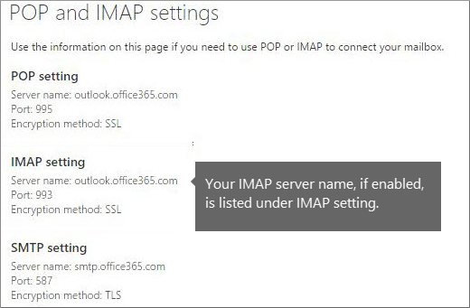

    See [Use POP or IMAP to connect to Office 365 for business or Microsoft Exchange accounts](https://support.office.com/article/44f951cc-2041-47ed-b674-506889ca9d8b.aspx) for more information on IMAP connections in Office 365.

### Step 2: Create the list of mailboxes to migrate

The steps followed to create the list of mailboxes to migrate depend on how you access the mailboxes. You need access to user mailboxes before you can migrate them to Office 365. Here are two ways in which you can gain access to the mailboxes:

- You either know the passwords to each user's mailbox, or you reset the passwords to new passwords that you do know. Follow the steps in [Create the list of user mailboxes when you know the user passwords, or you'll reset the passwords ](migrate-other-types-of-imap-mailboxes.md#KnownPassword).

- Your source email system lets you use mailbox admin credentials to access user mailboxes, which means you don't need to know the passwords or reset them. Follow the steps in [Create a list of user mailboxes using admin credentials to access them](migrate-other-types-of-imap-mailboxes.md#UseAdminCredentials) to learn how to access user mailboxes.

#### Create the list of user mailboxes when you know the user passwords, or you'll reset the passwords

For this task, you create a migration file that contains a list of mailboxes to migrate to Office 365. We use Excel in the instructions because it's the easiest way to create the migration file. You can use Excel 2013, Excel 2010, or Excel 2007.

When you create the migration file, you must know the password of each mailbox to be migrated. We're assuming you don't know user passwords, so you'll probably need to assign temporary passwords (by resetting the passwords) to all mailboxes during the migration.

You don't have to migrate all mailboxes at once. You can do them in batches at your convenience. You can include up to 50,000 mailboxes (one row for each user) in your migration file, which can be as large as 10 MB.

For more information, see [CSV files for IMAP migration batches](csv-files-for-imap-migrations.md).

1. Go to your source email system (the one you're migrating from), and navigate to the list of mailboxes you want to migrate.

    We'd give you the exact steps if we could, but there are so many different email systems out there that you need to find this out on your own. When you find the list of mailboxes, keep this window open.

2. Go to the Office 365 admin center.

3. Navigate to **Users** \> **Active users**. Keep an eye on the **username** column. You'll use this information in a minute. Keep the Office 365 admin center open, too.

    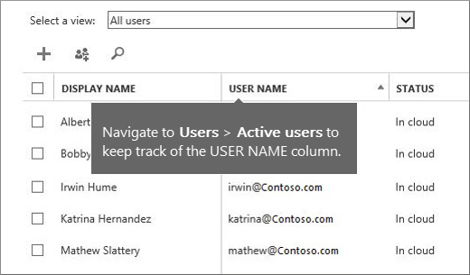

4. Start Excel.

5. Use the following screenshot as a template to create the migration file in Excel. Start with the headings in row 1. Make sure they match the picture exactly and don't contain spaces. The exact heading names are:

  - **EmailAddress** in cell A1.

  - **UserName** in cell B1.

  - **Password** in cell C1.

    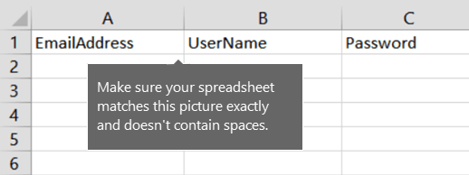

6. Next, enter the email address, username, and password for each mailbox you want to migrate. Enter one mailbox per row:

  - **Column A** is the email address of the Office 365 mailbox. This is what is shown in the **username** column under **Users** \> **Active users** in the Office 365 admin center.

  - **Column B** is the sign-in name—for example, alberta, or often, alberta@contoso.com—for the user's mailbox on the source email system.

    > [!NOTE]
    > A lot of email systems use the entire email address as the sign-in name. Note also, if you are using the same domain in Office 365 and your source email system, the columns A and B can be identical.

  - **Column C** is the password for the user's mailbox.

    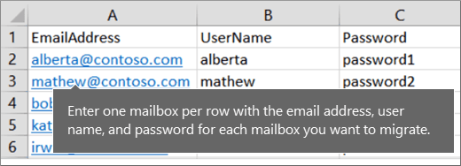

    If you don't know the users' passwords, you'll need to reset them to passwords that you do know, and then enter those passwords in the migration file. This is inconvenient for users, but there's no way around this unless your source email system supports using superuser credentials.

    If you want users to have access to the source email system, you can distribute new passwords to the source email system after the migration is finished. We'll deal with getting the new passwords distributed after the migration is finished.

7. Reset the passwords, and note the new passwords in your migration file. The exact steps will depend on your source email system. You can probably find the option to reset a password when you view the user's email account.

8. Save the file as a CSV file type, and close Excel.

    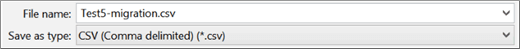

#### Create a list of user mailboxes using admin credentials to access them

For this task, you create a migration file that contains a list of mailboxes to migrate to Office 365. The easiest way to create the migration file is by using Excel, so we use Excel in these instructions. You can use Excel 2013, Excel 2010, or Excel 2007.

When you create a migration file in this task, you type your mailbox admin credentials and usernames using a special format. This allows you to access user mailboxes without knowing or resetting the user passwords. We provide the format used by Exchange, Dovecot, and Mirapoint IMAP servers. If your source email system isn't listed here and you don't know the correct format, you still have the option of resetting user passwords. Skip this task and go to [Create the list of user mailboxes when you know the user passwords, or you'll reset the passwords ](migrate-other-types-of-imap-mailboxes.md#KnownPassword).

You don't have to migrate all mailboxes at once. You can migrate them in batches at your convenience. You can include up to 50,000 mailboxes (one row for each user) in your migration file, which can be as large as 10 MB.

1. Go to your source email system (the one you're migrating from), and navigate to the list of mailboxes you want to migrate. We'd give you the exact steps if we could, but there are so many different email systems out there that you need to find out these steps on your own. When you find the list of mailboxes, keep the window open so you can refer to them.

2. Go to the Office 365 admin center.

3. Navigate to **Users** \> **Active users**. Keep an eye on the **username** column. You'll use this information in a minute. Keep the Office 365 admin center page open, too.

    

4. Start Excel.

5. Use the following screenshot as a template to create the migration file in Excel. Start with the headings in row 1. Make sure they match the screenshot exactly and don't contain spaces. The exact heading names are:

  - **EmailAddress** in cell A1.

  - **UserName** in cell B1.

  - **Password** in cell C1.

    

6. Next, enter the email address, username, and password for each mailbox you want to migrate. Enter one mailbox per row.

  - **Column A** is the email address of the user's Office 365 mailbox. This is what's shown in the **username** column under **Users** \> **Active users** in the Office 365 admin center.

  - **Column B** is the combination of the mailbox admin name and username that's specific to your source email system. See [Format mailbox admin credentials for different IMAP servers](migrate-other-types-of-imap-mailboxes.md#FormatCredentials) for formatting instructions.

  - **Column C** is the password for the mailbox admin account.

7. Save the file as a CSV file type, and then close Excel.

    

#### Format mailbox admin credentials for different IMAP servers

In the migration file, each cell in the **UserName** column consists of two combined names: the username of the person whose email is being migrated, and the username of the mailbox admin account. The supported format for mailbox admin credentials is different depending on your source email system. Here are the formats for several types of source email systems.

#### Microsoft Exchange

If you're migrating email from the IMAP implementation for Exchange, use the format **Domain/Admin_UserName/User_UserName** for the **UserName** attribute in the migration file. Let's say you're migrating email from Exchange for Alberta Greene, Bobby Overby, Irwin Hume, Katrina Hernandez, and Mathew Slattery. You have a mailbox admin account, where the username is **mailadmin** and the password is **P@ssw0rd**. Here's what your migration file would look like:

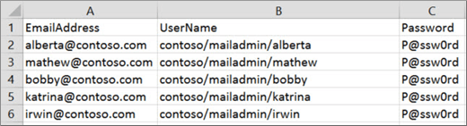

#### Dovecot

Source email systems such as a Dovecot IMAP server that support Simple Authentication and Security Layer (SASL), use the format **User_UserName\*Admin_UserName**. Let's say you're migrating email from a Dovecot IMAP server using the mailbox admin credentials **mailadmin** and **P@ssw0rd**. Here's what your migration file would look like:

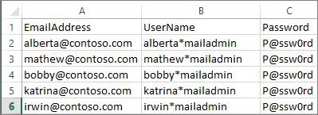

#### Mirapoint

If you're migrating email from Mirapoint Message Server, use the format **#user@domain#Admin_UserName#**. Let's say you're migrating email using the mailbox admin credentials **mailadmin** and **P@ssw0rd**. Here's what your migration file would look like:

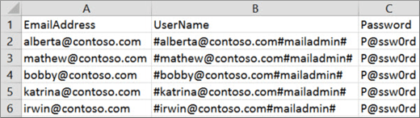

#### Courier IMAP and Oracle IMAP

Some source email systems such as Courier IMAP and Oracle IMAP don't support using mailbox admin credentials to migrate mailboxes to Office 365. Instead, you can set up your source email system to use virtual shared folders. Virtual shared folders allow you to use the mailbox admin credentials to access user mailboxes on the source email system. For more information about how to configure virtual shared folders for Courier IMAP, see [Shared Folders](https://go.microsoft.com/fwlink/p/?LinkId=398870).

To migrate mailboxes after you set up virtual shared folders on your source email system, you have to include the optional attribute **UserRoot** in the migration file. This attribute specifies the location of each user's mailbox in the virtual shared folder structure on the source email system. For example, the path to Alberta's mailbox is **/users/alberta**.

Here's an example of a migration file that contains the **UserRoot** attribute:

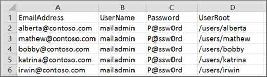

### Step 3: Connect Office 365 to your email system

To migrate email successfully, Office 365 needs to connect and communicate with the source email system. To do this, Office 365 uses a migration endpoint. This is a technical term that describes the settings that are used to create the connection. You create the migration endpoint in this task.

1. Go to the Exchange admin center.

2. In the Exchange admin center, go to **Recipients** \> **Migration** \> **More**  \> **Migration endpoints**.

    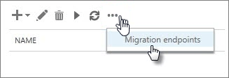

3. Click **New**  to create a new migration endpoint.

4. On the **Select the migration endpoint type** page, choose **IMAP**.

5. On the **IMAP migration configuration** page, enter the following information:

  - **\* IMAP server**: Type the *messaging server name*  (for example, imap.contoso.com) of the source email server.

  - Leave the remaining information as the default settings; these will work for most cases.

6. Click **Next**. The migration service uses the settings to test the connection to your email server. If the connection works, the **Enter general information** page appears.

7. On the **Enter general information** page, type a *Migration endpoint name*, for example, Test5-endpoint. Leave the other two boxes blank to use the default values.

    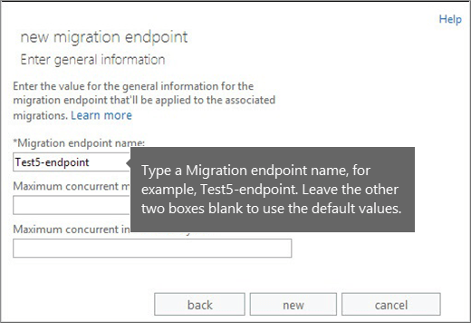

8. Click **New** to create the migration endpoint.

### Step 4: Create a migration batch and migrate your mailboxes

You use a migration batch to migrate groups of email to Office 365 mailboxes at the same time. The batch consists of the mailboxes that you listed in the migration file in the previous task.

> [!TIP]
> We recommend that you create a test migration batch with a small number of mailboxes to first test the process. > Use migration files with the same number of rows, and run the batches at similar times during the day. Then compare the total running time for each test batch. This comparison helps you estimate how long it could take to migrate all your mailboxes, how large each migration batch should be, and how many simultaneous connections to the source email system you should use to balance migration speed and internet bandwidth.

1. In the Exchange admin center, go to **Recipients** \> **Migration**.

2. Click **New**  \> **Migrate to Exchange Online**.

    

3. Choose **IMAP migration** \> **Next**.

4. On the **Select the users page**, click **Browse** to specify the migration file you created. After you select your migration file, Office 365 checks it to make sure of the following:

  - It isn't empty.

  - It uses comma-separated formatting.

  - It doesn't contain more than 50,000 rows.

  - It includes the required attributes in the header row.

  - It contains rows with the same number of columns as the header row.

    If any one of these checks fails, you'll get an error that describes the reason for the failure. If you get an error, you have to fix the migration file and resubmit it to create a migration batch.

5. After Office 365 validates the migration file, it displays the number of users listed in the file as the number of mailboxes to migrate.

    

6. Click **Next**.

7. On the **IMAP migration configuration** page, click **Next**.

8. On this page, select the migration endpoint that you created in [Step 3: Connect Office 365 to your email system](migrate-other-types-of-imap-mailboxes.md#ConnectO365).

9. On the **Move configuration** page, type the *name*  (no spaces or special characters) of the migration batch, for example, Test5-migration, and then click **Next**.

    The default migration batch name that's displayed is the name of the migration file that you specified. The migration batch name is displayed in the list on the migration dashboard after you create the migration batch.

    You can also optionally enter the names of the folders you want to exclude from migrating, for example Shared, Junk Email, and Deleted. Click **New**  to add them to the excluded list. You can also click **Edit**  to change a folder name and **Delete**  to delete a folder name.

    > [!IMPORTANT]
    > If you're migrating email from Microsoft Exchange Server, we recommend that you exclude public folders from the migration. If you don't, the contents of the public folders are copied to the Office 365 mailbox of every user in the migration file.

10. Click **Next**.

11. On the **Start the batch** page, do the following:

  - Click **Browse** to send a copy of the migration reports to other users. By default, migration reports are emailed to you. You can also access the migration reports from the properties page of the migration batch.

  - Choose **Automatically start the batch**. The migration starts as soon as you save the new migration batch. The batch status is first **Created** and changes to **Syncing** after the migration starts.

    

 **Verify that this task worked**

- In the Exchange admin center, go to **Recipients** \> **Migration**. Verify that the batch is displayed in the migration dashboard. If the migration completed successfully, the **Status** is **Synced**.

    If this step task fails, check the associated Mailbox status reports for specific errors, and double-check that your migration file has the correct Office 365 email address in the **EmailAddress** column.

 **Verify a successful mailbox migration to Office 365**

- Ask users with migrated mailboxes to complete the following tasks:

  - Sign into Office 365 with your work or school account. Use your temporary password.

  - Update your password, and set your time zone. It's important that you select the correct time zone to make sure your calendar and email settings are correct.

  - When Outlook Web App opens, send an email message to the another Office 365 user to verify that you can send email.

  - Choose **Outlook**, and check that your email messages and folders are all there.

### Optional: Reduce email delays

 **This task is optional**. You don't need to do this task, but if you skip it, it might take longer for email to start showing up in your new Office 365 mailboxes.

When people outside of your organization send you email, their email systems don't double-check where to send that email every time. Instead, their systems save the location of your email system based on a setting in your DNS server known as a time-to-live (TTL). If you change the location of your email system before the TTL expires, they'll try to send you email at the old location first before figuring out that the location changed. This can result in a mail delivery delay. One way to avoid this is to lower the TTL that your DNS server gives to servers outside of your organization. This will make the other organizations refresh the location of your email system more often.

Using a short interval, such as 3,600 seconds (one hour) or less, means that most email systems will ask for an updated location every hour. We recommend that you set the interval at least this low before you start the email migration. This allows all the systems that send you email enough time to process the change. Then, when you make the final switch over to Office 365, you can change the TTL back to a longer interval.

The place to change the TTL setting is on your email system's mail exchanger record, also called an MX record. This lives on your public facing DNS system. If you have more than one MX record, you need to change the value on each record to 3,600 or less.

Don't worry if you skip this task. It might take longer for email to start showing up in your new Office 365 mailboxes, but it will get there.

If you need some help configuring your DNS settings, head over to [Create DNS records for Office 365 when you manage your DNS records](https://support.office.com/article/b0f3fdca-8a80-4e8e-9ef3-61e8a2a9ab23.aspx). If you are using Office 365 operated by 21Vianet in China, see this version of the article instead: [Create DNS records for Office 365 when you manage your DNS records](https://support.office.com/article/0669bf14-414d-4f51-8231-6b710ce7980b).

### Step 5: Route your email directly to Office 365

Email systems use a DNS record called an MX record to figure out where to deliver emails. During the email migration process, we left your MX record pointing to your source email system. Now that the email migration to Office 365 is complete, it's time to point your MX record at Office 365. This helps ensure that email is delivered to your Office 365T mailboxes. Moving the MX record will also let you turn off your old email system when you are ready.

For many DNS providers, we have specific instructions to change your MX records, see [Create DNS records for Office 365 when you manage your DNS records](https://support.office.com/article/b0f3fdca-8a80-4e8e-9ef3-61e8a2a9ab23.aspx). If you are using Office 365 operated by 21Vianet in China, see this version of the article instead: [Create DNS records for Office 365 when you manage your DNS records](https://support.office.com/article/0669bf14-414d-4f51-8231-6b710ce7980b). If your DNS provider isn't included, or you want to get a sense of the general directions, we've provided general MX record instructions as well, see [Create DNS records at any DNS hosting provider for Office 365](https://support.office.com/article/7b7b075d-79f9-4e37-8a9e-fb60c1d95166), or for Office 365 in China, see this version of the article: [Create DNS records at any DNS hosting provider for Office 365](https://support.office.com/article/e21a9a4a-7b14-42cb-b39b-03aee92da95f).

It can take up to 72 hours for the email systems of your customers and partners to recognize the changed MX record. Wait at least 72 hours before you proceed to the next task to stop email synchronization.

### Step 6: Stop email synchronization

During the last task, you changed the MX record. Now it's time to verify that all your email is being routed to Office 365, and then you can go ahead and delete the migration batch. Doing this stops the synchronization between your source email system and Office 365. Before you do, make sure of a few things:

- Your users are using Office 365 exclusively for email. After you delete the migration batch, email that is sent to mailboxes on your source email system isn't copied to Office 365. This means your users can't get that email, so make sure that users are all on the new system.

- Let the migration batch run for at least 72 hours before you delete it. This makes the following two things much more likely:

  - Your source email system and Office 365 mailboxes were synchronized at least once (they synchronize once a day).

  - The email systems of your customers and partners have recognized the changes to your MX records and are now properly sending email to your Office 365 mailboxes.

When you delete the migration batch, the migration service cleans up any records related to the migration batch and removes it from the migration dashboard.

 **Delete a migration batch**

1. In the Exchange admin center, go to **Recipients** \> **Migration**.

2. On the migration dashboard, select the batch, and then click **Delete**.

    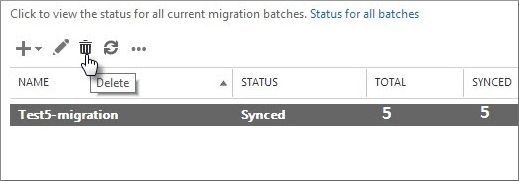

 **Confirm that the deletion worked**

- In the Exchange admin center, go to **Recipients** \> **Migration**. Verify that the migration batch is no longer listed on the migration dashboard.

## See also

[Migrate your IMAP mailboxes to Office 365](migrating-imap-mailboxes.md)

[Ways to migrate email to Office 365](../mailbox-migration.md)

[Tips for optimizing IMAP migrations](optimizing-imap-migrations.md)

