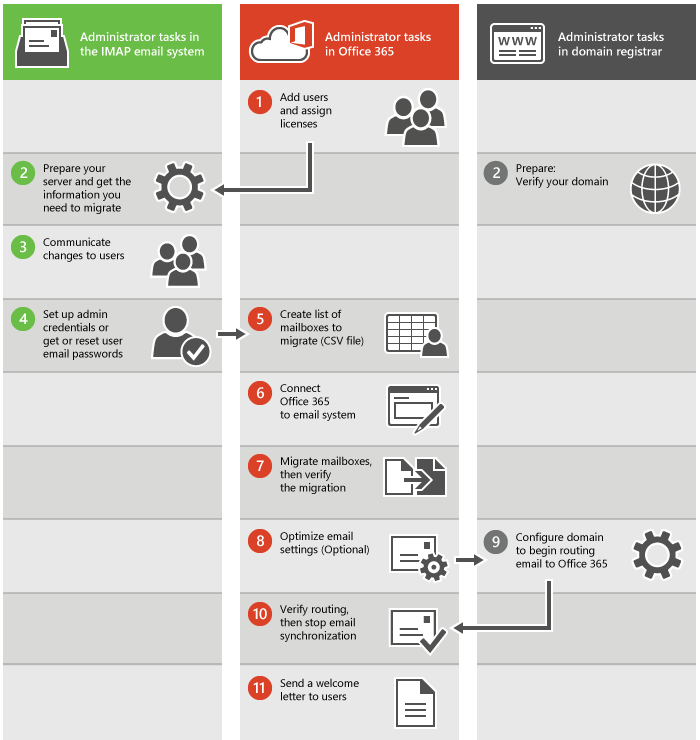

# What you need to know about migrating your IMAP mailboxes to Office 365

You can migrate the contents of user mailboxes from your source email system to Office 365. Use the Internet Message Access Protocol (IMAP) to migrate email when:

- Your source email system supports IMAP.

If this option won't work for you, see [Ways to migrate email to Office 365](../mailbox-migration.md) for other options.

For Windows PowerShell steps, see [Use PowerShell to perform an IMAP migration to Office 365](https://go.microsoft.com/fwlink/p/?LinkID=615256).

## Things to consider

Here are a few limitations to be aware of:

- You can only migrate items in a user's inbox or other mail folders. This type of migration doesn't migrate contacts, calendar items, or tasks.

- You can migrate a maximum of 500,000 items from a user's mailbox (emails are migrated from newest to oldest).

- The biggest email you can migrate is 35 MB.

- If you limited the connections to your source email system, it's a good idea to increase them to improve migration performance. Common connection limits include client/server total connections, per-user connections, and IP address connections on either the server or the firewall.

## Impact of migration to users

To migrate email, you need access to the user mailboxes in your source email system. If you know the user passwords or can access their mailboxes by using administrator credentials, there won't be any impact to users until you shut down your source email system.

If you can't access user mailboxes, you'll have to reset the passwords. This lets you access the user mailboxes by using a new password that you know. If users don't know the new passwords, they won't be able to get to their old mailboxes during or after the email migration. You can distribute the new passwords after the migration if you want users to get to their old mailboxes.

## How does IMAP migration work?

The main steps you perform for an IMAP email migration are shown in the following illustration.

These general steps apply whether you are migrating from Gmail or another IMAP system.

1. First you have to create your users in Office 365 and assign licenses to them. The mailboxes have to exist in Office 365 to use IMAP migration.

2. Prepare your IMAP source email system and get the information you need to migrate. If you plan to migrate your domain to Office 365, verify that you own your domain with your domain registrar.

    Depending on which type of email service you are migrating from, you might need to configure some settings or simply record the name of your email server or service to use later. You also need to verify your domain in your domain registry system if you have a custom domain.

3. Communicate changes to users.

    It's a good idea to let users know about the email migration and how it impacts them. Give users information about what tasks need to be done before, during, and after migration.

4. Set up admin credentials or get or reset user email passwords.

    To perform the migration, you need an administrator account that has permissions, or the username and password to each mailbox.

5.  If you are using the steps described in [Migrate Google Apps mailboxes to Office 365](migrate-g-suite-mailboxes.md) or [Migrate other types of IMAP mailboxes to Office 365](migrate-other-types-of-imap-mailboxes.md), you will create a list of mailboxes to migrate (CSV file). These migrations instructions start from the Exchange admin center, and you will need to create a CSV file that lists the email addresses, usernames, and passwords for the mailboxes you want to migrate.

    You can also use the migrations page or setup instructions in the [Admin center preview to migrate from IMAP](imap-migration-in-the-admin-center.md) systems such as Gmail, Hotmail.com or Outlook.com. These steps are the best if you plan to migrate mail for only a few users (less than 50). If you are migrating mail for more users it is easier to use a CSV file to enter all the information for the accounts.

6. Connect Office 365 to email system.

    To migrate email successfully, Office 365 needs to connect and communicate with the source email system. To do this, Office 365 uses a migration endpoint, the settings that are used to create the connection.

7. Migrate mailboxes and then verify the migration.

    To migrate mailboxes, you create a migration batch, and then start the migration. After the migration batch is run, verify that the email was migrated successfully.

8. Optimize email settings (optional).

    There are some settings you can configure so that it doesn't take as long for email to start showing up in your new Office 365 mailboxes. See [Tips for optimizing IMAP migrations](optimizing-imap-migrations.md).

9. Begin routing email to Office 365.

    You need to change a DNS record called an MX record so that your email system can start routing mail to Office 365.

10. Verify routing and then stop email synchronization.

    After you verify that all email is being routed to Office 365, you can delete the migration batch to stop the synchronization between your source email system and Office 365.

11. Send a welcome letter to users.

    Let your users know about Office 365 and how to sign in to their new mailboxes.

## Ready to start?

To finish an email migration successfully, it's a good idea to be comfortable doing these tasks:

- You create a list of mailboxes to migrate in Excel. You add your users' email addresses, usernames, and passwords to this file.

- You use step-by-step wizards in Office 365 to configure and start the migration process.

- After the mail has been migrated, you change your organization's MX record to point to Office 365 when the migration is complete. Your MX record is how other mail systems find the location of your email system. Changing your MX record allows other mail systems to begin to send email directly to the new mailboxes in Office 365. To learn how to update your MX record, see [Create DNS records at any DNS hosting provider for Office 365](https://go.microsoft.com/fwlink/p/?LinkId=397449) as well.

If you're comfortable with what's involved in migrating mailboxes to Office 365, you're ready to get started. The first step is to determine which source email system you're migrating from:

- [Gmail](migrate-g-suite-mailboxes.md)

    This procedure uses the Exchange admin center steps for an IMAP migration.

- [Some other IMAP enabled email system](migrate-other-types-of-imap-mailboxes.md)

    This procedure uses the Exchange admin center steps for an IMAP migration.

- [IMAP migration in the Admin center](imap-migration-in-the-admin-center.md)

- [Use PowerShell to perform an IMAP migration to Office 365](https://go.microsoft.com/fwlink/p/?LinkId=615256)

## See also

[Tips for optimizing IMAP migrations](optimizing-imap-migrations.md)

[Learn more about setting up your IMAP server connection](setting-up-your-imap-server-connection.md)

