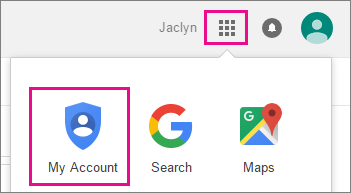
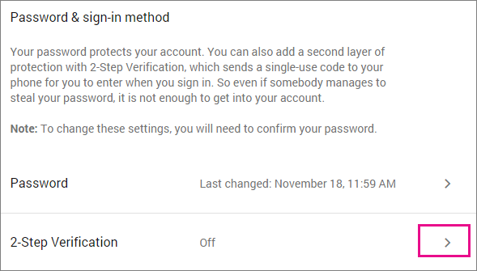
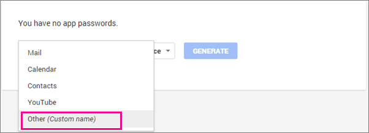
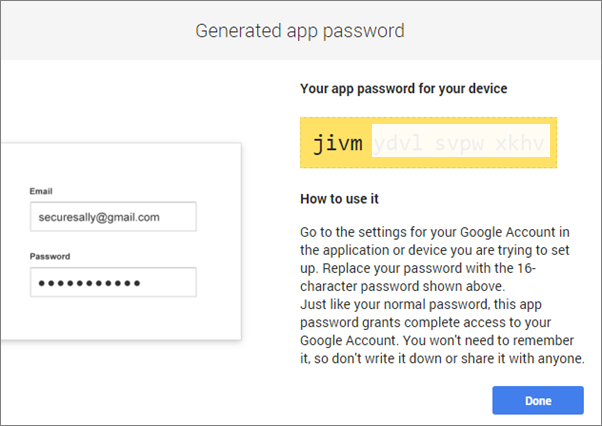
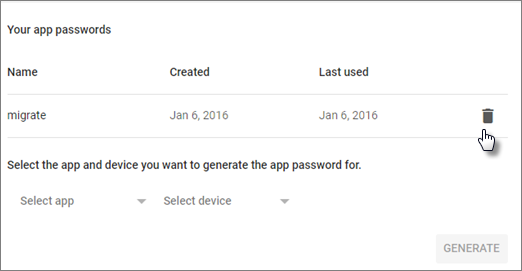

# Prepare your Gmail or G Suite account for connecting to Outlook and Office 365

Before you [connect to your Gmail](https://support.office.com/article/d7012ff0-924f-4f78-8aca-c3912d886c4d.aspx) account from Outlook on the web, or [add a Gmail](https://support.office.com/article/6e27792a-9267-4aa4-8bb6-c84ef146101b.aspx) account to Outlook, you need to prepare your Gmail account. You need to turn on 2-step verification for Gmail and then create an app password that Office 365 will use with your Gmail address to make the connection.

You will also have to do this if your admin is planning to migrate your [Gmail](https://support.office.com/article/20fdb8f2-fed8-4b14-baf0-bf04b9c44bf7.aspx) or [G Suite Gmail](migrate-g-suite-mailboxes.md) to Office 365.

## Enable IMAP for Gmail and G Suite Accounts

**Please make sure that you have enabled IMAP *before* you start the migration process.** Failure to do so will result in migration-related issues.

To enable IMAP for Gmail or G Suite Accounts:

1. Sign in to your Gmail/G Suite account using a supported browser.
2. Click the **gear icon** located at the top right of the screen.
3. In the drop-down menu that appears, click **Settings**.
4. Switch to the **Forwarding and POP/IMAP** tab.
5. Scroll down to the **IMAP access**, and make sure that **Enable IMAP** is selected.
6. Scroll to the bottom. Click **Save Changes**.

## Enable your Gmail to be connected by Office 365

To use an app password with Gmail, you have to first turn on 2-step verification, and then obtain the app password. Once you have an app password you can use that in combination with your username to connect to Gmail.

 **To turn on 2-step verification**

1. Sign in to your Gmail account

2. Select **Google apps** \> **My Account**.

    

3. On the **My Account** page choose **Sign-in &amp; security**.

4. Under the **Password &amp; sign-in method**, choose the arrow next to the **2-Step verification**, and provide your password if asked.

    

    > [!NOTE]
    > If you have a google apps account and you can't see this setting, your admin has to first turn it on. For instructions (for admin), see [Enable 2-step verification for your G Suite users](enable-2-step-verification-for-google-apps.md).

5. On the **Signing in with 2-step verification** page, choose **Start setup**.

6. Re-enter your password if asked, and in the **Set up your phone** step, enter or verify your cell phone. On the next step enter the verification number sent to your cell phone and choose **Verify**.

7. In the **Trust this computer** step choose **Next**, and in the **Turn on 2-step verification** step choose **Confirm**.

 **To create an app password**

1. Sign in to your Gmail account

2. Select **Google apps** \> **My Account**.

3. On the **My Account** page choose **Sign-in &amp; security**.

4. Under the **Password &amp; sign-in method**, choose the arrow next to the **App passwords**, and provide your password if asked.

5. On the **App passwords** page, in the **Select app** drop-down choose **Other (custom name)**.

    

6. Type in a name, for example Myconnection \> **GENERATE**.

    Note the app password under **Your app password for your device**. You can use this with your Gmail address in the app you are connecting to your Gmail account (or adding you Gmail account to). This combination grants complete access to your Gmail account by the app that is using it.

    After you have entered the app password, you do not have to remember it.

    

    > [!IMPORTANT]
    > The 16-character app password is displayed with spaces so it is easier to read. When you enter it to the app you want to connect, ignore the spaces and enter it as an unbroken string of 16 characters.

7. Now you're ready to add your Gmail account to Outlook. When you're prompted for a password, you *enter this app password for your Gmail account*. Don't enter your Gmail password. For instructions on adding your Gmail account to Outlook, see these articles:

  - [Add an email account to Outlook](https://support.office.com/article/6e27792a-9267-4aa4-8bb6-c84ef146101b)

  - [Connect email accounts in Outlook on the web (Office 365)](https://support.office.com/article/d7012ff0-924f-4f78-8aca-c3912d886c4d)

### Optionally revoke the app password

If you need the Gmail connection for a brief time only, for example for an IMAP mailbox migration that your admin is running, you can later revoke the App password.

 **To revoke the app password code**

1. Sign in to you Gmail account

2. Select **Google apps** \> **My Account**.

3. On the **My Account** page choose **Sign-in &amp; security**.

4. Under the **Password &amp; sign-in method**, choose the arrow next to the **App passwords**, and provide your password if asked.

5. On the **App passwords** page, select **REVOKE** next to the app password you want to revoke.

    

## Related Topics

[Migrate email and contacts to Office 365](https://support.office.com/article/a3e3bddb-582e-4133-8670-e61b9f58627e)

[Ways to migrate multiple email accounts to Office 365](../mailbox-migration.md)

