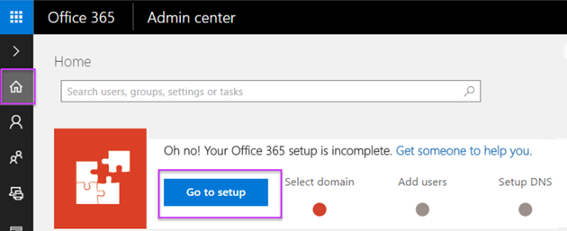
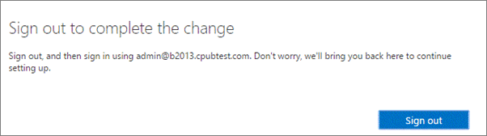
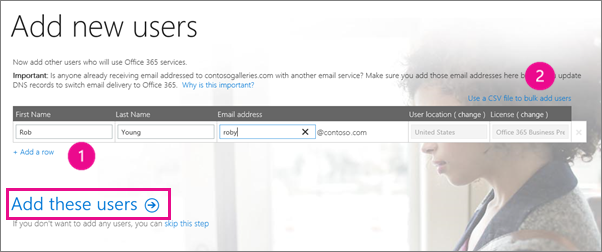

# Use the Office 365 Setup wizard to perform an IMAP migration

The advance setup wizard can run automated checks to discover how your current environment is set up and then, based on what is found, recommend a path to Office 365. If you tell Office 365 Setup wizard that your source email system uses IMAP, and you have fewer than 151 mailboxes, it recommends that you use the Office 365 Setup wizard to copy your users email to Office 365 by using IMAP migration.
  
You can also perform an IMAP migration by using the Exchange admin center (EAC). For the EAC steps, see [Migrate Google Apps mailboxes to Office 365](migrate-g-suite-mailboxes.md) or [Migrate other types of IMAP mailboxes to Office 365](migrate-other-types-of-imap-mailboxes.md).
  
## Prerequisites

To prepare for IMAP migration, make sure that a few pre-requisites are met:
  
- Your source email has to be IMAP enabled. See [Turn on POP or IMAP access to connect to another account](https://support.office.com/article/2bdac5d3-753f-4d7d-9957-94b0a06510d4.aspx) for instructions. 
    
- If you are migrating from Gmail or Google Apps, you will have to create an app password to make sure your Office 365 account can access it. See [Prepare your Gmail account for connecting to Outlook and Office 365](prepare-gmail-or-g-suite-accounts.md) for instructions. 
    
- If you are migrating from Outlook.com or Hotmail.com you will have to create an app password to make sure your Office 365 account can access it. See [Prepare your Outlook.com or Hotmail.com account for IMAP migration](migrating-your-outlook-com-account.md) for instructions. 
    
## IMAP migration tasks

[Migrate your IMAP mailboxes to Office 365](migrating-imap-mailboxes.md) gives you an overview of the IMAP migration process. Read this topic first if you want more information before you get going. 
  
Here are the tasks to complete when you're ready to get started:
  
## Step 1: Launch the setup wizard

In the Office 365 admin center **Home** page, click **Go to setup**.
  
## Step 2: Use the setup wizard to verify you own your domain

The first step is to tell Office 365 that you own the domain or domains you'll be bringing to office 365.
  
> [!NOTE]
> You'll need to repeat these steps for each domain that you own and want to use in Office 365. 
  
1. On the **Let's personalize your setup** page, choose **Yes, I need to copy data for my users** and then: 
    
  - In the **What is your current email system?** box, choose **IMAP (outlook.com, Hotmail, Gmail)**.
    
  -  In the **How many users do you have?** box, specify the number of users (less than 151). 
    
    > [!NOTE]
    > In order to use the Office 365 Setup wizard to migrate emails to Office 365, the number of users has to be less than 151. You can, however, run the Office 365 Setup wizard multiple times if you want to migrate more than 150 IMAP accounts. 
  
2. On the **What you need to know about domains and DNS** page, choose **Let's get started**.
    
    If you want to learn more about domains, view the video on the page.
    
3. On the **Which domain do you want to use?** page, type in your domain, for example, contoso.com. 
    
4. The **Add this TXT record to show you own \<your domain name\>** page lists a TXT record that is specific to you in the format "MS=ms########". Add this at your DNS host. For instructions see [Create DNS records for Office 365 when you manage your DNS records](https://support.office.com/article/b0f3fdca-8a80-4e8e-9ef3-61e8a2a9ab23.aspx).
    
    After you have added the TXT record at your DNS host, wait a few minutes, and then choose **Okay, I've added the record** to go to the next step. 
    
    
  
    > [!NOTE]
    > The TXT record is usually verified quickly, but if you receive an error, wait a while, and then click **Okay, I've added the record** again. 
  
5. On the **We've verified that you own \<your domain name\>** page, select **Next**.
    
## Step 3: Add users and copy data

In this step, the admin account will be updated to the domain you added and then you can use Office 365 Setup wizard to add users.
  
1. On the **Let's update your current Office 365 to \<your domain name\>** page, note the new administrator account's username, select it, and then choose **Update selected users** to update the administrator account to use the new domain. 
    
    On the **Sign out to complete the change** dialog box, select **Sign out** to continue. You will have to sign in by using your new username. Office 365 Setup wizard will bring you back to the setup step you were on after you sign in. 
    
    > [!NOTE]
    > If you run the Office 365 Setup wizard multiple times, you will have to add the admin account only the first time you run it. 
  

  
1. After you sign in, you will see the **Skipping add users** page. Select **Next**. 
    
2. Read the information on the **Get ready to copy data to Office 365** page and click **Next**.
    
3. On the **Add new users** page, enter a first name, last name and email alias to the table and then choose **+ Add a row** (1) to enter more users. 
    
    You can also choose **Use a CSV file to bulk add users** (2) to add many users at once. 
    
    When you are done, click **Add these users**.
    
    
  
4. On the **\<number of users\> was added successfully** page, click **Next** and follow the instructions to install the Microsoft Office apps. You might not see this page if your subscription does not include the desktop apps. 
    
    You can also skip this page and install the apps later.
    
5. On the **Copy data** page, select each user that you want to migrate the email for, and in the **Source email address** box enter the IMAP enabled account that you are copying the email from. This can be the same as the Office 365 address if the username and domain are the same, but it can also be a Gmail address, outlook.com address, etc. 
    
6. Enter the **Password** for the source email for each user, and then click **Next** to start copying emails. 
    
7. On the **Add your server connection** page, enter the IMAP server name, the **Port** number and the **Security** type and then choose **Copy** data. 
    
    For Gmail the values are:
    
  - **IMAP server**: imap.gmail.com 
    
  - **Port**: 993 
    
  - **Security**: SSL 
    
    See [Learn more about setting up your IMAP server connection](setting-up-your-imap-server-connection.md) for instructions on how to determine your IMAP server name. 
    
8. On the **Copy data in progress** page you can monitor the status of the migration. Once the migration is done, click **Next** to continue setting up your domain, as described in [Add a domain to Office 365](https://support.office.com/article/6383f56d-3d09-4dcb-9b41-b5f5a5efd611).
    
    > [!NOTE]
    > If you plan to run the Office 365 Setup wizard more than once, click the **X** on the upper-right corner to exit the wizard, and when prompted, choose **No, I want to start over**. This will allow you to rerun the wizard if you want to copy email in smaller batches. When you are done with the last batch, you can finish setting up your domain. 
  
## See also

[Migrate your IMAP mailboxes to Office 365](migrating-imap-mailboxes.md)
  
[Ways to migrate email to Office 365](../mailbox-migration.md)
  
[Tips for optimizing IMAP migrations](optimizing-imap-migrations.md)

