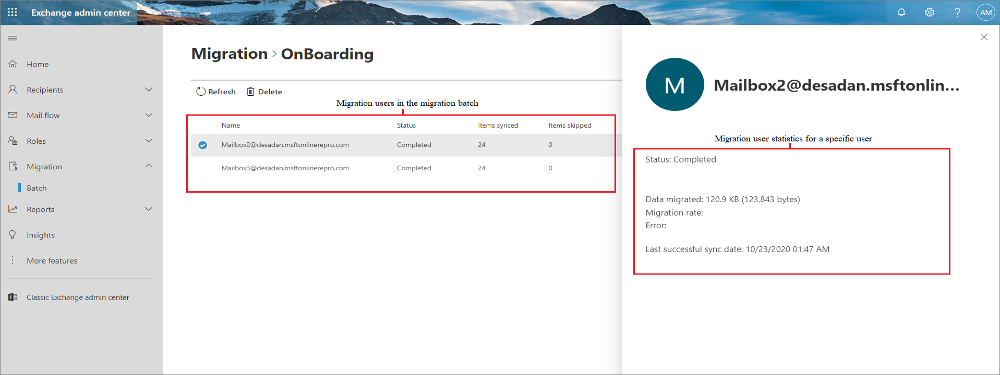
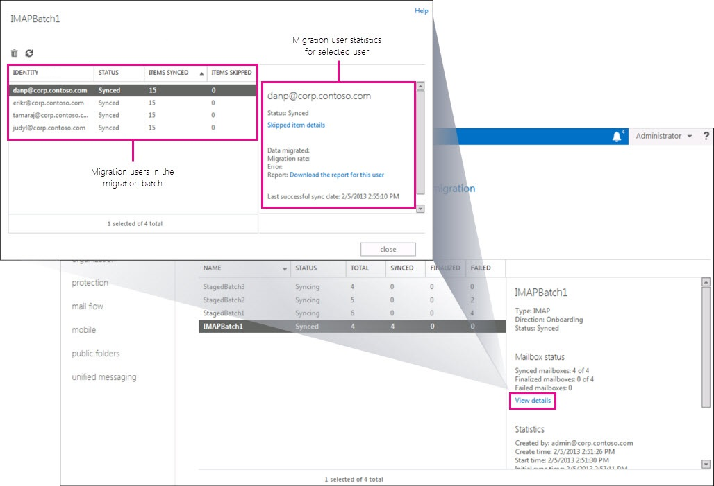

# Migration users status report

You can use the Migration dashboard in the Exchange administration center (EAC) to display the migration status information for all users in a migration batch. You can also display detailed migration information for each user in a migration batch. This information, also called migration user statistics, can help you troubleshoot issues that might prevent the migration of a user's mailbox or mailbox items. You can display this migration status information for migration batches that are currently running, that have been stopped, or that are complete.

You can also use Exchange Online PowerShell to display migration user statistics. For more information, see:

- [Get-MigrationUser](https://docs.microsoft.com/powershell/module/exchange/Get-MigrationUser)

- [Get-MigrationUserStatistics](https://docs.microsoft.com/powershell/module/exchange/Get-MigrationUserStatistics)

## Migration users report in new Exchange admin center (New EAC)

To access the migration users report for a migration batch, go to new [Exchange Admin center](https://admin.exchange.microsoft.com/#/), navigate to **Migration** > **Batch**, select the migration batch and then in the details pane, under **Migration details**, click **View details**.

The name of the migration batch and the following commands are displayed at the top of the window.

|**Command**|**Description**|
|:-----|:-----|
|**Delete**|Delete the selected user from the list of migration users.|
|**Refresh**|Refresh the list of migration users to update the information displayed for the users in the migration batch.|

### Columns in the list of migration users

|**Column**|**Description**|
|:-----|:-----|
|**Name**|The user's email address.|
|**Status**|The user's migration status. See the status descriptions in the table in the next section.|
|**Items Synced**|The number of items in the user's on-premises mailbox that were successfully migrated to the Microsoft 365 or Office 365 mailbox.|
|**Items Skipped**|The number of items in the user's on-premises mailbox that weren't migrated to the Microsoft 365 or Office 365 mailbox.|

## Migration user statistics for a specific user in new Exchange admin center (New EAC)

To view status information (also called migration user statistics) for a specific mailbox, mail contact, or distribution group, click the mailbox, contact, or distribution group in the list. Status information for the selected mail object is displayed in the details pane. The following table describes each field displayed in the details pane.

|**Field**|**Description**|
|:-----|:-----|
|**Status**| Identifies the specific point in the migration process for each mail object in the migration batch. This status is more specific than the high-level status summary displayed in the list of migration users. The following list describes each status state.  • **Completed**: The migration process is successfully completed and all mailbox items were migrated to the cloud-based mailbox.  • **Queued**: The object is in a migration batch that is running, but the migration of the object hasn't started yet. Objects typically have a status of **Queued** when all of the connections in the migration endpoint associated with the migration batch are being used.  • **Synced**: The migration process successfully provisioned the Microsoft 365 or Office 365 mailbox and completed the initial synchronization where all mailbox items were copied to the cloud-based mailbox. For cutover Exchange migrations and IMAP migrations, this status can also indicate that incremental synchronization completed successfully.  • **Failed**: The provisioning or the initial synchronization of the mail object failed. If a Microsoft 365 or Office 365 mailbox is successfully created for a user, but the migration of mailbox items fails, the status for the user will be **Failed**.|
|**Skipped item details**| Click **Skipped item details** to display information about each item that was skipped for the selected user. The following information about each skipped item is displayed:  • **Date**: The time stamp of the mailbox item.  • **Subject**: The subject line of the message.  • **Kind**: The type of error that caused the item to be skipped.  • **Folder name**: The folder where the skipped item is located.|
|**Data migrated**|The total amount of data (in bytes and megabytes (MB)) for the mailbox items that have been migrated to the Microsoft 365 or Office 365 mailbox. This number includes items migrated in both the initial and incremental synchronizations. This field doesn't have a value for IMAP migrations.|
|**Migration rate**|The average transfer rate (in bytes or MB per minute) of data copied to the Microsoft 365 or Office 365 mailbox. This field doesn't have a value for IMAP migrations.|
|**Error**|If the migration for the user failed, this field displays a description of the error. This error description is also included in the Migration Errors report.|
|**Report**|Click **Download the report for this user** to open or save a detailed migration report that contains diagnostic information about the migration status of the user. You or Microsoft Support can use the information in this report to troubleshoot failed migrations.|
|**Last successful sync date**|The last time that any new items in the on-premises mailbox were copied to the cloud-based mailbox.|

## Migration users report in Classic Exchange admin center (Classic EAC)

To access the migration users report for a migration batch, select **Recipients** \> **Migration**, select the migration batch, and then in the details pane, under **Mailbox status**, click **View details**.

The name of the migration batch and the following commands are displayed at the top of the window.

|**Command**|**Description**|
|:-----|:-----|
|**Delete** |Delete the selected user from the list of migration users.|
|**Refresh** |Refresh the list of migration users to update the information displayed for the users in the migration batch.|

### Columns in the list of migration users

|**Column**|**Description**|
|:-----|:-----|
|**Identity**|The user's email address.|
|**Status**|The user's migration status. See the status descriptions in the table in the next section.|
|**Items Synced**|The number of items in the user's on-premises mailbox that were successfully migrated to the Microsoft 365 or Office 365 mailbox.|
|**Items Skipped**|The number of items in the user's on-premises mailbox that weren't migrated to the Microsoft 365 or Office 365 mailbox.|

## Migration user statistics for a specific user in Classic Exchange admin center (Classic EAC)

To view status information (also called migration user statistics) for a specific mailbox, mail contact, or distribution group, click the mailbox, contact, or distribution group in the list. Status information for the selected mail object is displayed in the details pane. The following table describes each field displayed in the details pane.

|**Field**|**Description**|
|:-----|:-----|
|**Status**| Identifies the specific point in the migration process for each mail object in the migration batch. This status is more specific than the high-level status summary displayed in the list of migration users. The following list describes each status state.  • **Queued**: The object is in a migration batch that is running, but the migration of the object hasn't started yet. Objects typically have a status of **Queued** when all of the connections in the migration endpoint associated with the migration batch are being used.  • **Provisioning**: The migration process has started for the mail object, but it isn't provisioned yet.  • **Provision updating**: The mail object has been provisioned, but not all the object's properties were migrated. For example, after a distribution group has been migrated, this state occurs when members of the group haven't been migrated yet or there's a problem migrating a user who is a member of the group. In this case, the status indicates the migration process can't update the group membership because not all group members have been migrated.  • **Synced**: The migration process successfully provisioned the Microsoft 365 or Office 365 mailbox and completed the initial synchronization where all mailbox items were copied to the cloud-based mailbox. For cutover Exchange migrations and IMAP migrations, this status can also indicate that incremental synchronization completed successfully.  • **Failed**: The provisioning or the initial synchronization of the mail object failed. If a Microsoft 365 or Office 365 mailbox is successfully created for a user, but the migration of mailbox items fails, the status for the user will be **Failed**.|
|**Skipped item details**| Click **Skipped item details** to display information about each item that was skipped for the selected user. The following information about each skipped item is displayed:  • **Date**: The time stamp of the mailbox item.  • **Subject**: The subject line of the message.  • **Kind**: The type of error that caused the item to be skipped.  • **Folder name**: The folder where the skipped item is located.|
|**Data migrated**|The total amount of data (in bytes and megabytes (MB)) for the mailbox items that have been migrated to the Microsoft 365 or Office 365 mailbox. This number includes items migrated in both the initial and incremental synchronizations. This field doesn't have a value for IMAP migrations.|
|**Migration rate**|The average transfer rate (in bytes or MB per minute) of data copied to the Microsoft 365 or Office 365 mailbox. This field doesn't have a value for IMAP migrations.|
|**Error**|If the migration for the user failed, this field displays a description of the error. This error description is also included in the Migration Errors report.|
|**Report**|Click **Download the report for this user** to open or save a detailed migration report that contains diagnostic information about the migration status of the user. You or Microsoft Support can use the information in this report to troubleshoot failed migrations.|
|**Last successful sync date**|The last time that any new items in the on-premises mailbox were copied to the cloud-based mailbox.|

Click **More details** to display the following additional information about the selected migration user.

|**Field**|**Description**|
|:-----|:-----|
|**Queued duration**|The length of time the user had a status of Queued.|
|**In-progress duration**|The length of time the user was actively being migrated.|
|**Synced duration**|The length of time the migration user had a status of Synced.|
|**Stalled duration**|The length of time the migration process was stalled for the user.|

## Migration phases

To help you understand the migration status states described in the previous sections, it's helpful to be familiar with the phases of the migration process. The following table describes these phases and indicates whether the phase is included in each type of migration.

|**Migration phase**|**Cutover Exchange migration**|**Staged Exchange migration**|**IMAP migration**|
|:-----|:-----|:-----|:-----|
|**Provisioning**: The migration process creates the new Microsoft 365 or Office 365 mailbox.|Yes (includes distribution groups and mail contacts)|Yes (includes mail contacts)|No|
|**Initial synchronization**: After Microsoft 365 or Office 365 mailboxes are provisioned, the migration process migrates mailbox items to the newly provisioned cloud-based mailboxes.|Yes (includes calendar times and contacts)|Yes (includes calendar times and contacts)|Yes|
|**Incremental synchronization**: The migration process synchronizes the on-premises and the corresponding Microsoft 365 or Office 365 mailbox every 24 hours.|Yes|No|Yes|
