# Perform a Google Workspace (formerly G Suite) migration

You can migrate batches of users from Google Workspace to Microsoft 365 or Office 365, allowing a migration project to be done in stages. This migration requires that you provision all of your users who will be migrated as mail-enabled users outside of the migration process. You must specify a list of users to migrate for each batch.

All of the procedures in this article assume that your Microsoft 365 or Office 365 domain has already been verified and your TXT records have been set up. For more information, see [Set up your domain (host-specific instructions)](https://docs.microsoft.com/microsoft-365/admin/get-help-with-domains/set-up-your-domain-host-specific-instructions).

   > [!NOTE]
   > Google Workspace migration is not currently available for Office 365 US Government GCC High or DoD.

## Overview of the process

Before beginning your migration, review the following diagrams to understand how a Google Workspace staged migration works. The diagrams show how a fictitious company named Fabrikam, Inc., with the domain name *fabrikaminc.net* performed their migration.

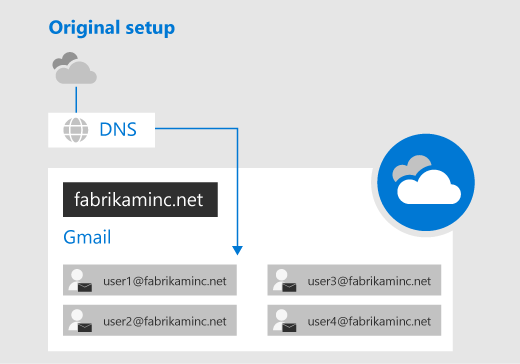

Prior to their migration, the MX record for the base "fabrikaminc.net" domain points to the Google Workspace tenant or mail server were all or most of Fabrikam, Inc.'s users are. Note that users have their primary email addresses at that domain.

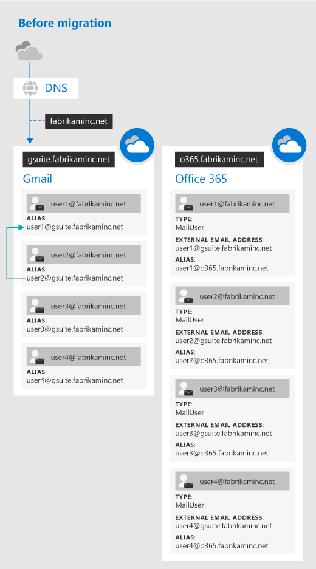

The MX record for the primary domain "fabrikaminc.net" still points to Google Workspace, where all the primary mailboxes reside. To prepare for the migration, new routing domains have been created: the *gsuite.fabrikaminc.net* domain points to Google Workspace and the *o365.fabrikaminc.net* domain points to Microsoft 365 or Office 365.

On the Google Workspace side, aliases have been added for all of the users in the Google Workspace routing domain. On the Microsoft 365 or Office 365 side, MailUsers have been provisioned for all of the users from the Google Workspace tenant. The ExternalEmailAddress field for MailUsers on the Microsoft 365 or Office 365 side were configured to point back to the primary mailbox using the address at the routing domain for the Google Workspace side. Additionally, there should be aliases for the user in the Microsoft 365 or Office 365 routing domain.

The green arrow indicates how, at this point in the migration, User 2 still contacts User 1 through their Google Workspace email addresses.

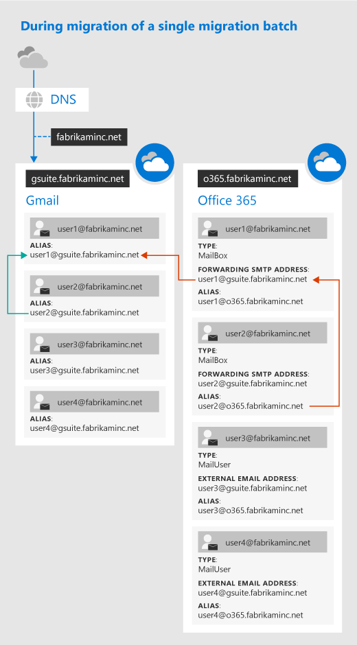

User 1 and User 2 are part of the first migration batch to Microsoft 365 or Office 365, while User 3 and User 4 will be part of a later batch. The MX record for the primary domain "fabrikaminc.net" still points to Google Workspace, where all the primary mailboxes still reside. Because User 1 and User 2 have had their migrations started, they've been converted from MailUsers to Mailboxes on the Microsoft 365 or Office 365 side.

The ExternalEmailAddress for each user has been moved to a ForwardingSmtpAddress, so that messages sent to User 1 and User 2 will be delivered back to their source mailboxes on the Google Workspace side by rerouting the message back to the Google Workspace routing domain. This is indicated by the red arrows in the above diagram. Mail is still being synced from the source Google Workspace side to the Microsoft 365 or Office 365 side.

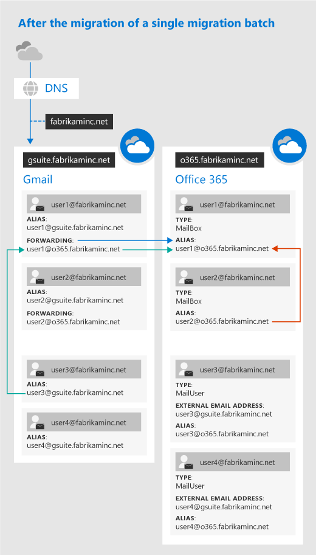

The MX record for the primary domain "fabrikaminc.net" still points to Google Workspace. Now that User 1 and User 2 have been fully migrated to Microsoft 365 or Office 365, they should start working out of Microsoft 365 or Office 365. On the Google Workspace side, automatic mail forwarding has been set up for migrated users, so that new emails sent to their Google Workspace address will be delivered instead to the Microsoft 365 or Office 365 address via the routing domain. This is shown by the green arrows in the above diagram.

> [!IMPORTANT]
> If your organization has disabled a user's ability to set a forwarding address, the Google Workspace migration tool will also be unable to set the forwarding address. You must enable permissions to set SMTP forwarding in order for forwarding to be set successfully during your migration.

Meanwhile, the forwarding address has been removed from the Microsoft 365 or Office 365 user object, so emails will be delivered to that user in the Microsoft 365 or Office 365 routing domain (as shown by the red arrows above).

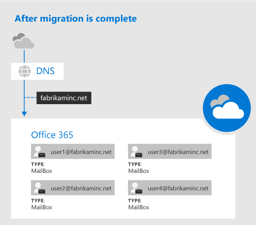

After all migration batches have been completed, all users can use their migrated mailboxes on Microsoft 365 or Office 365 as their primary mailbox. A manual MX record update for the primary domain "fabrikaminc.net" then points to the Microsoft 365 or Office 365 organization instead of the Google Workspace tenant. The routing domains and extra aliases can now be removed, as can the Google Workspace tenant. The migration of mail, calendar, and contacts from Google Workspace to Microsoft 365 or Office 365 is now complete.

## Migration limitations

> [!NOTE]
> The largest single email message that can be migrated is based on the transport configuration for your configuration. The default limit is 35 MB. To increase this limit, see [Office 365 now supports larger email messages](https://www.microsoft.com/microsoft-365/blog/2015/04/15/office-365-now-supports-larger-email-messages-up-to-150-mb/).

Throughput limitations for contacts and calendars completely depend on the quota restrictions for your tenant's service account on the Google Workspace side.

Other migration limitations are described in the following table:

|Data type|Limitations|
|---|---|
|Mail|Vacation settings, Automatic reply settings, Filters/Rules will not be migrated|
|Meeting rooms|Room bookings will not be migrated|
|Calendar|Shared calendars, cloud attachments, Google Hangout links, and event colors will not be migrated|
|Contacts|A maximum of three email addresses per contact are migrated over|
|Contacts|Gmail tags, contact URLs, and custom tags will not be migrated|

> [!TIP]
> If you will be [starting your migration batch with Exchange Online Powershell](#start-a-google-workspace-migration-with-exchange-online-powershell), as described later in this article, you can use the `-ExcludeFolder` parameter to prevent certain folders from being migrated. This will reduce the amount of data in your migration, as well as the size of a user's new Exchange Online mailbox. You can identify folders you don't want to migrate by name, and you can also identify Gmail labels that apply to multiple messages in order to exclude those messages from the migration. For more information on using `-ExcludeFolder`, see [New-MigrationBatch](https://docs.microsoft.com/powershell/module/exchange/new-migrationbatch).  

## Create a Google Service Account

> [!IMPORTANT]
> Use Chrome to create your Google Service account. Other browsers may not allow you to do this properly. <br/><br/> Because elements of the Google Workspace user interface can change over time, the screens you see might vary from the examples in this section. The locations of certain fields may vary as well. Please look at Google's Documentation for how to [Create a Service Account](https://support.google.com/a/answer/7378726) for clarifications in case the UI has changed significantly.

1. In Chrome, go to the [Google Cloud Platform](https://console.developers.google.com/iam-admin/serviceaccounts) and sign in as a Google user (such as the Google Workspace admin).

2. Click **Create** to create and name a new project for the onboarding (such as "Google Workspace project"), or click **Select** to select an existing project.

   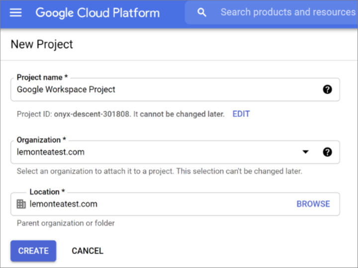

3. Navigate to **IAM & Admin** > **Service Accounts** > **Select Project** and then click **Create Service Account** and, in **Service account name**, give the service account a name, such as "Google Workspace Onboarding." Click **Create**.

   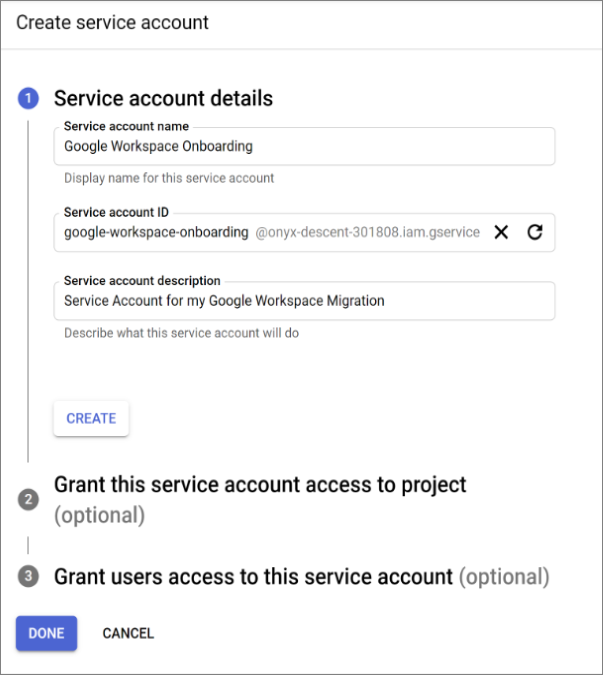

4. On the **Service account permissions (optional)** screen, click **Continue**.

5. On the **Grant users access to this service account (optional)** screen, click **Done**.

6. Once you have been returned to the page listing the service accounts, click on the **Email** for the Service Account you just created to enter the details page, then click the **Edit** button. Alternatively, you can click the ellipsis under the **Actions** column and select the **Edit** action.

7. On the Service account details page, note the **Unique ID**. This is the ClientId that you will provide later in the instructions for [Grant access to the service account for your Google tenant](#grant-access-to-the-service-account-for-your-google-tenant).

   

8. If you see an area that says **Show Domain-Wide Delegation**, click to expand that section. Next, enable the checkbox to **Enable G Suite Domain-wide Delegation**, enter the product name to configure the consent screen, and then click **Save** at the bottom of the page.

   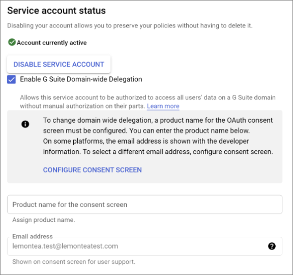

9. On the Service account details page, click **Add Key** and select the **Create new key** option.

   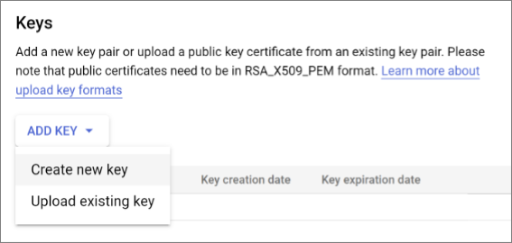

10. Under **Key type**, make sure **JSON** is selected, and then click **Create**.

    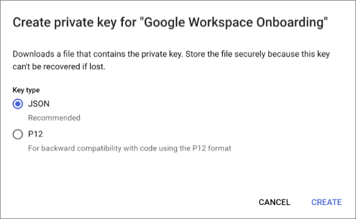

11. Keep track of the JSON key file that is automatically downloaded, as you will need its filename during the steps under [Create a migration endpoint in Microsoft 365 or Office 365](#create-a-migration-endpoint-in-microsoft-365-or-office-365). Close the pop-up dialog and click **Save**.

## Enable API usage in your project

If your project doesn't already have all of the required APIs enabled, you must enable them.

1. Go to the [Developer page for API Library](https://console.developers.google.com/apis/library) and sign in as the Google user you used above in **Create a Google Service Account**.

2. Select the project that you used above.

3. Search for the following APIs, and then for each one, if necessary, click **Enable** to enable them for your project:

   - Gmail API
   - Google Calendar API
   - Contacts API

## Grant access to the service account for your Google tenant

1. Go to the [Google Workspace Admin page](https://admin.google.com/AdminHome) and sign in as Google Workspace admin for your tenant.

2. Click **Security**, then click **API Controls**, and then click **Manage Domain Wide Delegation**.

3. Next to the **API Clients** list, click **Add new**.

4. In **Client ID**, type the ClientId for the service account you created in the [Create a Google Service Account](#create-a-google-service-account) section above.

   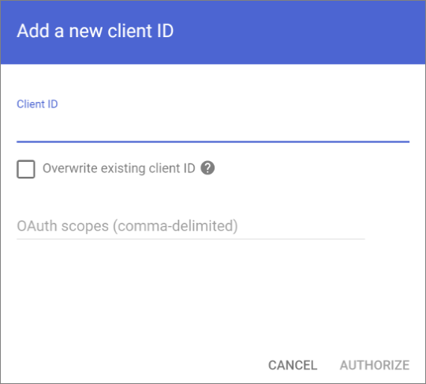

5. In **OAuth Scopes**, add the required scopes in comma-separated format, with no spaces in between. For example, `https://mail.google.com/,https://www.googleapis.com/auth/calendar,https://www.google.com/m8/feeds/,https://www.googleapis.com/auth/gmail.settings.sharing`. If the OAuth Scopes are entered incorrectly, the resulting list won't match and the migration process will fail later, after you start the migration batch.

6. Click **Authorize**. Verify that the resulting list shows the expected four (4) OAuth scopes.

   > [!NOTE]
   > It may take a substantial length of time for these settings to propagate (anywhere from 15 minutes to 24 hours).

## Create a subdomain for mail routing to Microsoft 365 or Office 365

1. Go to the [Google Workspace Admin page](https://admin.google.com/AdminHome) and sign in as a Google Workspace admin for your tenant.

2. Click **Domains**, then **Manage domains**, and then click **Add a domain**.

3. Enter the domain that you will use for routing mails to Microsoft 365 or Office 365, then click **Continue and verify domain ownership**. A subdomain of your primary domain is recommended (such as "o365.fabrikaminc.net" when "fabrikaminc.net" is your primary domain) so that it will be automatically verified. Keep track of the name of the domain you enter because you will need it for the following steps, and later in the instructions as the Target Delivery Domain when you [Create a migration batch in Microsoft 365 or Office 365](#create-a-migration-batch-in-microsoft-365-or-office-365).

   > [!NOTE]
   > A sub-domain of your primary domain is recommended. If another domain (such as "fabrikaminc.onmicrosoft.com") is set, Google will send emails to each individual address with a link to verify the permission to route mail. Migration won't complete until the verification is completed.

   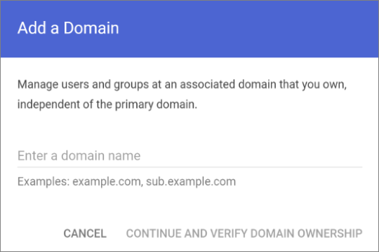

4. Follow any subsequent steps that are then required to verify your domain, making sure that the status is shown as **Active**. Note that if you chose a subdomain of your primary domain in step 3 above, your new domain may have been verified automatically.

   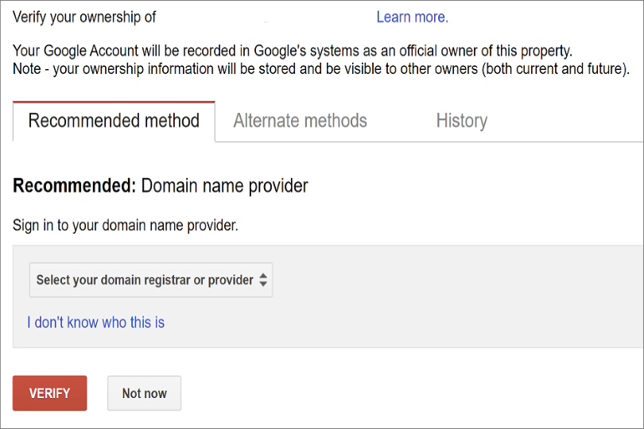

5. Log into your DNS provider and update your DNS records so that you have an MX record at the domain you created above in step 3, pointing to Microsoft 365 or Office 365. Ensure that this domain that you created above is an accepted domain in Microsoft 365 or Office 365. Follow the instructions in [Add a domain to Microsoft 365](https://docs.microsoft.com/microsoft-365/admin/setup/add-domain) to add the Microsoft 365 or Office 365 routing domain ("o365.fabrikaminc.net") to your organization and to configure DNS to route mail to Microsoft 365 or Office 365.

> [!NOTE]
> The migration process won't be able to complete if a routing domain is used that is not verified as described above. Choosing the built-in "tenantname.onmicrosoft.com" domain for routing mail to Office 365 instead of a sub-domain of the primary Google Workspace domain occasionally causes issues that Microsoft is not able to assist with besides to recommend that the user manually verify the forwarding address or contact Google support.

## Create a subdomain for mail routing to your Google Workspace domain

1. Go to the [Google Workspace Admin page](https://admin.google.com/AdminHome) and sign in as a Google Workspace admin for your tenant.

2. Click **Domains**, then **Manage domains**, and then click **Add a domain alias**.

3. Enter the domain that you will use for routing mails to Google Workspace, then click **Continue and verify domain ownership**. A subdomain of your primary domain is recommended (such as "gsuite.fabrikaminc.net" when "fabrikaminc.net" is your primary domain) so that it will be automatically verified.

   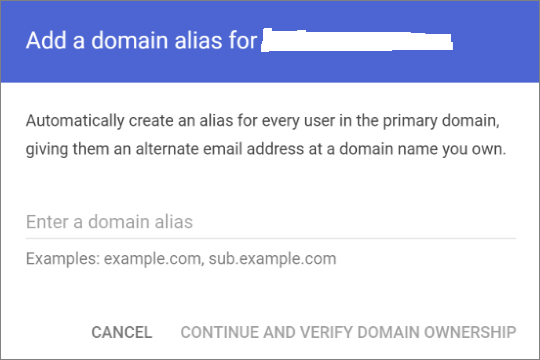

4. Follow any subsequent steps that are then required to verify your domain, making sure that the status is shown as **Active**. Note that if you chose a subdomain of your primary domain in step 3 above, your new domain may have been verified automatically.

   

5. Follow Google's instructions to [Set up MX records for Google Workspace Gmail](https://support.google.com/a/answer/140034) for this domain.

   > [!NOTE]
   > It may take up to 24 hours for Google to propagate this setting to all of the users in your organization.

   > [!IMPORTANT]
   > If you are using non-default Transport settings in your Microsoft 365 or Office 365 organization, you should check that mail flow will work from Office 365 to Google Workspace. Be sure that either your default Remote Domain ("\*") has Automatic Forwarding enabled, or that there is a new Remote Domain for your Google Workspace routing domain (e.g. "gsuite.fabrikaminc.net") that has Automatic Forwarding enabled.

## Provision users in Microsoft 365 or Office 365

Once your Google Workspace environment has been properly configured, you can complete your migration in the Exchange admin center or through the Exchange Online PowerShell.

Before proceeding with either method, make sure that Mail Users have been provisioned for every user in the organization who will be migrated (either now or eventually). If any users aren't provisioned, provision them using the instructions in [Manage mail users](https://docs.microsoft.com/exchange/recipients-in-exchange-online/manage-mail-users).

For more advanced scenarios, you may be able to deploy Azure Active Directory (Azure AD) Connect to provision your Mail Users. See [Deploy Microsoft 365 Directory Synchronization in Microsoft Azure](https://docs.microsoft.com/office365/enterprise/deploy-office-365-directory-synchronization-dirsync-in-microsoft-azure) for an overview, and [Set up directory synchronization for Microsoft 365](https://docs.microsoft.com/office365/enterprise/set-up-directory-synchronization) for setup instructions. Then, you need to deploy an Exchange server in your on-premises environment for user management, and mail-enable your users using this server. For more information, see [How and when to decommission your on-premises Exchange servers in a hybrid deployment](https://docs.microsoft.com/exchange/decommission-on-premises-exchange) and [Manage mail users](/Exchange/ExchangeServer/recipients/mail-users.md). Once the Mail Users have been created in Microsoft 365, the Azure AD Connect may need to be disabled in order to allow the migration process to convert these users into mailboxes - see [Turn off directory synchronization for Microsoft 365](https://docs.microsoft.com/office365/enterprise/turn-off-directory-synchronization).

We recommend that the primary address (sometimes referred to as the "User ID") for each user be at the primary domain (such as "will@fabrikaminc.net"). Typically, this means that the primary email address should match between Microsoft 365 or Office 365 and Google Workspace. If any user is provisioned with a different domain for their primary address, then that user should at least have a proxy address at the primary domain. Each user should have their `ExternalEmailAddress` point to the user in their Google Workspace routing domain ("will@gsuite.fabrikaminc.net"). The users should also have a proxy address that will be used for routing to their Microsoft 365 or Office 365 routing domain (such as "will@o365.fabrikaminc.net").

## Start a Google Workspace migration batch with the new Exchange admin center (New EAC)

1. In the new [Exchange Admin center](https://admin.exchange.microsoft.com/#/), navigate to **Migration** > **Batch**.

2. Click **New Migration batch** and follow the instructions in the details pane.

3. In **Migration Onboarding** section, enter the batch name, select the mailbox migration path and click **Next**.

4. Select the migration type as **G Suite (Gmail) migration** from the drop-down list and click **Next**.

   
   
5. In **G Suite migration prerequisites** section, you can either automate the configuration of your G-Suite for migration or manually configure G-Suite for migration. 
   
   
   
6. Under **Automate the configuration of your G-Suite for migration**, click **Start** to automate the four required prerequisite steps.

7. Sign in to your Google account to validate your APIs.

   Once the APIs are successfully validated, a link, client ID, and a scope is provided to add scope for API access.
   
8. Click the API access link and verify your google account.

9. In Google admin page, click **Add new**. 

10. In **Add a new client ID** window, enter the client ID and the scope provided after API validation and click **Authorize**.

    > [!NOTE]
    > For more information, see the above topic **Grant access to the service account for your Google tenant**.
    
11. In **Set endpoint** section, select the migration endpoint from the drop-down list and click **Next**.
    
    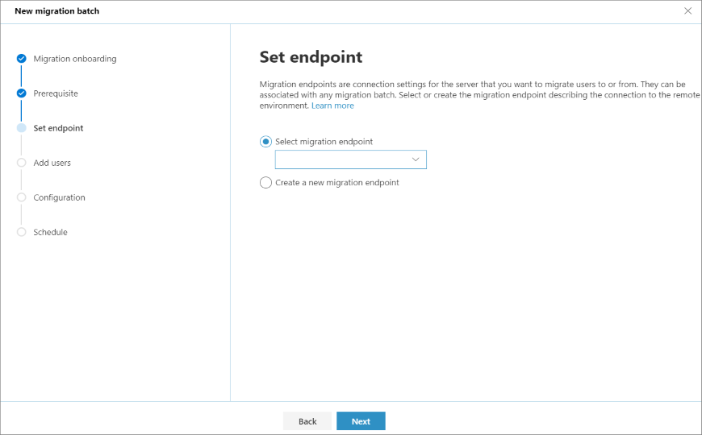
    
    > [!NOTE]
    > To migrate Gmail mailboxes successfully, Microsoft 365 or Office 365 needs to connect and communicate with Gmail. To do this, Microsoft 365 or Office 365 uses a migration endpoint. Migration endpoint is a technical term that describes the settings that are used to create the connection so you can migrate the mailboxes.
    
12. Create a CSV file containing the set of all of the users you want to migrate. You will need its filename below. The allowed headers are:

    - EmailAddress (required). Contains the primary email address for an existing Microsoft 365 or Office 365 mailbox.

    - Username (optional). Contains the Gmail primary email address, if it differs from EmailAddress.

    ```CSV
    EmailAddress
    will@fabrikaminc.net
    user123@fabrikaminc.net
    ```
13. In **Add user mailboxes** section, import the CSV file and click **Next**.

14. In **Move configuration** section, enter the details and click **Next**.

15. In **Schedule batch migration** section, verify all the details, click **Save**, and then click **Done**.

    
    
    The batch status changes from **Syncing** to **Synced**, you can complete the batch. 
    
16. To complete the batch, select the migration group.

17. In the details pane, select the preferred option to complete the batch and click **Save**.

    The batch status will then be **Completed**.

## Start a Google Workspace migration batch with the Classic Exchange admin center (Classic EAC)

1. In the Exchange Admin center, click **recipients**, and then click **migration**.

2. Click "New"   to create a new migration batch, and then click **Migrate to Exchange Online**.

3. In the New Migration Batch window, select **G Suite (Gmail) migration**, and then click **Next**.

   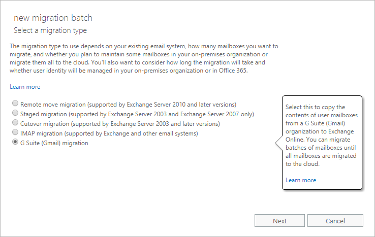

4. Create a CSV file containing the set of all of the users you want to migrate. You will need its filename below. The allowed headers are:

   - EmailAddress (required). Contains the primary email address for an existing Microsoft 365 or Office 365 mailbox.

   - Username (optional). Contains the Gmail primary email address, if it differs from EmailAddress.

   ```CSV
   EmailAddress
   will@fabrikaminc.net
   user123@fabrikaminc.net
   ```

5. Under **Select the users**, click **Choose File** and navigate to the CSV file of all the users you are migrating in this batch. If your CSV file contains more columns besides the two mentioned above, click to select **Allow unknown columns in the CSV file**.

   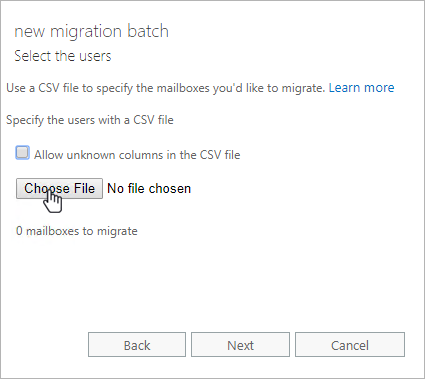

6. After selecting the CSV file, click **Open**. Back on the **new migration batch** page, click **Next**.

7. Enter the email address for the super admin within the Google Workspace environment. This email address will be used to test connectivity between Google Workspace and Microsoft 365 or Office 365.

8. Under **Specify the service account credentials using the JSON key file**, click **Choose File**, and then select the JSON file that was downloaded automatically when you created your service account. This file contains the private key for the service account. Click **Open** to select the file, and then, back on the **new migration batch** page, click **Next**.

   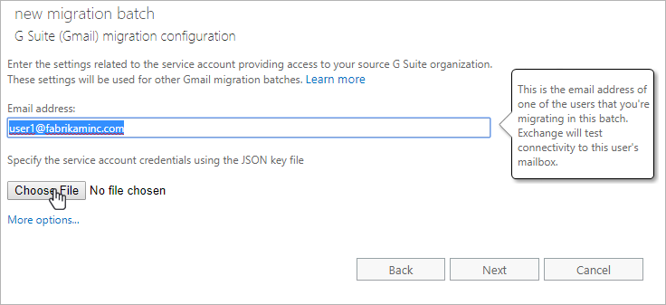

   > [!NOTE]
   > Click to select **Skip verification** if you don't want to verify the migration endpoint.

9. In the fields under **Move configuration**, name your migration batch and enter the target delivery domain, which is the domain [you created](#create-a-subdomain-for-mail-routing-to-microsoft-365-or-office-365) for routing mail to the Microsoft 365 or Office 365 target organization from the Google Workspace source organization. Optionally, you can also specify any folders that should be excluded from the migration. When done, click **Next**.

   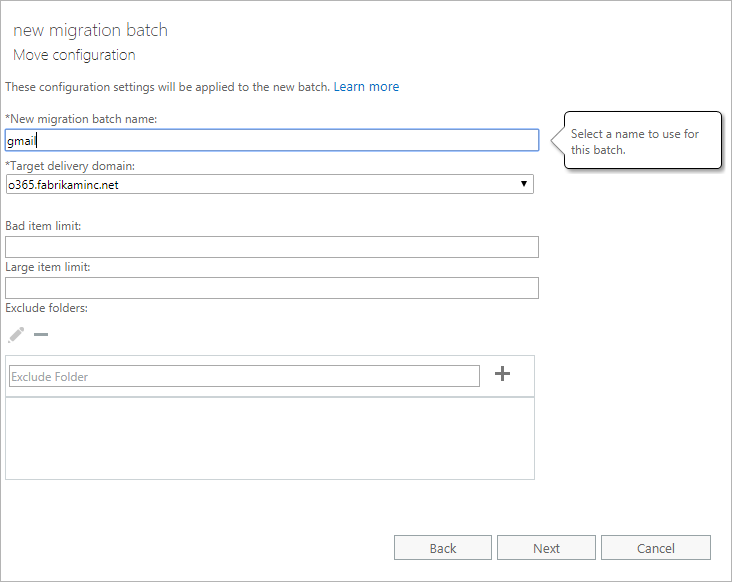

   > [!NOTE]
   > The target delivery domain you will want to use will not automatically show up in the dropdown - instead you should click within the text box and type it in. The target delivery domain must be different from the primary domain of the users in Google Workspace.

10. Under **Start the batch**, fill in the names or aliases of anyone who should be notified about the batch progress. Then select how you want to begin and complete the batch. When done, click **new**.

    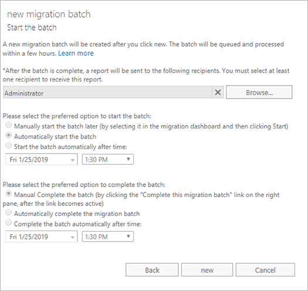

11. After the batch status changes from **Syncing** to **Synced**, you can complete the batch. The batch status will then be **Completed**.

    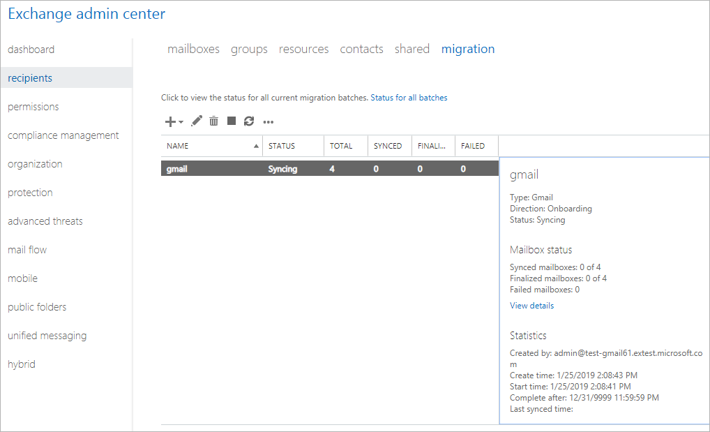

During completion, another incremental sync is run to copy any changes that have been made to the Google Workspace mailbox. Additionally, the forwarding address that routes mail from Microsoft 365 or Office 365 to Google Workspace is removed, and a forwarding address that routes mail from Google Workspace to Microsoft 365 or Office 365 is added. This ensures that any  messages received by migrated users at their Google Workspace mailboxes will be sent to their new Microsoft 365 or Office 365 address. Similarly, if any user who has not yet been migrated receives a message at their Microsoft 365 or Office 365 address, the message will get routed to their Google Workspace mailbox.

## Start a Google Workspace migration with Exchange Online PowerShell

### Create a migration endpoint in Microsoft 365 or Office 365

1. [Connect to Exchange Online PowerShell](https://docs.microsoft.com/powershell/exchange/connect-to-exchange-online-powershell).

2. Find the email address for the super admin within the Google Workspace environment. This email address will be used to test connectivity between Google Workspace and Microsoft 365 or Office 365. The following steps use 'admin123' as an example.

3. Run the following command:

   ```PowerShell
   Test-MigrationServerAvailability -Gmail -ServiceAccountKeyFileData $([System.IO.File]::ReadAllBytes("C:\\somepath\\yourkeyfile.json")) -EmailAddress admin123@fabrikaminc.net
   ```

4. Verify the test is successful.

5. If successful, run the following command:

   ```PowerShell
   New-MigrationEndpoint -Gmail -ServiceAccountKeyFileData $([System.IO.File]::ReadAllBytes("C:\\somepath\\yourkeyfile.json")) -EmailAddress admin123@fabrikaminc.net -Name gmailEndpoint
   ```

### Create a migration batch in Microsoft 365 or Office 365

1. [Connect to Exchange Online PowerShell](https://docs.microsoft.com/powershell/exchange/connect-to-exchange-online-powershell).

2. Create a CSV file containing the set of all of the users you want to migrate. You will need its filename below. The allowed headers are:

   - EmailAddress (required). Contains the primary email address for an existing Microsoft 365 or Office 365 mailbox.

   - Username (optional). Contains the Gmail primary email address, if it differs from EmailAddress.

   ```CSV
   EmailAddress
   will@fabrikaminc.net
   user123@fabrikaminc.net
   ```

3. Run the following command:

   ```CSV
   New-MigrationBatch -SourceEndpoint gmailEndpoint -Name gmailBatch -CSVData $([System.IO.File]::ReadAllBytes("C:\\somepath\\gmail.csv")) -TargetDeliveryDomain "o365.fabrikaminc.net"
   ```

   > [!TIP]
   > See [New-MigrationBatch](https://docs.microsoft.com/powershell/module/exchange/new-migrationbatch) for an explanation of all of the individual parameters you can use with this cmdlet.

4. Start the migration batch.

### Complete the migration batch in Microsoft 365 or Office 365

When the migration batch has reached the state of **Synced**, it can be completed by running the `Complete-MigrationBatch` cmdlet.

During completion, another incremental sync is run to copy any changes that have been made to the Google Workspace mailbox. Additionally, the forwarding address that routes mail from O365 to Google Workspace is removed, and a forwarding address that routes mail from Google Workspace to O365 is added.

> [!NOTE]
> Forwarding addresses are not needed when doing a cutover migration from Google Workspace to Exchange Online.

## Finalizing your migration

After you have successfully migrated all of your Google Workspace users to Microsoft 365 or Office 365, you can switch your primary MX record to point to Microsoft 365 or Office 365. The update to the MX record will propagate slowly, taking up to the length of time in the record's previous TTL (time to live). At this point, you are free to decommission your source Google Workspace tenant.

