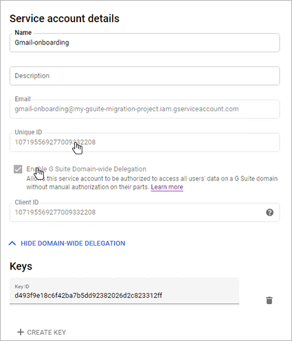

# Perform a G Suite migration

You can perform a staged migration from G Suite to Office 365. A staged migration requires that you have Office 365 Directory Synchronization (DirSync) set up, or that you manually provision all of the MailUsers outside of the migration process. You must specify a list of users to migrate.

If you don't have DirSync in your environment, see [Deploy Office 365 Directory Synchronization in Microsoft Azure](https://docs.microsoft.com/office365/enterprise/deploy-office-365-directory-synchronization-dirsync-in-microsoft-azure) for an overview, and [Set up directory synchronization for Office 365](https://docs.microsoft.com/office365/enterprise/set-up-directory-synchronization) for set up instructions.

To manually provision mail-enabled users without DirSync, see [Manage mail users](https://docs.microsoft.com/Exchange/recipients-in-exchange-online/manage-mail-users#use-directory-synchronization-to-manage-mail-users-in-exchange-online) for more information.

All of the procedures in this article assume that your Office 365 domain has already been verified and your TXT records have been set up. For more information see [Set up your domain (host-specific instructions)](https://docs.microsoft.com/office365/admin/get-help-with-domains/set-up-your-domain-host-specific-instructions).

## Overview of the process

Before beginning your migration, please review the following diagrams to understand how a G Suite staged migration works. The diagrams show how a fictitious company named Fabrikam, Inc., with the domain name *fabrikaminc.net* performed their migration.


Prior to their migration, the MX record for the base "fabrikaminc.net" domain points to the G Suite tenant or mail server where all or most of Fabrikam, Inc.'s users are. Note that users have their primary email addresses at that domain.


The MX record for the primary domain "fabrikaminc.net" still points to G Suite, where all the primary mailboxes reside. To prepare for the migration, new routing domains have been created: the *gsuite.fabrikaminc.net* domain points to G Suite and the *o365.fabrikaminc.net* domain points to Office 365.

On the G Suite side, aliases have been added for all of the users in the G Suite routing domain.  On the Office 365 side, MailUsers have been provisioned for all of the users from the G Suite tenant. The ExternalEmailAddress field for MailUsers on the Office 365 side were configured to point back to the primary mailbox using the address at the routing domain for the G Suite side.  Additionally, there should be aliases for the user in the O365 routing domain.

The green arrow indicates how, at this point in the migration, User 2 still contacts User 1 through their G Suite email addresses.


User 1 and User 2 are part of the first migration batch to Office 365, while User 3 and User 4 will be part of a later batch. The MX record for the primary domain "fabrikaminc.net" still points to G Suite, where all the primary mailboxes still reside. Because User 1 and User 2 have had their migrations started, they've been converted from MailUsers to Mailboxes on the Office 365 side.

The ExternalEmailAddress for each user has been moved to a ForwardingSmtpAddress, so that messages sent to User 1 and User 2 will be delivered back to their source mailboxes on the G Suite side by rerouting the message back to the G Suite routing domain. This is indicated by the red arrows in the above diagram. Mail is still being synced from the source G Suite side to the Office 365 side.


The MX record for the primary domain "fabrikaminc.net" still points to G Suite. Now that User 1 and User 2 have been fully migrated to Office 365, they should start working out of Office 365. On the G Suite side, automatic mail forwarding has been set up for migrated users, so that new emails sent to their G Suite address will be delivered instead to the Office 365 address via the routing domain. This is shown by the green arrows in the above diagram.

Meanwhile, the forwarding address has been removed from the Office 365 user object, so emails will be delivered to that user in the Office 365 routing domain (as shown by the red arrows above).


After all migration batches have been completed, all users can use their migrated mailboxes on Office 365 as their primary mailbox. A manual MX record update for the primary domain "fabrikaminc.net" then points to the Office 365 tenant instead of the G Suite tenant.  The routing domains and extra aliases can now be removed, as can the G Suite tenant. The migration of mail, calendar, and contacts from G Suite to Office 365 is now complete.

## Create a Google Service Account

> [!IMPORTANT]
> Use Chrome to create your Google Service account. Other browsers may not allow you to do this properly. <br/><br/> Because elements of the G Suite user interface can change over time, the screens you see might vary from the examples in this section. The locations of certain fields may vary as well.

1. In Chrome, go to the [Developer page for Service Accounts](https://console.developers.google.com/iam-admin/serviceaccounts) and sign in as a Google user (such as the G Suite admin).

2. Click **Create** to create and name a new project for the onboarding (such as "Gsuite migration project"), or click **Select** to select an existing project.

   

3. Click **Create Service Account** and, in **Service account name**, give the service account a name, such as "Gmail Onboarding." Click **Create**.

   

4. On the **Service account permissions (optional)** screen, click **Continue**.

5. Under **Create key (optional)** click **Create Key**.

   

6. Under **Key type**, make sure **JSON** is selected, and then click **Create**.

   

7. Keep track of the JSON keyfile that is automatically downloaded, as you will need its filename during the steps under [Create a migration endpoint in Office 365](#create-a-migration-endpoint-in-office-365). Click **Done**.

8. On the Service account details page, note the **Unique ID**. This is the ClientId that you will provide later in the instructions for [Grant access to the service account for your Google tenant](#grant-access-to-the-service-account-for-your-google-tenant).

   

9. Still on the **Service account details** page, if necessary, click **Show Domain-Wide Delegation**.

10. Click to select **Enable G Suite Domain-wide Delegation**, and then click **Save**.

## Enable API usage in your project

If your project doesn't already have all of the required APIs enabled, you must enable them.

1. Go to the [Developer page for API Library](https://console.developers.google.com/apis/library) and sign in as the Google user you used above in **Create a Google Service Account**.

2. Select the project that you used above.

3. Search for the following APIs, and then for each one, if necessary, click **Enable** to enable them for your project:

   - Gmail API

   - Google Calendar API

   - Contacts API

## Grant access to the service account for your Google tenant

1. Go to the [G Suite Admin page](https://admin.google.com/AdminHome) and sign in as G Suite admin for your tenant.

2. Click **Security**, then click **Advanced settings**, and then click **Manage API client access**.

3. In **Client Name**, type the ClientId for the service account you created in the [Create a Google Service Account](#create-a-google-service-account) section above.

4. In **API Scopes** add the required scopes (https://mail.google.com/,https://www.googleapis.com/auth/calendar,https://www.google.com/m8/feeds/,https://www.googleapis.com/auth/gmail.settings.sharing). The scopes need to be entered in comma-separated format, with no spaces in between. If the API Scopes are entered incorrectly, the resulting list won't match and the migration process will fail later, after you start the migration batch.

5. Click **Authorize**. Verify that the resulting list shows "Email (Read/Write/Send)", "Calendar (Read-Write)", "Contacts (Read/Write)", and "<https://www.googleapis.com/auth/gmail.settings.sharing>".


> [!NOTE]
> It may take a substantial length of time for these settings to propagate (anywhere from 15 minutes to 24 hours).

## Create a sub-domain for mail routing to Office 365

1. Go to the [G Suite Admin page](https://admin.google.com/AdminHome) and sign in as a G Suite admin for your tenant.

2. Click **Domains**, and then **Add/remove domains**, and then click **Add a domain or a domain alias**.

3. Select **Add another domain**. Enter the domain that you will use for routing mails to Office 365. A sub-domain of your primary domain is recommended (such as "o365.fabrikaminc.net" when "fabrikaminc.net" is your primary domain) so that it will be automatically verified. Keep track of the name of the domain you enter because you will need it for the following steps, and later in the instructions as the Target Delivery Domain when you [Create a migration batch in Office 365](#create-a-migration-batch-in-office-365).

   

4. For your newly created domain, make sure that the status is **Verified**. Follow any steps required to get the domain to a verified state. Note that if you chose a subdomain of your primary domain in step 3 above, your new domain should have been verified automatically.

   

5. Click **Skip Google MX setup**, and then click **I use another mail server**. This other mail server will be Office 365.

6. Log into your DNS provider and update your DNS records so that you have an MX record at the domain you created above in step 3, pointing to Office 365. Ensure that this domain that you created above is an accepted domain in Office 365. Follow the instructions in [Add a domain to Office 365](https://docs.microsoft.com/office365/admin/setup/add-domain?view=o365-worldwide) to add the Office 365 routing domain ("o365.fabrikaminc.net") to your organization and to configure DNS to route mail to Office 365.

## Create a sub-domain for mail routing to your G Suite domain

1. Go to the [G Suite Admin page](https://admin.google.com/AdminHome) and sign in as a G Suite admin for your tenant.

2. Click **Domains**, and then **Add/remove domains**, and then click **Add a domain or a domain alias**.

3. Select **Add a domain alias of...** your domain. Enter the domain that you will use for routing mails to G Suite. A sub-domain of your primary domain is recommended (such as "gsuite.fabrikaminc.net" when "fabrikaminc.net" is your primary domain) so that it will be automatically verified.

   

4. For your newly created domain, make sure that the status is **Verified**. Follow any steps required to get the domain to a verified state. Note that if you chose a subdomain of your primary domain in step 3 above, your new domain should have been verified automatically.

   

5. Click **Set up Google MX records**, and then follow the instructions that are listed for your DNS provider.

## Provision users in O365

Once your G Suite environment has been properly configured, you can complete your migration in the Exchange admin center or through the Exchange Online PowerShell.

Before proceeding with either method, make sure that MailUsers have been provisioned for every user in the organization who will be migrated (either now or eventually). If any users aren't provisioned, provision them using the instructions in [Manage mail users](https://docs.microsoft.com/exchange/recipients-in-exchange-online/manage-mail-users). Each user should have their `ExternalEmailAddress` point to the user in their G Suite routing domain (will@gsuite.fabrikaminc.net). The users should also have a proxy address that will be used for routing to their Office 365 routing domain (such as "will@o365.fabrikaminc.net").

The primary email address that you provision for each user should be the same as the users' primary email addresses on the source G Suite side.

## Start a G Suite migration batch with the Exchange admin center (EAC)

1. In the Exchange Admin center, click **recipients**, and then click **migration**.

2. Click "New"   to create a new migration batch, and then click **Migrate to Exchange Online**.

3. In the New Migration Batch window, select **G Suite (Gmail) migration**, and then click **Next**.

   

4. Under **Select the users**, click **Choose File** and navigate to the CSV file of all the users you are migrating in this batch. The two supported columns in the CSV file are **EmailAddress**, which is each user's email address in the target Office 365 environment, and **UserName**, which is provided in case someone's user name differs from their user account on the G Suite side of the migration. If your CSV file contains additional columns, click to select **Allow unknown columns in the CSV file**.

   

5. After selecting the CSV file, click **Open**. Back on the **new migration batch** page, click **Next**.

6. Enter an email address for a user within the G Suite environment. This email address will be used to test connectivity between G Suite and Office 365.

7. Under **Specify the service account credentials using the JSON key file**,click **Choose File**, and then select the JSON file that was downloaded automatically when you created your service account. This file contains the private key for the service account. Click **Open** to select the file, and then, back on the **new migration batch** page, click **Next**.

   

   > [!NOTE]
   > Click to select **Skip verification** if you don't want to verify the migration endpoint.

8. In the fields under **Move configuration**, name your migration batch and enter the target delivery domain, which is the domain [you created](#create-a-sub-domain-for-mail-routing-to-office-365) for routing mail to the Office 365 target organization from the G Suite source organization. Optionally, you can also specify a bad item limit and a large item limit, and you can specify any folders that should be excluded from the migration. When done, click **Next**.

   

9. Under **Start the batch**, fill in the names or aliases of anyone who should be notified about the batch progress. Then select how you want to begin and complete the batch. When done, click **new**.

   

10. After the batch status changes from **Syncing** to **Synced**, you can complete the batch. The batch status will then be **Completed**.

    

During completion, another incremental sync is run to copy any changes that have been made to the G Suite mailbox. Additionally, the forwarding address that routes mail from O365 to G Suite is removed, and a forwarding address that routes mail from G Suite to O365 is added. This ensures that any  messages received by migrated users at their G Suite mailboxes will be sent to their new Office 365 address. Similarly, if any user who has not yet been migrated receives a message at their Office 365 address, the message will get routed to their G Suite mailbox.

## Start a G Suite migration with Exchange Online Powershell

### Create a migration endpoint in Office 365

1. Connect to the service using Remote Powershell. See [Connect to Exchange Online PowerShell](https://docs.microsoft.com/powershell/exchange/exchange-online/connect-to-exchange-online-powershell/connect-to-exchange-online-powershell?view=exchange-ps) for more information.

2. Select a user in the gmail tenant for testing the connection settings. This can be any user. The following step uses 'user123' as an example.

3. Run the following command:

   ```
   Test-MigrationServerAvailability -Gmail -ServiceAccountKeyFileData $([System.IO.File]::ReadAllBytes("C:\\somepath\\yourkeyfile.json")) -EmailAddress user123@fabrikaminc.net
   ```

4. Verify the test is successful.

5. If successful, run the following command:

```
New-MigrationEndpoint -Gmail -ServiceAccountKeyFileData $([System.IO.File]::ReadAllBytes("C:\\somepath\\yourkeyfile.json")) -EmailAddress user123@fabrikaminc.net -Name gmailEndpoint
```

### Create a migration batch in Office 365

1. Connect to the service using Remote Powershell.

2. Create a CSV file containing the set of all of the users you want to migrate. You will need its filename below. The allowed headers are:

   - EmailAddress (required). Contains the primary email address for an existing Office 365 mailbox.

   - Username (optional). Contains the Gmail primary email address, if it differs from EmailAddress.

3. Run the following command:

   ```
   New-MigrationBatch -SourceEndpoint gmailEndpoint -Name gmailBatch -CSVData $([System.IO.File]::ReadAllBytes("C:\\somepath\\gmail.csv")) -TargetDeliveryDomain "o365.fabrikaminc.net"
   ```

4. Start the migration batch.

### Complete the migration batch in Office 365

When the migration batch has reached the state of **Synced**, it can be completed by running the `Complete-MigrationBatch` cmdlet.

During completion, another incremental sync is run to copy any changes that have been made to the G Suite mailbox.  Additionally, the forwarding address that routes mail from O365 to G Suite is removed, and a forwarding address that routes mail from G Suite to O365 is added.

## Finalizing your migration

After you have successfully migrated all of your G Suite users to Office 365, you can switch your primary MX record to point to Office 365. The update to the MX record will propagate slowly, taking up to the length of time in the record's previous TTL (time to live).  At this point, you are free to decommission your source G Suite tenant.
