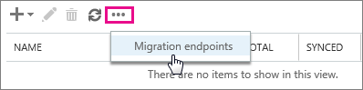
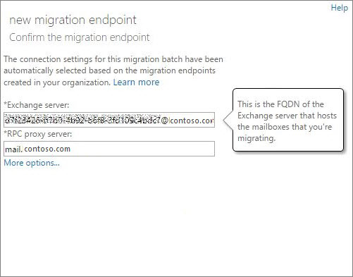
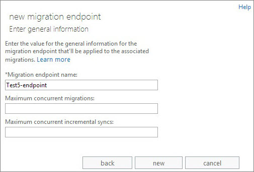
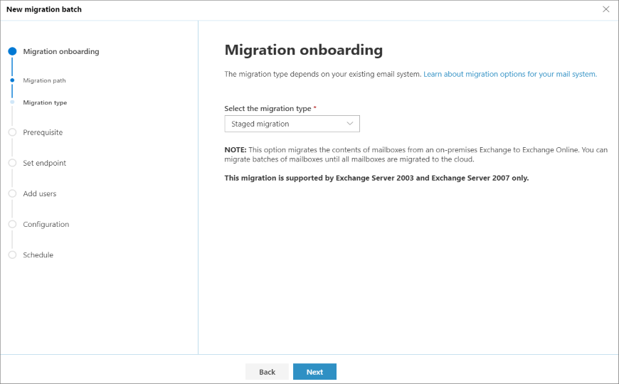
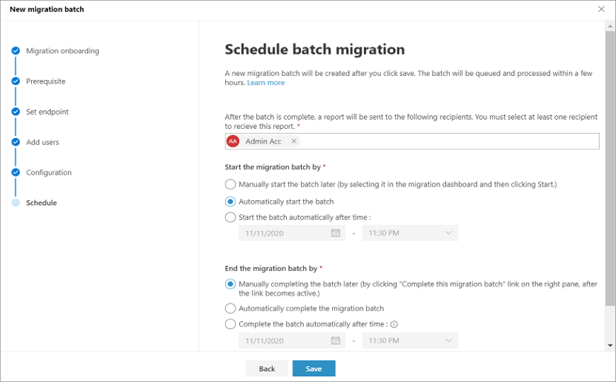
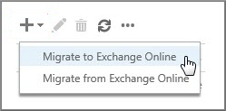
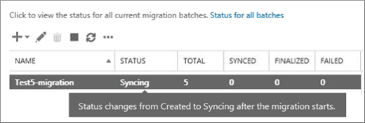

# Perform a staged migration of email

You can migrate the contents of user mailboxes from an Exchange 2003 or Exchange 2007 email to Microsoft 365 or Office 365 over time by using a staged migration.

This article walks you through the tasks involved with for a staged email migration. [What you need to know about a staged email migration](../what-to-know-about-a-staged-migration.md) gives you an overview of the migration process. When you're comfortable with the contents of that article, use this one to begin migrating mailboxes from one email system to another.

For Windows PowerShell steps, see [Use PowerShell to perform a staged migration](https://docs.microsoft.com/office365/enterprise/powershell/use-powershell-to-perform-a-staged-migration-to-office-365).

## Migration Tasks

Here are the tasks to do when you're ready to get started with your staged migration.

1. [Prepare for a staged migration](#prepare-for-a-staged-migration)

2. [Verify you own the domain](#verify-you-own-the-domain)

3. [Use directory synchronization to create users](#use-directory-synchronization-to-create-users-in-microsoft-365-or-office-365)

4. [Create a list of mailboxes to migrate](#create-a-list-of-mailboxes-to-migrate)

5. [Connect Microsoft 365 or Office 365 to your email system](#connect-microsoft-365-or-office-365-to-your-email-system)

6. [Migrate your mailboxes](#migrate-your-mailboxes)

7. [Start the staged migration batch](#start-the-staged-migration-batch)

8. [Convert on-premises mailboxes to mail-enabled users so that migrated users can get to their email](#convert-on-premises-mailboxes-to-mail-enabled-users-so-that-migrated-users-can-get-to-their-email)

9. [Route your email directly to Microsoft 365 or Office 365](#route-your-email-directly-to-microsoft-365-or-office-365)

10. [Delete the staged migration batch](#delete-the-staged-migration-batch)

11. [Complete post migration tasks](#complete-post-migration-tasks)

## Prepare for a staged migration

Before you migrate mailboxes to Microsoft 365 or Office 365 by using a staged migration, there are a few changes you must make first to your Exchange Server environment.

**To prepare for a staged migration**:

1. **Configure Outlook Anywhere on your on-premises Exchange Server**: The email migration service uses Outlook Anywhere (also known as RPC over HTTP), to connect to your on-premises Exchange Server. For information about how to set up Outlook Anywhere for Exchange 2007, and Exchange 2003, see the following:

   - [Exchange 2007: How to Enable Outlook Anywhere](https://docs.microsoft.com/previous-versions/office/exchange-server-2007/bb123889(v=exchg.80))

   - [How to configure Outlook Anywhere with Exchange 2003](https://docs.microsoft.com/previous-versions/office/exchange-server-2007/aa996922(v=exchg.80))

    > [!IMPORTANT]
    > You must use a certificate issued by a trusted certification authority (CA) with your Outlook Anywhere configuration. Outlook Anywhere can't be configured with a self-signed certificate. For more information, see [How to configure SSL for Outlook Anywhere](https://docs.microsoft.com/previous-versions/office/exchange-server-2007/aa995982(v=exchg.80)).

2. **(Optional) Verify that you can connect to your Exchange organization using Outlook Anywhere**: Try one of the following methods to test your connection settings.

   - Use Outlook from outside your corporate network to connect to your on-premises Exchange mailbox.

   - Use the [Microsoft Exchange Remote Connectivity Analyzer](https://docs.microsoft.com/connectivity-analyzer/exchange-remote-connectivity-analyzer-tool) to test your connection settings. Use the Outlook Anywhere (RPC over HTTP) or Outlook Autodiscover tests.

   - Wait for the connection to automatically be tested when you [Connect Microsoft 365 or Office 365 to your email system](#connect-microsoft-365-or-office-365-to-your-email-system) later in this procedure.

3. **Set permissions**: The on-premises user account that you use to connect to your on-premises Exchange organization (also called the migration administrator) must have the necessary permissions to access the on-premises mailboxes that you want to migrate to Microsoft 365 or Office 365. This user account is used when you [Connect Microsoft 365 or Office 365 to your email system](#connect-microsoft-365-or-office-365-to-your-email-system) later in this procedure.

4. To migrate the mailboxes, the admin must have one of the following permission sets:

   - Be assigned the **FullAccess** permission for each on-premises mailbox and be assigned the **WriteProperty** permission to modify the **TargetAddress** property on the on-premises user accounts.

    or

   - Be assigned the **Receive As** permission on the on-premises mailbox database that stores user mailboxes, and the **WriteProperty** permission to modify the **TargetAddress** property on the on-premises user accounts.

    For instructions about how to set these permissions, see [Assign Exchange permissions to migrate mailboxes to Microsoft 365 or Office 365](../assign-permissions-for-migration.md).

5. **Disable Unified Messaging (UM)**: If UM is turned on for the on-premises mailboxes you're migrating, turn off UM before migration. Turn on UM for the mailboxes after migration is complete. For how-to steps, see [disable unified messaging](https://docs.microsoft.com/previous-versions/office/exchange-server-2007/bb124691(v=exchg.80)).

## Verify you own the domain

During the migration, the Simple Mail Transfer Protocol (SMTP) address of each on-premises mailbox is used to create the email address for a new Microsoft 365 or Office 365 mailbox. To run a staged migration, the on-premises domain must be verified as a domain you own in your Microsoft 365 or Office 365 organization.

**Use the domains wizard to verify you own the on-premises domain**:

1. Sign in to Microsoft 365 or Office 365 with your work or school account.

   > [!NOTE]
   > You must be a global admin in Microsoft 365 or Office 365 to complete these steps.

2. Choose **Setup** \> **Domains**.

3. On the **Manage domains** page, click **Add domain**  to start the domain wizard.

4. On the **Add a domain to Microsoft 365 or Office 365** page, choose **Specify a domain name and confirm ownership**.

5. Type the *domain name* (for example, Contoso.com) you use for your on-premises Exchange organization, and then choose **Next**.

6. On the **confirm that you own \<your domain name\>** page, select your Domain Name System (DNS) hosting provider from the list or select **General Instructions**, if applicable.

7. Follow the instructions provided for your DNS hosting provider. The TXT record usually is chosen to verify domain ownership.

   You can also find the TXT or MX value specific to your Microsoft 365 or Office 365 organization by following instructions in [Gather the information you need to create Office 365 DNS records](https://docs.microsoft.com/microsoft-365/admin/get-help-with-domains/information-for-dns-records).

   After you add your TXT or MX record, wait about 15 minutes before proceeding to the next step.

8. In the Microsoft 365 or Office 365 domain wizard choose **done, verify now**, and you should see a verification page. Choose **Finish**.

   If you do not see the verification page, wait awhile, and try again.

   Do not continue to the next step in the domain wizard. You now have verified that you own the on-premises Exchange organization domain, and are ready to continue with an email migration.

## Use directory synchronization to create users in Microsoft 365 or Office 365

You use directory synchronization to create all the on-premises users in your Microsoft 365 or Office 365 organization.

You will need to license the users after they're created. You have 30 days to add licenses after the users are created. For steps to add licenses, see the [Complete post migration tasks](#complete-post-migration-tasks) section later in this topic.

**To create new users**:

You can use either the Microsoft Azure Active Directory Synchronization Tool or the Microsoft Azure Active Directory Sync Services (AAD Sync) to synchronize and create your on-premises users in Microsoft 365 or Office 365. After mailboxes are migrated to Microsoft 365 or Office 365, you'll manage user accounts in your on-premises organization and they're synchronized with your Microsoft 365 or Office 365 organization. For more information, see [What is hybrid identity with Azure Active Directory?](https://docs.microsoft.com/azure/active-directory/hybrid/whatis-hybrid-identity).

## Create a list of mailboxes to migrate

After you identify the users whose on-premises mailboxes you want to migrate to Microsoft 365 or Office 365, you'll use a comma-separated value (CSV) file to create a migration batch. Each row in the CSV file (used by Microsoft 365 or Office 365 to run the migration) contains information about an on-premises mailbox.

> [!NOTE]
> There isn't a limit for the number of mailboxes that you can migrate to Microsoft 365 or Office 365 using a staged migration. The CSV file for a migration batch can contain a maximum of 2,000 rows. To migrate more than 2,000 mailboxes, create additional CSV files and use each file to create a new migration batch.

### Supported attributes

The CSV file for a staged migration supports the following three attributes. Each row in the CSV file corresponds to a mailbox and must contain a value for each of these attributes.

|**Attribute**|**Description**|**Required?**|
|:-----|:-----|:-----|
|EmailAddress|Specifies the primary SMTP email address, for example, pilarp@contoso.com, for on-premises mailboxes. <br/> Use the primary SMTP address for on-premises mailboxes and not user IDs from the Microsoft 365 or Office 365. For example, if the on-premises domain is named contoso.com but the Microsoft 365 or Office 365 email domain is named service.contoso.com, you would use the contoso.com domain name for email addresses in the CSV file.|Required|
|Password|The password to be set for the new Microsoft 365 or Office 365 mailbox. Any password restrictions that are applied to your Microsoft 365 or Office 365 organization also apply to the passwords included in the CSV file.|Optional|
|ForceChangePassword|Specifies whether a user must change the password the first time they sign in to their new Microsoft 365 or Office 365 mailbox. Use **True** or **False** for the value of this parameter. Note that if you've implemented a single sign-on solution by deploying Active Directory Federation Services (AD FS) 2.0 (AD FS 2.0) or greater in your on-premises organization, you must use **False** for the value of the **ForceChangePassword** attribute.|Optional|

### CSV file format

Here's an example of the format for the CSV file. In this example, three on-premises mailboxes are migrated to Microsoft 365 or Office 365.

The first row, or header row, of the CSV file lists the names of the attributes, or fields, specified in the rows that follow. Each attribute name is separated by a comma.

```CSV
EmailAddress,Password,ForceChangePassword
pilarp@contoso.com,Pa$$w0rd,False
tobyn@contoso.com,Pa$$w0rd,False
briant@contoso.com,Pa$$w0rd,False
```

Each row under the header row represents one user and supplies the information that will be used to migrate the user's mailbox. The attribute values in each row must be in the same order as the attribute names in the header row.

Use any text editor, or an application like Excel, to create the CSV file. Save the file as a .csv or .txt file.

> [!NOTE]
> If the CSV file contains non-ASCII or special characters, save the CSV file with UTF-8 or other Unicode encoding. Depending on the application, saving the CSV file with UTF-8 or other Unicode encoding may be easier when the system locale of the computer matches the language used in the CSV file.

## Connect Microsoft 365 or Office 365 to your email system

A migration endpoint contains the settings and credentials needed to connect the on-premises server that hosts the mailboxes you're migrating with Microsoft 365 or Office 365. For a staged migration, you create an Outlook Anywhere migration endpoint. One migration endpoint is created to use for all of your migration batches.

**To create a migration endpoint in Classic Exchange admin center**:

1. Go to the Classic Exchange admin center, and navigate to **Migration** > **Batch**.

2. In the Exchange admin center, go to **Recipients** \> **Migration**.

3. Choose **More**  \> **Migration endpoints**.

   

4. On the **Migration endpoints** page, choose **New** .

5. On the **Select the migration endpoint type** page, choose **Outlook Anywhere** \> **Next**.

6. On the **Enter on-premises account credentials** page, enter the following information:

   - **Email address**: Type the *email address* of any user in the on-premises Exchange organization that will be migrated. Microsoft 365 or Office 365 will test the connectivity to this user's mailbox.

   - **Account with privileges**: Type the *username* (domain\username format or an email address) for an account that has the necessary administrative permissions in the on-premises organization. Microsoft 365 or Office 365 will use this account to detect the migration endpoint and to test the permissions assigned to this account by attempting to access the mailbox with the specified email address.

   - **Password of account with privileges**: Type the *password* for the account with privileges that is the administrator account.

7. Choose **Next** and then do one of the following:

   - If Microsoft 365 or Office 365 successfully connects to the source server, the connection settings are displayed. Choose **Next**.

    

   - If the test connection to the source server isn't successful, provide the following information:

   - **Exchange server**: Type the *fully qualified domain name* (FQDN) for the on-premises Exchange Server. This is the host name for your Mailbox server; for example, EXCH-SRV-01.corp.contoso.com.

   - **RPC proxy server**: Type the *FQDN* for the RPC proxy server for Outlook Anywhere. Typically, the proxy server is the same as your Outlook on the web (formerly known as Outlook Web App) URL. For example, mail.contoso.com, which is also the URL for the proxy server that Outlook uses to connect to an Exchange Server

8. On the **Enter general information** page, type a *Migration endpoint name*, for example, Test5-endpoint. Leave the other two boxes blank to use the default values.

   

9. Choose **New** to create the migration endpoint.

   To validate your Exchange Online is connected to the on-premises server, you can run the command in Example 4 of [Test-MigrationServerAvailability](https://docs.microsoft.com/powershell/module/exchange/Test-MigrationServerAvailability).

> [!NOTE]
> For new EAC, the **Migration endpoints** can be created during the creation of a new migration batch. For more information, continue to the section, **Create a staged migration batch in new Exchange admin center (New EAC)**.

## Migrate your mailboxes

You create and then run a migration batch to migrate mailboxes to Microsoft 365 or Office 365.

### Create a staged migration batch in new Exchange admin center (New EAC)

1. In the new [Exchange Admin center](https://admin.exchange.microsoft.com/#/), navigate to **Migration** > **Batch**.

2. Click **New Migration batch** and follow the instructions in the details pane.

3. In **Migration Onboarding** section, enter the batch name, select the mailbox migration path and click **Next**.

4. Select the migration type as **Staged migration** from the drop-down list and click **Next**.

   
   
5. In **Prerequisites** section, read the following and click **Next**. 
    
6. In **Set endpoint** section, you can either create a new migration endpoint or select the migration endpoint from the drop-down list:

    a. Select **Create a new migration endpoint** and follow the instructions to create the endpoints.
    
    b. Select the migration endpoint from the drop-down list and click **Next**.
    
    
    
7. Select and upload a CSV file containing the set of all of the users you want to migrate. You will need its filename below. The allowed headers are:

    - EmailAddress (required). Contains the primary email address for an existing Microsoft 365 or Office 365 mailbox.

    - Username (optional). Contains the Gmail primary email address, if it differs from EmailAddress.

      ```CSV
      EmailAddress
      will@fabrikaminc.net
      user123@fabrikaminc.net
      ```
8. In **Add user mailboxes** section, import the CSV file and click **Next**.

9. In **Move configuration** section, enter the details and click **Next**.

10. In **Schedule batch migration** section, verify all the details, click **Save**, and then click **Done**.

    
    
    The batch status changes from **Syncing** to **Synced**, you can complete the batch. 
    
11. To complete the batch, select the migration group.

12. In the details pane, select the preferred option to complete the batch and click **Save**.

    The batch status will then be **Completed**.

### Create a staged migration batch in Classic Exchange admin center (Classic EAC)

For a staged migration, you migrate mailboxes in batches: one batch for each CSV file you created.

**To create a staged migration batch**:

1. In the Classic Exchange admin center, go to Recipients > Migration.

2. Choose **New**  \> **Migrate to Exchange Online**.

   

3. On the **Select a migration type** page, choose **Staged migration** \> **next**.

4. On the **Select the users** page, choose **Browse** and select the CSV file to use for this migration batch.

   After you select a CSV file, Microsoft 365 or Office 365 checks the CSV file to make sure that:

   - It isn't empty.

   - It uses comma-separated formatting.

   - It doesn't contain more than 2,000 rows.

   - It includes the required **EmailAddress** column in the header row.

   - All rows have the same number of columns as the header row.

   If any one of these checks fails, you'll get an error that describes the reason for the failure. At this point, you must fix any errors in the CSV file and resubmit it to create a migration batch. After the CSV file is validated, the number of users listed in the CSV file is displayed as the number of mailboxes to migrate.

5. Choose **next**.

6. On the **Confirm the migration endpoint** page, verify the migration endpoint information that is listed and then choose **next**.

   

7. On the **Move configuration** page, type the name (no spaces or special characters) of the migration batch, and then choose **next**. This name is displayed in the list of migration batches on the **Migration** page after you create the migration batch.

8. On the **Start the batch** page, choose one of the following:

   - **Automatically start the batch**: The migration batch is started as soon as you save the new migration batch. The batch starts with a status of **Syncing**.

   - **Manually start the batch later**: The migration batch is created but not started. The status of the batch is set to **Created**. To start a migration batch, select it on the migration dashboard and then choose **Start**.

9. Choose **new** to create the migration batch.

   The new migration batch is displayed on the migration dashboard.

### Start the staged migration batch

In Classic Exchange admin center, if you created a migration batch and configured it to be manually started, you can start it by using the Exchange Admin center.

**To start a staged migration batch**:

1. In the new Exchange admin center, go to **Migration** > **Batch**. On the migration dashboard, select the batch, and then click **Start Migration**.

2. In the Classic Exchange admin center, go to **Recipients** \> **Migration**. On the migration dashboard, select the batch, and then click **Start**.

3. If a migration batch starts successfully, its status on the migration dashboard changes to **Syncing**.

   

**Verify the migration step worked**:

You'll be able to follow the sync status in the migration dashboard. If there is an issue, you can view a log file that gives you more information about the errors.

You can also verify that the users get created in the Microsoft 365 admin center as the migration proceeds.

## Convert on-premises mailboxes to mail-enabled users so that migrated users can get to their email

After you have successfully migrated a batch of mailboxes, you need some way to let users get to their mail. A user whose mailbox has been migrated now has both a mailbox on-premises and one in Microsoft 365 or Office 365. Users who have a mailbox in Microsoft 365 or Office 365 will stop receiving new mail in their on-premises mailbox.

Because you are not done with your migrations, you are not yet ready to direct all users to Microsoft 365 or Office 365 for their email. So what do you do for those people who have both? What you can do is change the on-premises mailboxes that you've already migrated to mail-enabled users. When you change from a mailbox to a mail-enabled user, you can direct the user to Microsoft 365 or Office 365 for their email instead of going to their on-premises mailbox.

Another important reason to convert on-premises mailboxes to mail-enabled users is to retain proxy addresses from the Exchange Online mailboxes by copying proxy addresses to the mail-enabled users. This lets you manage cloud-based users from your on-premises organization by using Active Directory. Also, if you decide to decommission your on-premises Exchange organization after all mailboxes are migrated to Exchange Online, the proxy addresses you've copied to the mail-enabled users will remain in your on-premises Active Directory.

For more information and to download scripts that you can run to convert mailboxes to mail-enabled users, see the following:

- [Convert Exchange 2007 mailboxes to mail-enabled users](convert-exchange-2007-mailboxes.md)

- [Convert Exchange 2003 mailboxes to mail-enabled users](convert-exchange-2003-mailboxes.md)

## Optional: Repeat migration steps

You can run batches simultaneously or one by one. Do what is convenient for your schedule and ability to help people as they complete their migration. Remember, each migration batch has a limit of 2,000 mailboxes.

When you're done migrating everyone to Microsoft 365 or Office 365, you'll be ready to start sending email directly to Microsoft 365 or Office 365 and decommissioning your old email system.

## Optional: Reduce email delays

You don't need to do this task, but if you skip it, it might take longer for email to start showing up in the new Microsoft 365 or Office 365 mailboxes.

When people outside of your organization send you email, their email systems don't double-check where to send that email every time. Instead, their systems save the location of your email system based on a setting in your DNS server known as a time-to-live (TTL). If you change the location of your email system before the TTL expires, they'll try to send you email at the old location first before figuring out that the location changed. This can result in a mail delivery delay. One way to avoid this is to lower the TTL that your DNS server gives to servers outside of your organization. This will make the other organizations refresh the location of your email system more often.

Using a short interval, such as 3,600 seconds (one hour) or less, means that most email systems will ask for an updated location every hour. We recommend that you set the interval at least this low before you start the email migration. This allows all the systems that send you email enough time to process the change. Then, when you make the final switch over to Office 365, you can change the TTL back to a longer interval.

*The place to change the TTL setting is on your email system's mail exchanger record, also called an MX record*. This lives on your public facing DNS system. If you have more than one MX record, you need to change the value on each record to 3,600 or less.

If you need some help configuring your DNS settings, go to our [Create DNS records at any DNS hosting provider](https://docs.microsoft.com/microsoft-365/admin/get-help-with-domains/create-dns-records-at-any-dns-hosting-provider).

## Route your email directly to Microsoft 365 or Office 365

Email systems use a DNS record called an MX record to figure out where to deliver emails. During the email migration process, your MX record was pointing to your on-premises email system. Now that the email migration to Microsoft 365 or Office 365 is complete for all of your users, it's time to point your MX record to Microsoft 365 or Office 365. This helps ensure that incoming email is delivered to your Microsoft 365 or Office 365 mailboxes. Moving the MX record also let you turn off your old email system when you are ready.

For many DNS providers, we have [host-specific instructions](https://docs.microsoft.com/microsoft-365/admin/get-help-with-domains/set-up-your-domain-host-specific-instructions). If your DNS provider isn't included, or you want to get a sense of the general directions, we've provided [general MX record instructions](https://docs.microsoft.com/microsoft-365/admin/get-help-with-domains/create-dns-records-at-any-dns-hosting-provider) as well.

It can take up to 72 hours for the email systems of your customers and partners to recognize the changed MX record. Wait at least 72 hours before you proceed to the next task.

## Delete the staged migration batch

After you change the MX record and verify that all email is being routed to Microsoft 365 or Office 365 mailboxes, you can delete the staged migration batches. Verify the following before you delete a migration batch:

- All users in the batch are using their Microsoft 365 or Office 365 mailboxes. After the batch is deleted, mail sent to mailboxes on the on-premises Exchange Server isn't copied to the corresponding Microsoft 365 or Office 365 mailboxes.

- Microsoft 365 and Office 365 mailboxes were synchronized at least once after mail began being sent directly to them. To do this, make sure that the value in the **Last Synced Time** box for the migration batch is more recent than when mail started being routed directly to Microsoft 365 or Office 365 mailboxes.

When you delete a staged migration batch, the migration service cleans up any records related to the migration batch and then deletes the migration batch. The batch is removed from the list of migration batches on the migration dashboard.

**To delete the staged migration batch**:

1. In the new Exchange admin center, go to **Migration** > **Batch**. On the migration dashboard, select the batch, and then click **Delete**.

2. In the Classic Exchange admin center, go to **Recipients** \> **Migration**. On the migration dashboard, select the batch, and then click **Delete**.

## Complete post migration tasks

After migrating mailboxes to Microsoft 365 or Office 365, there are post-migration tasks that must be completed.

**To complete post-migration tasks**:

1. **Activate user accounts for the migrated accounts by assigning licenses**: If you don't assign a license, the mailbox is disabled when the grace period (30 days) ends. To assign a license in the Microsoft 365 admin center, see [Add users individually or in bulk](https://docs.microsoft.com/microsoft-365/admin/add-users/add-users).

2. **Create an Autodiscover DNS record so users can easily get to their mailboxes**: After all on-premises mailboxes are migrated to Microsoft 365 or Office 365, you can configure an Autodiscover DNS record for your Microsoft 365 or Office 365 organization to enable users to easily connect to their new Microsoft 365 or Office 365 mailboxes with Outlook and mobile clients. This new Autodiscover DNS record has to use the same namespace that you're using for your Microsoft 365 or Office 365 organization. For example, if your cloud-based namespace is cloud.contoso.com, the Autodiscover DNS record you need to create is autodiscover.cloud.contoso.com.

   Microsoft 365 or Office 365 uses a CNAME record to implement the Autodiscover service for Outlook and mobile clients. The Autodiscover CNAME record must contain the following information:

   - **Alias**: autodiscover

   - **Target**: autodiscover.outlook.com

    For more information, see [Add DNS records to connect your domain](https://docs.microsoft.com/microsoft-365/admin/get-help-with-domains/create-dns-records-at-any-dns-hosting-provider).

3. **Decommission on-premises Exchange servers**: After you've verified that all email is being routed directly to the Microsoft 365 or Office 365 mailboxes, have completed the migration, and no longer need to maintain your on-premises email organization, you can uninstall Exchange.

   For more information, see the following:

   - [How to Remove an Exchange 2007 Organization](https://docs.microsoft.com/previous-versions/office/exchange-server-2007/aa998313(v=exchg.80))

   - [How to Uninstall Exchange Server 2003](https://docs.microsoft.com/previous-versions/tn-archive/bb125110(v=exchg.65))

   > [!NOTE]
   > Decommissioning Exchange can have unintended consequences. Before decommissioning your on-premises Exchange organization, we recommend that you contact Microsoft Support.

## See also

[What you need to know about a staged email migration to Microsoft 365 or Office 365](../what-to-know-about-a-staged-migration.md)

[Ways to migrate email to Microsoft 365 or Office 365](../mailbox-migration.md)
