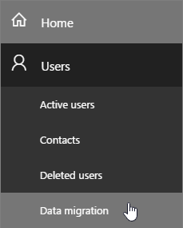
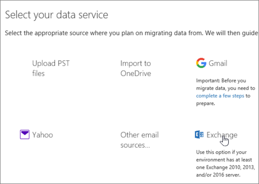
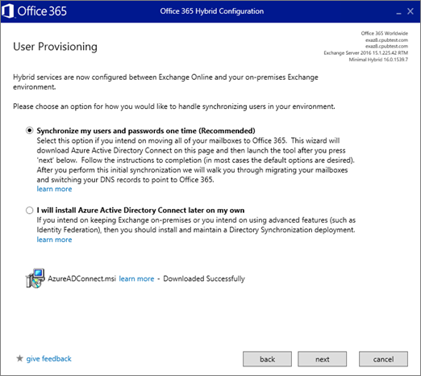

# Use Minimal Hybrid to quickly migrate Exchange mailboxes to Office 365

You can use the minimal hybrid, also known as express migration, option in the Exchange Hybrid Configuration Wizard to migrate the contents of user mailboxes to Office 365 over a course of couple of weeks or less.

## Pre-requisites

Use minimal hybrid to migrate emails if you:

-  Are running at least one Exchange 2010, Exchange 2013, and/or Exchange 2016 server on-premises.

- Plan to move to Exchange Online over a course of few weeks or less.

- Do not plan to continue to run directory synchronization to manage your users.

## Step 1: Verify you own the domain

During the migration, the Simple Mail Transfer Protocol (SMTP) address of each on-premises mailbox is used to create the email address for a new Office 365 mailbox. To run an express migration, the on-premises domain must be a verified domain in your Office 365 organization.

1. Sign in to Office 365 with your work or school account.

2. Choose **Setup** \> **Domains**.

3. On the **Domains-** page, click **Add domain** to start the domain wizard.

    

4. On the **Add a domain** page, type in the domain name (for example, Contoso.com) you use for your on-premises Exchange organization, and then choose **Next**.

5. On the **Verify domain** page, select either **Sign in to GoDaddy** (if your DNS records are managed by GoDaddy) or **Add a TXT record instead** for any other registrars \> **Next**.

6. Follow the instructions provided for your DNS hosting provider. The TXT record usually is chosen to verify ownership.

    You can also find the instructions in [Create DNS records at any DNS hosting provider for Office 365](https://support.office.com/article/7b7b075d-79f9-4e37-8a9e-fb60c1d95166).

    After you add your TXT or MX record, wait about 15 minutes before proceeding to the next step.

7. In the Office 365 domain wizard, choose **done, verify now**, and you'll see a verification page. Choose **Finish**.

    If the verification fails at first, wait awhile, and try again.

    **Do not continue to the next step in the domains wizard**. You now have verified that you own the on-premises Exchange organization domain and are ready to continue with an email migration.

    You will finish setting up your domain after the migrations are complete.

## Step 2: Start express migration

On a computer that is domain joined to your on-premises organization, sign in to your Office 365 account by using your global admin credentials, and start the Exchange Hybrid Configuration Wizard on the **Data migration** page of the Office 365 admin page.

1. In the Office 365 Admin center, go to **Setup** \> **Data migration**.

    

2. **Migration** page, under **Select your data service**, choose **Exchange**.

    

3. On the first **Hybrid Configuration Wizard** page, choose **next** and on the **On-premises Exchange Server Organization** page, accept the default values and choose **next**.

    By default the wizard connects to the Exchange server running the latest version.

4. On the Credentials page, choose **Use current Windows credentials** for on-premises Exchange server, and enter admin credentials for it and your Office 365 tenant choose **next**, and then choose **next** again once the connections and credentials have validated.

5. On the **Hybrid Features** page, select **Minimal Hybrid Configuration** \> **next**.

    

6. On the **Ready for Update** page, choose **update** to prepare the on-premises mailboxes for migration.

## Step 3: Run directory synchronization to create users in Office 365

1. On the **User Provisioning** page, select **Synchronize my users and passwords one time**.

    At this point you are prompted to download and install the **Azure AD Connect wizard** to synchronize your users from on-premises to Office 365.

2. Once Azure AD Connect has downloaded, run it and choose the **default options for [Express settings](https://go.microsoft.com/fwlink/p/?LinkID=698537)**.

    After synchronization is completed, you will be taken to the Office 365 **Data migration** page where you can see all of your users that were synchronized to Office 365.

    After the one-time synchronization is done, directory synchronization is turned off for your Office 365 tenant.

## Step 4: Give Office 365 licences to your users

After Azure AD connect synchronizes your users and their passwords to Office 365, you have to assign Office 365 licenses them so that they have a cloud mailbox to which to migrate their on-premises mailbox data.

The status on the **Data migration** page indicates that a license is needed as shown in the figure.

In the Admin center, go to **Users** \> **Active users** and follow these instructions to [Assign licenses to users in Office 365 for business](https://support.office.com/article/997596b5-4173-4627-b915-36abac6786dc).

## Step 5: Start migrating user mailbox data

After you assign licences to your users you can go to the Data migration page to start migrating their mailboxes.

1. Go to **Setup** \> **Data migration**, and on the **Migration** page choose **Exchange** for your data service.

2. On the **Data migration** page, select the users whose mailboxes you want to migrate and then choose **Start migration**.

    It is recommended that you migrate mailboxes for two or three users as a test before migrating all of your users to make sure everything works as expected.

    The Data migration page will display the migration status as it progresses. For a full list, see [Migration users status report](migration-users-status-report.md), which you can also view in the Exchange admin center.

## Step 6: Update DNS records

Email systems use a DNS record called an MX record to figure out where to deliver emails. During the email migration process, your MX record was pointing to your on-premises Exchange email system. Now that the email migration to Office 365 is complete, it's time to point your MX record at Office 365. You will also need to finish setting up your DNS records. In the Office 365 Admin center go to **Settings** \> **Domains** and then choose the domain name you want to update, for example contoso.com. The domains wizard will guide you through the update steps. See this article for instructions specific to your registrar or host: [Create DNS records at any DNS hosting provider for Office 365](https://support.office.com/article/7b7b075d-79f9-4e37-8a9e-fb60c1d95166#bkmk_add_mx).

## See also

[Office 365 migration performance and best practices](office-365-migration-best-practices.md)

[How to decommission Exchange servers in a Hybrid environment](https://go.microsoft.com/fwlink/p/?linkid=839914)

[Modify or remove Exchange 2010](https://go.microsoft.com/fwlink/p/?LinkId=217936)

[How to remove an Exchange 2007 organization](https://go.microsoft.com/fwlink/p/?LinkID=100485)

