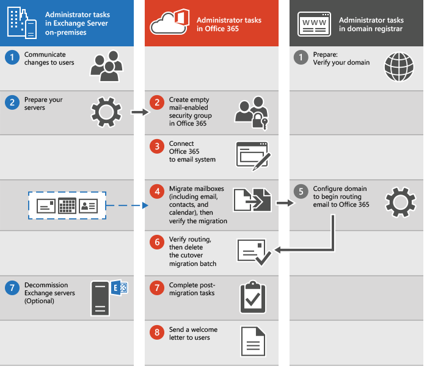

# What you need to know about a cutover email migration to Office 365

As part of an Office 365 deployment, you can migrate the contents of user mailboxes from a source email system to Office 365. When you do this all at one time, it's called a cutover migration. Choosing a cutover migration is suggested when:

- Your current on-premises Exchange organization is Microsoft Exchange Server 2003, Microsoft Exchange Server 2007, Microsoft Exchange Server 2010, Microsoft Exchange Server 2013, or Exchange Server 2016.

- Your on-premises Exchange organization has fewer than 2,000 mailboxes.

    > [!NOTE]
    > Even though cutover migration supports moving up to 2000 mailboxes, due to length of time it takes to create and migrate 2000 users, it is more reasonable to migrate 150 users or less.

If a cutover migration won't work for you, see [Ways to migrate email to Office 365](mailbox-migration.md) for other options.

## Things to consider

Setting up an email cutover migration to Office 365 requires careful planning. Before you begin, here are a few things to consider:

- You can move your entire email organization to Office 365 over a few days and manage user accounts in Office 365.

-  A maximum of 2,000 mailboxes can be migrated to Office 365 by using a cutover Exchange migration. However, it is recommended that you only migrate 150 mailboxes.

- The primary domain name used for your on-premises Exchange organization must be an accepted as a domain owned by you in your Office 365 organization.

-  After the migration is complete, each user who has an on-premises Exchange mailbox also will be a new user in Office 365. But you'll still have to assign licenses to users whose mailboxes are migrated.

## Impact to users

After your on-premises and Office 365 organizations are set up for a cutover migration, post-setup tasks could impact your users.

- **Administrators or users must configure desktop computers**: Make sure that desktop computers are updated and set up for use with Office 365. These actions allow users to use local user credentials to sign in to Office 365 from desktop applications. Users with permission to install applications can update and set up their own desktops. Or updates can be installed for them. After updates are made, users can send email from Outlook 2013, Outlook 2010, or Outlook 2007.

- **Potential delay in email routing**: Email sent to on-premises users whose mailboxes were migrated to Office 365 are routed to their on-premises Exchange mailboxes until the MX record is changed.

## How does cutover migration work?

The main steps you perform for a cutover migration are shown in the following illustration.

1. The administrator communicates upcoming changes to users and verifies domain ownership with the domain registrar.

2. The administrator prepares the servers for a cutover migration and creates empty mail-enabled security groups in Office 365.

3. The administrator connects Office 365 to the on-premises email system (this is called creating a migration endpoint).

4. The administrator migrates the mailboxes and then verifies the migration.

5. Grant Office 365 licences to your users.

6. The administrator configures the domain to begin routing email directly to Office 365.

7. The administrator verifies that routing has changed, and then deletes the cutover migration batch.

8. The administrator completes post-migration tasks in Office 365 (assigns licenses to users and creates an Autodiscover Domain Name System (DNS) record), and optionally decommissions the on-premises Exchange servers.

    See how-to steps in [Complete post migration tasks](cutover-migration-to-office-365.md#PostMigration).

9. The administrator sends a welcome letter to users to tell them about Office 365 and to describe how to sign in to their new mailboxes.

## Ready to start?

If you're comfortable setting up a migration to Office 365, here are the tasks that need to be done:

-  Set up Exchange Server by using the Exchange admin center.

- Change your organization's MX record to point to Office 365 when the migration is complete. Your MX record is how other mail systems find the location of your email system. Changing your MX record allows other mail systems to begin to send email directly to the new mailboxes in Office 365. We provide instructions on how to do this for many DNS providers. To set up your public DNS servers, you need to change your organization's MX record to point to Office 365 if you choose to route all incoming internet mail for your on-premises Exchange organization through Office 365.

If you're ready to begin a cutover migration, go to [Perform a cutover migration of email to Office 365](cutover-migration-to-office-365.md).

## See also

[Ways to migrate email to Office 365](mailbox-migration.md)

[Use PowerShell to perform a cutover migration to Office 365](https://go.microsoft.com/fwlink/p/?LinkId=615253)

