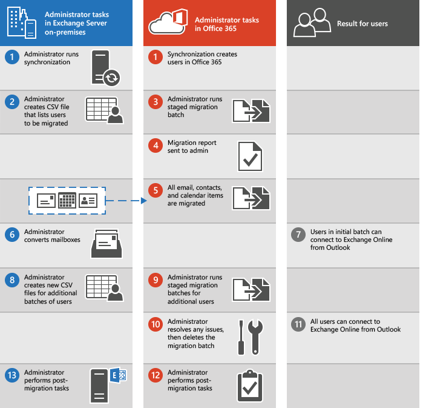

# What you need to know about a staged email migration to Office 365

As part of an Office 365 deployment, you can migrate the contents of user mailboxes from a source email system to Office 365. When you do this over time, it's called a staged migration. A staged migration is recommended when:

- Your source email system is Microsoft Exchange Server 2003 or Microsoft Exchange Server 2007.
    > [!NOTE]
    > Microsoft Exchange Server 2003 and Microsoft Exchange Server 2007 are out of support. Support for Exchange 2003 ended on April 8, 2014. Support for Exchange 2007 ended on April 11, 2017.

    > [!NOTE]
    > You can't use a staged migration to migrate Exchange 2013 or Exchange 2010 mailboxes to Office 365. Consider using a cutover migration or a hybrid email migration instead.

- You have more than 2,000 mailboxes.

If a staged email migration won't work for you, see [Ways to migrate email to Office 365](mailbox-migration.md) for other options.

## Things to consider

Here are a few items to be aware of:

- You must synchronize accounts between your on-premises Active Directory domain and Office 365 by using Azure Active Directory sync for a staged migration to work.

- The primary domain name used for your on-premises Exchange organization must be a domain verified to your Office 365 organization.

- You can migrate only user mailboxes and resource mailboxes. Other recipient types, such as distribution groups, contacts, and mail-enabled users are migrated to Office 365 through the process of directory synchronization.

- Out of Office messages aren't migrated with user mailboxes. If a user turns on the Out of Office feature before the migration, the feature will remain enabled on the migrated mailbox, but the Out of Office message is blank. People who send messages to the mailbox won't receive an Out of Office notification. To allow Out of Office notifications to be sent, the user needs to recreate the Out of Office message after the mailbox is migrated.

- If you limited the connections to your source email system, it's a good idea to increase them to improve migration performance. Common connection limits include client/server total connections, per-user connections, and IP address connections on either the server or the firewall. If you didn't limit these connections, you can skip this task.

## Impact of migration to users

- **Administrators can access email**: To migrate email, you need access to the user mailboxes in your source email system.

- **Users must create new Outlook profiles**: After the mailboxes are migrated and the on-premises accounts are converted to mail-enabled accounts, the users must create a new Office 365 profile in Outlook, and then Outlook automatically connects to Office 365.

## How does staged migration work?

The main steps you perform for a staged migration, and the results for your users, are shown in the following illustration.

Here's a description of the staged migration shown in the illustration.

1. The administrator synchronizes the list of users between their on-premises environment and Office 365.

    See how-to steps in [Prepare for a staged migration](perform-a-staged-migration/perform-a-staged-migration.md#PrepareforCutover).

2. The administrator creates a comma-separated value (CSV) file that contains a row for each user whose on-premises mailbox will be migrated in the migration batch.

    See how-to steps in [ Create a list of mailboxes to migrate ](perform-a-staged-migration/perform-a-staged-migration.md#BKMK_Step3).

3. The administrator creates and runs a staged migration batch by using the migration dashboard in the Exchange admin center.

    See how-to steps in [Connect Office 365 to your email system](perform-a-staged-migration/perform-a-staged-migration.md#CreateEndpoint), [Migrate your mailboxes](perform-a-staged-migration/perform-a-staged-migration.md#BKMK_Step7), and [Start the staged migration batch](perform-a-staged-migration/perform-a-staged-migration.md#StartMigBatch).

    After the administrator starts the migration batch, Exchange Online does the following:

  - Verifies that directory synchronization is enabled.

  - Checks that a mail-enabled user exists in the Office 365 organization for each user listed in the CSV file. Mail-enabled users are created in Office 365 as a result of the directory synchronization process.

  - Converts the Office 365 mail-enabled user to an Exchange Online mailbox for each user in the migration batch.

  - Begins initial synchronization. Exchange Online processes up to *N*  migration requests at one time. *N*  represents the maximum number of concurrent migrations that the administrator specified when creating the migration endpoint used for the migration batch. By default, initial synchronization is performed on 20 mailboxes at a time until all mailboxes in the migration batch are migrated.

  - Configures mail forwarding. The *TargetAddress*  property on the on-premises mailbox is configured with the email address of the Exchange Online mailbox. This process means that mail sent to the on-premises mailbox is forwarded to the corresponding Exchange Online mailbox.

4. After it creates the Exchange Online mailbox and configures mail forwarding for each user in the CSV file, Exchange Online sends a status email message to the administrator. This status message lists the number of mailboxes that were successfully migrated and how many couldn't be migrated. The message also includes links to migration statistics and error reports that contain more detailed information. At this point, users can start using their Exchange Online mailboxes.

5. As part of initial synchronization, Exchange Online then migrates all email messages, contacts, and calendar items from the on-premises mailboxes to Exchange Online mailboxes. Exchange Online sends a final migration report when the data migration is complete.

6. After a migration batch is complete and the administrator verifies that all mailboxes in the batch are successfully migrated, the administrator can convert the on-premises mailboxes to mail-enabled users.

    See how-to steps in [Convert on-premises mailboxes to mail-enabled users so that migrated users can get to their email](perform-a-staged-migration/perform-a-staged-migration.md#BKMK_Step8).

7. If a user opens their mailbox with Outlook, the Autodiscover service tries to connect to the on-premises mailbox. After you convert on-premises mailboxes to mail-enabled users, the Autodiscover service uses the mail-enabled user to connect Outlook to the Exchange Online mailbox after the user creates a new Outlook profile.

8. The administrator creates additional migration batches, submitting a CSV file for each one.

9. The administrator runs additional migration batches.

10. The administrator resolves any issues. After all on-premises mailboxes in a batch are successfully migrated, the administrator deletes the migration batch.

    See how-to steps in [Delete the staged migration batch](perform-a-staged-migration/perform-a-staged-migration.md#DeleteBatch).

11. Users can use their Exchange Online mailboxes.

12. The administrator, to complete the transition to Exchange Online and Office 365, performs post-configuration tasks such as:

  - Assign licenses to Office 365 users.

  - Configure the MX record to point to your Office 365 organization so that email is delivered directly to Exchange Online mailboxes.

  - Create an Autodiscover Domain Name System (DNS) record for your Office 365 organization.

    See how-to steps in [Route your email directly to Office 365](perform-a-staged-migration/perform-a-staged-migration.md#BKMK_Step14) and [Complete post migration tasks](perform-a-staged-migration/perform-a-staged-migration.md#PostMigrationstaged).

    The administrator can decommission the on-premises Exchange Servers (optional).

    > [!NOTE]
    > If you implement a single sign-on solution, it is strongly recommended that you maintain at least one Exchange Server so that you can access Exchange System Manager (Exchange 2003) or the Exchange Management Console/Exchange Management Shell (Exchange 2007) to manage mail-related attributes on the on-premises mail-enabled users. For Exchange 2007, the Exchange Server that you maintain should have the Hub Transport, Client Access, and Mailbox server roles installed.

## Ready to start?

If you're comfortable setting up a migration to Office 365, here are the tasks that need to be done.

- Using either Microsoft Azure Active Directory Synchronization Tool or Microsoft Azure Active Directory Sync Services (AAD Sync) to synchronize and create your on-premises users in Office 365.

-  Configuring Exchange Server by using the Exchange admin center.

- Changing your organization's MX record to point to Office 365 when the migration is complete. Your MX record is how other mail systems find the location of your email system. Changing your MX record allows other mail systems to begin to send email directly to the new mailboxes in Office 365.

To finish a staged email migration successfully, it's a good idea to be comfortable doing these tasks:

- You configure or verify that directory synchronization is working.

- You configure or verify that Outlook Anywhere is working.

- You create one or more lists of mailboxes to migrate in Excel.

- You use step-by-step wizards in Office 365 to configure and start the migration process.

- You add or change your organization's DNS records, such as the Autodiscover and MX records.

- You mail-enable on-premises mailboxes.

If you're ready to begin a staged email migration, you can use the steps given in [Perform a staged migration email to Office 365](perform-a-staged-migration/perform-a-staged-migration.md).

## See also

[Ways to migrate email to Office 365](mailbox-migration.md)

[Use PowerShell to perform a staged migration to Office 365](https://go.microsoft.com/fwlink/p/?LinkId=615255)

