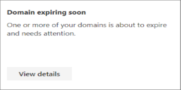
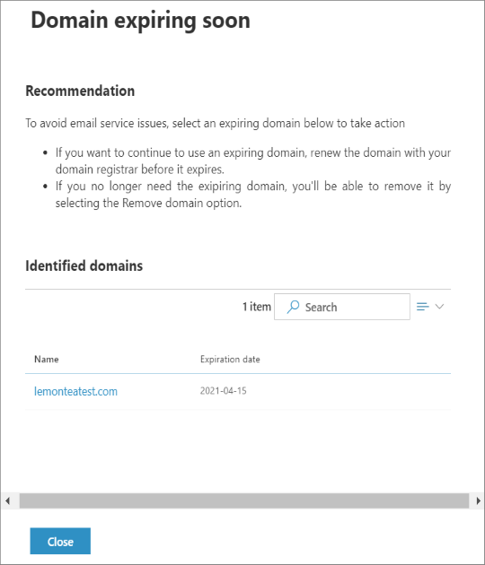

# Domain expiring insight in the new Exchange admin center

When you add your domain to Microsoft 365 or Office 365, it's called an accepted domain. Users in this accepted domain can send and receive mail. To keep a healthy mail flow, domains owned by customers should be active. Once domains expire, users configured under that domain will no longer receive emails. 

The **Domain expiring soon** insight in the **Insights** dashboard in the new Exchange admin center (new EAC) reports the domains that are about to expire and need necessary action to be taken.

You can click **View details** to see the identified domains that are about to expire listed in the details pane.

If a domain is expiring within 90 days, 60 days, or 30 days and less, it triggers an alert. A single alert could have multiple domains, for example, it may have one domain that is expiring in 90 days and another one that is expiring in 60, and so forth. These alerts are sent as email notifications to your registered email Ids.

These notifications list the domains that are expiring and require necessary action to be taken to avoid disruption in your mail flow. You can ignore the notifications if you've renewed/deleted the domain. 

You can also view these alerts in [new EAC](https://admin.exchange.microsoft.com) (new EAC), navigate to **Mail flow** > **View alerts**.

## Related article

[Mail flow insights in the modern Exchange admin center](mail-flow-insights.md)
