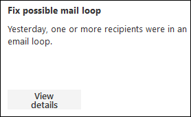
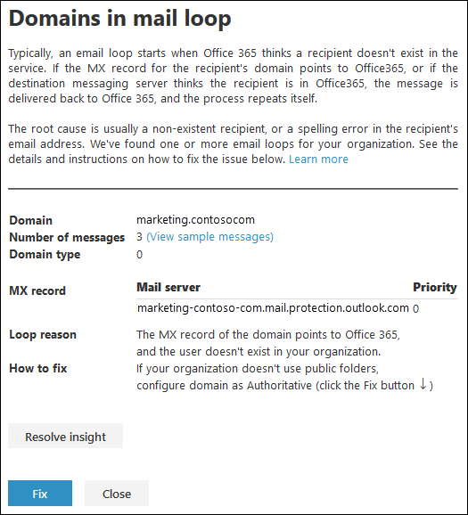

# Fix possible mail loop insight in the modern EAC

A mail loop is bad because it wastes system resources, consumes your organization's mail volume quota, and sends confusing non-delivery reports (also known as NDRs or bounce messages) to the original senders.

The **Fix possible mail loop** insight in the Insights dashboard in the modern Exchange admin center (modern EAC) reports when a mail loop is detected in your organization, the email domains that are involved in the loop, and the number of messages from the previous day that were in the loop.

You can click **View details** to see the details in a flyout where we identify the most common mail loop scenarios and provide the recommended actions (if available) to fix the loop.

To fix the issue, click **Fix**. To mark the issue as resolved, click **Resolve insight**. If you change your mind, click **Activate insight**.

## Related topics

For more information about other mail flow insights in the mail flow dashboard, see [Mail flow insights in the modern Exchange admin center](mail-flow-insights.md).
