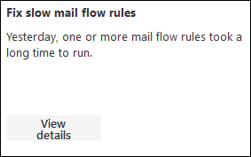
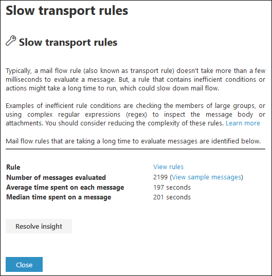

# Fix slow mail flow rules insight in the new EAC

Inefficient mail flow rules (also known as transport rules) can lead to mail flow delays for your organization. This insight reports mail flow rules that have an impact on your organization's mail flow. Examples of these types of rules are:

- Conditions that use **Is member of** for large groups.
- Conditions that use complex regular expression (regex) pattern matching.
- Conditions that use content checking in attachments.

The **Fix slow mail flow rules** insight in the Insights dashboard in the new Exchange admin center (new EAC) will notify you when a mail flow rule is taking too long to complete. You can use this notification to help you to identify and fine-tune mail flow rules to help reduce mail flow delays.

When you click **View details**, a flyout appears where you can review the rule by clicking **View rules**. You can also click **View sample messages** to see what kind of messages are impacted by the rule.

For more information about conditions and exceptions in mail flow rules in Exchange Online, see [Mail flow rule conditions and exceptions (predicates) in Exchange Online](../../security-and-compliance/mail-flow-rules/conditions-and-exceptions.md).

## Related topics

For more information about other mail flow insights in the mail flow dashboard, see [Mail flow insights in the new Exchange admin center](mail-flow-insights.md).
