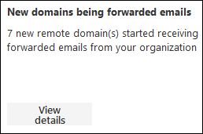
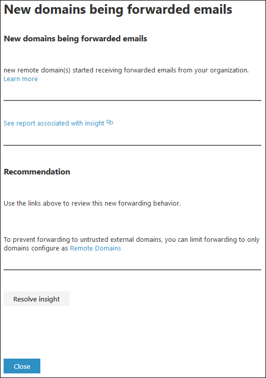

# New domains being forwarded email insight in the new EAC

Although you might have valid business reasons to forward email messages to external recipients in specific domains, it's suspicious when users in your organization suddenly start forwarding messages to external domains, and no one in the organization has ever forwarded messages to those domains (new domains).

The **New domains being forwarded email** insight in the Insights dashboard in the new Exchange admin center (new EAC) notifies you when users in your organization are forwarding messages to new domains.

When you click **View details**, a flyout appears where you can find more details about the forwarded messages, including a link to the [Auto forwarded messages report](../mail-flow-reports/mfr-auto-forwarded-messages-report.md) for more information.

To prevent automatic message forwarding to external domains, configure a remote domain for some or all external domains. For more information, see [Manage remote domains in Exchange Online](../../mail-flow-best-practices/remote-domains/manage-remote-domains.md).

If you suspect the accounts have been compromised, see [Responding to a compromised email account](https://docs.microsoft.com/microsoft-365/security/office-365-security/responding-to-a-compromised-email-account).

## Related topics

For more information about other mail flow insights in the mail flow dashboard, see [Mail flow insights in the new Exchange admin center](mail-flow-insights.md).
