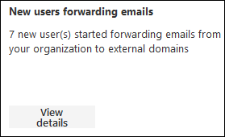
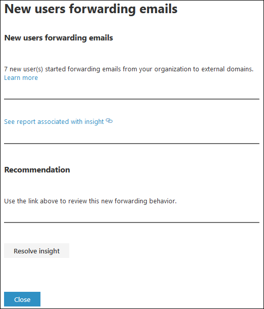

# New users forwarding email insight in the new EAC

It's suspicious when new user accounts in your organization suddenly start forwarding email messages to external domains.

The **New users fowarding email** insight in the Insights dashboard in the new Exchange admin center (new EAC) notifies you when new users accounts in your organization are forwarding messages to external domains.

When you click **View details**, a flyout appears where you can find more details about the forwarded messages, including a link to the [Auto forwarded messages report](../mail-flow-reports/mfr-auto-forwarded-messages-report.md) for more information.

If you suspect the accounts have been compromised, see [Responding to a compromised email account](https://docs.microsoft.com/microsoft-365/security/office-365-security/responding-to-a-compromised-email-account).

## Related topics

For more information about other mail flow insights in the mail flow dashboard, see [Mail flow insights in the new Exchange admin center](mail-flow-insights.md).
