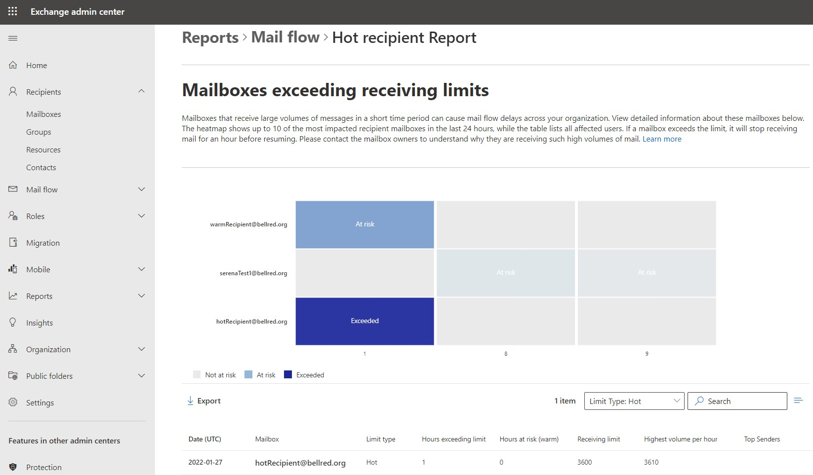

# Mailboxes exceeding receiving limits report in the new EAC in Exchange Online

In the new Exchange Center (EAC), the Mailboxes exceeding receiving limits report displays information on mailboxes that are receiving large volumes of messages in a short amount of time.

This report shows details on three categories of the Exchange Online receiving limit (see [Exchange Online limits](/office365/servicedescriptions/exchange-online-service-description/exchange-online-limits#receiving-and-sending-limits)):

  1. **Hot limit**: The general receiving limit. When a mailbox exceeds the overall receiving limit, they won’t receive any mail from the Internet or on-premises senders until the limit resets.
  
  2. **Sender-recipient pair limit**: The receiving limit per sender-recipient pair. When a mailbox exceeds the SRP limit, they won’t receive any mail from that sender, if the sender is from the Internet or on-premises.
  
  3. **Warm limit**: The logging-only limit that indicates when messages are ‘At risk’ of being blocked, set to 1000 messages per rolling hour. When a mailbox exceeds the warm limit, they are not yet impacted but will be displayed in reporting for admin awareness. 

> [!NOTE]
> For permissions that are required to use this report, see [Permissions required to view mail flow reports](mail-flow-reports.md#permissions-required-to-view-mail-flow-reports).

There are two sections to this report:

1. A heatmap that indicates:

    1. When a mailbox exceeded their receiving limit and can no longer receive mail until the limit is reset, which occurs 1 hour after the threshold is exceeded.

       - **Hot limit**: Mailboxes won't receive any mail from the Internet or on-premises senders if the overall receiving limit is exceeded.

    2. When a mailbox is at risk, which means they have exceeded one or both of the below limits. This mailbox has not exceeded the receiving (Hot) limit yet but is receiving large volumes of messages regularly.
    
       - **Sender-recipient pair (SRP) limit**: Mailboxes won't receive any mail from a specific sender if the mailbox has received too many messages from the sender. High volumes from specific senders should be paid attention to, as they can put the mailbox at risk of exceeding the receiving (Hot) limit.
       
       - **Warm limit**: When a mailbox has not exceeded their limit yet but is receiving large volumes of messages regularly.

2. A table that shows, in the selected time window:

   - The date
   
   - The impacted mailbox
   
   - The limit type (Hot, SRP, or Warm) based on the user’s filter selection
   
   - The number of hours a mailbox has exceeded the limit
   
   - The number of hours a mailbox is at risk 
   
   - The limit value, based on limit type
   
   - The maximum number of messages they received per hour
   
   - The top sender
   
  The report includes a filter on Limit type, allowing the user to display mailboxes that hit the Hot, SRP, or Warm limit separately. 

> [!NOTE]
> The default view is for the last 24 hours for all types. If no data is showing, that means you had no mailboxes exceeding the limit (or at risk) in the last 24 hours.
>
> The chart is limited to showing the top 10 mailboxes. If you'd like to see more mailboxes, you'll have to filter/search differently.

1. Use the **Limit type** filter to display mailboxes affected by the Hot, SRP, or Warm limit.

2. Click **Export** to download the data as a csv.

3. Select a mailbox address to view in detail the mailbox owner's contact information. Contact the mailbox owner to understand why their receiving so much email, so they can reduce their mail volume and have a better experience.
