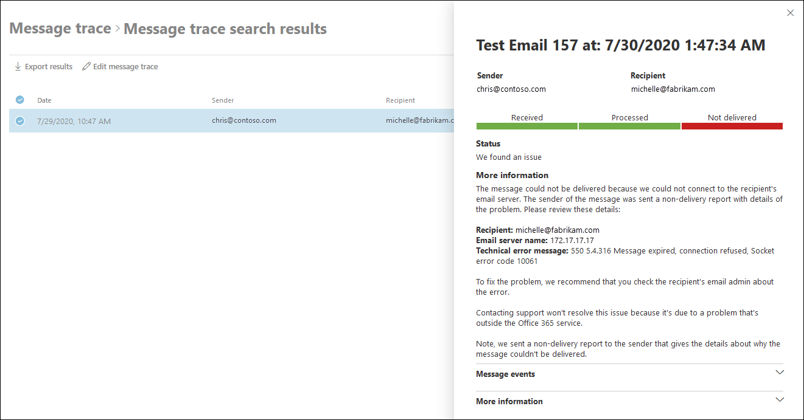

# Email issues for priority accounts report in the modern EAC

The **Email issues for priority accounts** report in the modern Exchange admin center (modern EAC) allows [admins or other users](mail-flow-insights.md#permissions-required-to-view-the-mail-flow-dashboard) to view failed and delayed email messages that were sent to or sent from priority accounts.

Priority users are people in your Microsoft 365 organization who have a high business impact, like your CEO, executives, or other users who have access to sensitive or high priority information. For more information about priority accounts, see [Manage and monitor priority account](https://docs.microsoft.com/microsoft-365/admin/setup/priority-accounts).

The **Unhealthy email status** section shows the following information about messages where a priority user is a sender or a recipient:

- **Date**
- **Sender**
- **Recipient**
- **Subject**
- **Status**: The value is **Failed** or **Delayed**.

To quickly filter the results by recipient, click **Search**  and start typing the recipient's email address.

For more advanced filtering, click **Filter**  and select **New filter**. In the **Custom filter** flyout that appears, enter the following information:

- **Name your filter**: Enter a unique name.

- Click **Add new clause**. A clause contains the following elements that you need to enter:

  - **Field**: Select **Date**, **Sender**, **Recipient**, **Subject** or **Status**.

  - **Operator**: Select **starts with** or **is**.

  - **Value**: Enter the value you want to search for.

  You can click **Add new clause** as many times as you need. Multiple clauses use AND logic (\<Clause1\> AND \<Clause2\>...).

  To remove a clause, click **Remove** 

  When you're finished, click **Save**. The new filter is automatically loaded, and the results are changed based on the filter. This is the same result as clicking **Filter** and selecting the customer filter from the list.

  To unload a existing filter (return to the default list), click **Filter**  and select **Clear all filters**.

Select an entry in the list to be taken to the [message trace](../../monitoring/trace-an-email-message/message-trace-modern-eac.md) search results for the message. Select the message trace entry to view details about the message and what happened to it.

Click **Export** to export the displayed results to a .csv file.

Click **Manage priority accounts** to add or remove users from the priority accounts list.

Click **Edit policy** to configure email notifications related to priority accounts:

- **Send email notification**: Select or clear this checkbox.

- **Send email notifications ot these users or groups**: Click in the box to find or enter a user or group to receive email notifications.

- **Daily notification limit**: Select from the following values: **No limit**, 1 (default), 5, 10, 25, 50, 150, or 200.
  
- **Threshold**: An email notification is sent when the number of failed or delayed email messages for priority accounts exceeds the specified value. The default value is 20.

When you're finished, click **Save**.
