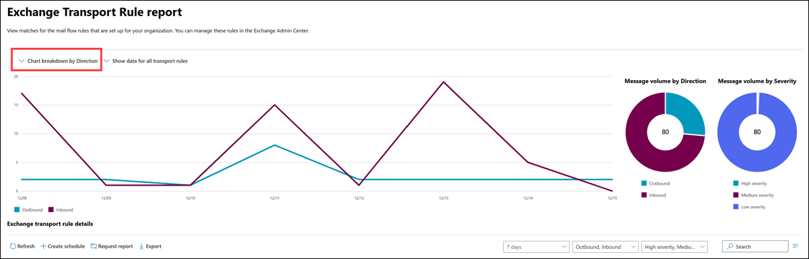

# Exchange transport rule report in the new Exchange admin center in Exchange Online

> [!NOTE]
> Currently, the Exchange transport rule report is not available in Microsoft 365 GCC or GCC High.

The **Exchange transport rule** report in the new Exchange admin center (new EAC) displays information on messages that were affected by mail flow rules (also known as transport rules).

> [!NOTE]
> By default, the report shows data for the last 7 days. If the report is empty, try changing the date range.
>
> For permissions that are required to use this report, see [Permissions required to view mail flow reports](mail-flow-reports.md#permissions-required-to-view-mail-flow-reports).

To view the report in the new EAC at <https://admin.exchange.microsoft.com>, go to **Reports** \> **Mail flow** \> and then select **Exchange transport rule report** on the **Mail flow reports** page. To go directly to the report, open <https://admin.exchange.microsoft.com/#/reports/transportruledetails>.

By default, **Chart breakdown by Severity** is selected, and the follow charts are shown:

- A line graph that shows the number of inbound and outbound messages per day that were affected by mail flow rules.\*
- **Message volume by direction**: A doughnut graph that shows the total number of message and portion of **Outbound** and **Inbound** messages that were affected by mail flow rules.*\*\*
- **Message volume by severity** A doughnut graph that shows the total number of message and portion of messages that were affected by **High severity**, **Medium severity**, and **Low severity** mail flow rules.\*\*

\* If you hover over the line on the chart for a specific day, you'll see the number of messages for that day.

\*\* If you hover over a specific color in the chart, you'll see the total number of messages in the category for the entire time period.

If you change the chart view to **Chart breakdown by severity**, the line graph changes to show the number of messages that were affected by **High severity**, **Medium severity**, and **Low severity** mail flow rules.

By default, **Show data for all transport rules** is selected, but if you click on that value, you can select a specific mail flow rule to show data for.

The following information is shown in the details table below the graph:

- **Date**
- **Transport rule**
- **Subject**
- **Sender address**
- **Recipient address**
- **Severity**
- **Direction**

You can sort the information in the details table by clicking on a column header.

To quickly filter the results by **Transport rule** or **Subject**, click **Search**  and start typing a value.

To filter the results, use the boxes. The following filters are available:

- Date: **7 days** is selected by default, but you can select **30 days**, **90 days** or a **Custom start date** that's less than 90 days.
- Direction: **Outbound, Inbound** is selected by default, but you can select either value by itself.
- Severity: **High severity, Medium severity, Low severity** are selected by default, but you can select one or more severity values.

Click **Export** to export the displayed results to a .csv file.

## See also

For more information about other mail flow reports, see [Mail flow reports in the new EAC](mail-flow-reports.md).
