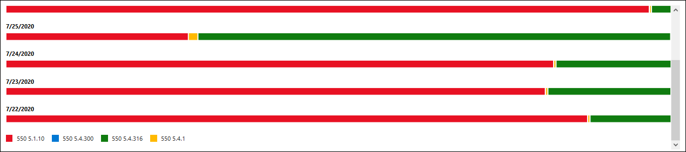

# Non-delivery details report in the new Exchange admin center

The **Non-delivery details report** in the new Exchange admin center (new EAC) shows the most-encountered error codes in non-delivery reports (also known as NDRs or bounce messages) for users in your organization. This report shows the details of NDRs so you can troubleshoot email delivery problems.

> [!NOTE]
> By default, the report shows data for the last 7 days. If the report is empty, try changing the date range.

The chart in the overview section contains the most-encountered NDR error codes for a given day. If you hover over a specific color in the chart, you'll see the number of messages for that specific error code.

The **Non-delivery details** section shows the following information for each date-error code combination:

- **Date**
- **Count**
- **Error code**
- **Sample messages**: This field contains the internet message IDs (also known as the Client IDs) of a sample of the original messages. This value is stored in the **Message-ID** header field in the message header and is constant for the lifetime of the message.

To quickly filter the results, click **Search**  and start typing a value.

To filter the results by date range or error code, use the boxes. You can specify a date range up to 90 days.

For more advanced filters that you can also save and use later, click **Filter**  and select **New filter**. In the **Custom filter** flyout that appears, enter the following information:

- **Name your filter**: Enter a unique name.

- Click **Add new clause**. A clause contains the following elements that you need to enter:

  - **Field**: Select **Date**, **Count**, **Error code** or **Sample messages**.

  - **Operator**: Select **starts with** or **is**.

  - **Value**: Enter the value you want to search for.

  You can click **Add new clause** as many times as you need. Multiple clauses use AND logic (\<Clause1\> AND \<Clause2\>...).

  To remove a clause, click **Remove** 

  When you're finished, click **Save**. The new filter is automatically loaded, and the results are changed based on the filter. This is the same result as clicking **Filter** and selecting the customer filter from the list.

  To unload a existing filter (return to the default list), click **Filter**  and select **Clear all filters**.

Click **Export** to export the displayed results to a .csv file.

## See also

For more information about other mail flow reports, see [Mail flow reports in the new EAC](mail-flow-reports.md).
