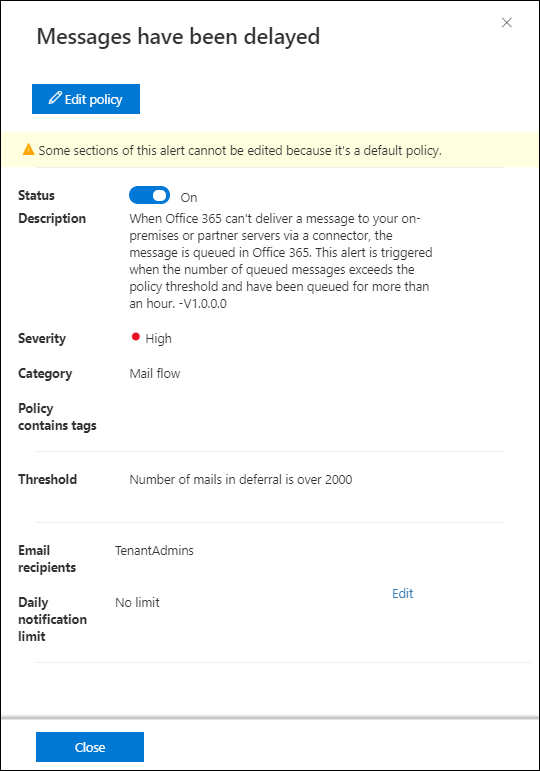
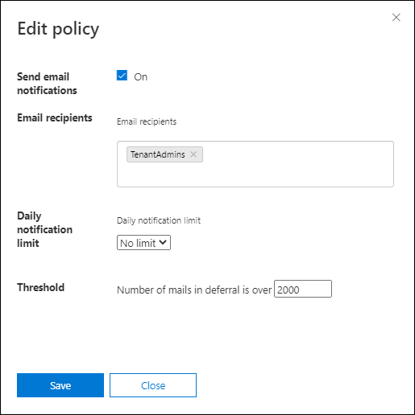
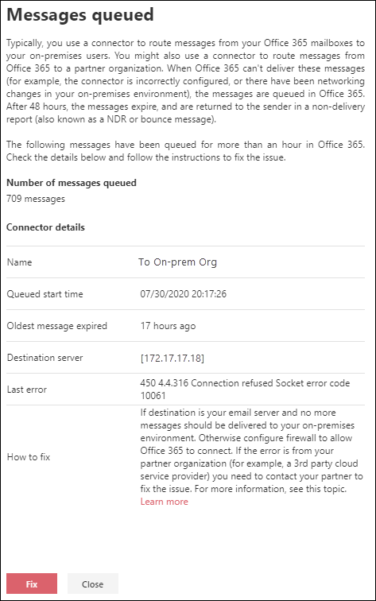

# Queued messages report in the new Exchange admin center

When messages can't be sent from your organization to your on-premises or partner email servers using connectors, the messages are queued in Microsoft 365. Common examples that cause this condition are:

- The connector is incorrectly configured.
- There have been networking or firewall changes in your on-premises environment.

Microsoft 365 will continue to retry to delivery for 24 hours. After 24 hours, the messages will expire and will be returned to the senders in non-delivery reports (also known as a NDRs or bounce messages).

If the queued email volume exceeds the pre-defined threshold (the default value is 200 messages), the information is available in the following locations:

- The **Queued messages report** report in the new Exchange admin center (new EAC). For more information, see the [Queues](#queues) section in this topic.
  
- An alert is displayed in **Recent alerts** the Alerts dashboard in the [Security & Compliance Center](https://protection.office.com) (**Alerts** \> **Dashboard** or <https://protection.office.com/alertsdashboard>).

  

- Admins will receive an email notification based on the configuration of the default alert policy named **Messages have been delayed**. To configure the notification settings for this alert, see the next section.

  For more information about alert policies, see [Alert policies in the Security & Compliance Center](https://docs.microsoft.com/microsoft-365/compliance/alert-policies).

## Customize queue alerts

1. In the [Security & Compliance Center](https://protection.office.com), go to **Alerts** \> **Alert policies** or open <https://protection.office.com/alertpolicies>.

2. On the **Alert policies** page, find and select the policy named **Messages have been delayed**.

3. In the **Message have been delayed** flyout that opens, you can turn the alert on or off and configure the notification settings.

   

   - **Status**: You can toggle the alert on or off.

   - **Email recipients** and **Daily notification limit**: Click **Edit** to configure the following settings:

4. To configure the notification settings, click **Edit**. In the **Edit policy** flyout that appears, configure the following settings:

   - **Send email notifications**: The default value is on.
   - **Email recipients**: The default value is **TenantAdmins**.
   - **Daily notification limit**: The default value is **No limit**.
   - **Threshold**: The default value is 200.

   

5. When you're finished, click **Save** and **Close**.

## Queues

Even if the queued message volume hasn't exceeded the threshold and generated an alert, you can still use the **Queued messages report** in the new EAC to see messages that have been queued for more than one hour, and take action before the number of queued messages becomes too large.

The same information and fix option is displayed after you click **View queue** in the details of a **Messages have been delayed** alert.

## See also

For more information about other mail flow reports, see [Mail flow reports in the new EAC](mail-flow-reports.md).
