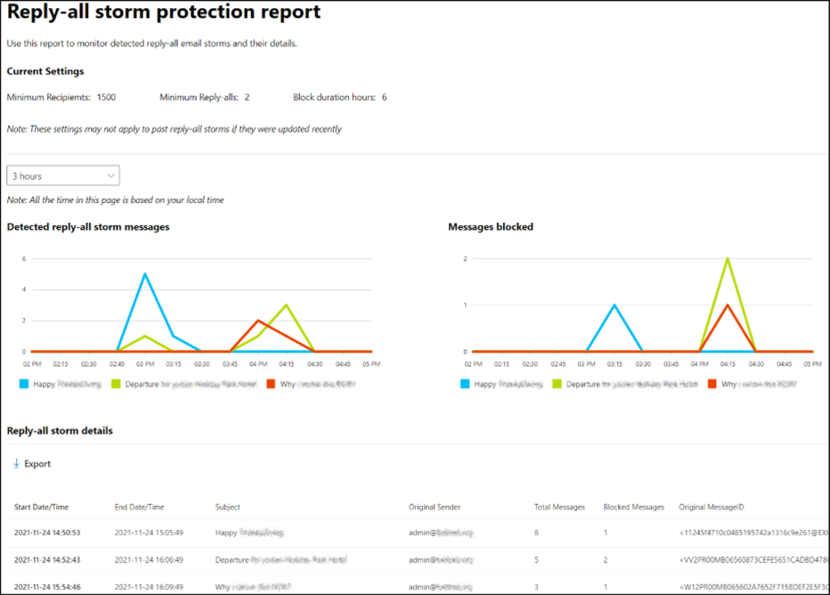

# Reply-all storm protection report in the new Exchange admin center in Exchange Online

The Reply-all storm protection report in the new Exchange admin center (new EAC), **Reports** > **Mail flow** section displays information about detected reply-all storms in your organization and the reply-all messages that were blocked. 

> [!NOTE]
> For more information on permissions that are required to use this report, see [Permissions required to view mail flow reports](/exchange/monitoring/mail-flow-reports/mail-flow-reports#permissions-required-to-view-mail-flow-reports).

The top of the report shows the current settings used by Reply-all Storm Protection for detecting and blocking reply-all messages during a reply-all storm.

 - Status
 - Minimum recipients
 - Minimum reply-alls
 - Block duration hours
 
To view the current feature settings here on the report, you must have read access to Transport configuration information (Get-TransportConfig) via the View-Only Configuration or Organization Transport Settings roles. Both the Organization Management and View-Only Organization Management role groups include both of these roles. For more information, see [View-only Organization Management](/exchange/view-only-organization-management-exchange-2013-help#:~:text=The%20View-Only%20Organization%20Management%20management%20role%20group%20is%2crequired%20to%20perform%20a%20given%20set%20of%20tasks).

Note that the current settings shown might not be the same as the settings that were used for past reply-all storms if they were previously changed. Changing the settings while a storm is happening might not apply those settings in time to affect the current storm, but it will apply to future storms.

Beneath the current settings is the time/date range drop-down from which you can select to view from 3 hours to 30 days of data (with the last 3 hours as the default). All times shown are based on your local time. 

The overview section shows these two charts: 

 - **Detected reply-all storm messages**
 - **Messages blocked**

The **Detected reply-all storm messages** chart shows the number of reply-all messages that were sent during the preceding time-interval for detected reply-all storms. For example, in the chart above the five reply-all messages for the "Happy Thanksgiving" storm shown at 3pm were detected between 2:45 and 3pm. While reply-all messages sent before a reply-all storm is detected won't get blocked, they're included in the **Detected reply-all storm messages** chart values, as are the messages that were blocked. 

> [!NOTE]
> This chart displays data only for declared reply-all storms where at least one reply-all message has been blocked. It can't be used to track potential storms before they're declared a reply-all storm.

The **Messages blocked** chart includes a subset of the messages shown in the **Detected reply-all storm messages** chart. It shows the number of reply-all messages blocked during the *Blocked duration hours* time frame.

Selecting any one of the reply-all storm names in either chart will pop up a side panel showing specific details about the selected reply-all storm, as shown below. 

The reply-all storm details panel includes the following information about the storm:

|Item|Description|
|---|---|
|**Subject**|The message subject of the initial message.|
|**Original Sender**|The sender of the first message in the conversation thread.|
|**Start Date/Time**|When the first reply-all message was sent.|
|**Total Messages**|The total number of messages in the conversation thread (includes the first message).|
|**Blocked Messages**|The total number of reply-all storm messages blocked by the feature. This is always lower than the total number of messages in the thread. In some cases it might be lower than you'd expect based on the feature's Minimum reply-alls setting. It can take up to a few minutes to synchronize the block enforcement notification to all relevant servers in the service. During that time, a few reply-alls could still get through before blocking kicks-in.|
|**Block Start Time**|Time when message blocking started.|
|**Message ID**|The Message ID of the first message in the conversation thread. Clicking on this link will open Message Trace in a new tab and run a query for this message.|
|**Reply-all senders**|Users who sent (or tried to send) a reply-all to the thread. Includes whether or not the message they sent was allowed through or blocked.|

The final section of the main report page, **Reply-all storm details**, shows a table of all the reply-all storms shown in the charts for the selected time range. It also includes the key details about each of the following:

 - **Start Date/Time**
 - **End Date/Time**
 - **Subject**
 - **Original Sender**
 - **Total Messages**
 - **Blocked Messages**
 - **Message ID**

Click **Export** to export the displayed results to a .csv file. 

## See also

For more information about other mail flow reports, see [Mail flow reports in the modern EAC](/exchange/monitoring/mail-flow-reports/mail-flow-reports).

