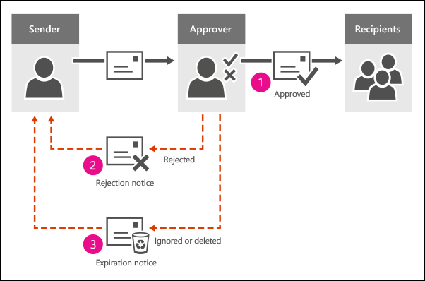

# Configure a moderated recipient in Exchange Online

In your Exchange Online organization, you may need to restrict access to specific recipients. The most common scenario is the need to control messages sent to large distribution groups. Depending on your organization's requirements, you may also need to control the messages sent to executive mailboxes or partner contacts. You can use moderated recipients to accomplish these tasks. When you configure a recipient for moderation, all messages sent to that recipient are subject to approval by the designated moderators.

## What do you need to know before you begin?

- Estimated time to complete: 15 minutes

- You need to be assigned permissions before you can perform this procedure or procedures. To see what permissions you need, see the"Moderated Transport" entry in the [Feature permissions in Exchange Online](../permissions-exo/feature-permissions.md) topic.

- You can use the Exchange admin center (EAC) to configure a distribution group for moderation. All other recipient types can only be configured for moderation using PowerShell. To learn how to use Windows PowerShell to connect to Exchange Online, see [Connect to Exchange Online PowerShell](/powershell/exchange/connect-to-exchange-online-powershell).

- For information about keyboard shortcuts that may apply to the procedures in this topic, see [Keyboard shortcuts for the Exchange admin center](../accessibility/keyboard-shortcuts-in-admin-center.md).

> [!TIP]
> Having problems? Ask for help in the Exchange forums. Visit the forums at [Exchange Online](/answers/topics/office-exchange-server-itpro.html) or [Exchange Online Protection](https://social.technet.microsoft.com/forums/forefront/home?forum=FOPE).

## Use the EAC to configure a moderated distribution group
<a name="EMCtoConfigureModeration"> </a>

This example configures the following moderation settings for the distribution group named All Employees:

- Enable moderation for the distribution group.

- Designate David Hamilton and Yossi Ran as moderators.

- Allow the members of the distribution group named HR to bypass moderation.

- Notify internal senders if their message to the distribution group is rejected, but do not send any notifications to external senders.

To accomplish the tasks in this example scenario, perform the following procedure:

1. In the EAC, navigate to **Recipients** \> **Groups**.
2. In the result pane, select the **All employees** distribution group and click **Edit** .
3. On the properties page, click **Message approval**, and complete the following:
   1. Select the **Messages sent to this group have to be approved by a moderator** check box.
   2. In the **Group moderators** list, click **Add** .
   3. In the **Select group moderators** dialog, find and select David Hamilton, click **Add**, find and select Yossi Ran, and click **Add**. When you are finished, click **OK**.
   4. In the **Senders who don't require message approval** list, click **Add** .
   5. In the **Select senders** dialog, find and select HR from the list and click **Add**. When you are finished, click **OK**.
   6. In **Select moderation notifications**, select **Notify all senders when their messages aren't approved**.
4. Click **Save**.

## Use Exchange Online PowerShell to configure a moderated recipient
<a name="EMCtoConfigureModeration"> </a>

Run the following command:

```PowerShell
Set-<RecipientType> <Identity> -ModerationEnabled $true -ModeratedBy <recipient1,recipient2...> -ByPassModerationFromSendersOrMembers <recipient1,recipient2...> -SendModerationNotifications <Never | Always | Internal>
```

This example configures the following moderation settings for the distribution group named All Employees:

- Enable moderation for the distribution group.
- Designate David Hamilton and Yossi Ran as moderators.
- Allow the members of the distribution group named HR to bypass moderation.
- Notify internal senders if their message to the distribution group is rejected, but do not send any notifications to external senders.

To accomplish the tasks in this example scenario, run the following command:

```PowerShell
Set-DistributionGroup "All Employees" -ModerationEnabled $true -ModeratedBy "David Hamilton","Yossi Ran" -ByPassModerationFromSendersOrMembers HR -SendModerationNotifications Internal
```

To add or remove users from the list of moderators or recipients who bypass moderation without affecting other entries, use the following syntax:

```PowerShell
Set-<RecipientType> <Identity> -ModeratedBy @{Add="<recipient1>","<recipient2>"...; Remove="<recipient1>","<recipient2>"...} -ByPassModerationFromSendersOrMembers @{Add="<recipient1>","<recipient2>"...; Remove="<recipient1>","<recipient2>"...}
```

This example configures the following moderation settings for the distribution group named All Employees:

- Add the user chris@contoso.com to the list of existing moderators.
- Remove the user michelle@contoso.com from the list of existing senders who bypass moderation.

```PowerShell
Set-DistributionGroup "All Employees" -ModeratedBy @{Add="chris@contoso.com"} -ByPassModerationFromSendersOrMembers @{Remove="michelle@contoso.com"
```

## How do you know this worked?

To verify that you have successfully configured a recipient for moderation, do the following:

1. Send a test message to the moderated recipient.
2. Verify the designated moderators receive notification.
3. Verify the recipients who bypass moderation receive the message directly.

## How the approval process works

When someone sends a message to a person or group that requires approval, if they're using Outlook on the web (formerly known as Outlook Web App), they're notified that their message might be delayed.


The moderator receives an email with a request to approve or reject the message. The text of the message includes buttons to approve or reject the message, and the attachment includes the original message to review.


The moderator can take one of three actions:

1. **Approve**: The message goes to the original intended recipients. The original sender isn't notified.

2. **Reject**: A rejection message is sent to the sender. The moderator can add an explanation:

    

3. **Ignore or delete the approval message** An expiration message is sent to the sender. In Exchange Online, the approval request expires after two days in Exchange Online.



The message that's waiting for approval gets temporarily stored in a system mailbox called the _arbitration mailbox_. The original message is kept in the arbitration mailbox until one of the following action occurs:

- The moderator approves or rejects the message.
- The moderator deletes the approval message.
- The moderator lets the approval message expire.

## Moderated recipient FAQ

### Q: What's the difference between a group moderator and a group owner?

A: The owner of a distribution group is responsible for managing the membership of the group. For example, an IT admin might be the owner of the All Employees distribution group, but the Human Resources manager might be set up as the moderator who's responsible for approving messages that are sent to the group.

Also, messages that the owner sends to the distribution group do not need to be approved by a moderator.

### Q: What happens when the moderator sends a message to the distribution group?

A: The message goes directly to the group, bypassing the approval process.

### Q: What happens when only a subset of recipients need approval?

A: Consider a message that's sent to 12 recipients, one of which is a moderated distribution group. The message is automatically split into two copies. One message is delivered immediately to the 11 recipients that don't require approval, and the second message is submitted to the approval process for the moderated distribution group.

If a message is intended for more than one moderated recipient, a separate copy of the message is automatically created for each moderated recipient and each copy goes through the appropriate approval process.

### Q: What if a distribution group contains moderated recipients that require approval?

A: A distribution group can include moderated recipients that also require approval. In this case, after the message to the distribution group is approved, a separate approval process occurs for each moderated recipient that's a member of the distribution group. However, you can also enable the automatic approval of the distribution group members after the message to the moderated distribution group is approved. To do this, you use the _BypassNestedModerationEnabled_ parameter on the [Set-DistributionGroup](/powershell/module/exchange/set-distributiongroup) cmdlet.

### Q: Is this process different if we have our own Exchange servers?

A: By default, one arbitration mailbox is used for each on-premises Exchange organization. If you have your own Exchange servers and need more arbitration mailboxes for load balancing, follow the instructions for adding arbitration mailboxes in [Manage and troubleshoot message approval](ttroubleshoot-message-approval.md). Arbitration mailboxes are system mailboxes and don't require an Exchange license.
